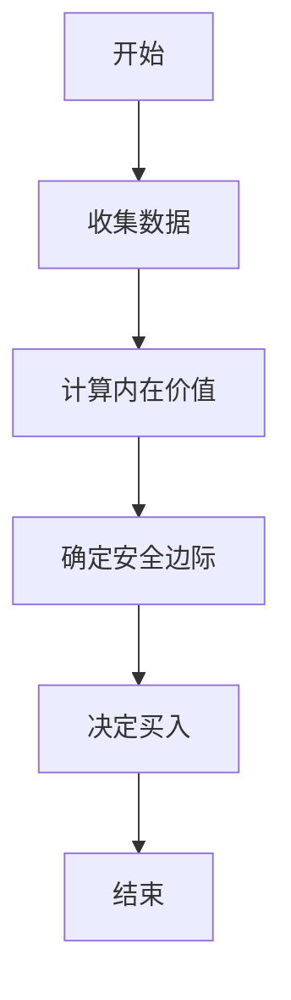
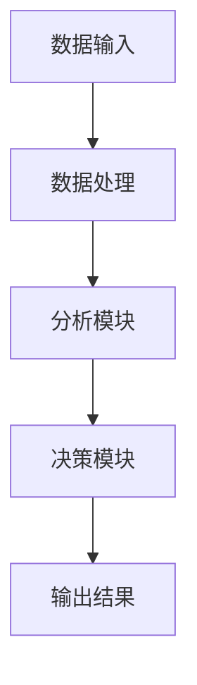
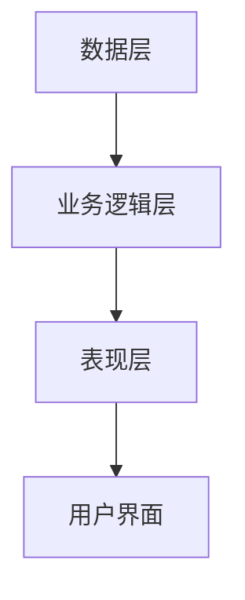

                 


# 约翰·聂夫的价值投资实践经验

## 关键词：
- 价值投资
- 约翰·聂夫
- 安全边际
- 选股标准
- 投资策略
- 系统架构

## 摘要：
本文详细探讨了约翰·聂夫的价值投资理念、策略和实践经验。通过分析其核心概念、算法原理、系统架构和项目实战，结合实际案例和数学模型，为读者提供全面的视角，帮助理解并应用价值投资的方法。

---

## 第一部分：价值投资的背景与理念

### 第1章：价值投资的起源与发展

#### 1.1 价值投资的起源
价值投资是一种以低于内在价值的价格购买优质股票的投资策略，起源于20世纪初。其核心思想是寻找市场先生的错误定价，利用市场波动进行长期投资。约翰·聂夫作为该领域的先驱，以其严谨的投资方法和卓越的长期业绩闻名。

#### 1.2 价值投资的核心理念
价值投资的核心理念在于寻找市场低估的股票，强调安全边际和长期持有的重要性。约翰·聂夫提出，投资者应关注企业的基本面，而非市场的短期波动。他强调避免情绪化决策，坚持独立思考，以获得超额收益。

### 第2章：约翰·聂夫的投资理念

#### 2.1 价值投资的定义
价值投资是一种通过深入分析企业内在价值，以低于市场价购买股票的投资策略。约翰·聂夫将其细化为：寻找具有稳定收益、合理估值和强大护城河的企业。

#### 2.2 价值投资的核心要素
- **内在价值**：企业未来现金流的现值，计算公式为：$$ \text{内在价值} = \sum_{t=1}^{n} \frac{\text{现金流}_t}{(1+r)^t} $$
- **安全边际**：买入价与内在价值的折扣，确保在市场波动中仍能获利。

#### 2.3 投资策略
约翰·聂夫的策略包括：长期持有、分散投资、逆向思维。他避免市场的短期波动，专注于企业的长期增长潜力。

### 第3章：价值投资的策略与分析框架

#### 3.1 安全边际的概念
安全边际是买入价与内在价值的差距，确保在市场低估时买入。计算公式：$$ \text{安全边际} = \text{内在价值} - \text{买入价} $$

#### 3.2 选股标准与分析方法
- **低市盈率**：$$ \text{市盈率} = \frac{\text{股价}}{\text{每股收益}} $$
- **低市净率**：$$ \text{市净率} = \frac{\text{股价}}{\text{每股净资产}} $$
- **高股息率**：$$ \text{股息率} = \frac{\text{每股股息}}{\text{股价}} $$

---

## 第二部分：价值投资的核心概念与联系

### 第4章：价值投资的核心概念

#### 4.1 核心概念对比
通过表格对比不同投资策略的关键点：

| 策略 | 核心概念 | 关注点 |
|------|----------|--------|
| 价值投资 | 内在价值 | 企业基本面 |
| 成长投资 | 市场潜力 | 收益增长率 |

#### 4.2 ER实体关系图
使用Mermaid图展示核心概念的关系：

```mermaid
erDiagram
    企业: id, name, value
    股票: id, name, price
    投资者: id, name, portfolio
    企业<--拥有--股票
    投资者<--持有--股票
```

### 第5章：价值投资的算法原理

#### 5.1 算法原理图
展示价值投资的分析流程：



#### 5.2 代码实现
使用Python计算安全边际：

```python
def calculate_intrinsic_value(enterprise, r):
    return sum(enterprise.cash_flows / (1 + r)**t for t in range(len(enterprise.cash_flows)))

def calculate_margin_of_safety(intrinsic_value, price):
    return intrinsic_value - price
```

### 第6章：价值投资的数学模型与公式

#### 6.1 核心公式
- 内在价值公式：
  $$ \text{IV} = \sum_{t=1}^{n} \frac{CF_t}{(1 + r)^t} $$
- 安全边际公式：
  $$ \text{ MOS } = IV - P $$

---

## 第三部分：价值投资的系统分析与架构设计方案

### 第7章：系统分析

#### 7.1 系统分析图
展示价值投资决策系统的模块：



### 第8章：架构设计方案

#### 8.1 系统架构图
展示系统的层次结构：



---

## 第四部分：价值投资的项目实战

### 第9章：项目实战

#### 9.1 案例分析
模拟购买低估股票的过程，包括数据收集、分析和决策。

#### 9.2 代码实现
编写一个简单的价值投资分析工具：

```python
import pandas as pd

def calculate_pe_ratio(stock_data):
    return stock_data['price'] / stock_data['eps']

data = {'price': [50, 60, 70], 'eps': [10, 15, 20}
df = pd.DataFrame(data)
print(calculate_pe_ratio(df))
```

---

## 第五部分：最佳实践与总结

### 5.1 最佳实践 tips
- 独立思考，避免从众心理。
- 保持耐心，长期持有优质股票。
- 定期复盘，调整投资组合。

### 5.2 小结
价值投资不仅是一种投资策略，更是一种生活哲学。通过深入分析和耐心持有，投资者可以在市场中获得稳定的收益。

### 5.3 注意事项
- 避免过度分散投资，集中于优质企业。
- 定期审视投资组合，确保符合价值投资的原则。

### 5.4 拓展阅读
推荐阅读约翰·聂夫的经典著作《约翰·聂夫投资哲学》和彼得·林奇的《投资漫步者》。

---

## 作者：AI天才研究院 & 禅与计算机程序设计艺术

通过以上内容，我们深入探讨了约翰·聂夫的价值投资理念、策略和实践，结合技术语言和实际案例，帮助读者更好地理解和应用价值投资的方法。

