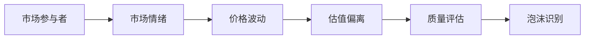
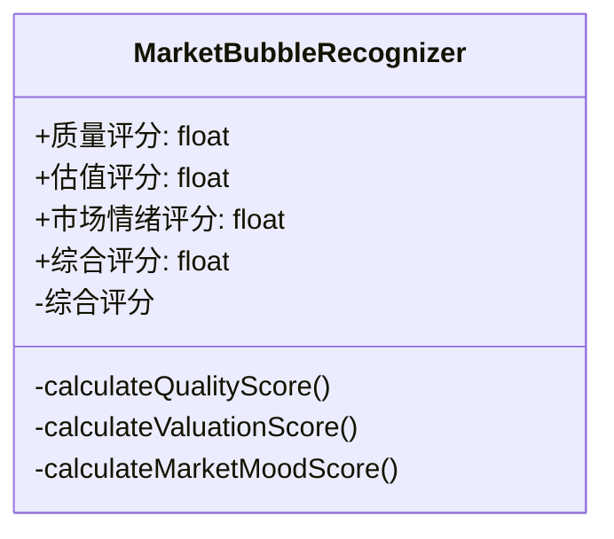

                 


# 约翰·聂夫的市场泡沫识别

> 关键词：市场泡沫识别，约翰·聂夫，价值投资，投资策略，风险管理，市场情绪

> 摘要：本文深入探讨了约翰·聂夫的市场泡沫识别方法，结合其独特的三重过滤法，详细分析了市场泡沫的定义、特征、形成机制，以及如何通过数学模型和系统设计来实现市场泡沫的识别与规避。文章内容涵盖了背景介绍、核心概念、算法原理、系统分析、项目实战和最佳实践，为投资者提供了实用的工具和方法。

---

# 第一部分: 市场泡沫识别的背景与核心概念

## 第1章: 市场泡沫的定义与特征

### 1.1 市场泡沫的定义

#### 1.1.1 什么是市场泡沫

市场泡沫是指资产价格在短期内迅速上涨，远远超过其实际价值的现象。这种现象通常由市场参与者的情绪波动、信息不对称和市场自我强化效应引发。

#### 1.1.2 市场泡沫的基本特征

| 特征维度 | 描述 |
|----------|------|
| 价格波动 | 资产价格剧烈波动，偏离实际价值 |
| 信息不对称 | 市场参与者对信息掌握不均衡 |
| 市场情绪 | 投资者情绪从乐观到狂热，再到恐慌的周期性变化 |

#### 1.1.3 泡沫与非泡沫的边界与外延

市场泡沫的边界在于价格波动与实际价值的偏离程度。外延则包括从局部市场到整体市场的扩散过程。

### 1.2 市场泡沫的形成机制

#### 1.2.1 市场参与者的心理因素

投资者的心理波动是市场泡沫形成的重要因素。贪婪和恐惧情绪的交替出现导致价格的非理性波动。

#### 1.2.2 市场信息不对称的影响

信息不对称导致投资者在决策时依赖于市场信号，而非实际价值。这种依赖进一步放大了价格波动。

#### 1.2.3 市场泡沫的自我强化效应

市场参与者的行为会自我强化，例如，更多的投资者加入导致价格进一步上涨，从而吸引更多投资者，形成恶性循环。

---

## 第2章: 约翰·聂夫的投资理念与方法

### 2.1 约翰·聂夫的三重过滤法

#### 2.1.1 第一重过滤：质量

质量过滤关注企业的基本面，如ROE（净资产收益率）和毛利率。通过筛选高质量企业，避免低效投资。

#### 2.1.2 第二重过滤：估值

估值过滤关注企业的市盈率、市净率等指标，确保买入价格低于实际价值。通过量化指标避免过高估值。

#### 2.1.3 第三重过滤：市场情绪

市场情绪过滤关注市场参与者的心理状态，通过分析换手率、成交量等指标，判断市场是否处于非理性状态。

### 2.2 约翰·聂夫的投资策略

#### 2.2.1 价值投资的核心要素

价值投资强调买入低于内在价值的资产，长期持有，避免短期波动的干扰。

#### 2.2.2 避免市场泡沫的原则

通过严格的三重过滤，避免买入高估资产，降低泡沫风险。

#### 2.2.3 长期投资与风险管理

长期投资策略结合风险管理，确保在市场波动中保持稳定收益。

---

## 第3章: 市场泡沫识别的核心概念

### 3.1 核心概念的属性对比

| 概念 | 描述 | 关键指标 |
|------|------|----------|
| 质量 | 企业的盈利能力 | ROE, 毛利率 |
| 估值 | 资产的市场价格 | 市盈率, 市净率 |
| 市场情绪 | 市场参与者的心理状态 | 换手率, 成交量 |

### 3.2 实体关系图



---

# 第二部分: 市场泡沫识别的算法与数学模型

## 第4章: 市场泡沫识别的数学模型

### 4.1 泡沫识别的评分系统

#### 4.1.1 质量评分公式

$$ 质量评分 = \frac{ROE}{行业平均ROE} $$

#### 4.1.2 估值评分公式

$$ 估值评分 = \frac{市盈率}{行业平均市盈率} $$

#### 4.1.3 市场情绪评分公式

$$ 市场情绪评分 = \frac{换手率}{行业平均换手率} $$

### 4.2 综合评分模型

综合评分模型将质量、估值和市场情绪评分进行加权求和，确定资产的综合评分。评分低于阈值则判断为非泡沫，高于阈值则判断为泡沫。

---

## 第5章: 系统分析与架构设计

### 5.1 问题场景介绍

市场参与者需要在复杂市场环境中识别泡沫，避免投资风险。

### 5.2 系统功能设计



### 5.3 系统架构设计


---

## 第6章: 项目实战

### 6.1 环境安装

需要安装Python、Pandas、NumPy等库。

### 6.2 核心实现代码

```python
def calculate_quality_score(roe, industry_roe):
    return roe / industry_roe

def calculate_valuation_score(pe, industry_pe):
    return pe / industry_pe

def calculate_market_mood_score(volume, industry_volume):
    return volume / industry_volume

def综合评分(quality_score, valuation_score, market_mood_score):
    return quality_score * 0.4 + valuation_score * 0.3 + market_mood_score * 0.3
```

### 6.3 实际案例分析

以某股票为例，计算其质量、估值和市场情绪评分，综合判断是否处于泡沫状态。

---

## 第7章: 最佳实践与总结

### 7.1 小结

通过约翰·聂夫的三重过滤法，结合数学模型和系统设计，投资者可以有效识别市场泡沫，避免投资风险。

### 7.2 注意事项

定期更新模型，关注市场变化，避免单一指标误导。

### 7.3 拓展阅读

推荐阅读约翰·聂夫的经典著作，深入理解价值投资的精髓。

---

作者：AI天才研究院/AI Genius Institute & 禅与计算机程序设计艺术 /Zen And The Art of Computer Programming

