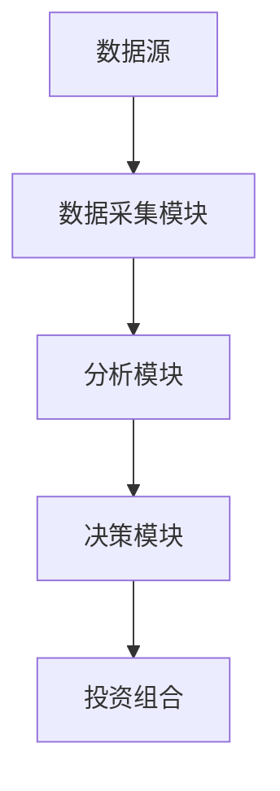
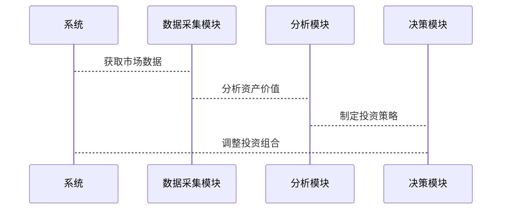

                 


# 约翰邓普顿的全球化投资视角

## 关键词
- 约翰·邓普顿
- 全球化投资
- 价值投资
- 风险管理
- 投资策略
- 资产配置

## 摘要
本文从约翰·邓普顿的投资哲学出发，探讨其全球化投资视角的核心理念、策略及实践。通过分析价值投资、风险管理等核心概念，结合数学模型和系统架构，详细阐述如何在国际化背景下优化投资组合，降低风险，实现长期收益。文章最后通过虚拟投资案例，展示如何将理论应用于实践。

---

## 第一部分: 约翰·邓普顿的全球化投资视角概述

### 第1章: 约翰·邓普顿的生平与投资理念

#### 1.1 约翰·邓普顿的生平简介
约翰·邓普顿（John Templeton）是一位传奇的投资家，以其价值投资理念闻名。他出生于1930年，父亲是美国宾夕法尼亚州兰开斯特市的律师。邓普顿在投资领域取得了巨大成功，尤其是在全球化投资方面。

#### 1.2 全球化投资的背景与意义
全球化经济的发展使得投资者能够跨越国界进行投资，分散风险并捕捉全球机会。邓普顿的全球化投资视角强调了这种全球化的必要性，并提出了独特的投资策略。

---

## 第二部分: 全球化投资的核心概念与策略

### 第2章: 价值投资的核心理念

#### 2.1 价值投资的定义与特点
价值投资是一种投资策略，旨在以低于内在价值的价格购买优质资产。邓普顿的价值投资理念强调寻找被市场低估的股票，长期持有，耐心等待市场回归其真实价值。

#### 2.2 邓普顿的价值投资策略
邓普顿的价值投资策略包括：
1. 寻找具有强大基本面的公司。
2. 确保安全边际，即购买价格低于内在价值。
3. 长期持有，避免频繁交易。

#### 2.3 价值投资与全球化的关系
全球化使投资者能够在全球范围内寻找低估资产，扩大投资机会，降低市场风险。

---

### 第3章: 风险管理与投资组合优化

#### 3.1 风险管理的基本原则
风险管理是投资成功的关键。邓普顿强调分散投资，避免过度集中于某一资产或地区。

#### 3.2 投资组合优化的数学模型
投资组合优化可以通过现代投资组合理论（MPT）实现。以下是MPT的基本公式：

$$
\text{最优权重} = \frac{\mu - r}{\sum_{i,j} w_i w_j (i,j)}
$$

其中，$\mu$ 是资产的期望收益，$r$ 是无风险利率，$(i,j)$ 是资产之间的协方差矩阵。

#### 3.3 邓普顿的风险管理实践
邓普顿通过分散投资于全球市场来降低风险，同时定期评估和调整投资组合。

---

## 第三部分: 全球化投资的系统架构与实现

### 第4章: 系统架构与接口设计

#### 4.1 系统模块划分
- 数据采集模块：收集全球市场数据。
- 分析模块：评估资产价值，识别低估资产。
- 决策模块：制定投资策略，调整投资组合。

#### 4.2 系统架构图（Mermaid）



#### 4.3 系统交互流程图（Mermaid）



---

## 第四部分: 项目实战——基于约翰·邓普顿理念的虚拟投资系统

### 第5章: 项目实战

#### 5.1 环境安装与配置
- 安装投资分析工具（如Python的Pandas库）。
- 数据库搭建（用于存储市场数据）。
- 网络环境配置（确保数据获取流畅）。

#### 5.2 系统核心实现源代码

```python
import pandas as pd

# 数据采集模块
def collect_data():
    data = pd.read_csv('market_data.csv')
    return data

# 分析模块
def assess_value(data):
    # 简单评估模型，计算市盈率
    data['PE'] = data['Price'] / data['Earnings']
    return data

# 决策模块
def make_decision(data):
    undervalued = data[data['PE'] < data['PE'].mean()]
    return undervalued

# 主程序
def main():
    data = collect_data()
    analyzed_data = assess_value(data)
    undervalued = make_decision(analyzed_data)
    print("Undervalued assets:", undervalued)

if __name__ == "__main__":
    main()
```

#### 5.3 案例分析与解读
以美国市场为例，分析如何通过上述代码识别低估资产，并制定投资策略。

---

## 第五部分: 总结与展望

### 第6章: 总结与最佳实践

#### 6.1 小结
约翰·邓普顿的全球化投资视角提供了宝贵的投资策略，强调价值投资和风险管理。

#### 6.2 注意事项
- 投资需谨慎，避免过度杠杆。
- 定期评估和调整投资组合。

#### 6.3 拓展阅读
推荐阅读《投资的艺术》等书籍，深入理解价值投资。

---

## 作者：AI天才研究院 & 禅与计算机程序设计艺术
通过本文的分析，读者可以深入了解约翰·邓普顿的全球化投资视角，并将其应用于实际投资中。

