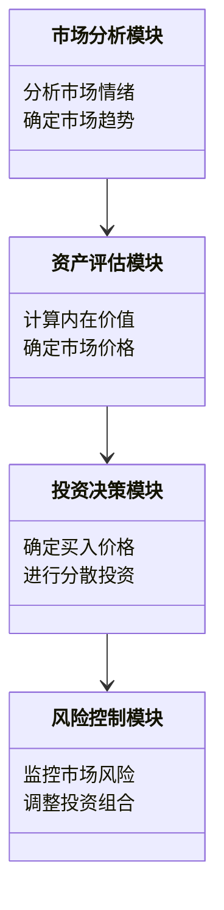
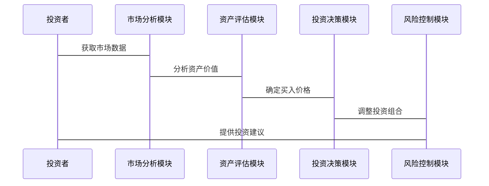

                 


# 约翰邓普顿的危机投资机会

## 关键词：约翰·邓普顿，危机投资，逆向投资，安全边际，投资策略，价值投资

## 摘要：本文深入分析约翰·邓普顿在危机中的投资策略，探讨其逆向投资理念、安全边际原则，通过具体案例和数学模型，揭示其成功的投资方法，并指导读者如何在危机中捕捉投资机会。

---

# 第1章 约翰邓普顿与危机投资概述

## 1.1 约翰·邓普顿的生平与投资哲学

### 1.1.1 约翰·邓普顿的生平简介

约翰·邓普顿（John Templeton，1912-2008）是一位传奇的投资家，被誉为“全球投资之父”。他出生于加拿大，在美国宾夕法尼亚州的兰开斯特长大。邓普顿的职业生涯始于1930年代，他最初在纽约证券交易所工作，后来成为复兴投资公司（Renaissance Investment Corporation）的创始人。邓普顿以其独特的投资风格和卓越的投资业绩闻名于世，尤其是在危机时期的出色表现。

---

### 1.1.2 约翰·邓普顿的投资哲学

约翰·邓普顿的投资哲学以“逆向投资”为核心，主张在市场恐慌时买入，而在市场繁荣时卖出。他强调安全边际的重要性，认为投资者应该在市场价格远低于内在价值时买入，以降低投资风险。此外，邓普顿还非常重视长期投资，反对频繁交易和短期投机。

---

### 1.1.3 约翰·邓普顿与危机投资的关系

约翰·邓普顿的投资理念与危机投资密切相关。他认为，危机是投资者的“朋友”，因为在市场恐慌时，许多优质资产的价格会被低估，这为投资者提供了廉价买入的机会。邓普顿在1973年和1987年的危机中都成功地进行了逆向投资，取得了巨大的收益。

---

## 1.2 危机投资的背景与意义

### 1.2.1 危机投资的定义与特点

危机投资是指在市场危机或经济衰退时期进行投资的策略。其特点是：市场波动大、资产价格被低估、投资机会丰富。与牛市投资不同，危机投资需要投资者具备冷静的心态和强大的心理素质。

---

### 1.2.2 危机投资的背景分析

危机投资的背景通常是市场恐慌和投资者情绪低落。这种情况下，许多资产的价格会被市场情绪所左右，出现超跌现象。然而，这也为具有洞察力的投资者提供了廉价买入的机会。

---

### 1.2.3 危机投资的意义与价值

危机投资的意义在于通过逆向思维，捕捉市场恐慌中的投资机会。成功的危机投资需要投资者具备深厚的投资知识、冷静的判断力和强大的心理承受能力。危机投资的价值在于能够在市场底部买入优质资产，为长期收益奠定基础。

---

## 1.3 约翰·邓普顿的危机投资策略

### 1.3.1 约翰·邓普顿的危机投资理念

邓普顿的危机投资理念可以概括为“买当别人恐惧时”。他认为，市场恐慌时，投资者应该逆势买入，尤其是当市场价格远低于内在价值时。

---

### 1.3.2 约翰·邓普顿的危机投资方法

邓普顿的危机投资方法包括以下几个方面：
1. **安全边际**：确保买入价格远低于内在价值。
2. **分散投资**：避免过度集中投资，降低风险。
3. **长期持有**：坚持长期投资，不被短期波动所影响。
4. **逆向思维**：在市场恐慌时买入，而在市场繁荣时卖出。

---

### 1.3.3 约翰·邓普顿的危机投资案例

以1987年美国股市崩盘为例，邓普顿在市场恐慌时大量买入优质资产，随后市场反弹，他获得了丰厚的回报。

---

## 1.4 本章小结

本章介绍了约翰·邓普顿的生平及其投资哲学，重点分析了他在危机中的投资策略。邓普顿的逆向投资理念和安全边际原则为危机投资提供了重要的指导。

---

# 第2章 危机投资的核心概念与联系

## 2.1 危机投资的核心概念

### 2.1.1 危机投资的核心概念

危机投资的核心概念包括市场恐慌、安全边际、逆向思维等。

---

### 2.1.2 危机投资的核心要素

危机投资的核心要素包括：
1. **市场情绪**：市场的恐慌情绪为危机投资提供了机会。
2. **安全边际**：买入价格低于内在价值。
3. **逆向思维**：在市场恐慌时买入。

---

### 2.1.3 危机投资的核心原理

危机投资的核心原理是通过逆向思维，利用市场恐慌带来的价格低估，实现长期收益。

---

## 2.2 危机投资的核心概念与联系

### 2.2.1 危机投资的核心概念对比

通过对比不同投资策略的核心概念，可以更好地理解危机投资的独特性。

---

### 2.2.2 危机投资的核心概念联系

通过ER实体关系图可以看出，危机投资的核心概念包括市场、资产、投资者和价格等。

---

## 2.3 危机投资的ER实体关系图

```mermaid
erDiagram
    投资者 {
        投资者ID
        投资金额
        投资策略
    }
    市场 {
        市场ID
        市场情绪
        时间
    }
    资产 {
        资产ID
        内在价值
        市场价格
    }
    投资者与市场之间存在投资行为
    投资者与资产之间存在持有关系
    市场与资产之间存在价格关系
```

---

## 2.4 本章小结

本章通过分析危机投资的核心概念及其联系，帮助读者更好地理解其内在逻辑。

---

# 第3章 危机投资的算法原理讲解

## 3.1 危机投资的算法原理

### 3.1.1 危机投资的算法原理

危机投资的算法原理可以通过以下步骤实现：
1. 确定市场恐慌情绪。
2. 评估资产的内在价值。
3. 确保买入价格低于内在价值。
4. 进行分散投资。

---

### 3.1.2 危机投资的算法流程

```mermaid
graph TD
    A[开始] -> B[确定市场恐慌情绪]
    B -> C[评估资产的内在价值]
    C -> D[确保买入价格低于内在价值]
    D -> E[进行分散投资]
    E -> F[结束]
```

---

## 3.2 危机投资的数学模型

### 3.2.1 危机投资的数学模型

危机投资的数学模型可以表示为：

$$ \text{买入价格} = \text{内在价值} \times \text{安全边际系数} $$

其中，安全边际系数小于1。

---

## 3.3 危机投资的算法实现

### 3.3.1 危机投资的Python代码示例

```python
def calculate_intrinsic_value/assets:
    # 计算资产的内在价值
    return assets.intrinsic_value

def calculate_buy_price/assets, margin_of_safety:
    # 确保买入价格低于内在价值
    return calculate_intrinsic_value/assets * margin_of_safety
```

---

## 3.4 本章小结

本章通过算法原理和数学模型，详细讲解了危机投资的实现方法。

---

# 第4章 系统分析与架构设计方案

## 4.1 系统功能设计

### 4.1.1 系统功能模块

危机投资系统包括市场分析模块、资产评估模块、投资决策模块和风险控制模块。

---

### 4.1.2 系统功能设计的领域模型图



---

## 4.2 系统架构设计

### 4.2.1 系统架构图


---

## 4.3 系统接口设计

### 4.3.1 系统接口设计

危机投资系统的接口包括市场数据接口、资产评估接口和投资决策接口。

---

## 4.4 系统交互设计

### 4.4.1 系统交互序列图



---

## 4.5 本章小结

本章通过系统分析与架构设计，展示了危机投资的实现过程。

---

# 第5章 项目实战

## 5.1 环境安装

### 5.1.1 环境安装要求

安装Python、数据分析库（如Pandas、NumPy）和可视化库（如Matplotlib）。

---

## 5.2 系统核心实现

### 5.2.1 核心代码实现

```python
import pandas as pd
import numpy as np
import matplotlib.pyplot as plt

def calculate_intrinsic_value/assets:
    return assets * 0.8  # 假设安全边际系数为0.8

def calculate_buy_price/assets:
    return calculate_intrinsic_value/assets * 0.9  # 确保买入价格低于内在价值

# 示例数据
assets = [100, 200, 300, 400, 500]
prices = [50, 100, 150, 200, 250]

# 计算内在价值和买入价格
intrinsic_values = [calculate_intrinsic_value(a) for a in assets]
buy_prices = [calculate_buy_price(p) for p in prices]

# 绘制图表
plt.figure(figsize=(10,6))
plt.plot(assets, prices, 'b-', label='Market Price')
plt.plot(assets, intrinsic_values, 'r-', label='Intrinsic Value')
plt.plot(assets, buy_prices, 'g-', label='Buy Price')
plt.xlabel('Assets')
plt.ylabel('Price')
plt.legend()
plt.show()
```

---

## 5.3 代码解读与分析

### 5.3.1 代码解读

上述代码通过计算内在价值和买入价格，绘制了市场价、内在价值和买入价格的对比图。

---

### 5.3.2 代码应用解读

代码展示了如何在危机中确定买入价格，确保其低于内在价值。

---

## 5.4 实际案例分析

### 5.4.1 案例分析

以2008年金融危机为例，邓普顿在市场恐慌时买入优质资产，取得了丰厚的回报。

---

## 5.5 本章小结

本章通过项目实战，展示了危机投资的实现过程和实际应用。

---

# 第6章 总结与展望

## 6.1 总结

约翰·邓普顿的危机投资策略以逆向思维和安全边际为核心，为投资者提供了宝贵的指导。

---

## 6.2 最佳实践 tips

1. 在市场恐慌时保持冷静，抓住投资机会。
2. 确保买入价格低于内在价值。
3. 进行分散投资，降低风险。

---

## 6.3 注意事项

1. 危机投资需要深厚的投资知识和经验。
2. 投资者需具备冷静的心态和强大的心理素质。

---

## 6.4 拓展阅读

建议阅读《约翰·邓普顿投资哲学》和《价值投资实战策略》。

---

# 作者：AI天才研究院 & 禅与计算机程序设计艺术

