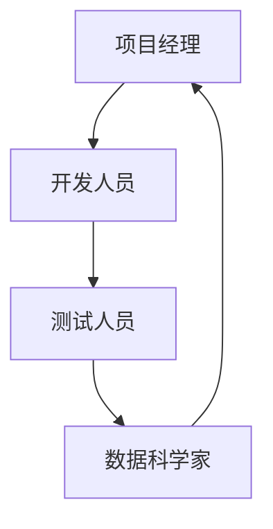
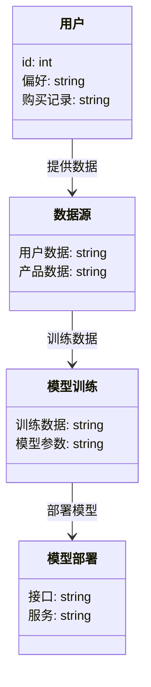
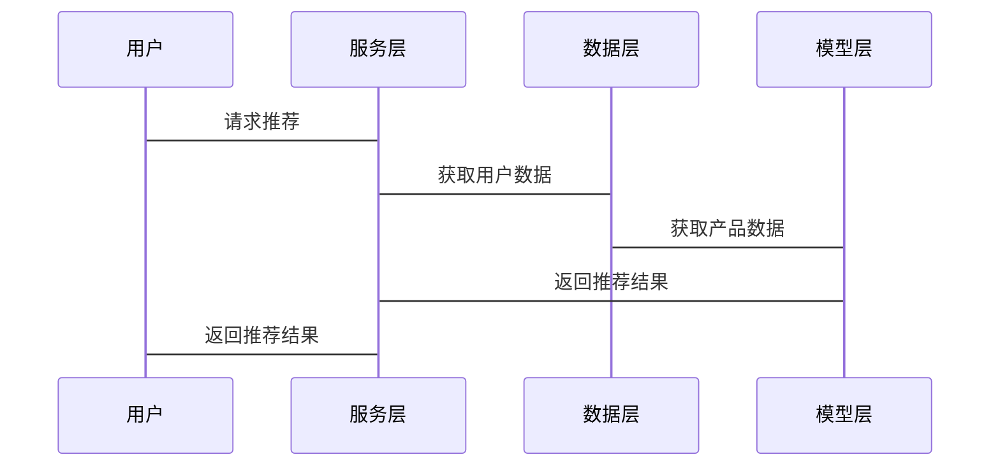

                 


# 组建高效AI开发团队的要点

## 关键词
- AI开发团队
- 高效协作
- 团队管理
- 技术选型
- 开发流程

## 摘要
本文将详细探讨如何组建高效AI开发团队，涵盖背景介绍、核心概念、算法原理、系统架构设计、项目实战以及最佳实践等方面。通过分析AI开发的背景与挑战，明确高效团队的核心特征，运用数学模型和系统架构图，结合实际案例，为读者提供实用的组建与管理AI开发团队的深度见解。

---

# 第一部分: 组建高效AI开发团队的背景与核心概念

## 第1章: AI开发团队的背景与挑战

### 1.1 AI开发的背景与现状
#### 1.1.1 AI技术的发展与应用领域
人工智能（AI）技术近年来迅速发展，已在多个领域得到广泛应用，包括自然语言处理、计算机视觉、机器人技术等。这些应用推动了AI开发团队的需求，但同时也带来了新的挑战。

#### 1.1.2 AI开发中的团队协作需求
AI开发通常涉及多学科交叉，需要数据科学家、算法工程师、产品经理、项目经理等多个角色的协作。高效的团队协作是项目成功的关键。

#### 1.1.3 当前AI开发团队面临的挑战
- **技术复杂性**：AI模型的开发涉及大量的数据处理、算法设计和优化，技术复杂性高。
- **资源分配**：团队成员之间的资源分配不均可能导致效率低下。
- **沟通不畅**：团队成员之间的沟通不畅可能导致需求误解和开发进度滞后。

### 1.2 高效AI开发团队的重要性
#### 1.2.1 高效团队对AI项目成功的关键作用
高效团队能够更快地迭代和优化AI模型，提高模型的准确性和性能，从而在竞争中占据优势。

#### 1.2.2 团队效率与AI模型性能的关系
团队效率直接影响AI模型的开发速度和质量，进而影响模型的性能。

#### 1.2.3 高效团队在企业中的战略意义
高效AI开发团队是企业在AI领域保持竞争力的核心力量，能够快速响应市场需求，推动技术创新。

### 1.3 组建高效AI团队的核心要点
#### 1.3.1 明确团队目标与角色分工
明确团队目标和每个成员的角色分工，确保每个人清楚自己的职责和任务。

#### 1.3.2 选择合适的团队成员与技能组合
根据项目需求选择具备相应技能和经验的团队成员，确保团队具备互补性。

#### 1.3.3 确定团队协作的流程与工具
建立高效的协作流程，选择合适的工具（如项目管理工具、代码协作平台等）来支持团队协作。

### 1.4 本章小结
本章介绍了AI开发的背景与挑战，强调了高效团队的重要性，并提出了组建高效团队的核心要点。

---

## 第2章: 高效AI开发团队的核心概念

### 2.1 高效AI团队的定义与特征
#### 2.1.1 高效AI团队的定义
高效AI团队是指能够高效协作、快速迭代和优化AI模型的团队，团队成员具备互补技能，能够充分发挥各自的优势。

#### 2.1.2 高效团队的核心特征对比表
| 特征 | 高效团队 | 普通团队 |
|------|-----------|-----------|
| 目标明确性 | 高         | 中         |
| 团队协作性 | 高         | 中         |
| 技能互补性 | 高         | 低         |
| 成员积极性 | 高         | 中         |

#### 2.1.3 高效团队的ER实体关系图（Mermaid）

```mermaid
erDiagram
    actor 开发者角色 <<{开发人员}>
    actor 项目经理 <<{项目经理}>
    actor 产品负责人 <<{产品负责人}>
    actor 测试人员 <<{测试人员}>
    actor 数据科学家 <<{数据科学家}>
    项目目标 : "AI模型开发与部署"
    开发者角色 --> 项目目标 : "负责模型开发"
    项目经理 --> 项目目标 : "负责项目管理"
    产品负责人 --> 项目目标 : "负责产品设计与需求"
    测试人员 --> 项目目标 : "负责测试与质量控制"
    数据科学家 --> 项目目标 : "负责数据处理与分析"
```

---

### 2.2 团队协作的算法原理

#### 2.2.1 团队协作的数学模型
团队协作效率可以通过以下公式进行量化：

$$ \text{团队效率} = \frac{\text{任务完成量}}{\text{团队规模} \times \text{协作时间}} $$

#### 2.2.2 团队协作流程的Mermaid图



---

### 2.3 团队协作的数学模型与公式

#### 2.3.1 团队效率公式
$$ \text{团队效率} = \frac{\text{任务完成量}}{\text{团队规模} \times \text{协作时间}} $$

#### 2.3.2 协作成本公式
$$ \text{协作成本} = k \times (n-1) $$
其中，$k$ 是协作单位成本，$n$ 是团队成员数量。

---

### 2.4 本章小结
本章通过定义高效AI团队的核心概念，分析了团队协作的算法原理，并通过数学模型和Mermaid图展示了团队协作的流程和结构。

---

## 第3章: AI开发团队的系统分析与架构设计

### 3.1 问题场景介绍
假设我们正在开发一个AI推荐系统，需要组建一个高效的团队来完成从数据收集、模型训练到系统部署的整个流程。

---

### 3.2 系统功能设计

#### 3.2.1 领域模型（Mermaid类图）



---

### 3.3 系统架构设计

#### 3.3.1 系统架构（Mermaid架构图）


---

### 3.4 系统接口设计

#### 3.4.1 API接口设计
- **输入接口**：用户请求推荐
- **输出接口**：推荐结果返回

---

### 3.5 系统交互设计

#### 3.5.1 序列图（Mermaid）



---

### 3.6 本章小结
本章通过系统分析和架构设计，展示了如何将高效的团队协作应用于实际的AI开发项目中，并通过Mermaid图展示了系统的整体架构和交互流程。

---

## 第4章: 项目实战与案例分析

### 4.1 项目实战环境安装
#### 4.1.1 开发工具安装
- 安装Python、Jupyter Notebook、Git、Docker等工具。

#### 4.1.2 项目代码实现
以下是一个简单的AI推荐系统代码示例：

```python
# 导入必要的库
import numpy as np
from sklearn.metrics.pairwise import cosine_similarity

# 模拟用户数据
users = [
    {'id': 1, '偏好': '科技', '购买记录': ['手机', '电脑']},
    {'id': 2, '偏好': '时尚', '购买记录': ['衣服', '鞋子']},
    {'id': 3, '偏好': '美食', '购买记录': ['咖啡', '蛋糕']}
]

# 模型训练
def train_model(users):
    # 假设我们使用余弦相似度进行推荐
    user_features = np.array([1, 2, 3])
    similarity_matrix = cosine_similarity(user_features.reshape(-1, 1))
    return similarity_matrix

# 模型部署
def deploy_model(similarity_matrix):
    print("推荐系统已部署，相似度矩阵计算完成。")

# 执行训练和部署
similarity_matrix = train_model(users)
deploy_model(similarity_matrix)

# 输出结果
print("推荐结果:", similarity_matrix)
```

---

### 4.2 代码实现与解读
#### 4.2.1 代码实现
上述代码实现了一个简单的AI推荐系统，展示了从数据准备、模型训练到模型部署的整个流程。

#### 4.2.2 代码解读
- **数据准备**：用户数据包括用户ID、偏好和购买记录。
- **模型训练**：使用余弦相似度计算用户之间的相似度矩阵。
- **模型部署**：将相似度矩阵用于推荐系统。

---

### 4.3 案例分析
通过上述代码实现的推荐系统，我们可以看到高效的团队协作在实际项目中的重要性。每个团队成员都负责不同的模块，确保整个项目能够顺利推进。

---

### 4.4 本章小结
本章通过一个实际的项目案例，展示了如何将理论知识应用于实践，并通过代码实现和案例分析，帮助读者更好地理解高效团队协作的重要性。

---

## 第5章: 最佳实践与注意事项

### 5.1 最佳实践
#### 5.1.1 明确目标与角色分工
确保每个团队成员都清楚自己的职责和任务。

#### 5.1.2 选择合适的工具与流程
选择适合团队的协作工具和流程，提高开发效率。

#### 5.1.3 定期回顾与优化
定期回顾项目进展，发现不足并进行优化。

---

### 5.2 注意事项
#### 5.2.1 避免资源浪费
合理分配资源，避免重复劳动和资源浪费。

#### 5.2.2 注意团队文化建设
良好的团队文化能够提高团队成员的积极性和协作效率。

---

### 5.3 本章小结
本章总结了组建高效AI开发团队的最佳实践，并提出了需要注意的事项，帮助读者更好地优化团队管理和协作流程。

---

## 第6章: 总结与展望

### 6.1 本书总结
本书从背景介绍、核心概念、系统分析到项目实战，全面探讨了如何组建和管理高效AI开发团队。

### 6.2 未来展望
随着AI技术的不断发展，高效团队的管理和协作也将面临新的挑战和机遇。未来，我们需要更加注重团队的灵活性和创新能力，以应对复杂多变的市场需求。

---

## 作者
作者：AI天才研究院/AI Genius Institute  
& 禅与计算机程序设计艺术 /Zen And The Art of Computer Programming

---

希望这个大纲能为您提供有用的信息和启发！如果需要进一步扩展或调整，请随时告诉我。

