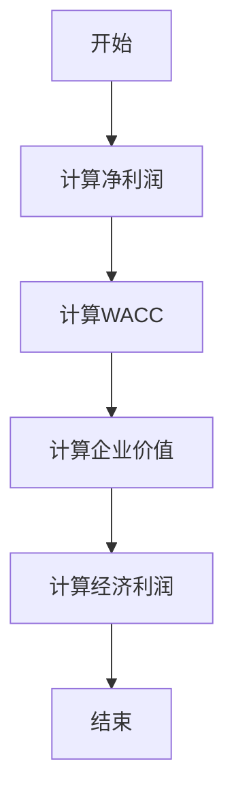

                 


# 经济利润模型：衡量真实价值创造的工具

## 关键词：经济利润模型，价值创造，会计利润，加权平均资本成本，企业价值

## 摘要：经济利润模型是一种衡量企业真实价值创造的工具，它通过计算经济利润，考虑了资本成本，提供了比传统会计利润更为准确的企业价值评估方法。本文将从背景介绍、核心概念、算法原理、数学模型、系统架构设计、项目实战等多个方面，详细阐述经济利润模型的理论基础和实际应用。

---

## 第1章: 经济利润模型的背景与问题背景

### 1.1 经济利润模型的定义与核心概念
#### 1.1.1 经济利润模型的定义
经济利润模型是一种衡量企业真实价值创造的工具，它基于经济学和财务管理的基本原理，通过计算经济利润（Economic Profit，简称EP）来评估企业的实际价值。经济利润不仅考虑了企业的会计利润，还考虑了资本成本，从而提供了一个更为全面的价值衡量方法。

#### 1.1.2 经济利润模型的核心要素
经济利润模型的核心要素包括：
1. 净利润（Net Income）：企业一定时期内的利润总额，扣除所有费用和税金后的利润。
2. 加权平均资本成本（Weighted Average Cost of Capital，WACC）：企业获取资本的成本，包括债务成本和股权成本，按照资本结构加权计算。
3. 企业价值（Enterprise Value）：企业整体价值的度量，包括股权价值、债权价值和所有者权益。

#### 1.1.3 经济利润模型的边界与外延
经济利润模型适用于所有类型的经济主体，包括企业、个人和政府机构。它不仅用于衡量企业的经济利润，还可以扩展应用于个人投资决策和宏观经济分析。

### 1.2 经济利润模型的背景与问题背景
#### 1.2.1 当前经济分析中的问题与挑战
传统的企业价值评估方法主要依赖于会计利润，但会计利润仅考虑了会计期间的收入和费用，忽略了资本成本和时间价值。此外，会计利润容易受到会计政策和管理层主观判断的影响，难以真实反映企业的经济价值。

#### 1.2.2 传统利润衡量方法的局限性
传统利润衡量方法的主要局限性包括：
1. 未考虑资本成本：会计利润仅计算会计期间的收入和费用，未考虑资本的使用成本。
2. 时间价值忽视：传统利润计算不考虑资金的时间价值，无法反映长期投资的真实回报。
3. 主观性问题：会计利润受到会计政策和管理层决策的影响，可能导致不同企业之间的可比性降低。

#### 1.2.3 经济利润模型的提出与目标
经济利润模型的提出旨在弥补传统利润衡量方法的不足，通过引入资本成本和时间价值的概念，提供一个更为准确和客观的企业价值衡量工具。其目标是帮助企业和投资者更好地理解企业的经济价值，做出更科学的决策。

### 1.3 经济利润模型的理论基础与应用领域
#### 1.3.1 经济学基础理论
经济利润模型的理论基础包括微观经济学和宏观经济学的基本原理。微观经济学研究企业的生产行为和市场结构，宏观经济学研究整体经济的运行和政策影响。

#### 1.3.2 会计学与财务管理基础
经济利润模型依赖于会计学和财务管理的基本知识，包括利润计算、资本结构分析和价值评估。这些知识为企业价值的计算提供了基础数据和方法。

#### 1.3.3 经济利润模型的应用场景
经济利润模型广泛应用于企业价值评估、投资决策、绩效考核和资本预算等领域。例如，企业在并购过程中可以使用经济利润模型评估目标企业的价值；投资者可以通过经济利润模型选择具有较高经济价值的企业进行投资。

## 1.4 本章小结
本章从经济利润模型的定义、核心要素和背景问题入手，分析了传统利润衡量方法的局限性，介绍了经济利润模型的理论基础和应用领域，为后续章节的深入分析奠定了基础。

---

## 第2章: 经济利润模型的核心概念与联系

### 2.1 经济利润模型的核心概念
#### 2.1.1 经济利润的计算公式
经济利润（EP）的计算公式如下：
$$EP = 净利润 - （加权平均资本成本 \times 企业价值）$$

#### 2.1.2 经济利润与会计利润的区别
| 区别点 | 会计利润 | 经济利润 |
|--------|-----------|----------|
| 计算依据 | 收入和费用 | 净利润和资本成本 |
| 考虑因素 | 不考虑资本成本 | 考虑资本成本 |
| 时间价值 | 不考虑 | 考虑 |

#### 2.1.3 经济利润与股东价值的关系
经济利润与股东价值密切相关。企业的经济利润越高，股东价值增长越快。经济利润可以看作是股东价值的增量。

### 2.2 经济利润模型的核心要素分析
#### 2.2.1 净利润
净利润是企业在一定会计期间内实现的利润总额，计算公式为：
$$净利润 = 收入 - 费用$$

#### 2.2.2 加权平均资本成本（WACC）
加权平均资本成本是企业获取资本的综合成本，计算公式为：
$$WACC = \frac{E}{E+D} \times Re + \frac{D}{E+D} \times Rd \times (1 - T)$$
其中，E为权益价值，D为债务价值，Re为权益资本成本，Rd为债务资本成本，T为税率。

#### 2.2.3 企业价值
企业价值是企业整体的市场价值，包括股权价值、债权价值和所有者权益。

### 2.3 经济利润模型的ER实体关系图
```mermaid
erDiagram
    actor 企业管理者 {
        string 公司名称
        string 行业
        float 股权价值
        float 债务价值
        float 净利润
    }
    actor 投资者 {
        string 投资者名称
        float 投资金额
        float 投资回报率
    }
    actor 企业价值评估机构 {
        string 评估报告
        float 企业价值
        float 加权平均资本成本
    }
    企业管理者 --> 投资者: 提供企业价值信息
    投资者 --> 企业价值评估机构: 委托评估
    企业价值评估机构 --> 企业管理者: 提供评估结果
```

### 2.4 本章小结
本章详细分析了经济利润模型的核心概念，包括经济利润的计算公式、净利润、加权平均资本成本和企业价值。通过ER实体关系图，展示了经济利润模型中的实体及其关系，为后续章节的分析提供了基础。

---

## 第3章: 经济利润模型的算法原理

### 3.1 经济利润模型的计算公式
经济利润的计算公式可以表示为：
$$EP = 净利润 - WACC \times 企业价值$$

### 3.2 经济利润模型的计算流程
计算经济利润的步骤如下：
1. 计算净利润：根据企业的财务报表，计算净利润。
2. 计算加权平均资本成本（WACC）：根据企业的资本结构和市场利率，计算WACC。
3. 计算企业价值：根据企业的市场价值和账面价值，计算企业价值。
4. 计算经济利润：将净利润减去WACC乘以企业价值，得到经济利润。

### 3.3 经济利润模型的流程图


### 3.4 经济利润模型的Python实现
```python
def calculate_economic_profit(net_income, wacc, enterprise_value):
    economic_profit = net_income - wacc * enterprise_value
    return economic_profit

# 示例数据
net_income = 100  # 净利润
wacc = 0.05       # 加权平均资本成本
enterprise_value = 1000  # 企业价值

# 计算经济利润
economic_profit = calculate_economic_profit(net_income, wacc, enterprise_value)
print(f"经济利润为：{economic_profit}")
```

### 3.5 本章小结
本章详细介绍了经济利润模型的计算公式和流程，通过流程图和Python代码展示了如何计算经济利润。这为读者理解经济利润模型的实现过程提供了直观的指导。

---

## 第4章: 经济利润模型的数学模型与公式

### 4.1 净利润计算公式
净利润的计算公式为：
$$净利润 = 收入 - 费用$$

### 4.2 加权平均资本成本计算公式
加权平均资本成本（WACC）的计算公式为：
$$WACC = \frac{E}{E+D} \times Re + \frac{D}{E+D} \times Rd \times (1 - T)$$
其中，E为权益价值，D为债务价值，Re为权益资本成本，Rd为债务资本成本，T为税率。

### 4.3 经济利润计算公式
经济利润的计算公式为：
$$EP = 净利润 - WACC \times 企业价值$$

### 4.4 经济利润模型的数学模型
经济利润模型的数学模型可以表示为：
$$EP = NetIncome - (WACC \times EnterpriseValue)$$

---

## 第5章: 经济利润模型的系统分析与架构设计

### 5.1 系统功能设计
系统功能包括：
1. 输入企业财务数据。
2. 计算净利润和加权平均资本成本。
3. 计算企业价值和经济利润。
4. 输出经济利润结果。

### 5.2 系统架构设计


### 5.3 系统接口设计
系统接口包括：
1. 输入接口：接收企业的财务数据。
2. 计算接口：计算净利润、WACC、企业价值和经济利润。
3. 输出接口：显示经济利润结果。

### 5.4 系统交互流程图


---

## 第6章: 经济利润模型的项目实战

### 6.1 环境安装
需要安装Python和相关库，如Pandas和NumPy。

### 6.2 系统核心实现源代码
```python
import pandas as pd
import numpy as np

def calculate_wacc(equity_value, debt_value, cost_equity, cost_debt, tax_rate):
    total_capital = equity_value + debt_value
    wacc = (equity_value / total_capital) * cost_equity + (debt_value / total_capital) * cost_debt * (1 - tax_rate)
    return wacc

def calculate_economic_profit(net_income, wacc, enterprise_value):
    economic_profit = net_income - wacc * enterprise_value
    return economic_profit

# 示例数据
equity_value = 500
debt_value = 300
cost_equity = 0.1
cost_debt = 0.05
tax_rate = 0.2
net_income = 200
enterprise_value = 1000

# 计算WACC
wacc = calculate_wacc(equity_value, debt_value, cost_equity, cost_debt, tax_rate)
print(f"WACC: {wacc}")

# 计算经济利润
economic_profit = calculate_economic_profit(net_income, wacc, enterprise_value)
print(f"经济利润: {economic_profit}")
```

### 6.3 案例分析与详细讲解
以某企业为例，假设其净利润为200，WACC为0.05，企业价值为1000，则经济利润为：
$$EP = 200 - 0.05 \times 1000 = 200 - 50 = 150$$

### 6.4 本章小结
本章通过实际案例展示了经济利润模型的实现过程，帮助读者理解如何在实际中应用经济利润模型。

---

## 第7章: 经济利润模型的最佳实践与注意事项

### 7.1 最佳实践
1. 数据准确性：确保输入数据的准确性和完整性。
2. 模型适用性：根据企业的具体情况选择合适的模型参数。
3. 定期更新：根据市场变化和企业经营状况，定期更新模型参数。

### 7.2 小结
经济利润模型是一种有效的衡量企业真实价值创造的工具，但其应用需要结合企业的实际情况和市场环境。

### 7.3 注意事项
1. 模型假设：经济利润模型基于一定的假设条件，如市场有效性和资本结构不变。
2. 数据限制：模型的准确性依赖于数据的完整性和可靠性。
3. 模型局限：经济利润模型无法完全反映企业的所有价值因素，如品牌价值和无形资产。

### 7.4 拓展阅读
1. 《财务管理》：深入理解经济利润模型的理论基础。
2. 《企业价值评估》：学习更多企业价值评估的方法和技巧。
3. 《Python数据分析》：掌握使用Python进行数据分析和计算的技能。

---

## 作者：AI天才研究院/AI Genius Institute & 禅与计算机程序设计艺术 /Zen And The Art of Computer Programming

---

### 本文使用 Markdown 格式撰写，如果对你有帮助，欢迎分享给更多人！

