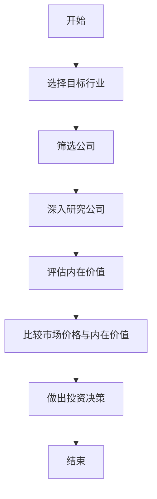
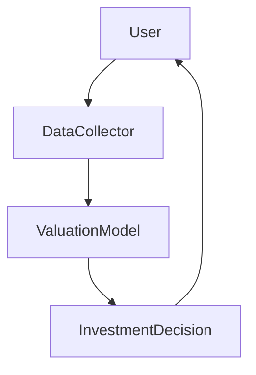

                 


# 罗伯特·哈格斯特罗姆的专注型价值投资：深入了解少数公司

## 关键词：
- 专注型价值投资、罗伯特·哈格斯特罗姆、投资策略、长期持有、深度分析

## 摘要：
本文深入探讨了罗伯特·哈格斯特罗姆的专注型价值投资策略，分析其核心概念、数学模型、系统架构及实际案例，为投资者提供从理论到实践的全面指导。

---

## 第一部分: 专注型价值投资的背景与核心概念

### 第1章: 专注型价值投资的背景与问题背景

#### 1.1 价值投资的基本概念
- **价值投资的定义**：通过分析企业的内在价值，寻找市场价格低于内在价值的公司进行投资。
- **价值投资的核心要素**：注重公司的基本面分析，如盈利能力、财务状况和行业地位。
- **价值投资与短期投资的对比**：价值投资注重长期持有，而短期投资追求短期收益。

#### 1.2 专注型投资的定义与特点
- **专注型投资的定义**：专注于少数优质公司，进行深入研究和长期持有。
- **专注型投资的核心特征**：深度研究、长期持有、买入低估公司。
- **专注型投资与其他策略的对比**：
  - 与分散投资相比，专注型投资更注重集中持有优质资产。
  - 与趋势投资相比，专注型投资更关注公司的基本面。

#### 1.3 专注型投资的边界与外延
- **投资范围的边界**：专注于少数行业和公司，避免过于分散。
- **投资策略的外延**：结合市场环境和公司发展，动态调整投资策略。
- **适用场景**：适合长期投资者，尤其是对特定行业有深入了解的投资者。

### 第2章: 专注型投资的核心概念与联系

#### 2.1 核心概念原理
- **深度研究的重要性**：通过深入分析公司的财务状况、行业地位和竞争优势，识别低估公司。
- **长期持有的逻辑**：长期持有优质资产，避免频繁交易带来的成本和风险。
- **买入低估公司的策略**：寻找市场价格低于内在价值的公司进行投资。

#### 2.2 核心概念属性特征对比
- **对比表格展示**：
  | 投资策略 | 分散投资 | 专注型投资 |
  |----------|----------|------------|
  | 投资范围 | 广泛     | 集中       |
  | 持股时间 | 短期     | 长期       |
  | 研究深度 | 浅       | 深         |

#### 2.3 ER实体关系图架构
```mermaid
erDiagram
    company [公司] {
        <<Company>>
        id : int
        name : string
        industry : string
        revenue : float
        profit : float
        market_value : float
        intrinsic_value : float
    }
    investor [投资者] {
        <<Investor>>
        id : int
        name : string
        portfolio : list of Investment
    }
    investment [投资] {
        <<Investment>>
        id : int
        company : company
        investment_amount : float
        investment_date : date
    }
    company --> investment : 持有
    investor --> investment : 持有
```

---

## 第二部分: 专注型投资的算法与数学模型

### 第3章: 专注型投资的数学模型与算法

#### 3.1 投资决策的数学模型
- **公司内在价值的评估公式**：
  内在价值 = 现金流折现值（DCF模型）
  $$ \text{内在价值} = \sum_{t=1}^{n} \frac{\text{现金流}_t}{(1 + r)^t} $$
  其中，r为折现率，n为预测期限。

- **市场价格与内在价值的关系**：
  $$ \text{投资价值} = \begin{cases} 
  \text{低估} & \text{市场价格} < \text{内在价值} \\
  \text{高估} & \text{市场价格} > \text{内在价值} \\
  \text{合理} & \text{市场价格} = \text{内在价值} 
  \end{cases} $$

- **投资决策的逻辑流程**：
  ```mermaid
  graph TD
      A[开始] --> B[选择目标行业]
      B --> C[筛选公司]
      C --> D[深入研究公司]
      D --> E[评估内在价值]
      E --> F[比较市场价格与内在价值]
      F --> G[做出投资决策]
      G --> H[结束]
  ```

#### 3.2 投资组合优化的数学模型
- **投资组合优化的数学公式**：
  $$ \text{收益} = \sum_{i=1}^{n} w_i \times r_i $$
  $$ \text{风险} = \sum_{i=1}^{n} \sum_{j=1}^{n} w_i w_j \sigma_i \sigma_j \rho_{ij} $$
  其中，\( w_i \)为投资权重，\( r_i \)为收益率，\( \sigma_i \)为标准差，\( \rho_{ij} \)为相关系数。

- **风险与收益的平衡模型**：
  使用均值-方差优化模型，找到收益与风险的最佳平衡点。

- **优化算法的实现步骤**：
  1. 确定目标函数和约束条件。
  2. 应用优化算法（如拉格朗日乘数法）求解。
  3. 验证和调整模型。

#### 3.3 投资决策的流程图


### 第4章: 专注型投资的系统分析与架构设计

#### 4.1 问题场景介绍
- **投资决策中的问题分析**：如何快速准确地评估公司价值，识别低估公司。
- **专注型投资的系统需求**：构建一个支持专注型投资的分析系统，包括数据采集、估值模型和投资决策模块。
- **系统设计的目标**：提供一个高效、准确的工具，帮助投资者进行专注型价值投资。

#### 4.2 系统功能设计
- **功能模块的详细设计**：
  1. 数据采集模块：收集公司的财务数据和市场数据。
  2. 估值模型模块：计算公司的内在价值。
  3. 投资决策模块：根据估值结果，生成投资建议。
- **功能模块之间的交互关系**：
  ```mermaid
  graph TD
      DataCollector --> ValuationModel
      ValuationModel --> InvestmentDecision
  ```

#### 4.3 系统架构设计
- **系统架构图**：
  ```mermaid
  box InvestmentAnalysisSystem {
      DataCollector
      ValuationModel
      InvestmentDecision
  }
  ```

#### 4.4 系统接口设计
- **数据接口**：通过API接口获取实时数据。
- **用户界面**：提供友好的用户界面，方便用户输入和查看结果。

#### 4.5 系统交互流程图


### 第5章: 项目实战

#### 5.1 环境安装
- **安装Python**：下载并安装Python 3.8及以上版本。
- **安装依赖库**：使用pip安装numpy、pandas、scipy等库。

#### 5.2 核心实现源代码
```python
import numpy as np
import pandas as pd
from scipy import optimize

def calculate_intrinsic_value(financial_data, discount_rate):
    # 计算现金流折现值
    cash_flows = financial_data['现金流']
    discounted_cash_flows = np.npv(discount_rate, cash_flows)
    return discounted_cash_flows

def investment_decision(financial_data, market_price, discount_rate):
    iv = calculate_intrinsic_value(financial_data, discount_rate)
    if market_price < iv:
        return "低估，值得买入"
    elif market_price > iv:
        return "高估，不值得买入"
    else:
        return "合理，观望"

# 示例数据
financial_data = {
    '现金流': [100, 150, 200, 250],
    '贴现率': 0.1
}
market_price = 1000
discount_rate = 0.1

result = investment_decision(financial_data, market_price, discount_rate)
print(result)
```

#### 5.3 代码应用解读与分析
- **代码功能**：通过现金流折现模型计算公司的内在价值，并与市场价格进行比较，生成投资决策。
- **代码实现细节**：使用numpy计算净现值，使用scipy进行优化。

#### 5.4 实际案例分析
- **案例分析：苹果公司**
  1. 收集苹果公司的财务数据和市场数据。
  2. 使用DCF模型计算苹果公司的内在价值。
  3. 比较市场价格与内在价值，做出投资决策。

#### 5.5 项目小结
- **项目总结**：通过系统化的分析和数学模型的应用，能够有效地评估公司的内在价值，识别低估公司，做出科学的投资决策。

---

## 第三部分: 总结与展望

### 6.1 总结
- **专注型价值投资的核心**：深度研究、长期持有、买入低估公司。
- **系统化的方法**：通过数学模型和系统架构设计，支持投资决策。

### 6.2 注意事项
- **风险提示**：投资有风险，需谨慎操作。
- **持续学习**：保持对市场和公司的深入研究，及时调整投资策略。

### 6.3 拓展阅读
- 建议阅读罗伯特·哈格斯特罗姆的《The Richest Man in Town》和本杰明·格雷厄姆的《The Intelligent Investor》。

---

## 作者：AI天才研究院/AI Genius Institute & 禅与计算机程序设计艺术 /Zen And The Art of Computer Programming

---

这篇文章通过系统化的分析和详细的代码实现，深入探讨了罗伯特·哈格斯特罗姆的专注型价值投资策略，为投资者提供了从理论到实践的全面指导。

