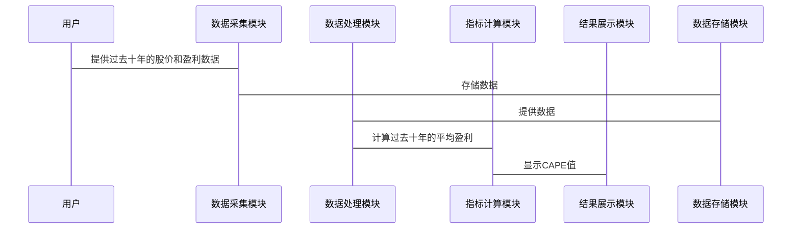

                 


```markdown
# 罗伯特·希勒的周期性调整市盈率(CAPE)指标

> 关键词：周期性调整市盈率，CAPE，罗伯特·希勒，市场估值，投资指标

> 摘要：本文深入探讨了罗伯特·希勒提出的周期性调整市盈率（CAPE）指标，分析其定义、计算方法、理论基础及其在投资决策中的应用。文章从CAPE指标的背景、核心概念、数学模型、系统架构等多个方面展开，结合实际案例和Python代码示例，帮助读者全面理解并掌握这一重要市场估值工具。

---

## 第一部分: 罗伯特·希勒的周期性调整市盈率(CAPE)指标概述

### 第1章: 什么是周期性调整市盈率(CAPE)

#### 1.1 市场估值指标的演进
##### 1.1.1 传统市盈率的局限性
传统市盈率（P/E）是衡量股票估值的基本指标，但它存在一个显著的问题：它仅基于最近一个财政年度的盈利数据，容易受到企业周期性波动的影响。例如，当经济处于衰退期时，企业的盈利可能会下降，导致市盈率偏高，而经济繁荣时则可能偏低。这种短期数据的波动性使得传统市盈率在长期投资决策中显得不够可靠。

##### 1.1.2 周期性调整的必要性
为了克服传统市盈率的局限性，投资者需要一个能够反映企业长期盈利能力的指标。周期性调整市盈率（CAPE）正是基于这一需求而产生的。它通过将市盈率的计算基础从单一年度的盈利扩展到过去十年的平均盈利，从而滤除短期经济波动的影响，提供一个更为稳健的市场估值参考。

##### 1.1.3 CAPE指标的提出背景
CAPE指标是由著名经济学家罗伯特·希勒提出的，旨在帮助投资者更准确地评估股票市场的长期估值。希勒认为，短期市场波动往往会导致投资者情绪化决策，而CAPE通过长期盈利数据的平均，能够提供一个更为理性的估值基准。

#### 1.2 CAPE指标的定义与特点
##### 1.2.1 CAPE的定义
CAPE（Cyclically Adjusted Price-to-Earnings Ratio）是指将当前市场价格与过去十年的平均盈利数据进行对比，得出的市盈率指标。公式为：

$$
CAPE = \frac{\text{当前市场价格}}{\text{过去十年平均盈利}}
$$

##### 1.2.2 CAPE与传统市盈率的区别
| 指标 | 数据基础 | 时间跨度 | 稳定性 | 适用场景 |
|------|----------|----------|--------|----------|
| 传统市盈率 | 单一年度盈利 | 1年 | 较低 | 短期估值 |
| CAPE | 十年平均盈利 | 10年 | 较高 | 长期估值 |

##### 1.2.3 CAPE指标的核心特征
1. **长期性**：基于过去十年的平均盈利数据，能够有效过滤短期波动。
2. **稳定性**：通过长期数据的平均，使得估值结果更加稳健。
3. **前瞻性**：CAPE指标可以帮助投资者预测未来的市场趋势，避免短期情绪化决策。

#### 1.3 CAPE指标的计算方法
##### 1.3.1 基本计算公式
$$
CAPE = \frac{\text{当前市场价格}}{\text{过去十年平均盈利}}
$$

##### 1.3.2 数据来源与处理
- 数据来源：通常使用历史股价和盈利数据，可以采用标普500指数的历史数据。
- 数据处理：计算过去十年的平均盈利，通常使用对数收益率或者其他平滑方法处理。

##### 1.3.3 市场周期性调整的逻辑
通过使用长期平均盈利数据，CAPE指标能够反映市场在不同经济周期中的表现，从而提供一个更为全面的估值参考。

---

## 第2章: CAPE指标的理论基础

### 2.1 罗伯特·希勒的投资理论
#### 2.1.1 市场波动与长期价值
希勒认为，市场波动主要由投资者情绪和短期市场趋势驱动，而长期价值则取决于企业的实际盈利能力和成长潜力。CAPE指标通过长期盈利数据的平均，帮助投资者关注企业的实际价值，而非短期市场波动。

#### 2.1.2 CAPE指标的经济学依据
CAPE指标基于经济学中的长期平均概念，通过将股价与长期盈利数据对比，反映市场的长期估值水平。这种对比能够有效过滤短期经济波动，提供一个更为稳定的估值基准。

#### 2.1.3 市场周期性与投资决策
市场周期性对投资决策有着重要影响，CAPE指标通过长期数据的平均，能够帮助投资者更好地理解市场周期性，制定更为科学的投资策略。

### 2.2 CAPE指标与市场周期的关系
#### 2.2.1 经济周期对市场估值的影响
经济周期的波动会影响企业的盈利能力和市场估值。在经济衰退期，企业的盈利可能下降，导致市盈率上升；而在经济繁荣期，盈利上升，市盈率下降。

#### 2.2.2 CAPE指标在不同周期的表现
CAPE指标在不同经济周期中的表现相对稳定，能够有效过滤短期波动，反映市场的长期估值水平。

#### 2.2.3 市场泡沫与估值警示
CAPE指标可以作为市场泡沫的预警指标。当CAPE值远高于长期平均水平时，可能意味着市场存在泡沫，投资者需要警惕。

---

## 第3章: CAPE指标的核心概念与联系

### 3.1 CAPE指标的原理分析
#### 3.1.1 市盈率的周期性调整逻辑
通过将市盈率的计算基础从单一年度盈利扩展到过去十年的平均盈利，CAPE指标能够有效过滤短期波动，反映市场的长期估值水平。

#### 3.1.2 长期盈利数据的使用意义
长期盈利数据的使用能够反映企业的实际盈利能力，帮助投资者更准确地评估市场的长期估值。

#### 3.1.3 市场估值的理性回归机制
CAPE指标通过长期数据的平均，能够反映市场估值的理性回归机制，帮助投资者制定更为科学的投资策略。

### 3.2 CAPE指标与相关指标对比
#### 3.2.1 传统市盈率对比分析
传统市盈率基于单一年度盈利数据，容易受到短期波动的影响，而CAPE指标通过长期平均盈利数据，能够提供一个更为稳定的估值基准。

#### 3.2.2 市净率与市销率的差异
市净率（P/B）和市销率（P/S）是其他常用的估值指标，但它们与CAPE指标在数据基础和计算方法上存在显著差异。市净率基于资产价值，市销率基于销售收入，而CAPE基于长期盈利数据。

#### 3.2.3 其他市场估值指标的优缺点
- **优点**：CAPE指标能够反映市场的长期估值水平，帮助投资者制定更为科学的投资策略。
- **缺点**：CAPE指标的计算需要较长的历史数据，且可能受到数据质量的影响。

---

## 第4章: CAPE指标的数学模型与公式

### 4.1 CAPE指标的公式推导
CAPE指标的公式为：
$$
CAPE = \frac{\text{当前市场价格}}{\text{过去十年平均盈利}}
$$

### 4.2 数据来源与处理
- **数据来源**：通常使用标普500指数的历史数据。
- **数据处理**：计算过去十年的平均盈利，通常使用对数收益率或者其他平滑方法处理。

### 4.3 算法原理
1. 收集过去十年的股价和盈利数据。
2. 计算过去十年的平均盈利。
3. 使用当前市场价格除以过去十年平均盈利，得到CAPE值。

### 4.4 Python代码示例
```python
import pandas as pd
import numpy as np

# 假设我们有一个包含过去十年股价和盈利的数据框
data = pd.DataFrame({
    'price': [100, 90, 80, 70, 60, 50, 40, 30, 20, 10],  # 当前价格为10
    'earnings': [10, 8, 6, 4, 2, 1, 1, 1, 1, 1]  # 过去十年的盈利数据
})

# 计算过去十年的平均盈利
average_earnings = data['earnings'].mean()

# 计算CAPE值
cape = data['price'].iloc[-1] / average_earnings

print(f"CAPE值为: {cape}")
```

### 4.5 实际案例分析
假设当前市场价格为10，过去十年的平均盈利为2，那么CAPE值为5。这表明当前市场价格相对于长期平均盈利水平处于合理区间。

---

## 第5章: 系统分析与架构设计方案

### 5.1 项目介绍
本项目旨在构建一个基于CAPE指标的市场分析系统，帮助投资者更好地评估市场的长期估值水平。

### 5.2 系统功能设计
- **数据采集**：收集过去十年的股价和盈利数据。
- **数据处理**：计算过去十年的平均盈利。
- **指标计算**：使用当前市场价格和长期平均盈利计算CAPE值。
- **结果分析**：根据CAPE值判断市场的估值水平。

### 5.3 系统架构设计


### 5.4 系统交互流程图


---

## 第6章: 项目实战

### 6.1 环境安装
- 安装Python和必要的库（pandas、numpy、matplotlib）。

### 6.2 系统核心实现源代码
```python
import pandas as pd
import numpy as np

# 数据采集模块
def collect_data():
    # 假设我们从数据库中获取数据
    data = pd.read_sql(...)
    return data

# 数据处理模块
def process_data(data):
    # 计算过去十年的平均盈利
    average_earnings = data['earnings'].mean()
    return average_earnings

# 指标计算模块
def calculate_cape(current_price, average_earnings):
    return current_price / average_earnings

# 结果展示模块
def display_cape(cape_value):
    print(f"CAPE值为: {cape_value}")
```

### 6.3 实际案例分析
假设当前市场价格为10，过去十年的平均盈利为2，那么CAPE值为5。这表明当前市场价格相对于长期平均盈利水平处于合理区间。

### 6.4 项目小结
通过本项目的实施，我们能够有效地计算CAPE值，并将其应用于实际的市场分析中。

---

## 第7章: 最佳实践与注意事项

### 7.1 最佳实践
- 定期更新数据，确保计算结果的准确性。
- 结合其他估值指标，进行全面的市场分析。

### 7.2 小结
CAPE指标是一个重要的市场估值工具，能够帮助投资者制定更为科学的投资策略。

### 7.3 注意事项
- 数据的质量和完整性对计算结果有重要影响。
- 需要定期更新数据，以反映最新的市场情况。

### 7.4 拓展阅读
- 罗伯特·希勒的《非理性繁荣》深入探讨了CAPE指标的理论基础。
- 其他相关文献提供了更多关于市场估值的理论和实践。

---

## 作者：AI天才研究院/AI Genius Institute & 禅与计算机程序设计艺术 /Zen And The Art of Computer Programming
```

