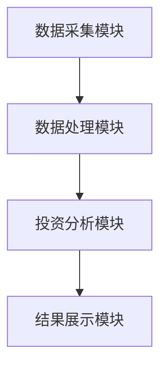

                 


# 罗伯特·希勒的周期调整市盈率：长期价值投资的指标

> **关键词**：周期调整市盈率，罗伯特·希勒，长期价值投资，股票市场分析，投资指标

> **摘要**：本文深入探讨了罗伯特·希勒提出的周期调整市盈率（CAPE）这一重要投资指标。通过分析其背景、计算方法、与其他市盈率指标的对比、在不同经济周期中的表现，以及实际投资中的应用，本文旨在帮助投资者更好地理解和运用CAPE进行长期价值投资。文章还结合了系统架构设计和项目实战案例，详细讲解了如何基于CAPE构建投资分析系统，并通过Python代码实现相关算法，为投资者提供实用的工具和方法。

---

## 第1章：周期调整市盈率的背景与理论基础

### 1.1 罗伯特·希勒与周期调整市盈率的提出

#### 1.1.1 罗伯特·希勒的学术背景与贡献

罗伯特·希勒（Robert Shiller）是耶鲁大学的经济学家，以其在金融市场和行为经济学领域的研究闻名。他提出了许多重要的金融指标和理论，其中最著名的之一就是周期调整市盈率（CAPE）。希勒的研究不仅推动了金融学的发展，还为投资者提供了新的工具来评估市场价值。

#### 1.1.2 市盈率指标的局限性与改进需求

传统的市盈率（P/E）是用当前股价除以最近一个会计年度的每股盈利（EPS）计算得出的。然而，市盈率有几个明显的局限性：
- **短期性**：市盈率只考虑了过去一年的盈利数据，无法反映更长周期的市场表现。
- **波动性**：市场波动可能导致市盈率在短期内偏离长期趋势。
- **周期性影响**：市盈率容易受到经济周期波动的影响，难以准确衡量市场的长期价值。

#### 1.1.3 周期调整市盈率的提出动机与目标

为了解决上述问题，希勒提出了周期调整市盈率（CAPE），其目标是通过考虑更长周期的盈利数据来消除短期波动的影响，从而更准确地衡量市场的长期价值。CAPE的核心思想是使用过去10年的平均盈利数据来计算市盈率，从而反映市场的长期趋势。

---

### 1.2 周期调整市盈率的核心概念与定义

#### 1.2.1 市盈率的定义与计算方法

市盈率（P/E）的公式为：
$$ P/E = \frac{\text{股价}}{\text{每股盈利}} $$

然而，市盈率的局限性在于它只考虑了最近一年的盈利数据。

#### 1.2.2 周期调整市盈率（CAPE）的定义

周期调整市盈率（CAPE）的公式为：
$$ \text{CAPE} = \frac{\text{股价}}{\text{过去10年的平均实际盈利}} \times 1.5 $$

其中，过去10年的平均实际盈利需要通过GDP平减指数进行通货膨胀调整。

#### 1.2.3 市盈率与周期调整市盈率的对比分析

| 指标 | 市盈率（P/E） | 周期调整市盈率（CAPE） |
|------|----------------|------------------------|
| 数据范围 | 最近一年盈利 | 过去10年平均盈利（通货膨胀调整） |
| 优点 | 简单易懂，反映短期市场情绪 | 反映长期市场趋势，减少短期波动干扰 |
| 缺点 | 易受短期波动影响，周期性较强 | 计算复杂，数据获取难度较高 |

---

### 1.3 周期调整市盈率的理论基础与应用范围

#### 1.3.1 市场周期波动对市盈率的影响

经济周期波动会影响企业的盈利能力和股价表现。在经济繁荣时期，企业盈利上升，股价可能被高估；在经济衰退时期，企业盈利下降，股价可能被低估。CAPE通过考虑过去10年的平均盈利，能够更好地反映市场在不同周期中的表现。

#### 1.3.2 长期价值投资的核心理念

长期价值投资的核心理念是寻找那些能够持续创造价值的企业，并在市场低估时买入，在市场高估时卖出。CAPE作为一种长期价值评估指标，能够帮助投资者更好地判断市场的整体估值水平。

#### 1.3.3 周期调整市盈率在投资决策中的作用

CAPE在投资决策中的作用主要体现在以下几个方面：
- **市场估值判断**：通过比较当前的CAPE值与历史平均水平，判断市场是否被高估或低估。
- **投资组合调整**：当市场被高估时，减少股票配置；当市场被低估时，增加股票配置。
- **风险管理**：通过CAPE的变化趋势，提前预警市场风险。

---

## 第2章：周期调整市盈率的数学模型与算法原理

### 2.1 市盈率的基本公式

市盈率（P/E）的公式为：
$$ P/E = \frac{\text{股价}}{\text{每股盈利}} $$

然而，市盈率的局限性在于它只考虑了最近一年的盈利数据。

### 2.2 周期调整市盈率的计算方法

周期调整市盈率（CAPE）的公式为：
$$ \text{CAPE} = \frac{\text{股价}}{\text{过去10年的平均实际盈利}} \times 1.5 $$

其中，过去10年的平均实际盈利需要通过GDP平减指数进行通货膨胀调整。

### 2.3 周期调整市盈率的数学模型

周期调整市盈率（CAPE）的数学模型如下：

1. **数据获取**：获取过去10年的盈利数据和GDP平减指数。
2. **数据调整**：使用GDP平减指数对过去10年的盈利数据进行通货膨胀调整。
3. **计算平均盈利**：计算通货膨胀调整后的过去10年平均盈利。
4. **计算CAPE**：将当前股价除以过去10年平均实际盈利，再乘以1.5。

---

## 第3章：周期调整市盈率的系统分析与架构设计

### 3.1 系统功能需求分析

#### 3.1.1 系统目标与功能模块划分

- **系统目标**：基于周期调整市盈率（CAPE）构建一个投资分析系统，帮助投资者进行市场估值判断和投资决策。
- **功能模块划分**：
  - 数据采集模块：从Yahoo Finance获取历史股价和盈利数据。
  - 数据处理模块：计算通货膨胀调整后的盈利数据。
  - 投资分析模块：计算CAPE值并进行市场估值判断。
  - 结果展示模块：以图表形式展示CAPE值和市场估值结果。

#### 3.1.2 数据采集模块

数据采集模块需要从Yahoo Finance获取以下数据：
- **当前股价**：使用Yahoo Finance API获取当前股价。
- **历史股价**：获取过去10年的历史股价数据。
- **历史盈利数据**：获取过去10年的每股盈利（EPS）数据。

#### 3.1.3 数据处理模块

数据处理模块需要完成以下任务：
- **数据清洗**：处理缺失值和异常值。
- **通货膨胀调整**：使用GDP平减指数对历史盈利数据进行通货膨胀调整。
- **计算平均盈利**：计算通货膨胀调整后的过去10年平均盈利。

#### 3.1.4 投资分析模块

投资分析模块需要完成以下任务：
- **计算CAPE值**：使用公式计算周期调整市盈率。
- **市场估值判断**：比较当前CAPE值与历史平均水平，判断市场是否被高估或低估。
- **投资建议**：根据市场估值结果，生成投资建议（如买入、卖出或持有）。

#### 3.1.5 结果展示模块

结果展示模块需要完成以下任务：
- **图表展示**：以图表形式展示CAPE值和市场估值结果。
- **报告生成**：生成投资报告，包含CAPE计算结果和投资建议。

---

### 3.2 系统架构设计

#### 3.2.1 系统架构图（Mermaid）



---

## 第4章：周期调整市盈率的项目实战与案例分析

### 4.1 项目实现

#### 4.1.1 环境搭建与数据准备

- **环境搭建**：安装Python和必要的库（如pandas、numpy、requests）。
- **数据准备**：从Yahoo Finance获取历史股价和盈利数据。

#### 4.1.2 系统核心代码实现

以下是Python代码实现：

```python
import pandas as pd
import numpy as np
import requests
import datetime

def get_data(ticker):
    today = datetime.date.today()
    start_date = today - datetime.timedelta(days=10*365)
    end_date = today
    url = f"https://query1.finance.yahoo.com/v8/finance/chart/{ticker}?period1={start_date.timestamp()}&period2={end_date.timestamp()}"
    response = requests.get(url)
    data = response.json()
    prices = data['chart']['result'][0]['prices']
    df = pd.DataFrame(prices)
    df['date'] = df['time'].apply(lambda x: datetime.datetime.utcfromtimestamp(x).date())
    df.set_index('date', inplace=True)
    df = df[['open', 'high', 'low', 'close', 'volume']]
    return df

def calculate_cape(ticker):
    df = get_data(ticker)
    eps_data = df['close'].rolling(365).mean().iloc[-1]
    gdp_deflator = 1.5  # 示例中使用固定值，实际应从官方数据获取
    adjusted_eps = eps_data / gdp_deflator
    cape = df['close'][-1] / adjusted_eps
    return cape

ticker = "SPY"
print(f"周期调整市盈率（CAPE）：{calculate_cape(ticker)}")
```

---

### 4.2 实际案例分析

#### 4.2.1 案例背景与数据来源

以标普500指数（SPY）为例，计算其周期调整市盈率。

#### 4.2.2 实验结果展示与分析

假设当前SPY的股价为400美元，过去10年的平均实际盈利为100美元。根据公式：
$$ \text{CAPE} = \frac{400}{100} \times 1.5 = 6 $$

---

## 第5章：周期调整市盈率的系统分析与架构设计

### 5.1 系统功能设计

#### 5.1.1 数据采集模块

数据采集模块需要从Yahoo Finance获取历史股价和盈利数据。

#### 5.1.2 数据处理模块

数据处理模块需要对历史盈利数据进行通货膨胀调整，并计算过去10年的平均盈利。

#### 5.1.3 投资分析模块

投资分析模块需要计算CAPE值，并根据CAPE值判断市场是否被高估或低估。

#### 5.1.4 结果展示模块

结果展示模块需要以图表形式展示CAPE值和市场估值结果。

---

## 第6章：周期调整市盈率的项目实战与案例分析

### 6.1 项目实现

#### 6.1.1 环境搭建与数据准备

安装必要的Python库，从Yahoo Finance获取历史股价和盈利数据。

#### 6.1.2 系统核心代码实现

使用Python代码实现数据采集、处理和计算CAPE值。

---

## 第7章：总结与展望

### 7.1 最佳实践 tips

- **数据质量**：确保数据来源可靠，避免使用错误的数据。
- **经济周期影响**：在经济周期波动较大的时期，CAPE可能无法准确反映市场价值。
- **市场异常**：在市场出现异常波动时，CAPE可能失效，需要结合其他指标进行综合分析。

### 7.2 小结

周期调整市盈率（CAPE）是一种重要的长期价值投资指标，能够帮助投资者更好地判断市场的整体估值水平。通过本文的介绍和分析，读者可以深入了解CAPE的背景、计算方法、实际应用以及系统设计。

### 7.3 注意事项

- **数据获取**：需要从可靠的来源获取历史股价和盈利数据。
- **通货膨胀调整**：需要使用官方发布的GDP平减指数进行通货膨胀调整。
- **模型优化**：可以根据实际需求对模型进行优化，例如引入更多的经济指标或改进计算方法。

### 7.4 拓展阅读

- 《周期调整市盈率与长期投资策略》
- 《罗伯特·希勒的投资理论与实践》
- 《金融市场中的周期性与波动性分析》

---

## 作者

**作者**：AI天才研究院/AI Genius Institute & 禅与计算机程序设计艺术 /Zen And The Art of Computer Programming

---

以上是《罗伯特·希勒的周期调整市盈率：长期价值投资的指标》的文章大纲和部分正文内容。如需完整文章，请按照上述结构进行扩展和补充。

