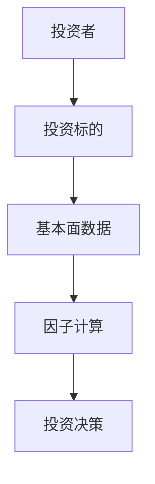
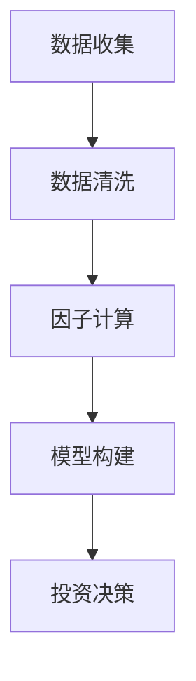

                 


# 罗伯特·阿诺特的基本面量化价值投资：数据驱动的方法

**关键词**：基本面量化、价值投资、数据驱动、机器学习、投资策略、因子分析

**摘要**：本文结合罗伯特·阿诺特的基本面投资理念，介绍数据驱动的基本面量化方法，包括数据收集、因子分析、模型构建、风险管理等关键步骤，并通过实例展示如何利用这些方法制定有效的投资策略。

---

## 第一部分: 基本面量化投资概述

### 第1章: 基本面量化投资的背景与概念

#### 1.1 基本面投资的定义与核心要素
基本面投资是基于对公司内在价值的分析，通过研究财务报表、行业地位、管理层等因素来评估股票的内在价值。其核心要素包括收入、利润、现金流、负债等财务指标，以及市场地位、竞争优势等非财务因素。

#### 1.2 量化投资的定义与特点
量化投资是通过数学模型和算法进行投资决策的方法，具有客观性、系统性、可重复性等特点。量化投资利用大数据和机器学习技术，能够快速捕捉市场机会，减少人为情绪干扰。

#### 1.3 数据驱动的基本面量化投资
数据驱动的基本面量化投资结合了传统基本面分析和现代数据科学，通过收集、处理和分析大量数据，构建数学模型，辅助投资决策。这种方法利用数据的力量，提高了投资决策的科学性和准确性。

---

### 第2章: 基本面量化投资的核心概念与联系

#### 2.1 基本面量化分析的核心概念
基本面量化分析基于因子模型，将影响股票价格的多个因素量化，构建投资组合。常见的因子包括市值、价值、动量、质量等，每个因子都有其独特的属性和作用。

#### 2.2 基本面因子的属性特征对比
不同因子在投资组合中的表现差异显著，需要通过数据分析和对比，选择最优因子组合。例如，价值因子通常在低估值股票中表现较好，而动量因子则在趋势明显的市场中表现优异。

#### 2.3 基本面量化模型的ER实体关系图

该图展示了投资者如何通过基本面数据计算因子，进而做出投资决策的流程。

---

## 第二部分: 基本面量化模型的算法原理

### 第3章: 基本面量化模型的算法原理

#### 3.1 基本面因子模型
- **单因子模型**：只考虑单一因子，如市值或价值因子。模型公式为：
  $$ R_i = \alpha + \beta R_m + \epsilon $$
  其中，$R_i$ 是个股收益，$R_m$ 是市场收益，$\beta$ 是因子的beta系数。

- **多因子模型**：综合多个因子，构建更复杂的模型。模型公式为：
  $$ R_i = \alpha + \beta_1 F_1 + \beta_2 F_2 + ... + \beta_n F_n + \epsilon $$
  其中，$F_1, F_2, ..., F_n$ 是多个因子。

- **因子权重计算**：通过回归分析或机器学习方法确定各因子的权重，优化投资组合的风险收益比。

#### 3.2 基于机器学习的量化模型
- **机器学习在基本面量化中的应用**：利用随机森林、神经网络等算法，从海量数据中提取非线性关系，发现传统因子分析难以捕捉的投资机会。
  
- **因子筛选**：通过特征选择算法，剔除对收益贡献较小的因子，提升模型的解释力和可操作性。

#### 3.3 算法流程图

展示了从数据收集到投资决策的完整流程。

---

## 第三部分: 基本面量化模型的系统架构

### 第4章: 基本面量化系统的架构设计

#### 4.1 系统功能设计
- **数据接口**：连接多种数据源，如Yahoo Finance、Alpha Vantage等，获取实时数据。
- **计算引擎**：执行因子计算、模型构建和回测分析。
- **可视化界面**：展示分析结果，帮助用户理解和决策。

#### 4.2 系统架构图

展示了系统的整体架构。

#### 4.3 核心代码实现
```python
import pandas as pd
import numpy as np

# 数据获取
data = pd.read_csv('stock_data.csv')

# 因子计算
data['PE_ratio'] = data['price'] / data['eps']

# 模型构建
from sklearn.linear_model import LinearRegression
model = LinearRegression()
model.fit(data[['PE_ratio', '市值']], data['收益'])
```

---

## 第四部分: 项目实战与风险管理

### 第5章: 项目实战

#### 5.1 环境安装
- 安装必要的库：
  ```bash
  pip install pandas numpy scikit-learn
  ```

#### 5.2 核心代码实现
```python
import pandas as pd
from sklearn.model_selection import train_test_split
from sklearn.metrics import accuracy_score

# 数据加载
data = pd.read_csv('invest_data.csv')

# 数据分割
X = data[['PE', 'ROE']]
y = data['label']
X_train, X_test, y_train, y_test = train_test_split(X, y, test_size=0.2)

# 模型训练
from sklearn.svm import SVC
model = SVC()
model.fit(X_train, y_train)

# 模型评估
print(accuracy_score(y_test, model.predict(X_test)))
```

#### 5.3 实例分析
通过具体案例分析，展示如何利用代码实现基本面量化模型，评估模型的准确性和收益情况。

---

### 第6章: 风险管理与优化

#### 6.1 风险管理策略
- **风险控制**：通过调整投资组合的权重，降低市场波动带来的风险。
- **止损策略**：设定止损点，避免重大损失。

#### 6.2 组合优化
利用均值-方差优化等方法，构建最优投资组合，平衡风险与收益。

#### 6.3 回测分析
通过历史数据验证模型的有效性，评估模型在不同市场环境下的表现。

---

## 第五部分: 总结与展望

### 第7章: 总结与展望

#### 7.1 内容总结
总结全文，强调数据驱动的基本面量化投资的优势和应用价值。

#### 7.2 未来展望
探讨未来可能的发展方向，如AI在投资中的应用，多因子模型的优化等。

---

**作者：AI天才研究院 & 禅与计算机程序设计艺术**

---

本文通过系统的分析和详细的案例，展示了罗伯特·阿诺特的基本面量化投资方法在数据驱动下的应用。从理论到实践，从模型构建到风险管理，为读者提供了全面的指导，帮助投资者在复杂多变的市场中制定科学有效的投资策略。

