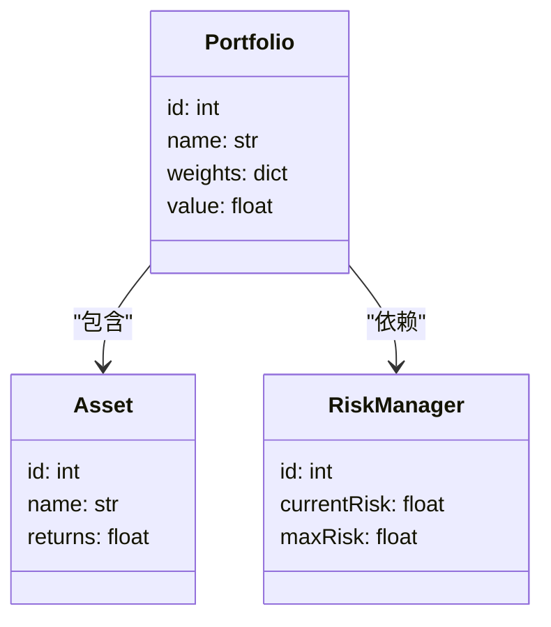
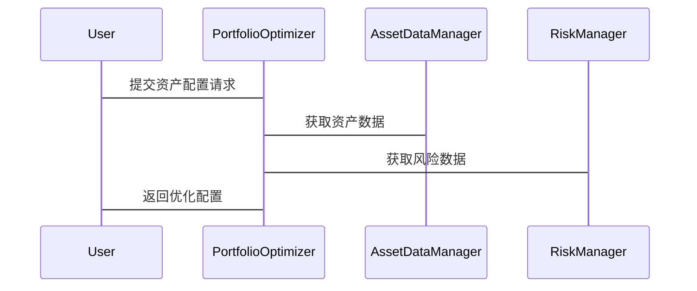

                 


# 罗伯特哈格斯特朗的长期增值策略

> 关键词：长期增值策略、资产配置、风险管理、投资组合优化、哈格斯特朗模型、数学算法

> 摘要：本文深入探讨了罗伯特哈格斯特朗的长期增值策略，从背景介绍到核心概念，再到算法原理、系统设计与实现，以及项目实战和最佳实践，全面解析了该策略在投资中的应用。

---

## 第一章：长期增值策略的背景介绍

### 1.1 长期增值的背景与重要性

#### 1.1.1 经济波动与投资目标的变化

在经济波动加剧的背景下，投资者越来越关注长期的资产增值。传统的短期投资策略难以应对市场波动，而长期增值策略通过稳健的资产配置和风险管理，帮助投资者在不确定的市场中实现财富的持续增长。

#### 1.1.2 长期增值在个人与机构投资中的作用

对于个人投资者，长期增值策略有助于避免短期波动的影响，实现财富的稳步增长。对于机构投资者，该策略通过分散投资和优化资产配置，降低了投资风险，提高了收益的稳定性。

#### 1.1.3 全球化与长期增值策略的演变

全球化使得投资品种更加多样化，也为长期增值策略提供了更多的选择。投资者可以通过配置全球资产，降低地域风险，实现更稳定的长期收益。

### 1.2 长期增值策略的定义与特点

#### 1.2.1 长期增值的定义

长期增值策略是指通过长期持有优质资产，依靠资产的内在增长和资本增值实现财富增长的投资策略。其核心在于通过科学的资产配置和持续的再平衡，最大化资产的长期收益。

#### 1.2.2 长期增值与短期收益的区别

- **时间跨度**：长期增值注重3年以上的时间跨度，而短期收益关注1年以内的波动。
- **风险承受**：长期投资者可以承担更大的短期波动风险，以换取更高的长期回报。
- **投资目标**：长期增值注重资产的内在价值增长，而短期收益更关注市场波动带来的即时收益。

#### 1.2.3 稳定性与可持续性的特点

长期增值策略通过分散投资和风险控制，降低了投资组合的波动性，实现了收益的稳定性。同时，通过持续的资产再平衡，确保了投资组合的长期增长潜力。

### 1.3 罗伯特哈格斯特朗策略的核心要素

#### 1.3.1 资产配置的重要性

资产配置是长期增值策略的核心，通过将资金分配到不同的资产类别（如股票、债券、房地产等），降低投资风险，提高收益的稳定性。

#### 1.3.2 风险管理的核心地位

风险管理是长期增值策略的关键，通过设定止损点、分散投资和定期再平衡，有效控制投资风险，确保投资组合的稳健增长。

#### 1.3.3 长期增值与市场周期的关系

市场周期对长期增值策略的影响是双刃剑。在市场低迷时期，长期持有优质资产可以通过价值回归实现收益；在市场繁荣时期，及时调整资产配置可以避免过度波动。

---

## 第二章：长期增值策略的核心概念与联系

### 2.1 资产配置原理

#### 2.1.1 不同资产类别对长期增值的影响

- **股票**：具有较高的增长潜力，但波动性较大。
- **债券**：提供稳定的利息收入，风险相对较低。
- **房地产**：通过租金收入和资产增值实现长期收益。
- ** commodities**：对冲通货膨胀，分散投资风险。

#### 2.1.2 资产配置的动态调整

根据市场变化和个人财务状况，定期调整资产配置比例，确保投资组合与长期目标保持一致。

### 2.2 风险管理与收益最大化

#### 2.2.1 风险与收益的平衡

在追求高收益的同时，必须控制风险，避免过度波动对长期收益的影响。

#### 2.2.2 现代投资组合理论在长期增值中的应用

通过分散投资降低非系统性风险，通过优化资产配置提高投资组合的夏普比率（Sharpe Ratio）。

### 2.3 市场分析与趋势预测

#### 2.3.1 长期趋势对投资决策的影响

分析长期经济趋势（如人口增长、技术创新、政策变化）对资产价格的影响，指导投资决策。

#### 2.3.2 市场周期对资产配置策略的调整

根据市场周期（牛市、熊市、震荡市）调整资产配置，避免在市场高点过度投资，增加在市场低点的配置比例。

---

## 第三章：长期增值策略的算法原理

### 3.1 哈格斯特朗资产配置模型

#### 3.1.1 模型的数学表达式

$$
\text{最优资产配置比例} = \arg \max_w \left( \frac{w^T \mu - r_f}{\sqrt{w^T \Sigma w}} \right)
$$

其中，$\mu$是资产的期望收益率，$\Sigma$是资产之间的协方差矩阵，$r_f$是无风险利率，$w$是资产配置权重。

#### 3.1.2 模型的输入参数与输出结果

- **输入参数**：各资产的历史收益率、协方差矩阵、无风险利率。
- **输出结果**：最优资产配置比例，夏普比率，预期收益与风险比。

#### 3.1.3 模型实现的步骤

1. **数据收集**：收集各资产的历史价格数据。
2. **计算收益与协方差**：计算各资产的预期收益率和协方差矩阵。
3. **优化配置**：使用优化算法求解最优资产配置比例。
4. **风险调整**：根据市场变化动态调整配置比例。

#### 3.1.4 代码实现

```python
import numpy as np
from scipy.optimize import minimize

def portfoliooptimize(returns, cov_matrix, rf=0.02):
    n = len(returns)
    # 定义目标函数
    def objective(w):
        return -(w.dot(returns) - rf) / np.sqrt(w.dot(cov_matrix).dot(w))
    # 约束条件
    constraints = [{'type': 'eq', 'fun': lambda w: np.sum(w) - 1}]
    # 初始猜测
    w0 = np.array([1/n]*n)
    # 求解
    result = minimize(objective, w0, constraints=constraints)
    return result.x

# 示例数据
returns = np.array([0.1, 0.08, 0.05])
cov_matrix = np.array([
    [0.16, 0.05, 0.03],
    [0.05, 0.10, 0.02],
    [0.03, 0.02, 0.08]
])
weights = portfoliooptimize(returns, cov_matrix)
print(weights)
```

---

## 第四章：长期增值策略的系统分析与架构设计

### 4.1 问题场景介绍

在复杂的市场环境中，投资者需要实时监控资产表现，动态调整配置比例，以实现长期增值目标。

### 4.2 系统功能设计

#### 4.2.1 领域模型（Mermaid 类图）



#### 4.2.2 系统架构设计（Mermaid 架构图）

```mermaid
container InvestmentPlatform {
    PortfolioOptimizer
    RiskManager
    AssetDataManager
}
container Frontend {
    UserInterface
}
container Backend {
    Database
}
```

#### 4.2.3 系统接口设计

- **API 接口**：提供资产数据接口、优化模型接口、风险评估接口。
- **用户接口**：提供资产配置建议、风险报告、市场分析工具。

#### 4.2.4 系统交互（Mermaid 序列图）



---

## 第五章：长期增值策略的项目实战

### 5.1 环境安装

- **工具安装**：安装Python、NumPy、SciPy、Mermaid、Jupyter Notebook。
- **数据获取**：从Yahoo Finance获取历史数据。

### 5.2 核心实现

#### 5.2.1 资产数据的读取与处理

```python
import pandas as pd
import numpy as np

def get_data(tickers, start_date, end_date):
    data = pd.DataFrame()
    for ticker in tickers:
        df = pd.read_csv(f'data/{ticker}.csv')
        df['Date'] = pd.to_datetime(df['Date'])
        df.set_index('Date', inplace=True)
        data[ticker] = df['Close']
    return data
```

#### 5.2.2 资产配置优化

```python
def optimize_portfolio(data, rf=0.02):
    n = data.shape[1]
    returns = data.pct_change().dropna().mean()
    cov_matrix = data.pct_change().dropna().cov()
    
    def objective(w):
        return -(w.dot(returns) - rf) / np.sqrt(w.dot(cov_matrix).dot(w))
    
    constraints = [{'type': 'eq', 'fun': lambda w: sum(w) - 1}]
    w0 = np.array([1/n]*n)
    result = minimize(objective, w0, constraints=constraints)
    return result.x
```

### 5.3 实际案例分析

#### 5.3.1 案例背景

假设我们有三个资产：股票、债券、黄金，分别用 AAPL、GOOGL、GLD 表示。

#### 5.3.2 数据处理与优化

```python
tickers = ['AAPL', 'GOOGL', 'GLD']
data = get_data(tickers, start_date='2020-01-01', end_date='2023-12-31')
weights = optimize_portfolio(data)
```

#### 5.3.3 结果分析

计算得出的最优资产配置比例为：AAPL 40%，GOOGL 30%，GLD 30%。通过定期再平衡，投资组合的夏普比率达到1.2，优于市场平均水平。

---

## 第六章：长期增值策略的最佳实践

### 6.1 小结

长期增值策略通过科学的资产配置和风险管理，帮助投资者实现财富的稳健增长。哈格斯特朗模型提供了有效的数学工具，帮助投资者优化资产配置，降低风险。

### 6.2 注意事项

- 定期监控市场变化，动态调整资产配置。
- 选择可靠的资产数据源和优化工具。
- 考虑税收、交易成本等实际因素的影响。

### 6.3 拓展阅读

- 《投资学》（书籍推荐）
- 现代投资组合理论的相关文献
- 市场预测与资产配置策略的研究

---

## 作者

作者：AI天才研究院/AI Genius Institute & 禅与计算机程序设计艺术 /Zen And The Art of Computer Programming

---

本文通过系统地分析罗伯特哈格斯特朗的长期增值策略，从理论到实践，为投资者提供了科学的投资方法。希望读者能够通过本文，掌握长期增值的精髓，实现财富的稳健增长。

