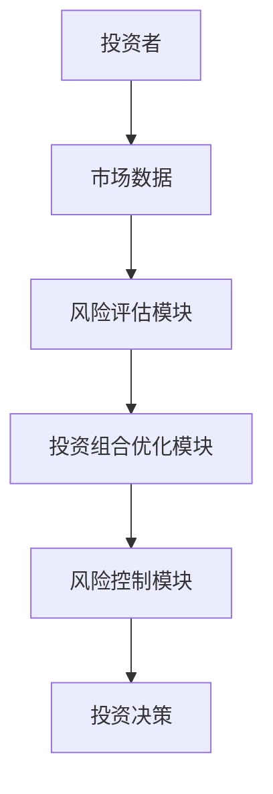

                 


# 罗杰·洛温斯坦的价值投资风险管理

> 关键词：价值投资、风险管理、投资策略、风险度量、投资组合优化

> 摘要：本文深入探讨了罗杰·洛温斯坦的价值投资风险管理方法，结合现代风险管理理论和数学模型，详细分析了价值投资中的风险识别、评估与控制策略，提出了风险管理框架的设计与实现方案。

---

# 第一部分: 价值投资与风险管理的背景

# 第1章: 价值投资与风险管理概述

## 1.1 价值投资的核心理念

### 1.1.1 价值投资的定义与起源

价值投资是一种投资策略，其核心理念是通过深入分析企业的基本面，寻找市场价格低于其内在价值的投资标的。这一策略起源于20世纪初，由本杰明·格雷厄姆和大卫·多德提出，强调以合理价格买入优质企业，追求长期稳定的超额收益。

### 1.1.2 价值投资的基本原则

- **安全边际**：买入价格低于内在价值，以降低风险。
- **长期视角**：关注企业的长期盈利能力，而非短期价格波动。
- **逆向思维**：在市场恐慌时寻找机会，避免追涨杀跌。

### 1.1.3 价值投资与风险管理的关系

风险管理是价值投资的重要组成部分。通过科学的风险管理，投资者可以在控制风险的前提下，实现价值投资的目标。罗杰·洛温斯坦强调，价值投资不仅关注于“买到便宜的东西”，更关注于如何在市场波动中保护资本，避免重大损失。

---

## 1.2 风险管理的重要性

### 1.2.1 风险管理的定义

风险管理是指通过识别、评估和应对各种可能影响投资收益的风险因素，以降低潜在损失、提高投资组合稳定性的过程。

### 1.2.2 风险管理在投资中的作用

- **保护资本**：通过控制风险，避免重大损失。
- **提高收益**：在可控风险范围内，追求更高的收益。
- **优化决策**：通过风险分析，帮助投资者做出更科学的投资决策。

### 1.2.3 现代风险管理理论的发展

从传统的资产组合理论（如马科维茨的有效组合）到现代的VaR（Value at Risk）和CVaR（Conditional Value at Risk）模型，风险管理理论不断进步，为投资者提供了更精确的风险度量方法。

---

## 1.3 价值投资与风险管理的结合

### 1.3.1 价值投资中的风险管理需求

价值投资者需要面对市场波动、企业基本面变化等多种风险。例如，市场恐慌可能导致优质企业的股价大幅下跌，投资者需要通过风险管理来避免过度损失。

### 1.3.2 风险管理对价值投资的促进作用

通过科学的风险管理，投资者可以更好地识别低估企业，优化投资组合，降低整体风险，同时抓住市场波动带来的机会。

### 1.3.3 价值投资与风险管理的系统性框架

罗杰·洛温斯坦提出，价值投资风险管理框架应包括以下几个方面：

1. **风险识别**：识别可能影响投资收益的各类风险因素。
2. **风险评估**：通过数学模型量化各类风险的影响程度。
3. **风险控制**：通过调整投资组合配置、设定止损等方式，降低整体风险。

---

## 1.4 本章小结

本章从价值投资的核心理念出发，分析了风险管理在投资中的重要性，并提出了价值投资与风险管理结合的系统性框架。下一章将深入探讨风险管理的理论基础和数学模型，为后续的策略分析奠定基础。

---

# 第二部分: 风险管理的理论与模型

# 第2章: 风险管理的理论基础

## 2.1 风险的定义与分类

### 2.1.1 风险的定义

风险是指在特定条件下，某一事件可能带来损失或收益的不确定性。在投资领域，风险通常与收益相关联，但投资者更关注如何控制潜在的损失。

### 2.1.2 风险的分类

- **系统性风险**：影响整个市场的风险，如经济衰退、政策变化等。
- **非系统性风险**：影响单个资产的风险，如企业经营不善、管理问题等。
- **流动性风险**：资产无法快速变现的风险。

### 2.1.3 风险的度量方法

- **标准差**：衡量资产收益的波动性。
- **VaR**：在给定置信水平下，资产可能的最大损失。
- **CVaR**：VaR的条件期望，衡量在最坏情况下的平均损失。

---

## 2.2 风险管理的基本原则

### 2.2.1 风险识别

通过分析市场、企业、行业等因素，识别可能影响投资收益的各类风险。

### 2.2.2 风险评估

通过数学模型量化各类风险的影响程度，评估其对投资组合的潜在影响。

### 2.2.3 风险控制

通过调整投资组合配置、设定止损等方式，降低整体风险。

---

## 2.3 现代风险管理理论

### 2.3.1 风险中性定价理论

通过无风险利率和风险溢价，对资产的合理价格进行估计。

### 2.3.2 风险调整现值法

通过调整现金流的折现率，考虑风险因素对资产价值的影响。

### 2.3.3 风险度量的数学模型

- **VaR模型**：$ VaR = \mu + z \cdot \sigma $
- **CVaR模型**：$$ CVaR = \frac{1}{1-\alpha} \int_{\alpha}^{1} VaR \, dF $$

---

## 2.4 本章小结

本章介绍了风险管理的理论基础和数学模型，为后续的策略分析提供了理论支持。下一章将详细探讨风险度量的数学模型及其应用。

---

# 第三部分: 价值投资的风险管理策略

# 第3章: 风险管理的系统性框架

## 3.1 价值投资中的风险管理需求

### 3.1.1 价值投资的内在风险

- **市场波动风险**：市场价格波动可能影响企业的估值。
- **企业基本面变化**：企业的盈利能力和财务状况可能发生变化。

### 3.1.2 风险管理对价值投资的促进作用

- **降低整体风险**：通过合理配置资产，分散风险。
- **抓住市场波动的机会**：在市场恐慌时，利用低估的价格进行投资。

---

## 3.2 风险管理框架的设计

### 3.2.1 风险识别与评估

通过分析市场、行业和企业基本面，识别可能的风险因素，并对其影响程度进行量化评估。

### 3.2.2 风险控制策略

- **分散投资**：通过投资多种资产或行业，降低非系统性风险。
- **设定止损**：在股价跌破一定价位时，及时卖出，避免进一步损失。
- **动态调整**：根据市场变化和企业基本面，动态调整投资组合。

---

## 3.3 数学模型与系统架构

### 3.3.1 风险度量的数学公式

- **VaR计算公式**：$$ VaR = \mu + z \cdot \sigma $$
- **CVaR计算公式**：$$ CVaR = \frac{1}{1-\alpha} \int_{\alpha}^{1} VaR \, dF $$

### 3.3.2 系统架构图



---

## 3.4 本章小结

本章详细探讨了价值投资中的风险管理需求，并提出了系统性的风险管理框架。通过数学模型和系统架构的设计，为投资者提供了科学的风险管理方法。

---

# 第4章: 项目实战与案例分析

## 4.1 项目背景与目标

- **项目背景**：通过实际案例，验证风险管理框架的有效性。
- **项目目标**：优化投资组合，降低整体风险。

---

## 4.2 系统实现

### 4.2.1 环境安装

- **工具安装**：安装Python、Pandas、NumPy等工具。
- **数据获取**：获取历史市场数据和企业基本面数据。

---

## 4.3 核心代码实现

```python
import numpy as np
import pandas as pd

# 示例代码：计算VaR
def calculate VaR(data, confidence_level=0.95):
    data_sorted = np.sort(data)
    index = int(len(data_sorted) * confidence_level)
    VaR = data_sorted[index]
    return VaR

# 示例数据：某资产的历史收益率
returns = np.random.normal(0, 1, 1000)
VaR = calculate VaR(returns)
print(f"VaR at {confidence_level} confidence level is {VaR}")
```

---

## 4.4 案例分析

### 4.4.1 案例背景

假设某投资者关注一只股票，通过风险管理框架，评估其风险，并制定投资策略。

### 4.4.2 分析过程

- **风险识别**：分析市场、行业和企业基本面。
- **风险评估**：计算VaR和CVaR，量化风险。
- **风险控制**：设定止损，分散投资。

---

## 4.5 本章小结

本章通过实际案例，验证了风险管理框架的有效性，并展示了如何通过数学模型和系统实现，优化投资组合，降低整体风险。

---

# 第5章: 总结与展望

## 5.1 本章总结

本文深入探讨了罗杰·洛温斯坦的价值投资风险管理方法，结合现代风险管理理论和数学模型，提出了系统性的风险管理框架。

---

## 5.2 未来展望

未来，随着人工智能和大数据技术的发展，风险管理将更加精准和智能化。投资者可以通过更复杂的风险模型和算法，优化投资组合，降低风险。

---

作者：AI天才研究院/AI Genius Institute & 禅与计算机程序设计艺术 /Zen And The Art of Computer Programming

