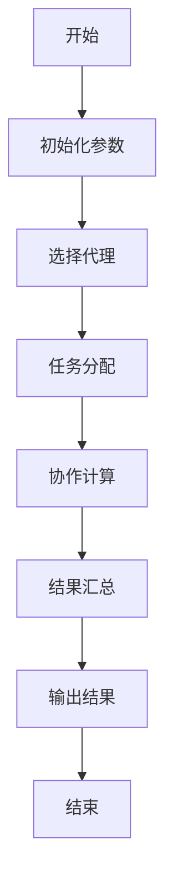

                 


# 群体智能AI Agent：多个LLM协作的分布式系统

---

## 关键词：群体智能，AI Agent，分布式系统，大语言模型，LLM协作，算法原理

---

## 摘要：  
本文探讨了群体智能与AI Agent在多个大语言模型（LLM）协作中的应用，分析了分布式系统的架构设计、算法原理以及实际项目实现。通过理论与实践相结合的方式，展示了如何利用群体智能优化AI Agent的协作效率，解决了分布式系统中的通信与协调问题，为未来的智能化系统设计提供了参考。

---

## 第1章: 群体智能与AI Agent概述

### 1.1 群体智能的基本概念

群体智能是指多个个体通过协作完成复杂任务的智能形式。这些个体可以是人类、动物或AI Agent，通过局部信息交换实现全局目标。群体智能的核心在于个体间的协同与分布式计算。

AI Agent是一种智能体，能够感知环境、自主决策并执行任务。AI Agent可以是软件程序，具备问题解决、规划和学习能力。群体智能中的AI Agent通过协作完成复杂任务，体现了分布式智能的特点。

群体智能与AI Agent的结合使得多个LLM能够协同工作，解决单个模型难以处理的问题。分布式系统中的群体智能AI Agent通过通信协议实现协作，提高了系统的整体智能水平。

### 1.2 问题背景与描述

当前AI Agent协作面临任务分配、通信效率和决策协调等问题。多个LLM协作需要考虑模型之间的通信、数据同步和任务分配策略。分布式系统中，节点间的延迟和带宽限制影响协作效率。

问题描述包括：如何高效分配任务，如何优化通信协议，如何处理模型间冲突。这些挑战需要通过系统设计和算法优化来解决。

### 1.3 问题解决与边界

群体智能AI Agent通过分布式协作机制优化任务分配，使用通信协议降低延迟。系统边界包括通信范围、协作范围和决策范围，确保系统在特定范围内高效运行。

核心概念包括：任务分配、通信协议、协作机制。通过ER图展示实体关系，明确各实体的属性与关系。系统边界与外延确保协作在合理范围内，避免复杂性过高。

---

## 第2章: 群体智能与AI Agent的核心概念

### 2.1 多个LLM协作的机制

多个LLM协作机制基于分布式系统架构，通过任务分配和结果汇总实现。任务分配算法根据模型能力和负载均衡分配任务。结果汇总算法整合各模型输出，形成最终结果。

通信协议设计必须高效，减少数据传输延迟。模型间通过消息队列或事件驱动机制实现异步通信。任务分配策略考虑模型响应时间和计算能力，动态调整任务负载。

### 2.2 分布式系统架构

系统架构采用微服务架构，各AI Agent作为独立服务。通信层使用HTTP或WebSocket协议，确保实时性和可靠性。数据存储层使用分布式数据库，保证数据一致性。

架构图展示系统组成，包括任务分配模块、通信模块、计算模块和结果汇总模块。功能模块协同工作，实现分布式协作。交互序列图展示模块间的协作流程，明确执行顺序。

### 2.3 群体智能与AI Agent的实体关系

实体关系图（ER图）展示主要实体及其关系。实体包括：AI Agent、任务、通信协议、模型参数。关系包括：拥有、执行、遵循和包含。

概念对比表格展示分布式系统与集中式系统的区别，包括可扩展性、容错性、延迟等方面。通过表格分析，明确群体智能的优势。

---

## 第3章: 群体智能AI Agent的算法原理

### 3.1 算法概述

算法分为任务分配、计算和汇总三个阶段。任务分配基于负载均衡和模型能力，计算阶段各模型并行处理，汇总阶段整合结果。

mermaid流程图展示算法流程，从任务分配到结果汇总的步骤。Python代码示例实现任务分配模块，展示如何动态分配任务。

### 3.2 算法流程图



### 3.3 算法实现

Python代码实现任务分配模块：

```python
import random

class TaskAllocator:
    def __init__(self, agents, load_factors):
        self.agents = agents
        self.load_factors = load_factors
    
    def allocate_task(self, task):
        # 根据负载因子选择最优代理
        min_factor = min(self.load_factors)
        selected_index = self.load_factors.index(min_factor)
        selected_agent = self.agents[selected_index]
        return selected_agent

# 示例使用
agents = ['Agent1', 'Agent2', 'Agent3']
load_factors = [0.8, 0.6, 0.9]
allocator = TaskAllocator(agents, load_factors)
task = 'image_recognition'
assigned_agent = allocator.allocate_task(task)
print(f"Task assigned to {assigned_agent}")
```

数学模型展示任务分配的优化目标：

$$ \text{目标函数} = \sum_{i=1}^{n} w_i x_i $$

其中，$w_i$为权重，$x_i$为任务分配给AI Agent i的负载。约束条件包括负载均衡和模型能力。

---

## 第4章: 群体智能AI Agent的系统架构设计

### 4.1 系统功能设计

系统功能包括任务分配、模型协作、结果汇总。功能模块协同工作，实现高效协作。

类图展示系统组成，包括代理管理器、任务分配器、通信模块。各模块协作完成任务分配和数据传输。

### 4.2 系统架构设计

架构图展示系统整体结构，包括前端、后端服务和数据库。前端接收请求，后端处理任务，数据库存储结果。

### 4.3 系统接口设计

接口包括任务分配接口、模型调用接口和结果汇总接口。接口设计考虑RESTful API和WebSocket协议。

### 4.4 系统交互

序列图展示系统交互流程，从用户请求到结果返回的步骤。展示各模块间的协作过程。

---

## 第5章: 群体智能AI Agent的项目实战

### 5.1 环境安装

安装Python、Flask、Redis等依赖。配置虚拟环境，安装所需库。

### 5.2 核心代码实现

实现任务分配模块、通信模块和结果汇总模块。代码示例展示如何实现异步通信和任务协作。

### 5.3 案例分析

通过案例展示系统在图像识别中的应用，分析模型协作效果和性能指标。

### 5.4 项目小结

总结项目实现的关键点，优化方向和未来展望。

---

## 第6章: 群体智能AI Agent的优化与扩展

### 6.1 性能优化

优化通信协议，减少数据传输延迟。采用负载均衡算法提高系统吞吐量。

### 6.2 可扩展性

设计模块化架构，便于添加新AI Agent。采用分布式存储保证数据一致性。

### 6.3 容错性

实现故障检测与恢复机制，确保系统高可用性。采用冗余部署降低故障风险。

### 6.4 安全性

加强数据加密和访问控制，防止数据泄露和恶意攻击。

---

## 第7章: 未来展望

### 7.1 群体智能的发展趋势

AI Agent协作将更加智能化，任务分配更精准。模型间协作将更高效，系统扩展性更强。

### 7.2 挑战与思考

数据隐私、计算资源分配和模型协作效率是未来的主要挑战。需要通过技术创新解决这些问题。

### 7.3 伦理与社会影响

群体智能AI Agent的广泛应用带来伦理问题，需制定规范确保其合理使用。

---

## 作者：AI天才研究院 & 禅与计算机程序设计艺术

---

以上内容为《群体智能AI Agent：多个LLM协作的分布式系统》的完整目录和正文部分，详细阐述了群体智能与AI Agent的基本概念、算法原理、系统架构设计以及项目实战。希望对您有所帮助！

