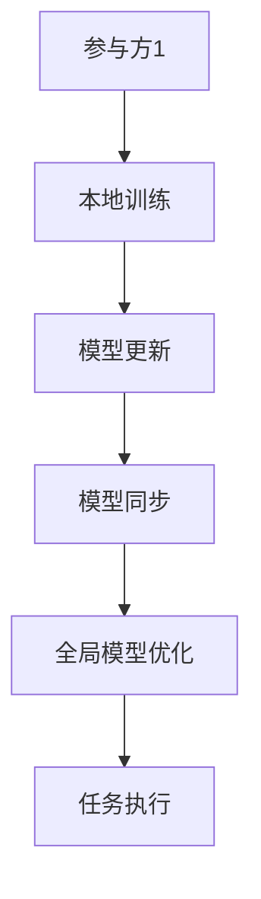

                 

# 联邦学习在AI Agent隐私保护推理中的应用

## 关键词：联邦学习，AI Agent，隐私保护，机器学习，分布式计算

## 摘要：  
随着人工智能技术的快速发展，AI Agent（智能体）在各个领域的应用越来越广泛。然而，AI Agent在执行任务时需要处理大量敏感数据，如何保护这些数据的隐私性成为了一个重要挑战。联邦学习（Federated Learning）作为一种分布式机器学习技术，能够在不共享原始数据的情况下进行模型训练，为AI Agent的隐私保护提供了新的解决方案。本文将详细探讨联邦学习在AI Agent隐私保护中的应用，从核心概念、算法原理到实际应用，全面分析其技术优势和实现细节。

---

## 第一部分: 联邦学习与AI Agent隐私保护概述

### 第1章: 联邦学习与AI Agent的基本概念

#### 1.1 联邦学习的定义与背景
联邦学习是一种分布式机器学习技术，允许多个参与方在不共享原始数据的情况下协同训练模型。其核心思想是通过数据局部训练和模型参数同步，实现全局模型的优化，同时保护数据隐私。联邦学习的主要特点包括数据局部性、模型全局性、通信效率高以及隐私保护强。

#### 1.2 AI Agent的基本概念
AI Agent是一种能够感知环境、执行任务并做出决策的智能实体。它具备自主性、反应性、目标导向性和社会性等特征。AI Agent广泛应用于推荐系统、自动驾驶、智能助手等领域，但在处理敏感数据时面临隐私泄露的风险。

#### 1.3 联邦学习与AI Agent的结合
联邦学习为AI Agent提供了一种在不共享数据的情况下进行模型训练的方法。通过联邦学习，AI Agent可以在本地数据上进行训练，同时与其他Agent协作优化模型，从而在保护隐私的前提下提升决策能力。

---

### 第2章: 联邦学习的核心原理与AI Agent的隐私保护

#### 2.1 联邦学习的核心原理
联邦学习的核心原理包括数据分割、模型同步和隐私保护。数据被分割在不同的参与方本地，每个参与方在本地数据上训练模型，并将模型参数上传到中央服务器或通过其他方式进行同步。这种分布式训练方式避免了原始数据的共享，从而保护了隐私。

#### 2.2 AI Agent的隐私保护需求
AI Agent在执行任务时需要处理大量敏感数据，例如用户的地理位置、行为习惯等。这些数据如果被滥用，可能导致隐私泄露。因此，AI Agent需要一种既能利用数据进行推理，又不泄露数据的方法。

#### 2.3 联邦学习如何满足AI Agent的隐私需求
联邦学习通过局部训练和模型同步的方式，确保数据不离开本地，从而保护AI Agent的隐私。同时，联邦学习的加密通信机制可以进一步增强隐私保护，确保模型同步过程中的数据安全性。

---

## 第二部分: 联邦学习的算法原理与数学模型

### 第3章: 联邦学习的算法原理

#### 3.1 联邦学习的主要算法类型
联邦学习可以分为横向联邦学习和纵向联邦学习。横向联邦学习适用于数据特征相同的场景，而纵向联邦学习适用于数据特征不同的场景。不同的算法类型适用于不同的应用场景。

#### 3.2 联邦学习的数学模型
联邦学习的优化目标是通过最小化损失函数来最大化模型的准确率。其数学模型通常包括损失函数、优化器和模型参数更新规则。

#### 3.3 联邦学习的算法流程图

---

### 第4章: 联邦学习在AI Agent中的应用

#### 4.1 联邦学习如何支持AI Agent的决策推理
通过联邦学习，AI Agent可以在本地数据上进行训练，同时与其他Agent协作优化模型，从而在保护隐私的前提下提升决策能力。

#### 4.2 联邦学习与AI Agent结合的技术挑战
技术挑战包括数据异构性、通信开销、模型收敛性等问题。

#### 4.3 联邦学习在AI Agent中的实际应用
实际应用包括推荐系统、智能助手、自动驾驶等领域。

---

## 第三部分: 系统分析与架构设计

### 第5章: 系统分析与架构设计

#### 5.1 项目介绍
本项目旨在通过联邦学习技术实现AI Agent的隐私保护，提升其决策推理能力。

#### 5.2 系统功能设计
系统功能包括数据本地训练、模型同步、隐私保护等。

#### 5.3 系统架构设计
系统架构包括本地AI Agent、中央服务器和通信模块。

#### 5.4 系统接口设计
系统接口包括本地训练接口、模型同步接口和隐私保护接口。

---

## 第四部分: 项目实战

### 第6章: 项目实战

#### 6.1 环境安装
需要安装Python、TensorFlow等工具。

#### 6.2 系统核心实现
实现本地训练、模型同步和隐私保护功能。

#### 6.3 案例分析
通过具体案例展示联邦学习在AI Agent中的应用。

---

## 第五部分: 总结与展望

### 第7章: 总结与展望

#### 7.1 小结
本文详细探讨了联邦学习在AI Agent隐私保护中的应用，分析了其技术优势和实现细节。

#### 7.2 注意事项
在实际应用中，需要注意数据异构性、通信开销等问题。

#### 7.3 拓展阅读
推荐阅读相关技术文献，深入理解联邦学习和AI Agent的结合。

---

## 作者：AI天才研究院/AI Genius Institute & 禅与计算机程序设计艺术 /Zen And The Art of Computer Programming

