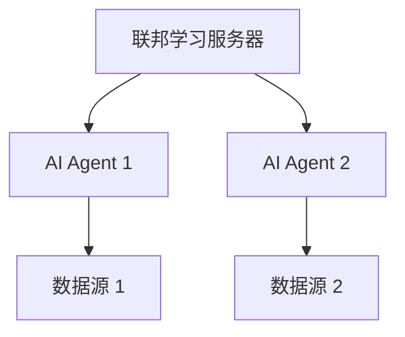
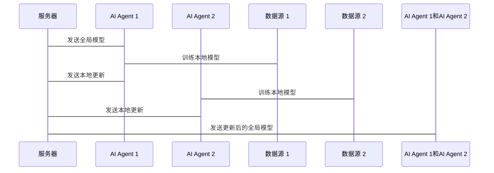

                 


# 联邦学习在分布式AI Agent中的应用

## 关键词：联邦学习、分布式AI Agent、机器学习、数据隐私、协作学习

## 摘要

联邦学习（Federated Learning）是一种在分布式环境下进行机器学习的方法，允许多个机构在不共享原始数据的情况下共同训练模型。AI Agent（人工智能代理）是指具备自主决策和行动能力的智能体，通常在分布式环境中工作。本文探讨联邦学习在分布式AI Agent中的应用，分析其核心原理、算法设计、系统架构，并通过实际案例展示其应用价值。

---

## 第三章：算法原理讲解

### 3.1 联邦学习的优化算法

联邦学习的核心在于如何在不共享数据的情况下，通过模型参数的同步与更新来优化全局模型。以下是常见的优化算法：

#### 3.1.1 联邦平均（FedAvg）

**算法原理：**
- 每个参与方（机构或AI Agent）在本地数据上训练模型，生成更新参数。
- 服务器收集所有参与方的更新参数，并计算平均值，更新全局模型。
- 全局模型参数分发给所有参与方，继续下一轮训练。

**数学公式：**

全局模型参数更新：
$$\theta_{\text{global}}^{(t+1)} = \frac{1}{K} \sum_{i=1}^{K} \theta_{\text{local}}^{(t)}$$

其中，$K$ 是参与方数量，$\theta_{\text{local}}$ 是各参与方的本地模型参数。

**代码示例：**

```python
def fed_avg(client_params):
    avg_params = {}
    for key in client_params[0].keys():
        avg = sum([client[key] for client in client_params]) / len(client_params)
        avg_params[key] = avg
    return avg_params
```

#### 3.1.2 联邦Proximal

**算法原理：**
- 在FedAvg的基础上，加入正则化项，防止模型参数发散。
- 适用于参与方数据分布不均衡的情况。

**数学公式：**

模型更新目标函数：
$$\min_{\theta_{\text{local}}} \frac{1}{n_i} \sum_{i=1}^{n_i} \mathcal{L}(\theta_{\text{local}}, (x_i, y_i)) + \lambda \|\theta_{\text{local}} - \theta_{\text{global}}\|^2$$**

**代码示例：**

```python
def fed_prox(global_params, client_params, learning_rate, lambda_reg):
    proximal_params = {}
    for key in global_params.keys():
        proximal = client_params[key] - 2 * lambda_reg * (client_params[key] - global_params[key])
        proximal_params[key] = proximal
    return proximal_params
```

#### 3.1.3 联邦学习的挑战与优化

- 数据异质性：不同机构的数据分布可能不同，导致模型更新不一致。
- 通信开销：模型参数同步需要消耗大量带宽，特别是在大规模分布系统中。
- 鲲鹏优化：针对特定硬件的优化，如华为鲲鹏芯片的性能优化，可能需要调整算法以适应不同的计算环境。

---

### 3.2 AI Agent中的强化学习

AI Agent在分布式环境中通常需要进行强化学习，以实现自主决策和协作。以下是强化学习在AI Agent中的应用：

#### 3.2.1 多智能体强化学习（MADRL）

**算法原理：**
- 多个AI Agent协作完成任务，每个Agent学习自己的策略。
- 使用价值函数或策略梯度方法，优化全局目标。

**数学公式：**

多智能体价值函数：
$$V(s) = \sum_{i=1}^{N} \alpha_i V_i(s)$$

其中，$\alpha_i$ 是权重系数，$N$ 是智能体数量。

**代码示例：**

```python
def multi_agent_value(value_functions, weights):
    return sum([weight * vf.predict() for vf, weight in zip(value_functions, weights)])
```

#### 3.2.2 联合策略优化

**算法原理：**
- 所有AI Agent共同优化一个全局策略，每个Agent更新自己的参数，同步全局参数。
- 使用分布式优化算法，如分布式梯度下降。

**数学公式：**

全局策略更新：
$$\theta_{\text{global}}^{(t+1)} = \theta_{\text{global}}^{(t)} - \eta \sum_{i=1}^{K} \nabla L_i(\theta_{\text{global}}^{(t)})$$

其中，$\eta$ 是学习率，$L_i$ 是第$i$个智能体的损失函数。

**代码示例：**

```python
def distributed_optimization(global_params, client_gradients, learning_rate):
    updated_params = {}
    for key in global_params.keys():
        updated_params[key] = global_params[key] - learning_rate * sum(client_gradients[key]) / len(client_gradients)
    return updated_params
```

---

## 第四章：系统分析与架构设计

### 4.1 问题场景介绍

在分布式AI Agent系统中，联邦学习面临以下问题：

- 数据隐私：各个机构的数据不能共享。
- 模型同步：需要高效的方法同步模型参数。
- 协作效率：确保AI Agent之间的协作高效且实时。

### 4.2 系统功能设计

系统功能包括：

- 数据采集与预处理
- 模型训练与更新
- 模型同步与分发
- 任务协作与执行

### 4.3 系统架构设计

**系统架构图（Mermaid）：**



**接口设计：**

- 服务器接口：接收模型更新，发送全局模型。
- AI Agent接口：接收全局模型，发送本地更新。

### 4.4 系统交互流程（Mermaid）



---

## 第五章：项目实战

### 5.1 环境安装

安装必要的库：

```bash
pip install tensorflow-federated pandas numpy matplotlib
```

### 5.2 核心代码实现

#### 联邦学习实现

```python
import numpy as np
from tensorflow_federated import create_simple_federated_dataset

# 初始化数据集
data = create_simple_federated_dataset()

# 定义模型
model = tf.keras.Model(inputs=x, outputs=y)

# 联邦平均算法实现
def fed_avg(client_models):
    return {key: np.mean([model[key] for model in client_models], axis=0) for key in model.keys()}

# 训练过程
global_model = initialize_model()
for round in rounds:
    client_models = train_clients(global_model)
    global_model = fed_avg(client_models)
```

#### AI Agent强化学习实现

```python
# 多智能体强化学习
class MultiAgent:
    def __init__(self, num_agents):
        self.agents = [Agent() for _ in range(num_agents)]
    
    def update(self, global_params):
        for agent in self.agents:
            agent.update(global_params)

# 全局策略优化
def optimize(global_params, gradients):
    return global_params - learning_rate * sum(gradients) / len(gradients)
```

### 5.3 案例分析

**案例：分布式推荐系统**

- **背景：** 多个电商平台协作训练推荐模型，保护用户数据隐私。
- **实现：** 使用联邦学习训练用户偏好模型，AI Agent负责实时推荐。
- **结果：** 提高推荐准确率，降低数据泄露风险。

---

## 第六章：最佳实践与总结

### 6.1 最佳实践

- **数据预处理：** 确保数据质量，减少异质性影响。
- **通信优化：** 使用压缩技术减少参数传输量。
- **安全机制：** 引入加密和差分隐私保护数据。

### 6.2 小结

本文详细探讨了联邦学习在分布式AI Agent中的应用，从算法原理到系统架构，再到项目实战，全面展示了其在实际应用中的价值和挑战。通过结合联邦学习和多智能体强化学习，可以有效解决数据隐私问题，提升协作效率。

### 6.3 注意事项

- 确保通信效率，避免成为性能瓶颈。
- 定期更新模型，适应数据分布变化。
- 考虑硬件优化，提升计算效率。

### 6.4 拓展阅读

- "Federated Learning: Challenges, Methods, and Future Directions" by Qiang Yang et al.
- "Distributed Reinforcement Learning in Multi-Agent Systems" by X. Li et al.

---

## 作者：AI天才研究院/AI Genius Institute & 禅与计算机程序设计艺术/Zen And The Art of Computer Programming

---

**注：** 由于篇幅限制，上述代码和图表未完全展开，实际撰写时需要根据具体需求进行补充和调整。

