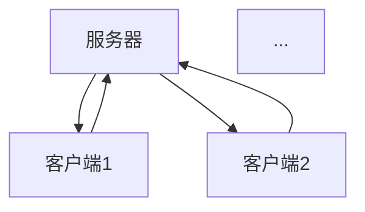
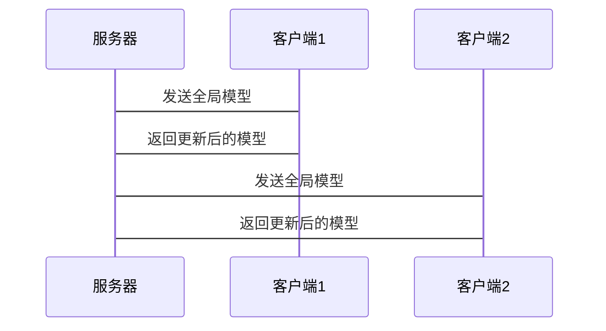

                 


# 联邦学习在分布式AI Agent训练中的应用

> 关键词：联邦学习、分布式AI Agent、数据隐私、模型训练、分布式计算、人工智能

> 摘要：  
本文深入探讨了联邦学习在分布式AI Agent训练中的应用，分析了其核心概念、算法原理、系统架构以及实际项目中的实现。通过详细的技术分析和实例，展示了联邦学习如何在保护数据隐私的同时，支持分布式AI Agent的高效训练，为实际应用提供了理论和实践指导。

---

## 第一部分: 联邦学习与分布式AI Agent概述

### 第1章: 联邦学习与分布式AI Agent的背景介绍

#### 1.1 问题背景与问题描述
- **问题背景**：在分布式AI Agent训练中，数据往往分布在多个不同的设备或机构中，这些数据通常包含敏感信息，直接共享数据可能引发隐私泄露和合规性问题。此外，传统集中式训练方法需要将所有数据汇总到一个中心节点，这在实际应用中面临数据传输成本高、延迟大、安全性差等问题。
- **问题描述**：如何在不共享原始数据的前提下，训练出高性能的AI模型？如何设计高效的算法和架构，支持分布式环境下的模型更新与协作？

#### 1.2 联邦学习的核心概念与问题解决
- **联邦学习的定义**：联邦学习是一种分布式机器学习方法，允许多个参与方在不共享原始数据的情况下，通过交换模型更新来协作训练一个全局模型。
- **分布式AI Agent训练的核心问题**：如何在分布式环境中高效同步模型参数，如何处理异构数据和计算资源，如何保证模型收敛性和鲁棒性。
- **联邦学习的解决方案**：通过设计高效的通信协议和优化算法，联邦学习能够在分布式环境中实现模型的联合训练，同时保护数据隐私。

#### 1.3 联邦学习的边界与外延
- **适用场景**：适用于数据分布式的场景，如多机构协作、移动设备端智能、IoT设备联动等。
- **限制与不足**：通信开销高、模型更新延迟、部分参与方可能恶意攻击等。
- **相关概念的对比**：与传统集中式学习、分布式计算、区块链在AI中的应用等进行对比，明确联邦学习的独特性和优势。

#### 1.4 联邦学习的核心要素与概念结构
- **参与方角色**：包括协调者（服务器）和参与者（客户端），协调者负责全局模型的管理，参与者负责本地数据的训练和模型更新。
- **数据分布**：数据按领域、用户或设备分布，每个参与方只处理本地数据。
- **模型更新机制**：通过同步或异步方式，将各个参与方的局部模型更新聚合为全局模型。

#### 1.5 本章小结
本章介绍了联邦学习的基本概念、核心问题及解决方案，明确了其在分布式AI Agent训练中的重要性。

---

## 第二部分: 联邦学习的核心概念与原理

### 第2章: 联邦学习的核心概念与联系

#### 2.1 联邦学习的核心原理
- **联邦平均（FedAvg）算法**：服务器将全局模型参数分发给各个客户端，客户端在本地数据上训练模型，然后将更新后的模型参数回传给服务器，服务器将所有客户端的参数进行加权平均，得到新的全局模型。
- **数据隐私保护**：通过加密通信和差分隐私技术，确保本地数据不被泄露。
- **模型聚合优化**：通过优化算法（如Adam、SGD）和通信协议（如gossip协议），提高模型收敛速度和通信效率。

#### 2.2 联邦学习与AI Agent的关系
- **AI Agent的特点**：自主性、反应性、目标导向，需要在分布式环境中协同工作。
- **联邦学习支持AI Agent训练的方式**：通过联邦学习的分布式训练机制，支持多个AI Agent在本地数据上训练，同时保持全局模型的统一性。
- **与分布式计算的联系**：联邦学习依赖分布式计算技术，如分布式训练、并行计算等。

#### 2.3 联邦学习的核心概念对比表
| 概念         | 联邦学习                            | 集中式学习                            |
|--------------|------------------------------------|--------------------------------------|
| 数据共享     | 不共享原始数据，只共享模型更新     | 需要共享所有原始数据                 |
| 隐私保护     | 高                                 | 低                                   |
| 通信成本     | 中高                               | 低                                   |
| 可扩展性     | 高                                 | 中                                   |

#### 2.4 联邦学习的ER实体关系图
```mermaid
er
    actor: 参与方
    model: 模型
    data: 数据
    communication: 通信渠道
    actor -[拥有]-> data
    actor -[参与]-> model
    model -[通过]-> communication
```

#### 2.5 本章小结
本章通过对比和图表，详细阐述了联邦学习的核心概念及其在AI Agent训练中的应用。

---

## 第三部分: 联邦学习的算法原理与数学模型

### 第3章: 联邦学习的算法原理

#### 3.1 联邦学习的算法概述
- **FedAvg算法流程**：
  1. 服务器初始化全局模型参数。
  2. 向所有客户端分发当前全局模型参数。
  3. 各客户端在本地数据上训练模型，得到局部更新参数。
  4. 客户端将局部更新参数回传给服务器。
  5. 服务器聚合所有客户端的更新参数，得到新的全局模型。

#### 3.2 联邦学习的算法流程图


#### 3.3 联邦学习的数学模型
- **模型更新公式**：
  全局模型参数更新公式为：
  $$ \theta_{\text{new}} = \theta_{\text{old}} + \sum_{i=1}^{n} w_i (\theta_i - \theta_{\text{old}}) $$
  其中，\( w_i \) 是客户端 \( i \) 的权重，\( \theta_i \) 是客户端 \( i \) 的局部更新参数。

#### 3.4 联邦学习的代码实现示例
以下是一个简单的FedAvg算法的Python代码示例：
```python
import numpy as np

# 初始化全局模型参数
global_model = np.random.randn(10, 10)

# 模拟多个客户端
clients = 5
for _ in range(num_rounds):
    # 分发全局模型到客户端
    for client in clients:
        client_model = client.train(global_model)
        # 收集客户端更新
        client_updates.append(client_model - global_model)
    # 聚合客户端更新
    average_update = np.mean(client_updates, axis=0)
    # 更新全局模型
    global_model += average_update
```

#### 3.5 本章小结
本章详细讲解了联邦学习的核心算法FedAvg，通过公式和代码示例，帮助读者理解其工作原理。

---

## 第四部分: 系统分析与架构设计

### 第4章: 联邦学习的系统架构

#### 4.1 系统功能设计
- **问题场景**：多个AI Agent分布在不同设备或机构中，需要协作训练一个全局模型。
- **系统功能**：
  - 模型分发与同步
  - 本地训练与更新
  - 模型聚合与优化
  - 数据隐私保护

#### 4.2 系统架构设计


#### 4.3 系统交互序列图


#### 4.4 本章小结
本章通过系统架构图和交互序列图，展示了联邦学习在分布式环境中的实现方式。

---

## 第五部分: 项目实战与应用

### 第5章: 项目实战

#### 5.1 环境安装与配置
- 安装必要的库：TensorFlow、Flask、gRPC等。
- 配置分布式环境：搭建服务器和多个客户端节点。

#### 5.2 核心代码实现
```python
import tensorflow as tf
from tensorflow.keras import layers

# 定义模型
model = tf.keras.Sequential([
    layers.Dense(64, activation='relu'),
    layers.Dense(1, activation='sigmoid')
])

# 编译模型
model.compile(optimizer='adam', loss='binary_crossentropy', metrics=['accuracy'])

# 联邦学习训练过程
for round in range(num_rounds):
    # 分发模型到客户端
    for client in clients:
        client.train(model)
    # 聚合模型
    model = aggregate(models_from_clients)
```

#### 5.3 实际案例分析
- **案例背景**：假设有一个分布式AI系统，包含5个客户端，每个客户端有1000条本地数据。
- **训练过程**：每个客户端在本地训练模型，然后将更新同步到服务器，服务器聚合所有更新，得到新的全局模型。
- **结果分析**：通过多次迭代，全局模型的准确率逐渐提升，最终达到与集中式训练相当的效果。

#### 5.4 本章小结
本章通过实际项目案例，展示了联邦学习在分布式AI Agent训练中的具体实现和应用。

---

## 第六部分: 最佳实践与总结

### 第6章: 最佳实践与总结

#### 6.1 小结
- 联邦学习是一种高效的数据隐私保护方法，适用于分布式环境下的AI Agent训练。
- 通过合理的算法设计和系统架构，可以实现高性能的模型训练。

#### 6.2 注意事项
- **通信开销**：分布式环境中的通信开销可能较高，需要优化通信协议和数据传输方式。
- **模型收敛性**：需要根据具体场景调整算法参数，确保模型收敛性和稳定性。
- **数据异构性**：不同客户端的数据分布可能不同，需要设计鲁棒的算法以适应异构数据。

#### 6.3 拓展阅读
- 推荐阅读《Distributed Machine Learning》、《联邦学习实战》等相关书籍和论文。

---

## 作者信息

作者：AI天才研究院/AI Genius Institute & 禅与计算机程序设计艺术 /Zen And The Art of Computer Programming

---

**注**：由于篇幅限制，本文仅为部分内容的示例，完整文章将包含更多细节和扩展内容。

