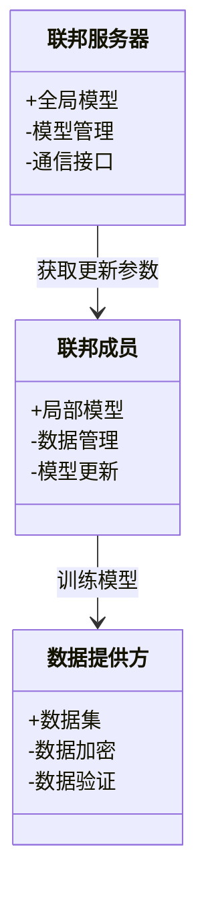

                 


# 联邦学习：保护隐私的分布式AI Agent训练

---

## 关键词：
联邦学习、分布式AI、数据隐私、AI Agent、隐私保护、分布式系统、机器学习

---

## 摘要：
随着人工智能技术的快速发展，数据隐私保护成为分布式AI训练中的核心挑战。联邦学习（Federated Learning）作为一种新兴的分布式机器学习方法，能够在不泄露原始数据的前提下，通过多方协作训练出高性能的全局模型。本文从联邦学习的核心概念出发，逐步分析其算法原理、系统架构、实际应用及挑战，深入探讨如何在保护隐私的前提下实现高效分布式AI Agent训练。通过理论分析与实践案例结合，本文为读者提供全面的联邦学习技术解读。

---

# 第一部分：联邦学习背景与核心概念

## 第1章：联邦学习的起源与背景

### 1.1 问题背景与挑战
- **数据隐私与安全问题**：随着AI应用的普及，数据泄露和隐私侵犯问题日益严重。
- **分布式AI训练的必要性**：数据孤岛现象导致无法高效利用分布式数据资源。
- **联邦学习的提出与目标**：在保护隐私的前提下，实现多方数据协作训练。

### 1.2 问题描述与解决思路
- **数据孤岛问题**：数据分散在不同机构，无法集中共享。
- **联邦学习如何解决数据隐私问题**：通过局部建模和模型更新，避免数据传输。
- **联邦学习的核心思想与技术路线**：局部模型训练与全局模型聚合。

### 1.3 联邦学习的边界与外延
- **适用场景**：医疗、金融、物联网等领域。
- **与分布式学习方法的区别**：强调隐私保护与数据可用性。
- **局限性与挑战**：通信开销、模型收敛性、对抗攻击等。

### 1.4 联邦学习的核心要素与概念结构
- **参与方角色划分**：联邦服务器、联邦成员、数据提供方。
- **数据分布特点**：数据分布异构性、隐私性。
- **通信协议**：加密通信、差分隐私等。

---

## 第2章：联邦学习的核心概念与联系

### 2.1 联邦学习的基本原理
- **数学模型**：全局模型通过局部更新聚合而成。
- **通信机制**：模型参数更新通过加密通道传输。
- **同步与异步模式**：同步模式的收敛性好，异步模式的效率高。

### 2.2 联邦学习的核心概念对比
| 概念         | 联邦学习             | 数据共享             | 区块链结合           |
|--------------|----------------------|----------------------|----------------------|
| 数据可用性   | 高                   | 低                   | 中                   |
| 数据隐私性   | 高                   | 低                   | 高                   |
| 中心化程度   | 低                   | 高                   | 低                   |

### 2.3 联邦学习的实体关系图
```mermaid
erDiagram
    participant 联邦服务器 : Server
    participant 联邦成员 : Member
    participant 数据 : Data
    Server --> Data : 存储
    Member --> Data : 训练
    Server --> Member : 发送模型参数
    Member --> Server : 返回更新参数
```

---

## 第3章：联邦学习的核心算法

### 3.1 联邦平均算法(FedAvg)
#### 算法流程
```mermaid
graph TD
    A[客户] --> B[联邦服务器] : 请求模型参数
    B --> C[成员1] : 发送模型参数
    C --> B : 返回更新参数
    B --> D[全局模型] : 更新全局模型
    D --> B : 发送全局模型参数
```

#### 核心公式
- 全局模型更新公式：
  $$ \theta_{\text{global}} = \sum_{i=1}^{N} \frac{1}{N} \theta_i $$
- 成员模型更新公式：
  $$ \theta_i = \theta_{\text{global}} + \eta (\nabla L_i) $$

---

## 第4章：联邦学习的系统分析与架构设计

### 4.1 系统分析
- **问题场景**：医疗数据共享。
- **功能需求**：隐私保护、模型训练、结果发布。

### 4.2 系统功能设计


### 4.3 系统架构设计


### 4.4 接口设计与交互流程
- **接口设计**：
  - `GET /model`：获取全局模型参数。
  - `POST /update`：提交更新的模型参数。
- **交互流程**：
  ```mermaid
  sequenceDiagram
      客户 -> 联邦服务器 : 请求模型参数
      联邦服务器 -> 成员1 : 发送模型参数
      成员1 -> 联邦服务器 : 返回更新参数
      联邦服务器 -> 全局模型 : 更新全局模型
      联邦服务器 -> 客户 : 返回全局模型
  ```

---

## 第5章：联邦学习的项目实战

### 5.1 环境搭建
- **工具安装**：Python、TensorFlow、Flask。
- **依赖管理**：使用虚拟环境管理依赖。

### 5.2 核心代码实现
```python
import numpy as np
import tensorflow as tf

class FedAvgClient:
    def __init__(self, model, data):
        self.model = model
        self.data = data

    def train(self, epochs=1):
        # 训练局部模型
        for _ in range(epochs):
            for x, y in self.data:
                loss = self.model.train_on_batch(x, y)
                print(f"Loss: {loss}")
    
    def get_weights(self):
        return self.model.get_weights()
    
    def set_weights(self, weights):
        self.model.set_weights(weights)
```

### 5.3 代码解读与分析
- **模型训练**：使用局部数据训练模型，返回更新后的权重。
- **权重同步**：通过Flask接口接收全局模型参数，更新本地模型。

### 5.4 实际案例分析
- **医疗数据共享**：通过联邦学习在保护患者隐私的前提下，训练出一个全局诊断模型。

---

## 第6章：最佳实践与注意事项

### 6.1 最佳实践
- **数据预处理**：确保数据格式统一，避免数据分布偏差。
- **模型选择**：根据实际场景选择合适的模型架构。
- **通信优化**：减少通信开销，采用压缩技术。

### 6.2 小结
- 联邦学习在保护隐私的前提下，实现了高效的数据协作。
- 需要注意数据分布、模型收敛性等问题。

### 6.3 注意事项
- **数据安全**：确保数据传输加密，防止数据泄露。
- **模型鲁棒性**：防范恶意攻击，保证模型安全。

### 6.4 拓展阅读
- 推荐阅读Google的《通信效率优化的联邦学习方法》。

---

# 作者：
**AI天才研究院/AI Genius Institute & 禅与计算机程序设计艺术 /Zen And The Art of Computer Programming**

