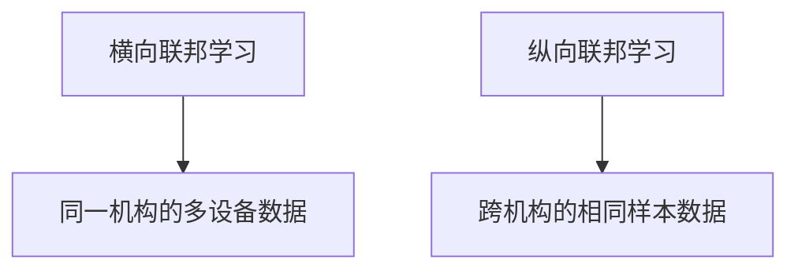
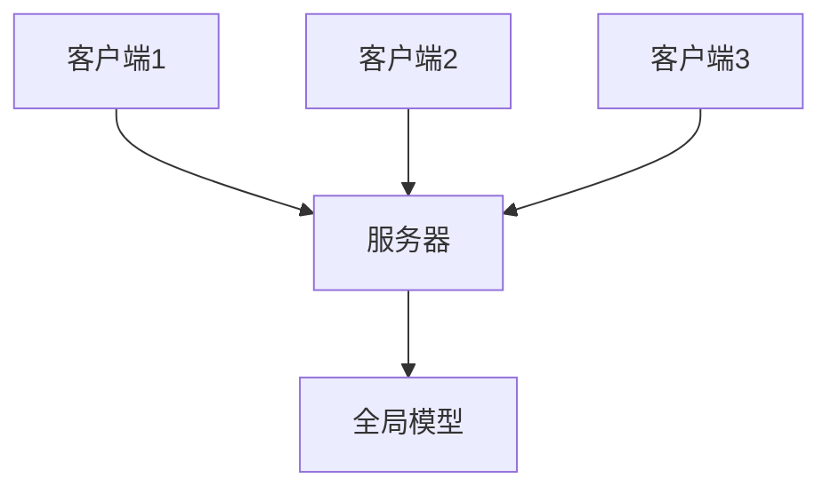
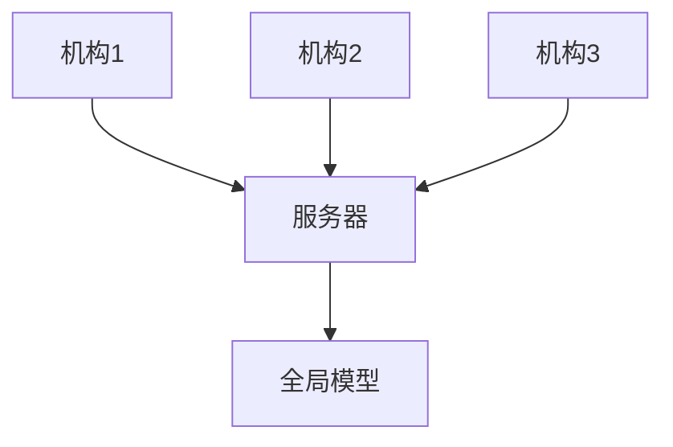
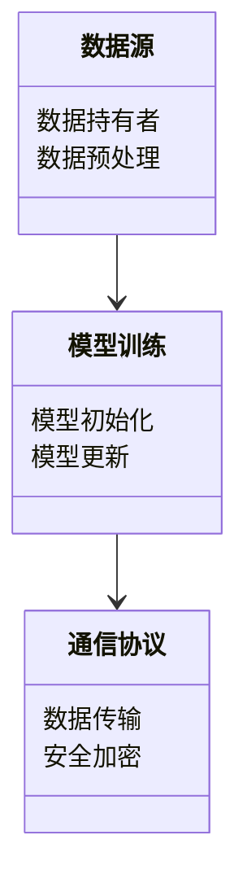

                 


# 联邦学习：在保护隐私的前提下训练AI Agent

> 关键词：联邦学习、数据隐私、AI训练、分布式学习、安全多方计算

> 摘要：  
联邦学习是一种新兴的人工智能技术，旨在在保护数据隐私的前提下，通过分布式数据源协同训练模型。本文将从背景、核心概念、算法原理、系统架构设计、项目实战到总结与展望，全面解析联邦学习的核心思想和实现方法，帮助读者理解如何在保护隐私的同时，高效训练AI模型。

---

## 第一部分：背景介绍

### 第1章：联邦学习的基本概念与问题背景

#### 1.1 联邦学习的定义与核心概念

联邦学习（Federated Learning）是一种分布式机器学习技术，允许多个参与方在不共享原始数据的情况下，共同训练一个统一的模型。其核心思想是“数据不动，模型动”，即数据保留在本地，仅模型参数或中间结果在参与方之间传递。

- **数据孤岛问题**：当前许多行业（如医疗、金融、社交网络等）存在数据孤岛现象，数据分散在不同的机构或设备中，难以集中共享。
- **数据隐私保护**：随着隐私保护法规（如GDPR）的加强，如何在不泄露原始数据的情况下训练模型成为亟待解决的问题。
- **联邦学习的目标**：在保护数据隐私的前提下，通过分布式协同学习，提升模型性能。

---

#### 1.2 问题背景与应用现状

- **问题背景**：数据孤岛和隐私保护的双重挑战使得传统的集中式训练方法难以适用。如何在不共享数据的情况下训练高质量的模型，成为人工智能领域的重要研究方向。
- **应用现状**：
  - 医疗领域：联邦学习用于医疗数据共享，保护患者隐私的同时提升诊断模型的性能。
  - 金融领域：用于反欺诈、信用评估等场景，通过多家金融机构的数据协作训练模型。
  - 社交网络：用于推荐系统、用户画像等场景。
- **技术挑战**：数据异构性、通信效率、模型收敛性、隐私保护等问题。

---

## 第二部分：核心概念与联系

### 第2章：联邦学习的核心概念与联系

#### 2.1 联邦学习的核心概念

| 核心概念 | 定义 | 特性 |
|----------|------|------|
| 数据源    | 数据的持有者（如医院、金融机构等） | 数据不可共享，只能本地处理 |
| 模型      | 中央模型或多个局部模型 | 模型参数在参与方之间同步 |
| 通信协议  | 数据传输的规则 | 确保数据传输的安全性和隐私性 |

---

#### 2.2 联邦学习与相关技术的联系

**横向联邦学习 vs 纵向联邦学习**

| 对比维度       | 横向联邦学习           | 纵向联邦学习           |
|----------------|-----------------------|-----------------------|
| 数据分布       | 特征相同，样本不同      | 特征不同，样本相同      |
| 应用场景       | 同一机构的多设备数据     | 跨机构的相同样本数据     |
| 示例           | 多台手机上的用户数据     | 多家医院的患者数据       |

**图2-1：横向与纵向联邦学习的对比**



---

## 第三部分：算法原理讲解

### 第3章：联邦学习的算法原理

#### 3.1 横向联邦学习的算法流程

**图3-1：横向联邦学习流程**



**数学模型**：假设客户端$i$有数据集$D_i$，全局模型$f$通过联邦平均（Federated Averaging，FedAvg）更新：

$$
w_{t+1} = \frac{1}{n}\sum_{i=1}^n w_i^{(t+1)}
$$

其中，$n$为客户端数量，$w_i$为客户端$i$的模型参数。

---

#### 3.2 纵向联邦学习的算法流程

**图3-2：纵向联邦学习流程**



**数学模型**：假设机构$i$有数据集$D_i$，全局模型$f$通过安全多方计算（SMC）更新：

$$
y = f(x_1, x_2, \ldots, x_n)
$$

其中，$x_i$为机构$i$的输入数据，$y$为输出结果。

---

## 第四部分：系统分析与架构设计方案

### 第4章：联邦学习的系统架构设计

#### 4.1 系统功能模块设计

**领域模型**



---

## 第五部分：项目实战

### 第5章：联邦学习的项目实战

#### 5.1 环境安装与配置

```bash
pip install fed学习库
```

#### 5.2 核心代码实现

```python
import fed学习库

class 联邦学习模型:
    def __init__(self):
        self.模型参数 = 初始参数

    def 模型更新(self, 本地数据):
        # 训练模型
        self.模型参数 = self.模型训练(本地数据)

    def 模型同步(self, 全局模型):
        # 联邦平均
        self.全局模型 = self.联邦平均(self.模型参数, 全局模型)
```

---

## 第六部分：总结与展望

### 第6章：总结与展望

#### 6.1 最佳实践与注意事项

- 数据安全是核心，需采用加密技术确保通信安全。
- 算法选择需结合数据分布和应用场景。
- 系统设计需考虑通信效率和模型收敛性。

#### 6.2 小结

联邦学习是一种在保护隐私的前提下，通过分布式数据源协同训练模型的技术，具有重要的理论意义和应用价值。

#### 6.3 未来发展趋势

- 更高效的通信协议。
- 更强大的隐私保护技术。
- 更广泛的应用场景。

#### 6.4 拓展阅读

- 《隐私保护与数据共享》
- 《分布式机器学习技术》

---

**作者：AI天才研究院 & 禅与计算机程序设计艺术**

