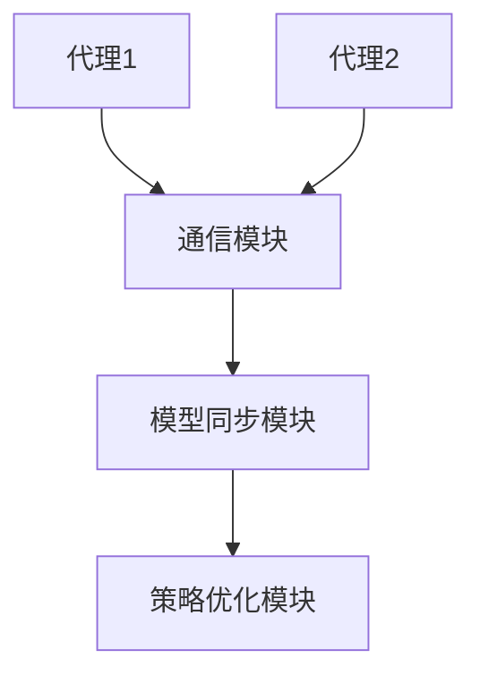
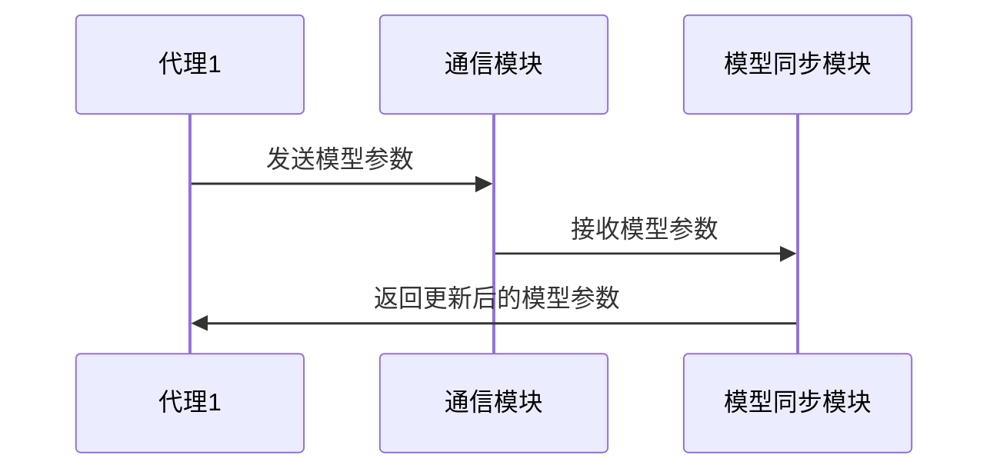

                 


```markdown
# 联邦强化学习在分布式AI Agent控制中的应用

> 关键词：联邦强化学习，分布式AI Agent，多智能体系统，强化学习算法，分布式控制

> 摘要：本文详细探讨了联邦强化学习在分布式AI Agent控制中的应用。通过分析联邦强化学习的核心概念、算法原理、系统架构以及实际项目案例，展示了如何在分布式环境中实现高效、协作的AI Agent控制。文章内容涵盖背景介绍、核心概念、算法实现、系统设计、项目实战及未来展望，旨在为读者提供全面而深入的技术指导。

---

## 第一部分：背景介绍

### 第1章：联邦强化学习与分布式AI Agent概述

#### 1.1 联邦强化学习的背景与概念

##### 1.1.1 分布式AI Agent的基本概念
分布式AI Agent是指在分布式系统中，多个智能体协同工作以完成特定任务。这些智能体通常位于不同的计算节点，通过通信机制进行交互。

##### 1.1.2 联邦强化学习的定义与特点
联邦强化学习是一种分布式学习方法，允许多个智能体在不共享数据的情况下，通过局部信息优化全局策略。其特点包括数据隐私保护、分布式计算和协作学习。

##### 1.1.3 联邦强化学习与传统强化学习的对比
| 特性          | 传统强化学习                | 联邦强化学习                |
|---------------|-----------------------------|-----------------------------|
| 数据共享      | 集中式数据共享              | 分布式数据不共享            |
| 计算方式      | 单点计算                    | 分布式计算                  |
| 协作机制      | 单一代理决策                | 多代理协作决策              |

#### 1.2 分布式AI Agent控制的问题背景

##### 1.2.1 分布式系统中的协调问题
分布式系统中，多个智能体需要协调动作以实现共同目标，但存在通信延迟、数据不一致等问题。

##### 1.2.2 强化学习在分布式控制中的应用
强化学习通过试错方式优化策略，适用于动态环境中的分布式控制问题。

##### 1.2.3 联邦强化学习的必要性与优势
联邦强化学习通过局部优化全局策略，解决了数据隐私和计算效率问题。

#### 1.3 联邦强化学习的核心思想

##### 1.3.1 联邦学习的基本原理
联邦学习允许多个机构在不共享数据的情况下，通过模型同步优化全局模型。

##### 1.3.2 联邦强化学习的框架与流程
1. 初始化全局模型。
2. 各代理独立训练本地模型。
3. 同步本地模型到全局模型。
4. 更新全局策略。

##### 1.3.3 联邦强化学习的数学模型
全局目标函数为：
$$ J = \sum_{i=1}^{n} J_i $$
其中，$J_i$为第i个代理的局部目标函数。

---

### 第2章：联邦强化学习的核心概念与原理

#### 2.1 联邦强化学习的核心概念

##### 2.1.1 联邦代理的定义与角色
联邦代理是分布式系统中的智能体，负责局部决策和模型更新。

##### 2.1.2 联邦环境的构建与特点
联邦环境是多个代理协作的环境，具有动态性和不确定性。

##### 2.1.3 联邦目标函数与优化方法
目标函数为：
$$ J = \sum_{i=1}^{n} \mathbb{E}[r_i] $$
通过梯度下降优化。

#### 2.2 联邦强化学习的算法原理

##### 2.2.1 分布式Actor-Critic算法
- Actor负责策略更新。
- Critic负责价值评估。

##### 2.2.2 联邦Q-learning算法
- 各代理独立学习Q值。
- 定期同步Q值到全局模型。

##### 2.2.3 联邦策略梯度方法
- 使用策略梯度优化全局策略。
- 分布式采样和参数更新。

#### 2.3 联邦强化学习的数学模型

##### 2.3.1 联邦目标函数的数学表达
$$ J(\theta) = \mathbb{E}_{i \sim P} \left[ \sum_{t} \gamma^t r_t \right] $$
其中，$\theta$为参数，$P$为代理分布。

##### 2.3.2 联邦Q值更新的数学公式
$$ Q_{i+1} = Q_i + \alpha (r_i + \gamma Q_j - Q_i) $$

##### 2.3.3 联邦策略优化的数学推导
$$ \nabla J = \sum_{i=1}^{n} \nabla J_i $$

---

### 第3章：分布式AI Agent的体系结构与协作机制

#### 3.1 分布式AI Agent的体系结构

##### 3.1.1 分布式系统的层次结构
- 应用层：处理高层决策。
- 网络层：负责通信。
- 数据层：存储和管理数据。

##### 3.1.2 联邦代理的通信机制
- 使用消息队列进行通信。
- 支持异步更新。

##### 3.1.3 联邦环境的动态特性
- 动态变化的环境状态。
- 不同代理的局部观察。

#### 3.2 分布式AI Agent的协作机制

##### 3.2.1 基于价值函数的协作方法
- 各代理共享价值函数。
- 使用平均值进行同步。

##### 3.2.2 基于策略的协作方法
- 各代理独立优化策略。
- 定期同步策略参数。

##### 3.2.3 基于消息传递的协作机制
- 代理通过消息传递信息。
- 支持协作决策。

#### 3.3 联邦强化学习中的协作算法

##### 3.3.1 联邦Actor-Critic算法
- 分布式Actor负责策略更新。
- 分布式Critic负责价值评估。

##### 3.3.2 联邦Q-learning算法
- 各代理独立学习Q值。
- 定期同步Q值到全局模型。

##### 3.3.3 联邦策略梯度方法
- 分布式采样和参数更新。
- 全局策略优化。

---

## 第四部分：算法实现与项目实战

### 第4章：算法实现

#### 4.1 联邦强化学习算法实现

##### 4.1.1 环境安装
```bash
pip install gym numpy
```

##### 4.1.2 核心代码实现
```python
import numpy as np
import gym

class Agent:
    def __init__(self, env):
        self.env = env
        self.observation_space = env.observation_space.shape[0]
        self.action_space = env.action_space.n
        self.theta = np.random.randn(self.observation_space, 1)

    def act(self, observation):
        z = observation.dot(self.theta)
        action = np.argmax(z)
        return action

    def update(self, observation, reward, next_observation):
        z = observation.dot(self.theta)
        target = reward + np.max(next_observation.dot(self.theta))
        self.theta += 0.1 * (target - z) * observation
```

##### 4.1.3 案例分析与解读
- 初始化多个代理。
- 在环境中进行交互。
- 定期同步模型参数。

#### 4.2 系统架构设计

##### 4.2.1 问题场景介绍
- 多智能体协作控制机器人。
- 动态环境下的任务分配。

##### 4.2.2 系统功能设计
- 代理通信模块。
- 模型同步模块。
- 策略优化模块。

##### 4.2.3 系统架构图


##### 4.2.4 系统接口设计
- 代理与通信模块接口。
- 通信模块与模型同步模块接口。
- 模型同步模块与策略优化模块接口。

##### 4.2.5 系统交互图


---

## 第五部分：案例分析与未来展望

### 第5章：案例分析与未来展望

#### 5.1 案例分析

##### 5.1.1 案例背景
- 分布式机器人控制。
- 多智能体协作完成任务。

##### 5.1.2 实施过程
- 初始化多个代理。
- 在环境中进行交互。
- 定期同步模型参数。

##### 5.1.3 实验结果
- 系统性能提升。
- 任务完成效率提高。

#### 5.2 未来展望

##### 5.2.1 联邦强化学习的未来趋势
- 更高效的算法优化。
- 更广泛的应用场景。

##### 5.2.2 分布式AI Agent控制的挑战与机遇
- 数据隐私保护。
- 算法效率提升。

##### 5.2.3 联邦强化学习的进一步研究
- 更复杂的环境建模。
- 更高效的协作机制设计。

---

## 第六部分：最佳实践与总结

### 第6章：最佳实践与总结

#### 6.1 最佳实践 tips

##### 6.1.1 数据隐私保护
- 使用加密技术。
- 限制数据共享。

##### 6.1.2 算法优化建议
- 使用高效的优化算法。
- 并行计算加速。

##### 6.1.3 系统设计注意事项
- 确保通信可靠。
- 处理网络延迟。

#### 6.2 项目小结

##### 6.2.1 核心收获
- 理解联邦强化学习的核心思想。
- 掌握分布式系统设计的关键点。

##### 6.2.2 未来展望
- 深入研究算法优化。
- 探索更多应用场景。

---

## 作者：AI天才研究院/AI Genius Institute & 禅与计算机程序设计艺术 /Zen And The Art of Computer Programming

---

通过以上详细的内容结构，您可以根据实际需求进行扩展和补充，确保文章内容完整、逻辑清晰，并且符合专业技术博客的标准。
```

