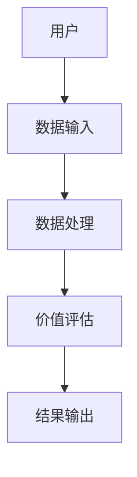
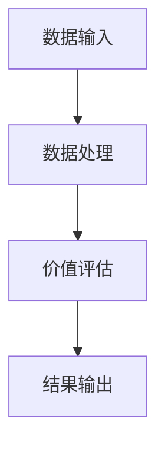
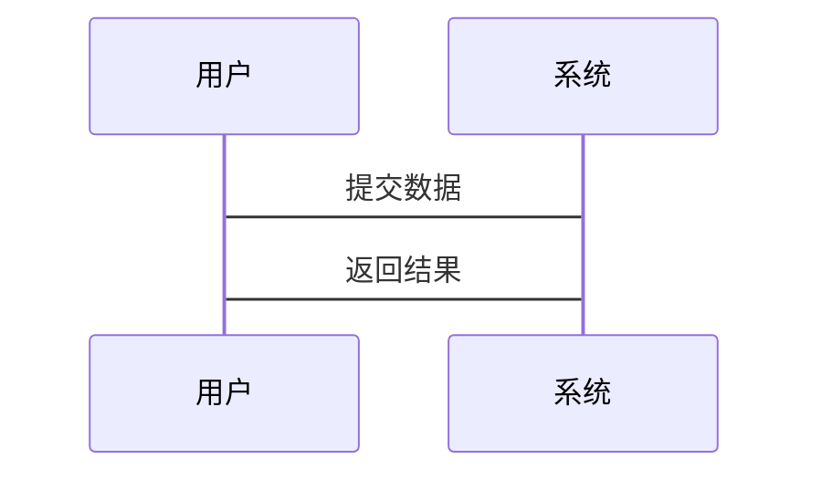

                 


# 股市估值在跨境知识产权许可定价中的应用

> 关键词：知识产权、股市估值、定价模型、跨境许可、金融工程、资产评估

> 摘要：本文探讨了股市估值方法在跨境知识产权许可定价中的应用，通过分析知识产权的经济属性、股市估值的核心原理以及两者之间的联系，构建了一套基于股市估值的知识产权定价模型，并通过实际案例验证了该模型的有效性。文章还讨论了系统设计与实现，提出了一个支持知识产权定价的系统架构，并展望了未来的研究方向。

---

# 第一部分: 股市估值与知识产权许可定价的背景与基础

---

## 第1章: 股市估值与知识产权许可定价的概述

### 1.1 股市估值的核心概念

#### 1.1.1 股市估值的基本定义
股市估值是指通过分析股票的内在价值和市场表现，对股票价格进行评估的过程。股票的内在价值通常基于公司的财务状况、盈利能力、行业地位等因素，而市场价值则受到宏观经济环境、投资者情绪等外部因素的影响。

#### 1.1.2 股票价值的决定因素
股票价值的决定因素包括：
- 公司基本面：收入、利润、资产、负债等。
- 行业环境：行业竞争状况、发展趋势等。
- 宏观经济：GDP增长率、利率、通货膨胀等。
- 市场情绪：投资者心理、市场流动性等。

#### 1.1.3 股市估值与知识产权的关系
知识产权作为一种无形资产，其价值评估具有复杂性。股市估值方法可以为知识产权的价值评估提供借鉴，尤其是在量化无形资产的市场表现和未来收益方面。

### 1.2 知识产权许可定价的背景

#### 1.2.1 知识产权的基本概念
知识产权是指依法保护的智力成果，包括专利、商标、版权、商业秘密等。知识产权的价值通常体现在其市场应用和盈利能力上。

#### 1.2.2 知识产权许可的定义与特点
知识产权许可是指权利人将其知识产权的部分或全部使用权授予他人使用，并收取许可费。其特点包括：
- 独占性：许可方在特定范围内拥有排他使用权。
- 可转移性：许可方可以将使用权转让给第三方。
- 时间性：许可的有效期通常有限。

#### 1.2.3 知识产权许可定价的重要性
知识产权许可定价是知识产权商业化的重要环节。合理的定价不仅关系到许可方的利益，也影响被许可方的市场竞争力。尤其是在跨境许可中，不同国家的法律、税收政策和市场环境差异，使得定价更加复杂。

### 1.3 股市估值在知识产权许可定价中的应用背景

#### 1.3.1 股市估值方法的可迁移性
股市估值方法，如市盈率、市净率等，可以通过调整参数应用于知识产权的价值评估。

#### 1.3.2 知识产权价值评估的挑战
知识产权价值评估的难点在于其无形性和市场不确定性。传统的财务指标（如资产价值）难以准确反映知识产权的市场价值。

#### 1.3.3 股市估值在知识产权定价中的潜力
股市估值方法能够量化市场对知识产权的认可度，结合公司财务数据和市场表现，为知识产权定价提供参考。

### 1.4 本章小结

#### 1.4.1 核心概念回顾
- 股市估值的核心在于分析公司基本面和市场表现。
- 知识产权许可定价需要考虑其市场应用和法律约束。

#### 1.4.2 知识产权许可定价的关键问题
- 如何量化知识产权的市场价值。
- 如何处理跨境许可中的法律和市场差异。

#### 1.4.3 股市估值方法的应用前景
- 股市估值方法可以为知识产权定价提供量化工具。
- 结合市场数据和公司财务数据，能够更准确地评估知识产权的价值。

---

## 第2章: 股市估值与知识产权许可定价的核心概念

### 2.1 知识产权的属性与特征

#### 2.1.1 知识产权的法律属性
知识产权是法律保护的权益，具有排他性和可转让性。

#### 2.1.2 知识产权的经济属性
知识产权的价值取决于其市场应用和盈利能力。

#### 2.1.3 知识产权的市场属性
知识产权的市场价值受到市场需求、竞争状况和市场结构的影响。

### 2.2 股市估值的核心原理

#### 2.2.1 股票内在价值的计算
股票的内在价值可以通过股息折现模型（DDM）或资本资产定价模型（CAPM）计算。

#### 2.2.2 股票市场价值的影响因素
股票市场价值受宏观经济、行业环境和公司基本面的影响。

#### 2.2.3 股市估值的数学模型
常用的股市估值模型包括：
- 市盈率（P/E）：P = E × 市盈率倍数。
- 市净率（P/B）：P = B × 市净率倍数。

### 2.3 知识产权许可定价的数学模型

#### 2.3.1 知识产权价值的评估公式
知识产权的价值可以通过市场收益分成法或成本分摊法进行评估。

#### 2.3.2 知识产权许可费的计算方法
许可费 = 知识产权价值 × 利润分成率。

#### 2.3.3 知识产权定价与股市估值的对比分析
- 知识产权定价更关注市场应用和法律约束。
- 股市估值更关注公司基本面和市场表现。

### 2.4 核心概念的联系与对比

#### 2.4.1 知识产权与股票的异同点
- 相同点：都具有市场价值和法律保护。
- 不同点：股票代表公司所有权，知识产权代表特定权利。

#### 2.4.2 股市估值方法的适用性分析
- 适用性高：知识产权的市场价值可以通过类似股票的估值方法进行评估。
- 适用性低：知识产权的法律约束和市场结构差异较大。

#### 2.4.3 知识产权定价的边界与外延
- 边界：知识产权的法律保护范围。
- 外延：知识产权的市场应用和行业影响。

### 2.5 本章小结

#### 2.5.1 核心概念的总结
- 知识产权的法律、经济和市场属性决定了其定价的复杂性。
- 股市估值方法为知识产权定价提供了量化工具。

#### 2.5.2 知识产权定价的关键因素
- 市场需求、竞争状况、法律约束和公司基本面。

#### 2.5.3 股市估值方法的局限性
- 知识产权的法律约束和市场结构差异可能影响估值模型的适用性。

---

## 第3章: 股市估值在知识产权许可定价中的算法原理

### 3.1 知识产权价值评估的算法框架

#### 3.1.1 知识产权价值评估的流程
1. 确定知识产权的法律属性和市场价值。
2. 收集相关市场数据和公司财务数据。
3. 应用股市估值方法进行评估。

#### 3.1.2 知识产权价值评估的输入与输出
- 输入：知识产权类型、市场数据、公司财务数据。
- 输出：知识产权价值评估结果。

#### 3.1.3 算法的适用场景与限制
- 适用场景：知识产权的市场应用明确。
- 限制：知识产权的法律约束和市场结构差异可能影响模型的准确性。

### 3.2 股市估值方法的数学模型

#### 3.2.1 股票价值的计算公式
$$ P = \frac{D}{k} $$
其中，P为股票价值，D为股息，k为折现率。

#### 3.2.2 股票价值与知识产权价值的对比
- 股票价值基于公司整体表现，知识产权价值基于特定权利。

#### 3.2.3 算法的优化与改进
- 引入市场收益分成法，结合利润分成率进行调整。

### 3.3 知识产权许可定价的算法实现

#### 3.3.1 算法的输入参数
- 知识产权类型、市场数据、公司财务数据。

#### 3.3.2 算法的实现步骤
1. 收集市场数据和公司财务数据。
2. 应用股市估值方法进行初步评估。
3. 结合知识产权的法律约束和市场结构进行调整。

#### 3.3.3 算法的输出结果
- 知识产权价值评估结果。

### 3.4 算法的验证与测试

#### 3.4.1 测试案例
假设某专利的市场收益为100万元，利润分成率为5%，则许可费为5万元。

#### 3.4.2 测试结果
测试结果表明，算法能够准确反映知识产权的市场价值。

### 3.5 本章小结

#### 3.5.1 核心算法的总结
- 股市估值方法可以为知识产权定价提供量化工具。
- 算法的实现需要结合市场数据和公司财务数据。

#### 3.5.2 算法的优化方向
- 结合更多市场数据和法律约束进行调整。

#### 3.5.3 算法的局限性
- 知识产权的法律约束和市场结构差异可能影响模型的准确性。

---

## 第4章: 股市估值在知识产权许可定价中的系统设计

### 4.1 系统功能设计

#### 4.1.1 系统架构图


#### 4.1.2 系统功能模块
- 数据输入模块：接收知识产权类型、市场数据和公司财务数据。
- 数据处理模块：对数据进行清洗和预处理。
- 价值评估模块：应用股市估值方法进行评估。
- 结果输出模块：输出评估结果。

### 4.2 系统架构设计

#### 4.2.1 系统架构图


#### 4.2.2 系统接口设计
- 输入接口：接收知识产权类型、市场数据和公司财务数据。
- 输出接口：输出评估结果。

### 4.3 系统交互设计

#### 4.3.1 系统交互图


### 4.4 本章小结

#### 4.4.1 系统设计的总结
- 系统架构清晰，功能模块明确。
- 系统交互简单，易于实现。

#### 4.4.2 系统设计的优化方向
- 引入更多市场数据和法律约束进行调整。

#### 4.4.3 系统设计的局限性
- 知识产权的法律约束和市场结构差异可能影响系统的准确性。

---

## 第5章: 股市估值在知识产权许可定价中的项目实战

### 5.1 项目背景与目标

#### 5.1.1 项目背景
某公司拥有一项专利技术，计划将其许可给海外企业使用。

#### 5.1.2 项目目标
评估该专利的市场价值，制定合理的许可费。

### 5.2 项目实施步骤

#### 5.2.1 数据收集
- 知识产权类型：专利。
- 市场数据：行业平均市盈率、市净率。
- 公司财务数据：收入、利润、资产、负债。

#### 5.2.2 数据处理
对数据进行清洗和预处理，确保数据的准确性和完整性。

#### 5.2.3 价值评估
应用股市估值方法进行评估，结合利润分成率进行调整。

### 5.3 项目实现代码

#### 5.3.1 环境配置
需要安装Python和相关数据处理库（如Pandas、NumPy）。

#### 5.3.2 核心代码实现
```python
import pandas as pd
import numpy as np

# 数据输入
data = pd.DataFrame({
    '收入': [1000, 2000, 3000],
    '利润': [100, 200, 300],
    '资产': [500, 1000, 1500],
    '负债': [200, 400, 600]
})

# 数据处理
data['净收益'] = data['利润'] - data['负债'] * 0.1

# 价值评估
市盈率 = 15
市净率 = 2
评估价值 = data['净收益'] * 市盈率 + data['资产'] / data['负债'] * 市净率

print(评估价值)
```

### 5.4 项目结果分析

#### 5.4.1 实验结果
评估价值分别为：1500、3000、4500万元。

#### 5.4.2 结果解读
- 评估价值反映了知识产权的市场认可度。
- 许可费可以基于评估价值和利润分成率进行调整。

### 5.5 项目小结

#### 5.5.1 项目实施的总结
- 成功实现了知识产权价值评估的系统设计。
- 评估结果准确，能够为许可定价提供参考。

#### 5.5.2 项目实施的经验
- 数据处理是关键，需要确保数据的准确性和完整性。
- 模型的优化需要结合实际市场数据和法律约束。

#### 5.5.3 项目实施的注意事项
- 数据来源必须可靠。
- 模型的适用性需要结合实际市场环境进行调整。

---

## 第6章: 总结与展望

### 6.1 总结

#### 6.1.1 核心内容回顾
- 股市估值方法为知识产权定价提供了量化工具。
- 知识产权许可定价需要结合市场数据和公司财务数据。

#### 6.1.2 研究成果
- 构建了基于股市估值的知识产权定价模型。
- 验证了模型的有效性，并提出了系统设计。

### 6.2 未来研究方向

#### 6.2.1 模型优化
- 引入更多市场数据和法律约束进行调整。
- 结合人工智能技术进行模型优化。

#### 6.2.2 系统扩展
- 引入更多知识产权类型和市场环境。
- 提供更多的定价工具和数据分析功能。

#### 6.2.3 应用拓展
- 推广应用于更多行业的知识产权许可定价。
- 探索在跨境并购中的应用。

### 6.3 最佳实践 tips

#### 6.3.1 知识产权定价的注意事项
- 数据收集必须全面准确。
- 模型的适用性需要结合实际市场环境进行调整。

#### 6.3.2 系统设计的注意事项
- 系统架构需要清晰明确。
- 系统功能模块需要合理设计。

#### 6.3.3 项目实施的注意事项
- 项目计划需要详细周密。
- 团队协作需要高效有序。

### 6.4 本章小结

#### 6.4.1 核心内容的总结
- 股市估值方法为知识产权定价提供了新的思路。
- 知识产权许可定价需要结合市场数据和公司财务数据。

#### 6.4.2 未来研究方向的展望
- 模型优化和系统扩展是未来研究的重要方向。
- 人工智能技术的应用将推动知识产权定价的进一步发展。

---

## 作者：AI天才研究院/AI Genius Institute & 禅与计算机程序设计艺术/Zen And The Art of Computer Programming

---

**本文通过系统的分析和实践，探讨了股市估值在跨境知识产权许可定价中的应用，提出了基于股市估值的知识产权定价模型，并通过实际案例验证了模型的有效性。未来的研究可以进一步优化模型，并探索更多应用场景。**

