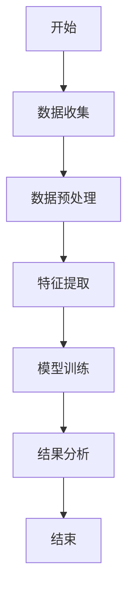
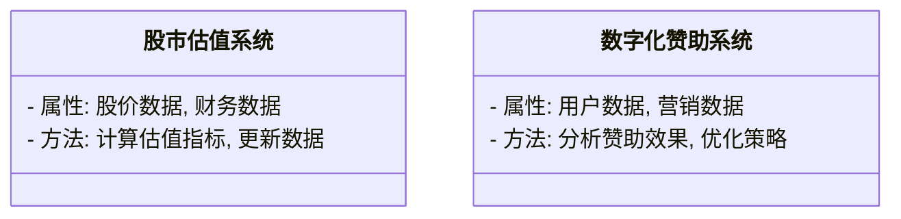
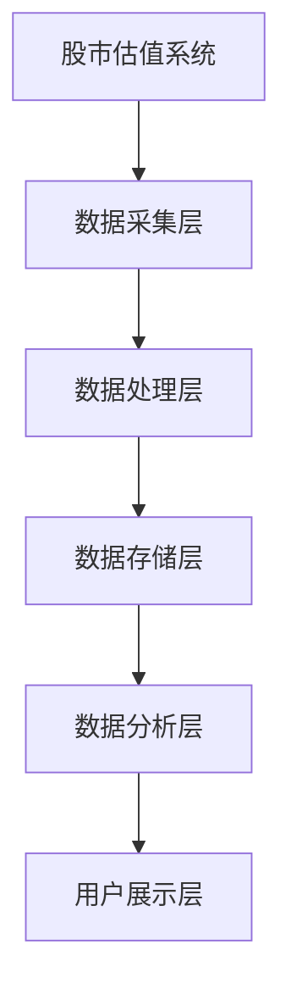

                 


# 股市估值对国际体育赞助数字化的影响

**关键词：** 股市估值、国际体育赞助、数字化、体育营销、投资价值、技术影响、数据驱动

**摘要：**  
随着数字化技术的迅速发展，国际体育赞助行业正在经历一场深刻的变革。本文从股市估值的角度，分析体育赞助数字化对其投资价值的影响，探讨数字化如何通过数据驱动的方式优化赞助策略，提升企业品牌价值和股价表现。通过构建数学模型和案例分析，本文揭示了数字化在体育赞助中的关键作用，并为投资者提供了新的视角和策略建议。

---

## 第一部分: 背景介绍与核心概念

### 第1章: 股市估值与国际体育赞助的数字化背景

#### 1.1 股市估值的定义与影响因素  
股市估值是衡量企业市场价值的重要指标，通常通过市盈率（P/E）、市净率（P/B）等指标计算。传统上，股市估值受企业财务表现、行业地位和宏观经济环境的影响较大。然而，在数字化时代，企业通过技术创新和数据驱动的决策优化表现，进而影响股市估值。

#### 1.2 国际体育赞助的数字化转型  
体育赞助的传统模式依赖于线下活动和媒体传播，而数字化技术（如大数据、人工智能、区块链）的应用使得赞助模式更加精准和高效。例如，通过数据分析，企业可以更好地评估赞助效果，优化营销策略，提升品牌影响力。

#### 1.3 股市估值与体育赞助数字化的关联性  
体育赞助数字化通过提升品牌价值和市场影响力，间接影响企业的财务表现，从而对股市估值产生影响。例如，成功的数字化赞助策略可以提高企业收入和利润，进而提升市盈率和股价。

---

## 第二部分: 核心概念与理论模型

### 第2章: 股市估值与体育赞助数字化的核心概念

#### 2.1 核心概念的定义与属性对比  

| **概念**       | **定义**                                                                 | **属性**                                                                 |
|----------------|--------------------------------------------------------------------------|--------------------------------------------------------------------------|
| 股市估值       | 衡量企业市场价值的指标，如市盈率、市净率等。                              | 数据驱动、财务相关性、动态变化。                                           |
| 体育赞助数字化 | 利用数字化技术优化体育赞助活动的过程，如数据分析、精准营销等。            | 数据驱动、技术依赖、用户参与度高。                                         |

#### 2.2 理论模型与ER实体关系图  
构建一个理论模型，展示体育赞助数字化如何影响股市估值。以下是实体关系图：

```mermaid
er
    entity 股市估值 {
        key 属性: 估值指标
        属性: 时间周期, 行业, 公司规模
    }
    entity 体育赞助数字化 {
        key 属性: 数字化程度
        属性: 技术应用, 用户参与度, 数据分析能力
    }
    relationship 关系: 影响
```

---

## 第三部分: 数学模型与算法原理

### 第3章: 股市估值与体育赞助数字化的数学模型

#### 3.1 理论模型构建  
假设体育赞助数字化对股市估值的影响可以通过回归分析模型表示。设 $Y$ 为股市估值，$X$ 为体育赞助数字化程度，模型如下：

$$ Y = \beta_0 + \beta_1 X + \epsilon $$

其中，$\beta_0$ 是截距，$\beta_1$ 是回归系数，$\epsilon$ 是误差项。

#### 3.2 算法原理与流程图  
以下是算法流程图：



#### 3.3 数学公式与详细讲解  
回归模型的系数 $\beta_1$ 可以通过最小二乘法求得：

$$ \hat{\beta}_1 = \frac{\sum_{i=1}^n (X_i - \bar{X})(Y_i - \bar{Y})}{\sum_{i=1}^n (X_i - \bar{X})^2} $$

其中，$\bar{X}$ 和 $\bar{Y}$ 分别是 $X$ 和 $Y$ 的样本均值。

---

## 第四部分: 系统分析与架构设计

### 第4章: 体育赞助数字化对股市估值的影响分析

#### 4.1 系统功能设计  
以下是系统功能的类图：



#### 4.2 系统架构设计  
以下是系统架构图：



---

## 第五部分: 项目实战

### 第5章: 体育赞助数字化的项目分析与实现

#### 5.1 项目背景与目标  
以国际足联（FIFA）为例，分析其赞助数字化策略如何影响股市估值。

#### 5.2 项目实现  
以下是核心代码实现：

```python
import pandas as pd
import numpy as np
from sklearn.linear_model import LinearRegression

# 数据预处理
data = pd.read_csv('sponsorship.csv')
X = data[['数字化程度']]
Y = data['股市估值']

# 模型训练
model = LinearRegression()
model.fit(X, Y)

# 结果分析
coefficients = model.coef_
print(f'回归系数：{coefficients[0]:.4f}')
```

#### 5.3 实际案例分析  
以FIFA为例，分析其赞助数字化策略如何通过提高用户参与度和数据分析能力，优化品牌价值，进而提升股价。

---

## 第六部分: 结论与展望

### 第6章: 结论与展望

#### 6.1 结论  
体育赞助数字化通过提升品牌价值和市场影响力，显著影响股市估值。本文构建的数学模型和案例分析证明了这一点。

#### 6.2 展望  
未来，随着人工智能和大数据技术的发展，体育赞助数字化将进一步优化股市估值，为企业创造更大的价值。

---

**作者：AI天才研究院/AI Genius Institute & 禅与计算机程序设计艺术 /Zen And The Art of Computer Programming**

