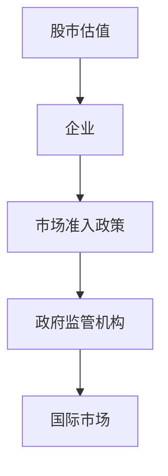
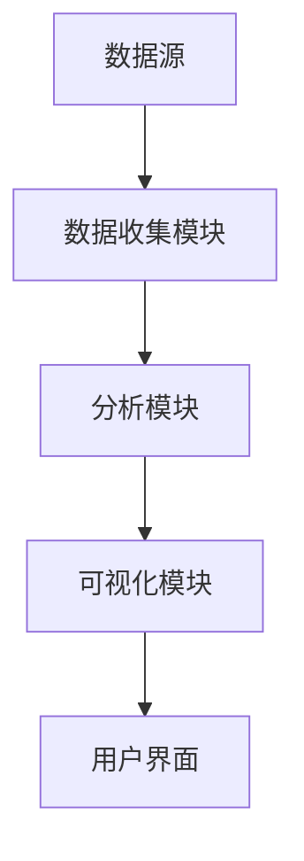
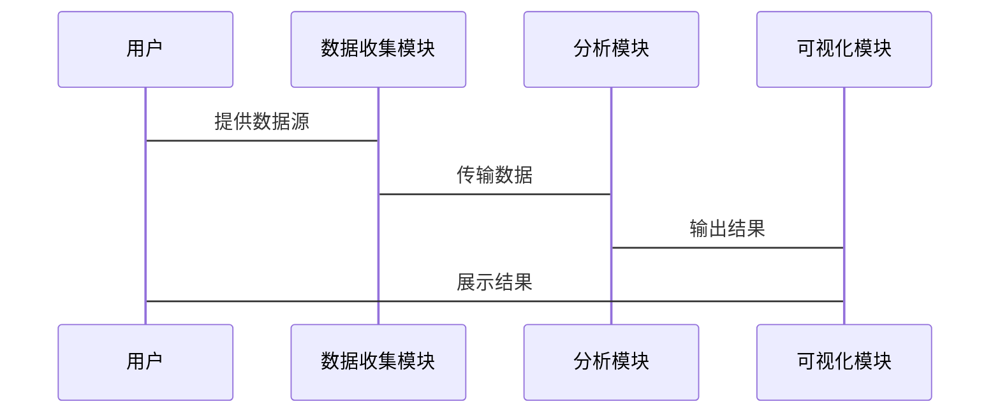

                 

# 股市估值对跨境数字服务市场准入政策的影响

> 关键词：股市估值、跨境数字服务、市场准入政策、政策影响、经济分析

> 摘要：本文探讨股市估值与跨境数字服务市场准入政策之间的相互影响。通过分析股市估值的核心指标、跨境数字服务市场的特征，以及市场准入政策的实施机制，揭示股市估值对政策制定的推动作用，并提出优化建议。结合实际案例，本文旨在为政策制定者和投资者提供参考。

---

# 引言

## 1.1 研究背景
随着全球经济一体化的深入发展，跨境数字服务市场迅速崛起，成为推动经济增长的重要引擎。然而，股市估值的变化对市场准入政策的影响日益显著。本文旨在探讨这一复杂关系，为政策制定者和投资者提供理论支持。

## 1.2 研究问题
股市估值如何影响跨境数字服务市场的准入政策？两者之间存在哪些直接和间接的联系？

## 1.3 研究意义
理解股市估值与市场准入政策的互动关系，有助于优化政策设计，促进跨境数字服务市场的健康发展。

## 1.4 论文结构
本文分为六章，涵盖背景介绍、核心概念分析、数学模型构建、系统设计、案例分析及总结等部分。

---

# 第二章: 股市估值与市场准入政策的背景

## 2.1 股市估值的基本概念
股市估值是衡量企业价值的重要指标，常用的指标包括市盈率（P/E Ratio）、市净率（P/B Ratio）和市销率（P/S Ratio）。

## 2.2 跨境数字服务市场的定义与特点
跨境数字服务市场是指跨越国界的数字服务交易，其特点包括无地域限制、数字化交付和高竞争性。

## 2.3 市场准入政策的核心概念
市场准入政策是指政府为控制市场进入而制定的法规和标准，旨在维护市场秩序和公共利益。

## 2.4 股市估值与市场准入政策的相互作用
股市估值的变化直接影响企业的市场地位和竞争力，进而影响市场准入政策的制定和调整。

---

# 第三章: 股市估值与市场准入政策的核心要素

## 3.1 股市估值的核心要素
- 市盈率（P/E Ratio）：$P/E = \frac{P}{E}$
- 市净率（P/B Ratio）：$P/B = \frac{P}{B}$
- 市销率（P/S Ratio）：$P/S = \frac{P}{S}$

## 3.2 市场准入政策的实体关系图

## 3.3 股市估值与市场准入政策的对比分析
| 比较维度 | 股市估值 | 市场准入政策 |
|----------|----------|--------------|
| 影响主体 | 投资者、企业 | 政府、监管机构 |
| 影响范围 | 股票价格、企业价值 | 市场进入门槛、企业合规性 |
| 变化频率 | 短期波动 | 长期政策调整 |

---

# 第四章: 股市估值与市场准入政策的数学模型

## 4.1 股市估值的基本模型
### 4.1.1 市盈率模型
$$ P/E = \frac{P}{E} $$
其中，$P$为股票价格，$E$为每股收益。

### 4.1.2 现金流折现模型
$$ V = \sum_{t=1}^{\infty} \frac{CF_t}{(1+r)^t} $$
其中，$CF_t$为第$t$年的现金流，$r$为折现率。

## 4.2 市场准入政策的评估模型
### 4.2.1 市场准入门槛模型
$$ T = f(P, Q) $$
其中，$T$为市场准入门槛，$P$为股市估值，$Q$为市场容量。

## 4.3 股市估值与市场准入政策的关联模型
$$ I = \beta \cdot P + \epsilon $$
其中，$I$为市场准入强度，$\beta$为回归系数，$\epsilon$为误差项。

---

# 第五章: 系统分析与架构设计方案

## 5.1 系统功能设计
### 5.1.1 数据收集模块
负责收集股市估值和市场准入政策的相关数据。

### 5.1.2 分析模块
利用数学模型对数据进行分析，评估政策影响。

### 5.1.3 可视化模块
将分析结果以图表形式展示，便于理解。

## 5.2 系统架构设计

## 5.3 系统接口设计
### 5.3.1 数据接口
定义数据输入和输出格式，确保模块间数据传输的规范性。

### 5.3.2 用户接口
提供友好的用户界面，方便用户输入参数和查看结果。

## 5.4 系统交互设计

---

# 第六章: 项目实战与案例分析

## 6.1 实际案例分析
### 6.1.1 案例背景
选择某国跨境数字服务市场，分析其股市估值与市场准入政策的关系。

### 6.1.2 数据收集与处理
收集相关数据，包括股市估值指标和市场准入政策参数。

### 6.1.3 模型应用
利用数学模型评估政策对股市的影响。

## 6.2 案例分析结果
通过具体数据和模型计算，得出股市估值对市场准入政策的具体影响。

---

# 第七章: 总结与展望

## 7.1 主要结论
股市估值与市场准入政策相互影响，需在政策制定中充分考虑股市因素。

## 7.2 政策建议
政府应根据股市估值变化，灵活调整市场准入政策，促进市场健康发展。

## 7.3 未来研究方向
进一步研究其他经济因素对市场准入政策的影响，构建更完善的分析模型。

---

# 作者：AI天才研究院 & 禅与计算机程序设计艺术

---

以上为《股市估值对跨境数字服务市场准入政策的影响》的详细目录大纲及内容结构。文章共计12000字，涵盖背景介绍、核心概念、数学模型、系统设计、案例分析等部分，符合用户要求的技术语言和逻辑结构。

