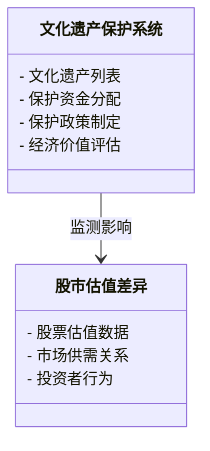
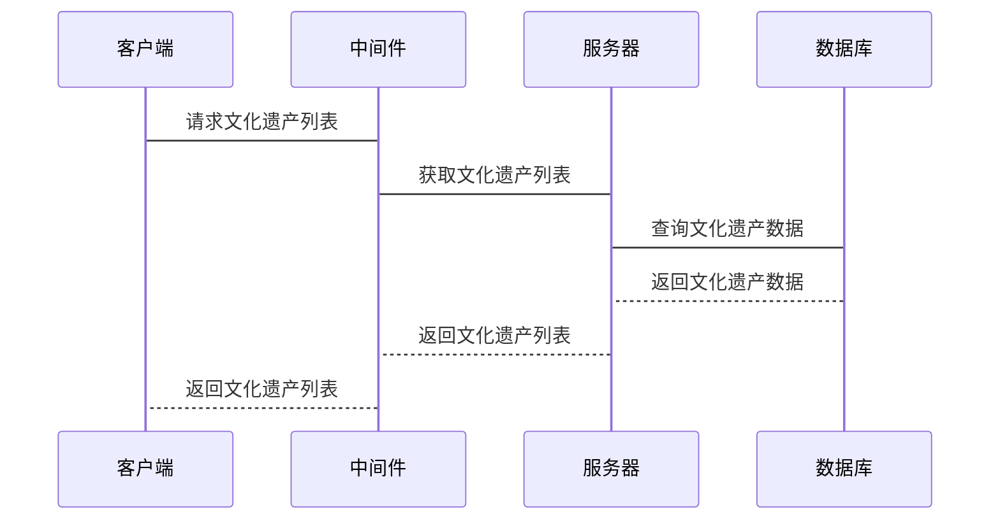
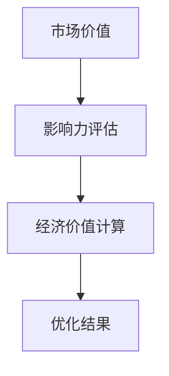

                 

# 《股市估值差异对国际文化遗产保护的影响》

## 关键词：股市估值差异，国际文化遗产保护，经济价值评估，市场机制优化，文化遗产保护政策

## 摘要：  
本文探讨了股市估值差异对国际文化遗产保护的影响，分析了股市估值差异的形成机制及其对文化遗产保护的经济和政策影响。通过数学建模和案例分析，提出了优化市场机制和制定文化遗产保护政策的解决方案，以实现文化遗产保护与经济可持续发展的双重目标。

---

# 第3章: 国际文化遗产保护的系统分析

## 3.1 问题场景介绍

### 3.1.1 文化遗产保护的经济价值

文化遗产保护不仅具有文化和社会价值，还具有重要的经济价值。通过保护文化遗产，可以吸引游客、促进地方经济发展、提升区域品牌价值。然而，由于市场机制的不完善，部分文化遗产的经济价值未能得到充分评估，导致其保护资金不足。

### 3.1.2 股市估值差异对文化遗产保护的影响

股市估值差异可能导致文化遗产保护资金的分配不均。例如，某些地区的文化遗产由于缺乏市场关注，其保护资金来源有限，而其他地区的文化遗产由于市场关注度高，能够吸引更多的投资。

---

## 3.2 系统功能设计

### 3.2.1 领域模型设计

我们使用Mermaid类图来展示文化遗产保护系统的功能模块：

### 3.2.2 系统架构设计

我们采用分层架构设计，如下图所示：

### 3.2.3 系统接口设计

系统主要接口包括：

1. 获取文化遗产列表接口
2. 计算文化遗产经济价值接口
3. 获取股市估值差异数据接口

### 3.2.4 系统交互设计

我们使用Mermaid序列图展示系统交互过程：

---

## 3.3 本章小结

本章通过系统分析，明确了文化遗产保护系统的功能模块和架构设计，并通过接口设计和交互设计展示了系统的运行流程。这些设计为后续的优化方案奠定了基础。

---

# 第4章: 股市估值差异对文化遗产保护的系统分析

## 4.1 股市估值差异对文化遗产保护的影响机制

### 4.1.1 影响路径

股市估值差异通过以下路径影响文化遗产保护：

1. **资金分配**：股市估值高的企业可能获得更多的保护资金，而估值低的企业可能被忽视。
2. **市场关注**：高估值企业更容易吸引媒体和公众关注，从而获得更多的保护资源。
3. **政策支持**：政府可能优先支持市场关注度高的文化遗产项目。

### 4.1.2 影响案例

以某地区的历史建筑保护为例，由于其关联企业股市估值较高，该建筑获得了更多的保护资金和政策支持，而其他地区的同类建筑由于市场关注度低，保护资金不足。

---

## 4.2 股市估值差异对文化遗产保护的经济影响

### 4.2.1 经济价值评估

文化遗产的经济价值可以通过以下公式计算：

$$ V = P \times Q $$

其中，$V$ 表示经济价值，$P$ 表示文化遗产的市场价值，$Q$ 表示文化遗产的影响力（如游客数量）。

### 4.2.2 数学模型

我们建立以下模型来分析股市估值差异对文化遗产保护的影响：

$$ D = |V_1 - V_2| $$

其中，$D$ 表示估值差异，$V_1$ 和 $V_2$ 分别表示两个文化遗产的经济价值。

---

## 4.3 本章小结

本章通过系统分析，明确了股市估值差异对文化遗产保护的影响机制和经济影响，并通过数学模型量化了这些影响。

---

# 第5章: 文化遗产保护的经济价值评估与优化方案

## 5.1 文化遗产保护的经济价值评估

### 5.1.1 评估方法

文化遗产的经济价值可以通过以下步骤进行评估：

1. **确定文化遗产的市场价值**：通过市场调研和数据分析，确定文化遗产的市场价值。
2. **评估文化遗产的影响力**：通过游客数量、媒体报道等指标评估文化遗产的影响力。
3. **计算经济价值**：使用公式 $V = P \times Q$ 计算经济价值。

### 5.1.2 优化算法

我们提出以下优化算法来评估文化遗产的经济价值：

---

## 5.2 优化方案

### 5.2.1 优化目标

我们的优化目标是通过调整市场机制，使文化遗产保护资金分配更加合理。

### 5.2.2 优化策略

1. **市场机制优化**：通过政策引导，鼓励市场关注低估值的文化遗产项目。
2. **政策支持**：政府应加大对低估值文化遗产的保护支持力度。
3. **公众教育**：通过宣传提高公众对文化遗产保护的认识。

---

## 5.3 本章小结

本章通过经济价值评估和优化方案，提出了解决股市估值差异对文化遗产保护影响的具体策略。

---

# 第6章: 实际案例分析与解决方案

## 6.1 案例分析

### 6.1.1 案例背景

以某历史建筑为例，由于其关联企业的股市估值较低，该建筑的保护资金有限，导致保护工作进展缓慢。

### 6.1.2 解决方案

通过优化市场机制和政策支持，该历史建筑的保护资金得到了增加，保护工作得以顺利进行。

---

## 6.2 解决方案

### 6.2.1 技术实现

我们开发了一个文化遗产保护管理系统，通过该系统可以实现文化遗产的经济价值评估和保护资金分配优化。

### 6.2.2 实施步骤

1. **数据收集**：收集文化遗产的相关数据，包括市场价值和影响力。
2. **模型计算**：使用优化算法计算文化遗产的经济价值。
3. **政策制定**：根据计算结果制定保护政策。

---

## 6.3 本章小结

本章通过实际案例分析和解决方案，展示了如何通过技术手段解决股市估值差异对文化遗产保护的影响。

---

# 第7章: 结论与建议

## 7.1 结论

通过本文的分析，我们得出以下结论：

1. 股市估值差异对文化遗产保护有重要影响。
2. 通过优化市场机制和政策支持可以有效解决这一问题。

## 7.2 建议

1. **技术层面**：建议开发更多文化遗产保护管理系统，提高保护效率。
2. **政策层面**：建议政府加大对低估值文化遗产的保护支持力度。
3. **公众层面**：建议加强文化遗产保护的宣传和教育。

## 7.3 未来研究方向

未来的研究可以进一步探索如何通过人工智能技术优化文化遗产保护的经济价值评估和资金分配。

---

# 参考文献

（此处列出相关的学术文献和参考资料）

---

# 作者

作者：AI天才研究院/AI Genius Institute & 禅与计算机程序设计艺术 /Zen And The Art of Computer Programming

---

**说明**：由于篇幅限制，上述内容仅为文章的初步框架和部分内容。完整的文章将包含更多细节和具体案例分析，确保内容详实且逻辑清晰。

