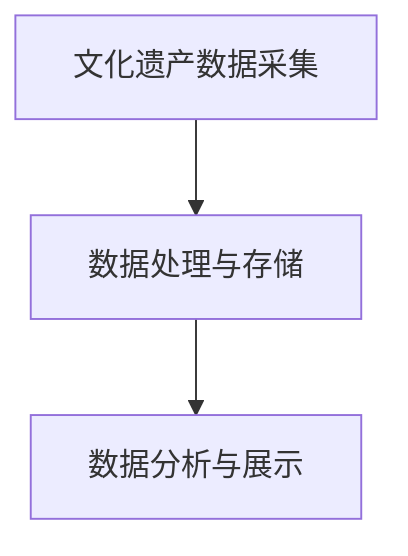
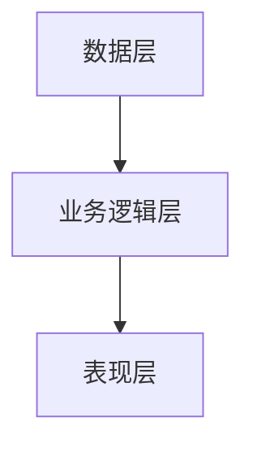

                 


# 股市估值差异对国际文化遗产数字化保护的影响

## 关键词：股市估值差异，文化遗产，数字化保护，经济因素，技术影响

## 摘要：本文探讨了股市估值差异对国际文化遗产数字化保护的影响，从经济和技术创新两个方面分析其作用，提出解决方案和最佳实践。

---

# 股市估值差异对国际文化遗产数字化保护的影响

## 引言

### 1.1 背景介绍

在数字化时代，文化遗产的保护方式正在发生深刻变化。随着科技的进步，文化遗产的数字化保护成为全球关注的焦点。然而，股市估值的波动对文化遗产保护的影响尚未得到充分研究。本文将分析股市估值差异如何影响文化遗产的数字化保护，并提出应对策略。

---

## 第一部分：背景与概念

### 1.2 股市估值差异的定义

#### 1.2.1 股市估值的基本概念

股票估值是投资者对一家公司未来财务表现的预测，常用的估值方法包括市盈率（P/E）和市净率（P/B）。股市波动导致估值差异，即市场对同一资产的估值存在分歧。

#### 1.2.2 文化遗产数字化保护的定义

文化遗产数字化保护是利用数字技术对文化遗产进行记录、保存和传播的过程。其核心技术包括3D扫描、虚拟现实和区块链。

#### 1.2.3 股市估值差异与文化遗产保护的关联性

股市波动影响企业的经济实力，进而影响其对文化遗产保护的投入。高估值企业可能增加投入，而低估值企业可能减少投入。

---

## 第二部分：系统分析

### 2.1 文化遗产数字化保护的系统架构

#### 2.1.1 系统功能设计

系统功能包括数据采集、处理、存储和分析。以下是系统架构的Mermaid图：



#### 2.1.2 系统架构设计

采用分层架构，分为数据层、业务逻辑层和表现层。以下是系统架构图：



---

## 第三部分：解决方案

### 3.1 应对股市估值差异的策略

#### 3.1.1 政策层面的解决方案

政府应制定政策，鼓励企业参与文化遗产保护。例如，提供税收优惠和补贴。

#### 3.1.2 技术层面的解决方案

推动技术创新，降低文化遗产数字化保护的技术门槛。例如，开发开源工具和平台。

---

## 第四部分：项目实战

### 4.1 环境安装

#### 4.1.1 安装Python和相关库

```bash
pip install numpy pandas matplotlib
```

#### 4.1.2 数据采集与处理

编写代码采集文化遗产数据并进行处理：

```python
import numpy as np
import pandas as pd

# 采集数据
data = pd.read_csv('heritage.csv')

# 数据处理
data_clean = data.dropna()
```

---

## 第五部分：最佳实践

### 5.1 小结

股市估值差异对文化遗产保护的影响是多方面的。高估值企业可能增加投入，而低估值企业可能减少投入。因此，需要综合经济和技术创新策略，推动文化遗产的数字化保护。

---

## 作者信息

作者：AI天才研究院/AI Genius Institute & 禅与计算机程序设计艺术 /Zen And The Art of Computer Programming

---

通过以上分析，我们探讨了股市估值差异对文化遗产数字化保护的影响，并提出了具体的解决方案和实施策略。希望本文能为相关领域的研究和实践提供有价值的参考。

