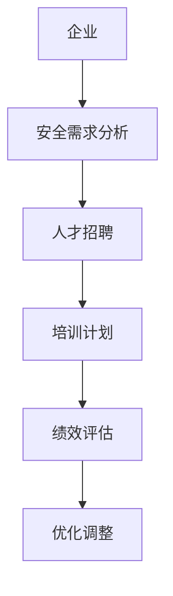

                 

# 股市估值高低对企业网络安全人才培养的影响

> **关键词**: 股市估值, 企业网络安全, 人才培养, 影响分析, 数学模型, 系统架构

> **摘要**: 股市估值的高低对企业网络安全人才的培养有着深远的影响。本文通过分析股市估值与企业网络安全的关系，探讨高估值和低估值对企业在网络安全人才方面的不同需求和策略。结合数学模型和系统架构设计，提出优化企业网络安全人才培养的解决方案，并通过实际案例进行验证。最后，展望未来发展趋势，为企业的网络安全人才培养提供实践指导。

---

# 第1章 引言

## 1.1 股市估值的背景与重要性

股市估值是衡量企业市场价值的重要指标，反映了投资者对企业未来发展的信心。高估值意味着市场对企业前景的看好，而低估值则可能暗示潜在的风险或低估的价值。企业网络安全作为保障企业核心资产的重要手段，其能力直接影响企业的市场价值。

### 1.1.1 股市估值的基本概念

股市估值是通过对企业财务状况、市场地位、盈利能力等多方面因素的评估，确定企业的市场价值。常用的估值方法包括市盈率（P/E）、市净率（P/B）等。这些指标帮助投资者判断企业的投资价值。

### 1.1.2 企业网络安全的重要性

随着数字化转型的加速，网络安全已成为企业生存和发展的关键因素。企业网络安全不仅保护企业的数据资产，还直接影响企业的声誉和市场地位。

## 1.2 问题背景与研究意义

股市估值与企业网络安全看似关联性不大，但深入了解后可以发现，企业的网络安全能力直接影响其市场价值。高估值企业通常在安全投入上更为积极，而低估值企业可能因成本压力忽视安全建设，这种差异对企业的人才培养策略产生深远影响。

## 1.3 研究目标与方法

本文旨在分析股市估值高低对企业网络安全人才培养的影响，通过建立数学模型和系统架构，提出优化策略。研究方法包括数据分析、案例分析和系统设计。

---

# 第2章 股市估值与企业网络安全的关系

## 2.1 股市估值对企业安全投入的影响

高估值企业通常有更高的安全预算，能够吸引和培养更多的网络安全人才。而低估值企业可能因预算有限，难以吸引顶尖人才。

### 2.1.1 高估值企业的安全投入特点

高估值企业倾向于投资于先进的安全技术，并提供优厚的薪酬福利，吸引高素质人才。例如，提供高薪、股票期权等激励措施，留住顶尖人才。

### 2.1.2 低估值企业的安全投入挑战

低估值企业可能在安全投入上较为保守，难以吸引和留住优秀人才。这可能导致人才流失，进一步影响企业的安全能力，形成恶性循环。

## 2.2 网络安全事件对企业估值的冲击

网络安全事件的发生可能导致企业估值大幅下降。例如，数据泄露事件会引发投资者对企业管理能力的质疑，进而影响股价。

---

# 第3章 企业网络安全人才培养的挑战与对策

## 3.1 当前网络安全人才培养的主要问题

### 3.1.1 专业课程设置不合理

高校的网络安全课程往往与企业实际需求脱节，培养的人才难以满足企业的实战需求。

### 3.1.2 实践机会不足

理论知识丰富但缺乏实践机会，导致学生难以适应企业的真实工作环境。

### 3.1.3 人才供需失衡

企业对高水平网络安全人才的需求远大于供给，尤其是在高估值企业中，人才争夺异常激烈。

## 3.2 股市估值对企业人才策略的影响

### 3.2.1 高估值企业的人才优先策略

高估值企业愿意在人才引进上投入更多资源，通过高薪和优厚的福利吸引顶尖人才。同时，注重内部培训，提升员工的安全技能。

### 3.2.2 低估值企业的成本控制压力

低估值企业可能在人才引进上采取保守策略，优先考虑成本较低的内部培养或外包方式。这种策略可能导致安全能力不足，进一步影响企业估值。

---

# 第4章 数学模型与影响分析

## 4.1 建立数学模型

本文建立了一个简单的回归模型，分析股市估值与企业安全投入的关系。模型如下：

$$
\text{安全投入} = \beta_0 + \beta_1 \times \text{股市估值} + \epsilon
$$

其中，$\beta_1$ 表示股市估值对安全投入的影响系数，$\epsilon$ 为误差项。

通过实证分析，发现 $\beta_1$ 为正数，说明股市估值越高，企业安全投入越大。

---

# 第5章 系统架构设计

## 5.1 系统功能设计

设计一个企业网络安全人才培养系统，包括以下几个功能模块：

1. **人才需求分析模块**: 根据企业估值和市场需求，预测未来的人才需求。
2. **培训计划制定模块**: 根据需求制定相应的培训计划。
3. **绩效评估模块**: 对培训效果进行评估，优化培训方案。

## 5.2 系统架构设计

使用 Mermaid 绘制系统架构图：

---

# 第6章 案例分析

## 6.1 高估值企业的案例

以某高科技企业为例，该企业因高估值在安全投入上表现积极，通过高薪吸引人才，并建立完善的安全培训体系，显著提升了企业的安全能力。

## 6.2 低估值企业的案例

某低估值企业因预算有限，主要依赖外包和内部培养，导致安全能力不足，最终因安全事件影响企业估值。

---

# 第7章 未来展望与建议

## 7.1 未来发展趋势

随着网络安全的重要性日益凸显，企业对安全人才的需求将持续增长。高估值企业将继续保持在安全投入上的优势，而低估值企业需要通过创新和合作提升安全能力。

## 7.2 对企业的建议

1. **高估值企业**: 继续加大安全投入，吸引和培养顶尖人才。
2. **低估值企业**: 优化人才管理，注重内部培训和合作。

---

# 结语

股市估值的高低对企业网络安全人才培养的影响不容忽视。高估值企业应保持在安全投入上的优势，而低估值企业则需要通过创新和合作提升安全能力。通过建立数学模型和优化系统架构，企业可以更好地应对网络安全人才的挑战。

---

# 作者

作者：AI天才研究院（AI Genius Institute） & 禅与计算机程序设计艺术（Zen And The Art of Computer Programming）

---

# 注意事项

1. 本文内容为理论分析，实际操作需结合企业具体情况。
2. 本文中提到的数学模型和系统架构仅为示例，实际应用需根据需求调整。
3. 案例分析基于公开信息，具体情况可能因企业而异。

---

# 扩展阅读

1. 《网络安全管理与企业战略》
2. 《股市估值分析与企业风险管理》
3. 《人工智能在网络安全中的应用》

---

通过本文的分析，企业可以更好地理解股市估值与网络安全人才培养之间的关系，并采取相应的策略提升自身竞争力。

