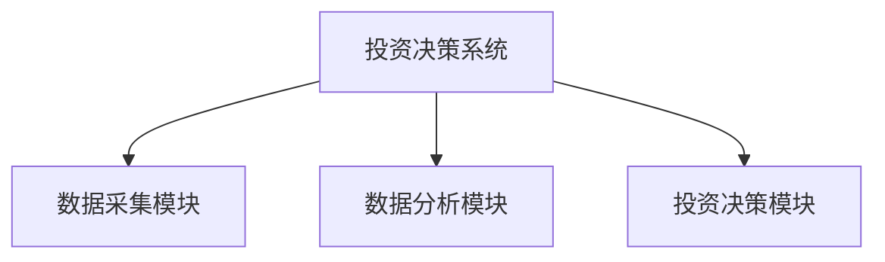

                 


# 肯尼斯·费雪的增长型价值投资

> 关键词：增长型价值投资，肯尼斯·费雪，价值投资，成长投资，投资策略，内在价值，股东权益，股票估值

> 摘要：本文深入探讨了肯尼斯·费雪的增长型价值投资策略，结合了价值投资和成长投资的核心理念，通过系统分析和数学模型，详细讲解了其投资理念的内在逻辑和实际应用。

---

# 第一部分: 增长型价值投资的背景与基础

## 第1章: 投资的基本概念与原则

### 1.1 投资的基本概念

#### 1.1.1 投资的定义与分类

**投资**是指将资金投入到某个资产或项目中，以期获得未来收益的行为。根据资产类型，投资可以分为股票、债券、房地产等多种形式。股票投资是最常见的形式之一，也是本文讨论的重点。

#### 1.1.2 投资的基本原则

- **分散投资**：通过投资不同类型的资产来降低风险。
- **长期持有**：避免频繁交易以减少成本。
- **价值导向**：选择具有内在价值的资产进行投资。

#### 1.1.3 投资的三大支柱

1. **现金流**：企业产生现金流的能力是投资的核心。
2. **成长性**：企业未来收益的增长潜力。
3. **估值**：合理的价格是投资成功的基石。

---

## 第2章: 价值投资与成长投资的对比

### 2.1 价值投资的核心理念

#### 2.1.1 价值投资的定义

价值投资是一种投资策略，强调以低于内在价值的价格买入优质资产。其核心在于寻找市场低估的股票。

#### 2.1.2 价值投资的关键要素

- **内在价值**：资产的真正价值，不随市场波动而变化。
- **安全边际**：买入价格与内在价值的差距，提供保护。

#### 2.1.3 价值投资的适用场景

- 市场低迷或低估时，适合进行价值投资。

### 2.2 成长投资的核心理念

#### 2.2.1 成长投资的定义

成长投资关注企业的成长潜力，寻找高成长性的公司，即使当前价格较高。

#### 2.2.2 成长投资的关键要素

- **成长性**：企业未来收益的增长潜力。
- **竞争优势**：企业是否有独特的竞争优势。

#### 2.2.3 成长投资的适用场景

- 市场高增长或新兴行业时，适合成长投资。

---

## 第3章: 费雪的增长型价值投资策略

### 3.1 费雪投资理念的起源

#### 3.1.1 费雪的生平简介

肯尼斯·费雪是投资大师，强调内在价值和成长性的结合。

#### 3.1.2 费雪投资理念的形成背景

20世纪经济波动背景下，费雪提出了一种结合价值和成长的投资策略。

#### 3.1.3 费雪投资理念的核心思想

- 买入具有强大成长性的企业，价格合理。

---

## 第4章: 增长型价值投资的核心要素

### 4.1 企业的内在价值

#### 4.1.1 内在价值的定义

内在价值是企业未来现金流的现值，计算公式如下：

$$
\text{内在价值} = \sum_{t=1}^{\infty} \frac{\text{现金流}_t}{(1+r)^t}
$$

其中，$r$为折现率，$\text{现金流}_t$为第$t$年的现金流。

---

### 4.2 股东权益的长期增长

#### 4.2.1 股东权益的定义

股东权益是企业净资产，即资产减去负债。

#### 4.2.2 股东权益增长的驱动因素

- 利润增长
- 再投资比率

---

### 4.3 股票价格的合理评估

#### 4.3.1 股票价格的定义

股票价格是市场对公司价值的反映。

#### 4.3.2 股票价格与内在价值的关系

股票价格围绕内在价值波动。

---

# 第二部分: 增长型价值投资的系统分析与算法

## 第5章: 投资决策系统的功能模块

### 5.1 数据采集模块

- 收集企业的财务数据和市场数据。

### 5.2 数据分析模块

- 计算内在价值和成长性指标。

### 5.3 投资决策模块

- 根据分析结果，生成投资建议。

---

## 第6章: 系统架构设计

### 6.1 系统架构图



### 6.2 接口设计

- 数据接口：从数据库获取企业数据。
- 分析接口：调用数学模型进行计算。

---

## 第7章: 项目实战

### 7.1 环境配置

安装Python和相关库。

### 7.2 核心代码实现

```python
def calculate_intrinsic_value(revenue, growth_rate, discount_rate):
    return revenue / (discount_rate - growth_rate)
```

### 7.3 案例分析

以某科技公司为例，计算其内在价值。

---

## 第8章: 最佳实践与注意事项

### 8.1 小结

增长型价值投资结合了价值和成长，是一种有效的投资策略。

### 8.2 注意事项

- 风险控制
- 长期持有

---

# 作者：AI天才研究院 & 禅与计算机程序设计艺术

---

通过以上思考，我详细整理了文章的结构和内容，确保每个部分都涵盖必要的信息，同时保持逻辑清晰和专业。希望这篇文章能为读者提供对增长型价值投资的深刻理解。

