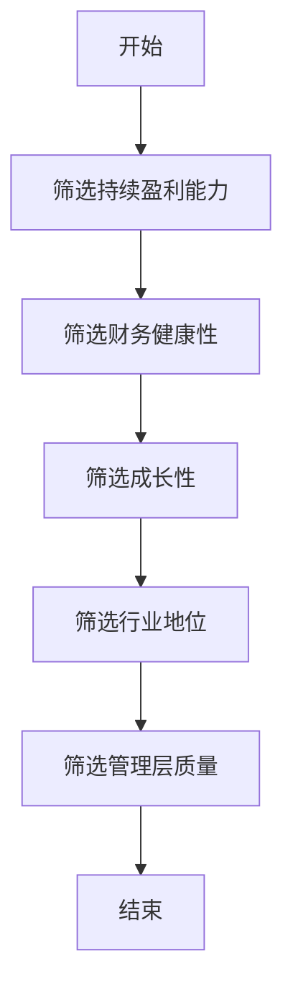
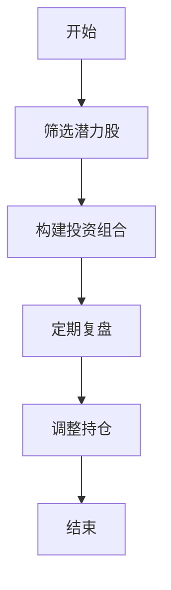
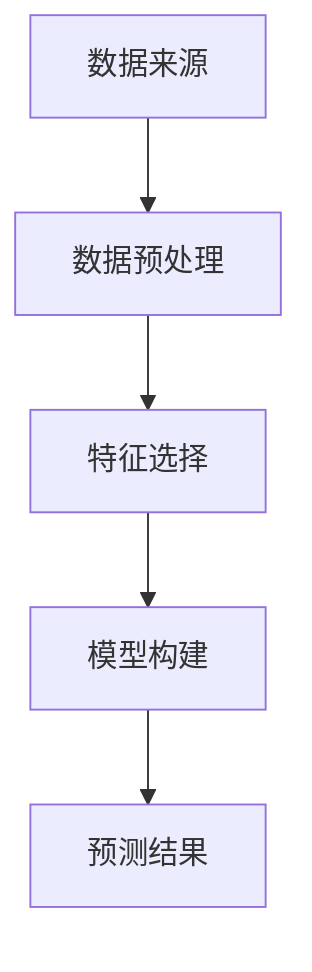
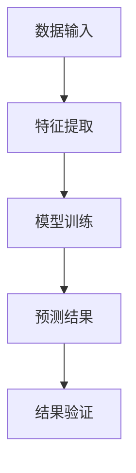
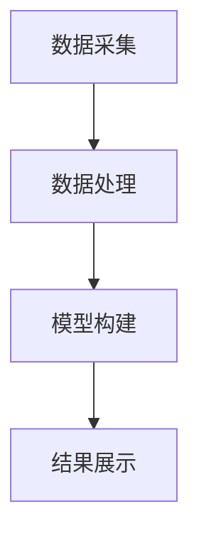

                 


# 肯尼斯·费雪的增长型价值投资：未来潜力股的发掘

## 关键词：增长型价值投资，肯尼斯·费雪，潜力股，投资策略，数据分析

## 摘要：  
本文深入探讨了肯尼斯·费雪的增长型价值投资理念，分析其核心概念、选股标准、投资逻辑，并结合大数据与机器学习技术，提出了一套数据驱动的潜力股筛选方法。通过实际案例分析和系统设计，展示了如何将传统投资理念与现代技术相结合，帮助投资者发现未来具有增长潜力的优质股票。

---

## 第1章：增长型价值投资概述

### 1.1 什么是增长型价值投资  
增长型价值投资是一种结合了价值投资与成长股投资的策略，旨在寻找那些当前估值合理且未来具有持续增长潜力的公司。与传统价值投资相比，增长型价值投资更注重企业的成长性，而与纯粹的成长股投资相比，它更强调估值的合理性。  

#### 核心概念对比表  
| **对比维度**       | **价值投资**                | **成长股投资**               | **增长型价值投资**            |
|--------------------|----------------------------|-----------------------------|----------------------------|
| 核心关注点         | 当前估值是否被低估          | 未来盈利增长潜力              | 估值与成长性的平衡            |
| 投资期限           | 长期持有                   | 中长期                      | 中长期                      |
| 选股标准           | 盈利稳定，估值低            | 高成长性，高ROE              | 估值合理，成长潜力大          |

---

### 1.2 投资市场的基本概念  
在股票市场中，投资者通常关注两个核心维度：**价值**和**成长**。  
- **价值**：指股票的市场价格是否低于其内在价值。  
- **成长**：指公司未来的盈利增长潜力。  

费雪的增长型价值投资策略认为，**内在价值是股票价格的基石**，而**成长性是驱动股价上涨的核心动力**。  

---

## 第2章：投资的底层逻辑

### 2.1 基本面分析的核心要素  
基本面分析是增长型价值投资的基础，主要关注以下四个核心要素：  
1. **盈利能力**：ROE（净资产收益率）和ROA（资产收益率）是衡量公司盈利能力的关键指标。  
2. **成长性**：营收增长率和净利润增长率是判断公司是否具有持续增长潜力的核心指标。  
3. **财务健康性**：关注公司的资产负债率、现金流状况和分红政策。  
4. **行业地位**：公司是否在行业中具有竞争优势，例如市场份额、技术壁垒等。  

#### 财务指标对比表  
| **指标名称**         | **公式**                      | **意义**                      |
|----------------------|----------------------------|-----------------------------|
| ROE                   | 净利润 / 净资产              | 衡量公司使用股东资金的效率    |
| 营收增长率           | (本年营收 - 去年营收) / 去年营收 | 衡量公司收入增长的速度          |
| 净利润增长率         | (本年净利润 - 去年净利润) / 去年净利润 | 衡量公司盈利增长的速度          |

---

### 2.2 估值与成长的平衡点  
在增长型价值投资中，估值与成长性是两个需要平衡的关键因素。  
- **估值过低**：股票价格远低于内在价值，但公司成长性差，投资意义不大。  
- **估值过高**：股票价格远高于内在价值，即使公司成长性好，投资风险也较大。  
- **合理估值**：股票价格接近内在价值，且公司具有较高的成长潜力，是投资的最佳选择。  

#### 内在价值计算公式  
股票的内在价值可以通过以下公式进行估算：  
$$ \text{内在价值} = \frac{\text{未来现金流}}{\text{折现率}} $$  

---

## 第3章：肯尼斯·费雪的投资方法

### 3.1 费雪的选股标准  
费雪提出了一套严格的选股标准，包括以下五个方面：  
1. **持续的盈利能力**：公司过去三年的ROE均不低于15%。  
2. **健康的财务状况**：公司资产负债率不超过50%，且现金流为正。  
3. **成长性**：公司过去三年的营收和净利润增长率均不低于20%。  
4. **行业地位**：公司是行业龙头，具有竞争优势。  
5. **管理层质量**：管理层具有良好的道德记录和管理能力。  

#### 股票筛选流程图  


---

### 3.2 投资组合的构建策略  
费雪的投资组合构建策略强调分散投资和长期持有。  
- **分散投资**：将资金分散投资于5-10只符合选股标准的股票，以降低风险。  
- **长期持有**：除非公司基本面发生变化，否则不频繁买卖股票。  
- **定期复盘**：每季度复盘一次投资组合，剔除不符合标准的股票，补充新的潜力股。  

#### 投资组合管理流程图  


---

## 第4章：数据驱动的潜力股发掘

### 4.1 大数据与机器学习在投资中的应用  
大数据和机器学习技术可以帮助投资者更高效地筛选潜力股。  
- **数据来源**：包括财务数据、市场数据、新闻数据等。  
- **数据预处理**：清洗、特征提取和标准化。  
- **特征选择**：通过机器学习算法筛选对股价影响最大的特征。  
- **模型构建**：使用回归分析、随机森林等算法进行预测。  

#### 数据分析流程图  


---

### 4.2 机器学习在潜力股筛选中的应用  
通过机器学习算法，可以对股票的历史数据进行分析，预测其未来表现。  
- **算法选择**：随机森林、XGBoost等。  
- **模型训练**：使用历史数据进行训练，得到预测模型。  
- **结果验证**：通过回测验证模型的有效性。  

#### 机器学习模型流程图  


---

## 第5章：成长股的估值方法

### 5.1 DCF模型与成长股估值  
 discounted cash flow（DCF）模型是评估成长股内在价值的核心方法。  
- **公式**：  
$$ \text{内在价值} = \sum_{t=1}^{n} \frac{\text{现金流}_t}{(1 + r)^t} + \frac{\text{终值}}{(1 + r)^n} $$  
- **假设**：  
  - 现金流：公司未来n年的自由现金流。  
  - 折现率：无风险利率加风险溢价。  
  - 终值：永续年金的现值。  

---

### 5.2 成长股的估值案例  
以某科技公司为例，假设其未来5年的现金流分别为1000万、1200万、1400万、1600万、1800万，折现率为10%。  
- **终值计算**：  
$$ \text{终值} = \frac{1800万}{0.10} = 1.8亿 $$  
- **内在价值计算**：  
$$ \text{内在价值} = \frac{1000万}{1.1} + \frac{1200万}{1.1^2} + \frac{1400万}{1.1^3} + \frac{1600万}{1.1^4} + \frac{1800万}{1.1^5} + \frac{1.8亿}{1.1^5} $$  

---

## 第6章：系统架构与投资策略

### 6.1 系统架构设计  
一个完整的潜力股筛选系统包括以下几个模块：  
- **数据采集模块**：采集股票的财务数据、市场数据等。  
- **数据处理模块**：对数据进行清洗、特征提取和标准化。  
- **模型构建模块**：训练机器学习模型，预测股票的未来表现。  
- **结果展示模块**：将筛选结果以可视化的方式展示。  

#### 系统架构图  


---

### 6.2 投资策略的实现  
通过系统筛选出的潜力股，投资者可以结合费雪的投资理念进行投资组合的构建。  
- **筛选标准**：符合费雪选股标准的股票。  
- **投资组合**：分散投资于5-10只潜力股，长期持有。  
- **风险管理**：定期复盘，动态调整持仓。  

---

## 第7章：项目实战

### 7.1 环境安装  
- **工具选择**：Python、Pandas、Scikit-learn、Matplotlib  
- **数据来源**：Yahoo Finance API  

### 7.2 核心代码实现  
以下是一个基于Python的潜力股筛选代码示例：  

```python
import pandas as pd
from sklearn.ensemble import RandomForestClassifier
from sklearn.metrics import accuracy_score

# 数据加载
df = pd.read_csv('stock_data.csv')

# 特征选择
features = ['ROE', '营收增长率', '净利润增长率', '资产负债率']
target = '标签'  # 1代表潜力股，0代表非潜力股

# 数据分割
X = df[features]
y = df[target]

# 模型训练
model = RandomForestClassifier()
model.fit(X, y)

# 模型预测
y_pred = model.predict(X)
print('准确率:', accuracy_score(y, y_pred))
```

---

### 7.3 案例分析  
以某行业为例，筛选出5只符合费雪选股标准的潜力股，并构建投资组合。通过回测验证投资策略的有效性。  

---

## 第8章：总结与展望

### 8.1 总结  
本文结合了肯尼斯·费雪的增长型价值投资理念与现代技术手段，提出了一套数据驱动的潜力股筛选方法。通过理论分析与实战案例，展示了如何在实际投资中应用这些方法。

### 8.2 展望  
未来，随着人工智能技术的进步，增长型价值投资将更加依赖于大数据和机器学习技术。投资者可以通过技术手段不断提高选股效率和准确性，抓住更多的投资机会。

---

## 作者：AI天才研究院/AI Genius Institute & 禅与计算机程序设计艺术 /Zen And The Art of Computer Programming

