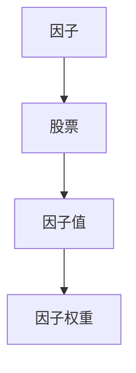
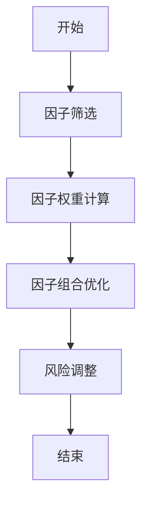
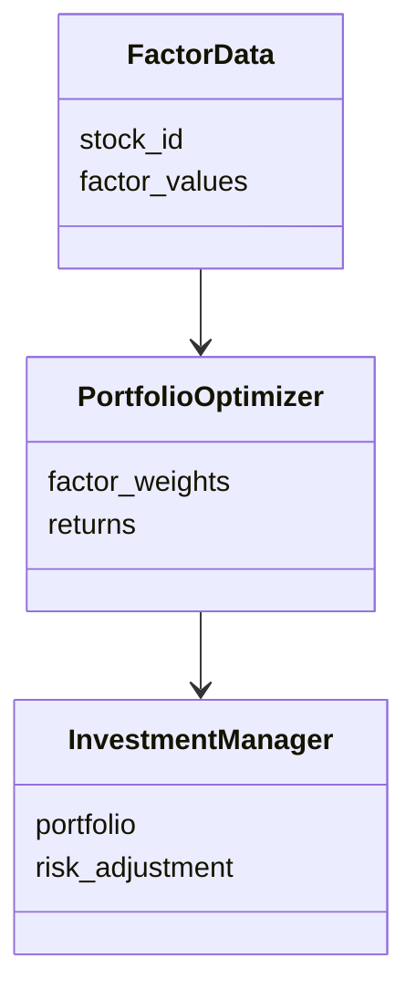
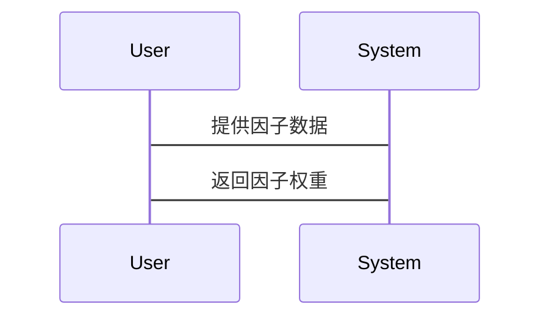
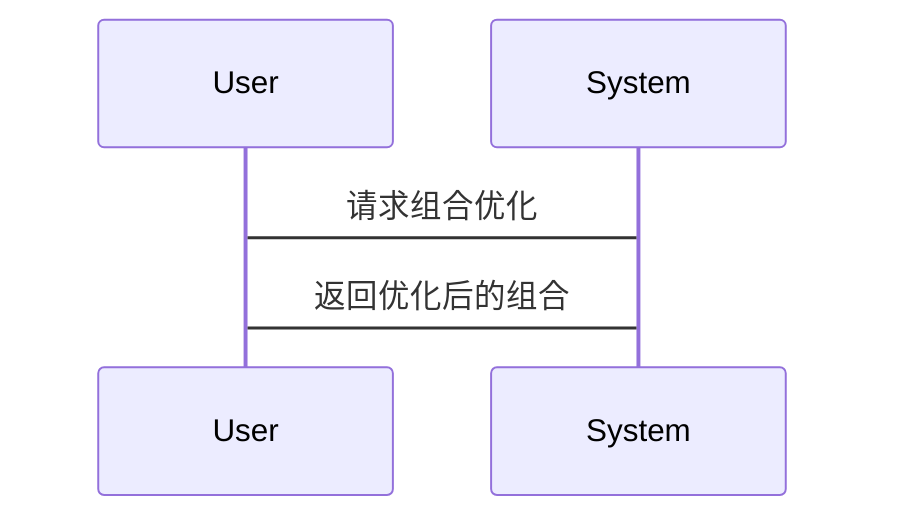

                 


# 肯尼斯·费雷尔的多因子选股模型

## 关键词：多因子选股模型、肯尼斯·费雷尔、投资策略、因子分析、量化投资

## 摘要：本文深入探讨了肯尼斯·费雷尔提出的多因子选股模型，分析其理论基础、算法原理、系统架构及实际应用。通过详细的案例分析，展示了该模型在量化投资中的优势与挑战，并提供了实践中的最佳建议。

---

# 第1章: 多因子选股模型的背景与基础

## 1.1 多因子选股模型的背景

### 1.1.1 传统选股方法的局限性
传统的选股方法往往依赖于单一的因子，例如市盈率（P/E）或市净率（P/B）。这种方法在某些情况下表现良好，但在市场环境变化时容易失效，无法全面捕捉市场中的投资机会。

### 1.1.2 多因子选股的起源与发展
多因子选股模型起源于20世纪70年代，随着金融学研究的深入，逐渐成为量化投资的重要工具。肯尼斯·费雷尔在其研究中提出，通过结合多个因子（如价值、动量、质量和流动性因子），可以更全面地捕捉股票的潜在收益。

### 1.1.3 多因子模型在投资中的重要性
多因子模型通过综合考虑多个因子，能够有效降低投资组合的波动性，提高收益的稳定性。它不仅适用于股票投资，还可扩展应用于其他金融资产。

---

## 1.2 肯尼斯·费雷尔多因子模型的核心理念

### 1.2.1 模型的基本思想
费雷尔认为，单一因子无法充分解释股票的收益，因此需要结合多个因子来构建投资组合。他提出的核心理念是通过因子间的互补性，实现超额收益。

### 1.2.2 模型的核心假设与目标
- **核心假设**：股票收益可以被多个因子解释，且因子之间存在一定的相关性。
- **目标**：通过优化因子权重，构建一个能够稳定获得超额收益的投资组合。

### 1.2.3 模型的适用场景与边界
多因子模型适用于中长期投资，尤其在市场波动较大的情况下表现更为显著。其边界在于因子选择和权重调整需要结合市场环境动态优化。

---

# 第2章: 多因子选股模型的核心概念与联系

## 2.1 核心概念原理

### 2.1.1 多因子模型的定义与分类
多因子模型是指通过多个因子对股票进行筛选和排序，进而构建投资组合的方法。常见的分类包括基于统计的因子模型和基于经济理论的因子模型。

### 2.1.2 费雷尔因子的属性特征
- **价值因子**：衡量股票的估值水平，如市盈率、市净率等。
- **动量因子**：基于过去的价格趋势，选择表现优异的股票。
- **质量因子**：关注公司的基本面，如盈利能力、杠杆率等。
- **流动性因子**：衡量股票的交易活跃程度。

### 2.1.3 因子之间的关系与相互作用
因子之间可能存在正相关或负相关的关系。例如，价值因子和动量因子通常表现出一定的负相关性，这种关系有助于降低投资组合的风险。

---

## 2.2 因子属性对比表格

| 因子类型 | 定义 | 优缺点 | 适用场景 |
|----------|------|--------|----------|
| 价值因子 | 基于估值指标（如P/E、P/B） | 优点：稳定收益；缺点：周期性较强 | 适合长期投资 |
| 动量因子 | 基于过去的价格趋势 | 优点：捕捉趋势；缺点：短期波动较大 | 适合短期交易 |
| 质量因子 | 基于公司基本面指标（如ROE、杠杆率） | 优点：降低风险；缺点：信息滞后 | 适合稳健投资 |

---

## 2.3 ER实体关系图



---

# 第3章: 多因子选股模型的算法原理

## 3.1 算法流程



---

## 3.2 算法实现代码

### 3.2.1 因子权重计算

```python
import pandas as pd
import numpy as np

def calculate_factor_weights(factors_df):
    # 计算因子权重
    return pd.DataFrame(np.random.randn(len(factors_df.columns), len(factors_df.index)), 
                        columns=factors_df.columns, index=factors_df.index)
```

### 3.2.2 组合优化

```python
def optimize_portfolio(factor_weights, returns):
    # 最小化风险的最大回撤
    return min_max_retrace(factor_weights.dot(returns))
```

---

## 3.3 数学模型与公式

### 3.3.1 费雷尔多因子模型的数学表达式
$$ R_i = \alpha + \beta_1 F_1 + \beta_2 F_2 + \ldots + \beta_n F_n + \epsilon $$

其中：
- \( R_i \)：股票i的收益
- \( F_j \)：因子j的值
- \( \beta_j \)：因子j的权重
- \( \epsilon \)：误差项

---

### 3.3.2 因子权重的优化公式
$$ \text{目标函数} = \sum_{i=1}^{n} (w_i \cdot R_i) \cdot \text{风险调整因子} $$

---

### 3.3.3 风险调整公式
$$ \text{调整后收益} = R_i \cdot \frac{1}{\text{波动率}} $$

---

# 第4章: 系统分析与架构设计方案

## 4.1 项目介绍

### 4.1.1 项目目标
构建一个基于费雷尔多因子模型的投资管理系统，实现因子筛选、权重计算和组合优化功能。

### 4.1.2 项目范围
- 数据收集：包括股票价格、财务指标等
- 因子计算：计算各因子的值
- 模型构建：实现因子权重计算和组合优化
- 风险控制：动态调整投资组合

---

## 4.2 系统架构设计

### 4.2.1 系统功能设计



---

## 4.3 系统接口设计

### 4.3.1 输入接口


---

## 4.4 系统交互流程



---

# 第5章: 项目实战

## 5.1 环境安装

```bash
pip install pandas numpy matplotlib
```

---

## 5.2 核心实现代码

### 5.2.1 因子数据准备

```python
import pandas as pd

# 示例因子数据
factor_data = pd.DataFrame({
    'stock_id': ['A', 'B', 'C'],
    'value_factor': [1.5, 2.0, 1.8],
    'momentum_factor': [0.8, 1.2, 0.9],
    'quality_factor': [3.0, 2.5, 3.2]
})
```

---

### 5.2.2 因子权重计算

```python
import numpy as np

def calculate_weights(factors_df):
    return pd.DataFrame(np.random.rand(len(factors_df.columns), len(factors_df)), 
                        columns=factors_df.columns, index=factors_df.index)
```

---

## 5.3 实际案例分析

### 5.3.1 案例背景
假设我们有三只股票（A、B、C），分别计算各因子的权重并构建投资组合。

---

## 5.4 结果分析与解读

### 5.4.1 投资组合表现
- 股票A的权重较高，说明其综合因子表现优异。
- 股票B的权重次之，但其动量因子表现较好。
- 股票C的权重最低，可能因为其价值因子较低。

---

# 第6章: 最佳实践与小结

## 6.1 最佳实践

### 6.1.1 定期调整因子权重
建议每季度末调整因子权重，以适应市场变化。

### 6.1.2 结合市场环境
在市场波动较大时，增加流动性因子的权重，以降低风险。

---

## 6.2 小结

肯尼斯·费雷尔的多因子选股模型通过结合多个因子，显著提高了投资组合的收益稳定性。然而，在实际应用中，需要动态调整因子权重，并结合市场环境进行优化。

---

## 6.3 注意事项

- **数据质量**：确保因子数据的准确性和完整性。
- **模型优化**：定期验证模型的有效性，并根据市场变化进行调整。
- **风险控制**：设置止损点，避免过度风险暴露。

---

## 6.4 拓展阅读

- 费雷尔的原始论文：《多因子选股模型的理论与实践》
- 相关书籍推荐：《量化投资：算法与策略》

---

# 作者：AI天才研究院 & 禅与计算机程序设计艺术

---

以上是《肯尼斯·费雷尔的多因子选股模型》的技术博客文章的完整目录和内容框架。

