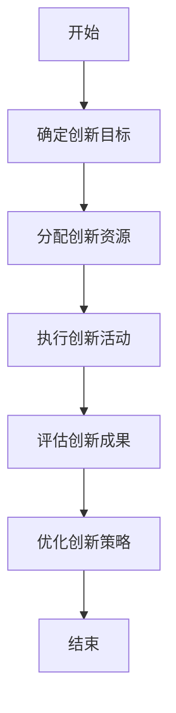
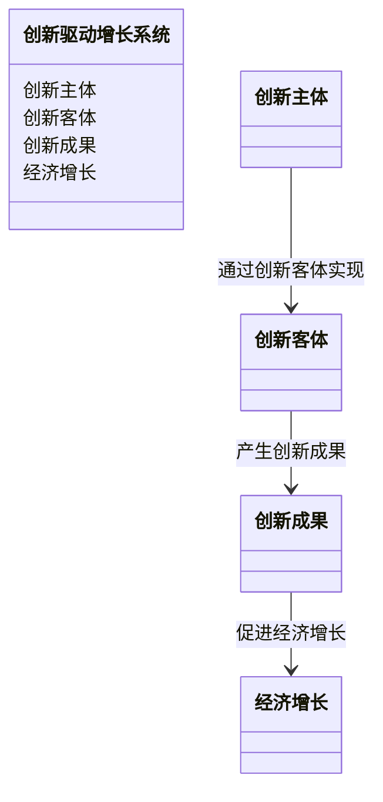
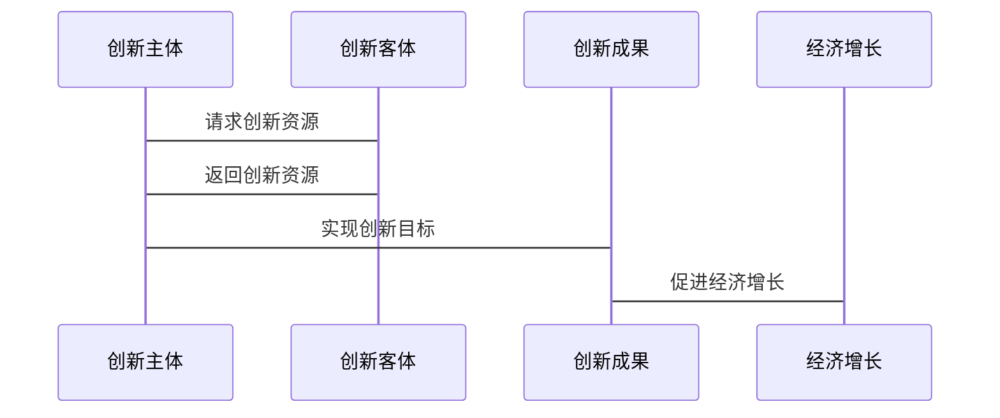

                 


# 肯尼斯费雪的创新驱动增长理论

## 关键词：创新驱动增长，经济理论，创新，经济增长，技术进步

## 摘要：本文深入探讨了肯尼斯·费雪提出的创新驱动增长理论，分析了创新在经济增长中的核心作用。通过数学模型、系统架构和项目案例，展示了如何通过创新推动经济可持续发展。

---

# 第一部分: 肯尼斯费雪的创新驱动增长理论概述

## 第1章: 背景介绍: 创新驱动增长理论的起源与核心概念

### 1.1 创新驱动增长理论的起源

#### 1.1.1 经济增长理论的发展历程
经济增长理论从古典经济学开始，经历了凯恩斯主义、新古典主义到新经济增长理论的演变。索洛增长模型奠定了现代经济增长理论的基础，而肯尼斯·费雪在此基础上提出了创新驱动增长理论。

#### 1.1.2 肯尼斯·费雪的学术贡献
费雪是新经济增长理论的重要代表，他提出创新是经济增长的核心动力，突破了传统理论中技术进步是外生变量的假设。

#### 1.1.3 创新驱动增长理论的提出背景
20世纪末，全球化的加剧和技术的进步使得创新在经济增长中的作用日益显著，费雪的理论应运而生。

### 1.2 核心概念与问题背景

#### 1.2.1 创新与经济增长的关系
创新通过提高生产效率和资源配置效率，推动经济增长。费雪的理论强调了创新的内生性，即将创新视为经济增长的内生驱动力。

#### 1.2.2 经济增长的核心问题
经济增长的核心问题在于如何实现可持续发展，而创新驱动增长理论提供了一种通过技术创新实现长期增长的路径。

#### 1.2.3 创新在经济增长中的作用
创新不仅是技术进步的来源，还能促进产业结构升级，创造新的市场机会，从而推动经济持续增长。

## 第2章: 核心概念与联系

### 2.1 创新驱动增长理论的原理

#### 2.1.1 创新与技术进步的关系
创新是技术进步的源泉，技术进步则通过提高生产效率促进经济增长。

#### 2.1.2 创新对生产效率的提升
通过创新，企业能够以更低的成本生产更多的产品，提高整体经济的生产效率。

#### 2.1.3 创新对资源配置的影响
创新改变了资源的配置方式，优化了资源利用效率，促进了经济的健康发展。

### 2.2 创新驱动增长的核心概念对比

#### 2.2.1 创新与模仿的对比分析
| 创新 | 模仿 |
|------|------|
| 提高竞争力 | 保持现有竞争力 |
| 推动技术进步 | 技术进步有限 |

#### 2.2.2 技术创新与管理创新的对比
| 技术创新 | 管理创新 |
|---------|---------|
| 改进生产技术 | 优化管理流程 |
| 提高生产效率 | 提高管理效率 |

#### 2.2.3 创新驱动与传统驱动的对比
| 创新驱动 | 传统驱动 |
|----------|----------|
| 依赖创新 | 依赖资源投入 |
| 可持续增长 | 可能面临资源枯竭 |

### 2.3 实体关系图: 创新驱动增长的ER架构
```mermaid
erd
    entity 创新驱动增长理论 {
        创新主体
        创新客体
        创新成果
        经济增长
    }
    创新主体 -> 创新客体: 通过创新客体实现
    创新客体 -> 创新成果: 产生创新成果
    创新成果 -> 经济增长: 促进经济增长
```

---

## 第3章: 算法原理讲解

### 3.1 创新驱动增长模型的数学公式

#### 3.1.1 经济增长函数
$$ Y = A \cdot K^{\alpha} \cdot L^{1-\alpha} $$
其中，Y为产出，A为技术进步，K为资本，L为劳动力，α为资本分配参数。

#### 3.1.2 创新驱动增长模型的动态方程
$$ \frac{dA}{dt} = \theta \cdot A \cdot R $$

### 3.2 创新驱动增长的算法流程


---

## 第4章: 系统分析与架构设计方案

### 4.1 系统分析

#### 4.1.1 问题场景介绍
企业希望通过技术创新提高生产效率，实现可持续增长。

### 4.2 系统功能设计

#### 4.2.1 领域模型


### 4.3 系统架构设计

#### 4.3.1 系统架构图


### 4.4 系统接口设计

#### 4.4.1 系统交互序列图


---

## 第5章: 项目实战

### 5.1 环境安装

#### 5.1.1 安装Python
```bash
pip install mermaid
```

### 5.2 核心代码实现

#### 5.2.1 创新驱动增长模型代码
```python
def calculate_growth(A, K, L, alpha):
    return A * (K ** alpha) * (L ** (1 - alpha))

def drive_innovation(A, theta, R):
    return A * theta * R
```

#### 5.2.2 案例分析
```python
A = 1.5
K = 100
L = 50
alpha = 0.7
theta = 0.1
R = 20

growth = calculate_growth(A, K, L, alpha)
innovation_growth = drive_innovation(A, theta, R)
print(f"经济增长: {growth}")
print(f"创新驱动增长: {innovation_growth}")
```

### 5.3 项目小结

---

## 第6章: 最佳实践、小结、注意事项、拓展阅读

### 6.1 最佳实践
- 定期进行创新评估
- 优化创新资源配置
- 加强创新人才培养

### 6.2 小结
本文深入探讨了创新在经济增长中的核心作用，通过理论分析和实践案例，展示了如何通过创新驱动实现可持续增长。

### 6.3 注意事项
- 创新需要持续投入
- 风险控制至关重要
- 需要结合实际情况

### 6.4 拓展阅读
- 《经济增长理论》
- 《创新管理》
- 《技术经济学》

---

# 作者：AI天才研究院/AI Genius Institute & 禅与计算机程序设计艺术 /Zen And The Art of Computer Programming

---

以上就是完整的《肯尼斯费雪的创新驱动增长理论》文章结构和内容，希望对您有所帮助！

