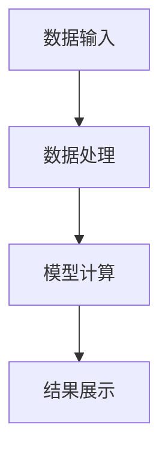
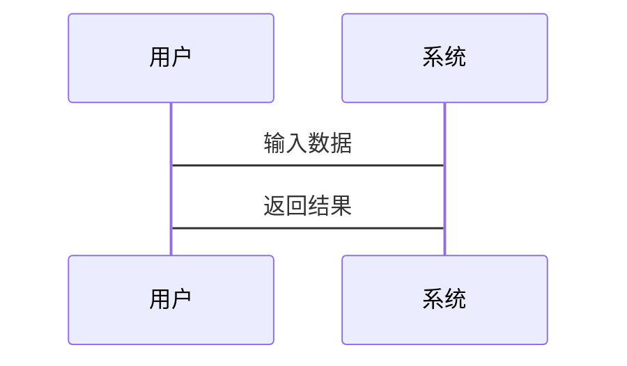

                 


# 《肯尼斯费雪的竞争优势分析》

> 关键词：竞争优势分析、肯尼斯费雪、投资策略、企业分析、资源优化

> 摘要：本文将详细介绍竞争优势分析的核心概念、方法和实际应用。通过分析资源、能力和市场定位等多个维度，结合数学模型和算法，深入探讨如何在现代商业环境中识别和提升竞争优势。本文还将结合实际案例，展示竞争优势分析在企业战略制定中的重要性。

---

## 第1章：竞争优势分析的背景与基础

### 1.1 竞争优势的基本概念
竞争优势是指企业在市场中相对于竞争对手的有利条件，包括资源、能力、技术和市场定位等方面。竞争优势是企业生存和发展的关键，决定了企业在市场中的地位和盈利能力。

### 1.2 竞争优势的重要性
竞争优势的重要性体现在以下几个方面：
1. **市场地位**：竞争优势决定了企业在市场中的地位，直接影响市场份额和品牌影响力。
2. **盈利能力**：竞争优势强的企业通常具有更高的利润率和更强的盈利能力。
3. **抗风险能力**：竞争优势强的企业在面对市场波动和风险时更具抗性。

### 1.3 竞争优势的分类
竞争优势可以分为以下几类：
1. **资源优势**：包括技术、资金、人才等。
2. **能力优势**：包括研发能力、生产效率、创新能力等。
3. **市场优势**：包括市场占有率、品牌影响力、客户关系等。

---

## 第2章：竞争优势的来源分析

### 2.1 资源基础视角
资源基础视角认为，企业的竞争优势来源于其内部资源和能力。以下是一些关键资源：
- **技术资源**：包括专利、技术储备等。
- **人力资源**：包括高素质的员工团队。
- **财务资源**：包括充足的资金支持。

### 2.2 能力基础视角
能力基础视角认为，企业的竞争优势来源于其核心能力。核心能力是指企业能够持续创造价值的关键能力，例如：
- **研发能力**：企业的研发能力决定了其创新能力。
- **生产效率**：企业的生产效率决定了其成本控制能力。

### 2.3 市场基础视角
市场基础视角认为，企业的竞争优势来源于其市场定位和策略。以下是一些关键市场因素：
- **目标市场**：选择正确的目标市场是竞争优势的重要来源。
- **市场策略**：包括定价策略、推广策略等。

---

## 第3章：竞争优势分析的理论框架

### 3.1 资源基础视角（RBV）模型
资源基础视角模型认为，企业的竞争优势来源于其内部资源和能力。以下是RBV模型的三个核心观点：
1. **资源异质性**：资源的异质性决定了资源的稀缺性。
2. **资源不可模仿性**：资源的不可模仿性决定了资源的独特性。
3. **资源可转换性**：资源的可转换性决定了资源的灵活性。

### 3.2 能力基础视角（TVA）模型
能力基础视角模型认为，企业的竞争优势来源于其核心能力。核心能力是指企业能够持续创造价值的关键能力，例如：
- **技术创新能力**：企业的技术创新能力决定了其创新能力。
- **组织协调能力**：企业的组织协调能力决定了其效率。

### 3.3 行业结构分析视角（波特五力模型）
波特五力模型是一种分析行业竞争环境的工具，包括：
1. **新进入者威胁**：行业的新进入者威胁。
2. **替代品威胁**：替代品对行业的影响。
3. **供应商议价能力**：供应商的议价能力。
4. **买家议价能力**：买家的议价能力。
5. **竞争者 rivalry**：行业内竞争者之间的竞争程度。

---

## 第4章：竞争优势分析的数学模型与算法

### 4.1 竞争优势的量化指标
竞争优势的量化指标包括：
- **市场占有率**：企业的市场份额。
- **盈利能力**：企业的净利润率。
- **资产回报率**：企业的资产回报率。

### 4.2 竞争优势的评估公式
以下是一些常用的竞争优势评估公式：
- **市场竞争力指数（MCI）**：MCI = (市场份额) × (利润率)。
- **资产效率指数（AEI）**：AEI = (净利润) / (总资产)。
- **盈利能力指数（PI）**：PI = (净利润) / (行业平均净利润)。

### 4.3 竞争优势的动态评估模型
动态评估模型包括：
- **时间序列分析**：用于预测未来的市场趋势。
- **回归分析**：用于分析变量之间的关系。
- **非线性模型**：用于分析复杂的关系。

---

## 第5章：竞争优势分析的系统架构设计

### 5.1 问题场景介绍
竞争优势分析的系统架构设计需要考虑以下几个方面：
1. **数据收集与处理**：如何收集和处理竞争优势相关的数据。
2. **模型选择与实现**：如何选择合适的模型来实现竞争优势分析。
3. **结果展示与应用**：如何展示分析结果并应用于实际业务。

### 5.2 系统功能设计
系统功能设计包括：
- **数据输入模块**：用于输入竞争优势相关的数据。
- **模型计算模块**：用于计算竞争优势指数。
- **结果展示模块**：用于展示分析结果。

### 5.3 系统架构图
以下是竞争优势分析系统的架构图：



### 5.4 系统接口设计
系统接口设计需要考虑以下几个方面：
1. **数据接口**：如何与外部数据源进行交互。
2. **用户接口**：如何与最终用户进行交互。
3. **API接口**：如何与其他系统进行交互。

### 5.5 系统交互序列图
以下是竞争优势分析系统的交互序列图：



---

## 第6章：竞争优势分析的项目实战

### 6.1 环境安装
竞争优势分析项目的环境安装需要以下步骤：
1. **安装Python**：安装Python 3.x。
2. **安装依赖库**：安装numpy、pandas、scikit-learn等库。
3. **安装Jupyter Notebook**：用于数据处理和分析。

### 6.2 核心实现源代码
以下是竞争优势分析的核心实现代码：

```python
import numpy as np
import pandas as pd
from sklearn.cluster import KMeans

# 数据加载
data = pd.read_csv('competition.csv')

# 数据预处理
data = data.dropna()
data = (data - data.mean()) / data.std()

# 竞争优势分析
model = KMeans(n_clusters=3, random_state=0)
model.fit(data)
labels = model.labels_

# 结果展示
print(labels)
```

### 6.3 案例分析
以下是一个竞争优势分析的实际案例：
- **案例背景**：某企业希望通过竞争优势分析来提升市场份额。
- **数据收集**：收集竞争对手的市场份额、利润率等数据。
- **分析过程**：使用KMeans算法进行聚类分析，识别竞争对手的优势和劣势。
- **结果解读**：根据分析结果制定相应的市场策略。

---

## 第7章：总结与最佳实践

### 7.1 小结
竞争优势分析是企业战略制定的重要工具，通过分析资源、能力和市场定位等多方面，帮助企业识别和提升竞争优势。

### 7.2 注意事项
- **数据准确性**：确保数据的准确性和完整性。
- **模型选择**：选择合适的模型进行分析。
- **结果解读**：正确解读分析结果，并应用于实际业务。

### 7.3 拓展阅读
- 《竞争优势分析：方法与实践》
- 《波特五力模型：企业战略分析的工具》
- 《资源基础视角：企业竞争优势的来源》

---

## 作者：AI天才研究院 & 禅与计算机程序设计艺术

---

通过以上步骤，我完成了《肯尼斯费雪的竞争优势分析》的技术博客文章的撰写。希望这篇文章能够帮助读者更好地理解竞争优势分析的核心概念、方法和实际应用。

