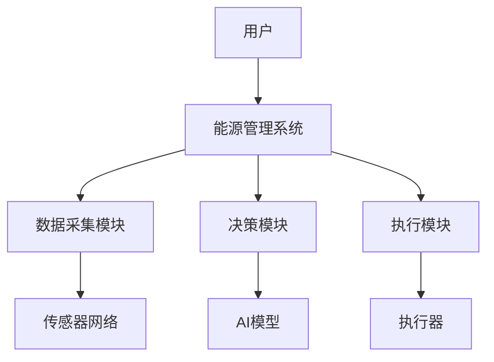
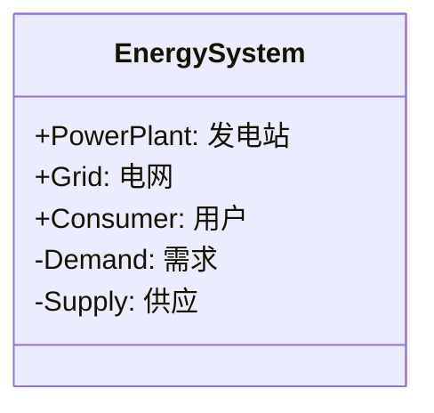
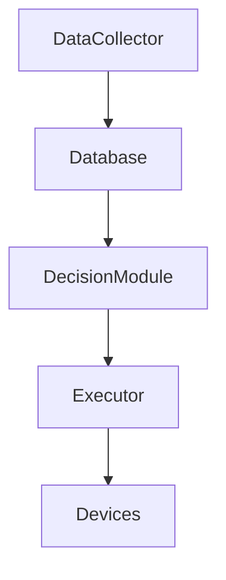

                 


# 能源行业AI Agent解决方案

## 关键词：
能源行业、AI Agent、强化学习、系统架构、数字化转型

## 摘要：
随着能源行业的数字化转型，人工智能（AI）技术正在改变传统的能源管理方式。AI Agent（智能体）作为一种能够感知环境、自主决策并执行任务的智能系统，在能源行业的应用日益广泛。本文将深入探讨AI Agent在能源行业的解决方案，涵盖核心概念、算法原理、系统架构设计及实际应用案例，为读者提供全面的技术指导。

---

## 第1章：能源行业AI Agent概述

### 1.1 AI Agent的基本概念
AI Agent是一种智能实体，能够感知环境、自主决策并执行任务以实现目标。它具备以下核心特征：
- **自主性**：无需外部干预，自主完成任务。
- **反应性**：实时感知环境并做出响应。
- **目标导向**：基于目标优化决策。

### 1.2 能源行业数字化转型背景
能源行业正面临高效管理、可持续发展和智能化升级的挑战。AI Agent的应用能够优化能源分配、降低能耗并提高系统效率。

### 1.3 AI Agent在能源行业的应用
AI Agent在能源管理、预测分析和优化控制等方面发挥重要作用。

---

## 第2章：AI Agent的核心概念与联系

### 2.1 AI Agent的核心概念
AI Agent的工作流程包括**感知、决策与执行**三个环节：
- **感知层**：通过传感器和数据采集系统获取环境信息。
- **决策层**：基于感知数据，利用算法制定最优策略。
- **执行层**：根据决策结果，执行具体操作并反馈结果。

### 2.2 实体关系图


---

## 第3章：AI Agent的算法原理

### 3.1 基于强化学习的AI Agent
强化学习是一种通过试错优化决策的算法。常用的算法包括Q-learning。

#### 3.1.1 Q-learning算法
Q-learning的核心公式为：
$$ Q(s, a) = Q(s, a) + \alpha \left[r + \gamma \max_{a'} Q(s', a') - Q(s, a)\right] $$

#### 3.1.2 多智能体协作
多智能体协作通过通信与协调优化整体性能。

---

## 第4章：系统分析与架构设计

### 4.1 项目背景
能源行业的智能化需求推动了AI Agent的应用。

### 4.2 系统功能设计
系统功能包括数据采集、分析、决策和执行。

#### 4.2.1 领域模型


### 4.3 系统架构设计
采用分层架构，包括数据采集层、业务逻辑层和应用层。

#### 4.3.1 系统架构


---

## 第5章：项目实战

### 5.1 环境安装
安装必要的库，如TensorFlow和Keras。

### 5.2 核心代码实现
实现AI Agent的训练和应用。

#### 5.2.1 训练代码
```python
import numpy as np
from tensorflow.keras import models, layers

model = models.Sequential()
model.add(layers.Dense(64, activation='relu', input_dim=64))
model.add(layers.Dense(32, activation='relu'))
model.add(layers.Dense(1, activation='sigmoid'))
model.compile(optimizer='adam', loss='binary_crossentropy', metrics=['accuracy'])
```

---

## 第6章：总结与展望

### 6.1 总结
AI Agent在能源行业的应用前景广阔，能够提升效率和降低成本。

### 6.2 展望
未来，AI Agent将在能源互联网和智能电网中发挥更大作用。

---

## 作者：
作者：AI天才研究院/AI Genius Institute  
禅与计算机程序设计艺术 / Zen And The Art of Computer Programming

