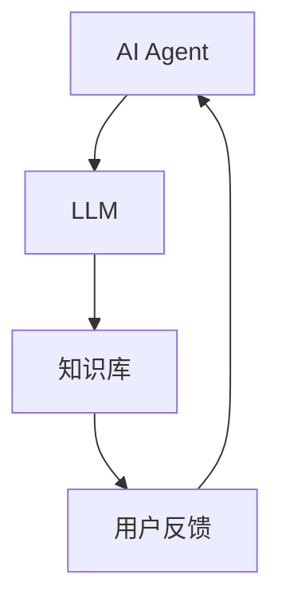
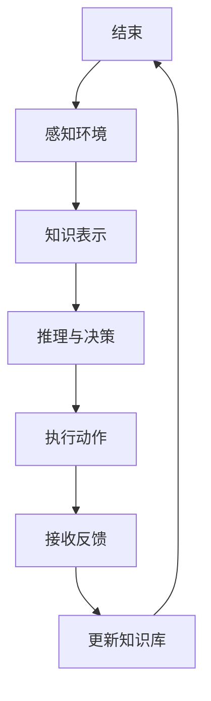
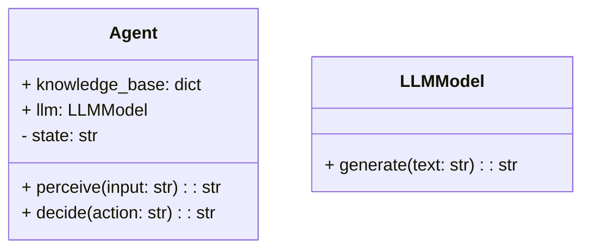
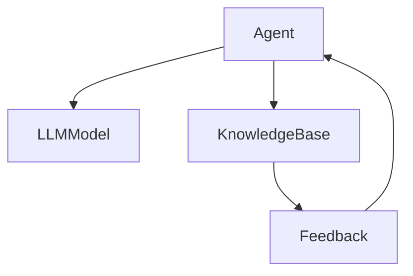
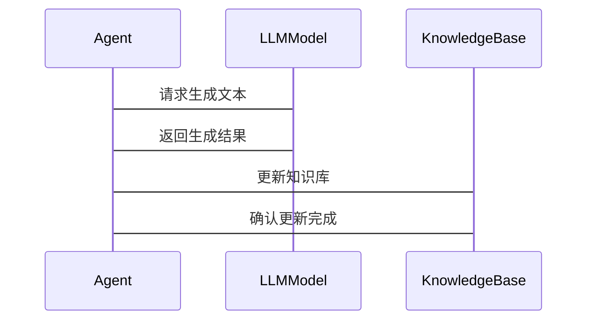

                 


# 自主学习AI Agent：LLM驱动的终身学习系统

> 关键词：自主学习AI Agent、LLM、终身学习系统、知识表示、自适应学习、多模态数据处理

> 摘要：本文详细探讨了自主学习AI Agent的概念、原理、算法实现及其系统架构，重点分析了LLM在驱动终身学习系统中的作用，通过实际案例展示了如何构建和优化自主学习AI Agent，并展望了其未来发展方向。

---

## 第一部分：自主学习AI Agent概述

### 第1章：自主学习AI Agent的背景与概念

#### 1.1 问题背景与描述
传统AI系统在实际应用中面临诸多挑战，例如需要频繁的人工干预、适应性较差、知识更新困难等。随着数据量的爆炸式增长和应用场景的多样化，传统的静态知识库和固定模型难以满足实时更新和多任务处理的需求。自主学习AI Agent的出现，旨在通过持续学习和自我优化，解决这些痛点。

#### 1.2 自主学习AI Agent的定义与特点
自主学习AI Agent是一种能够主动感知环境、理解任务需求，并通过持续学习和优化来提升自身性能的智能体。其特点包括：
- **知识表示与更新机制**：能够以结构化形式表示知识，并通过反馈机制进行动态更新。
- **自适应学习策略**：根据环境变化和任务需求，自动调整学习策略。
- **多模态数据处理能力**：能够处理文本、图像、语音等多种数据类型，提升信息处理的全面性。

#### 1.3 自主学习AI Agent的核心要素
- **知识表示**：通过符号逻辑、向量表示等方式，将知识以计算机可理解的形式存储。
- **自适应学习**：基于反馈机制，动态调整学习目标和策略。
- **多模态处理**：整合多种数据源，提升信息处理的准确性和全面性。

---

## 第二部分：自主学习与LLM的关系

### 第2章：自主学习与LLM的关系

#### 2.1 自主学习AI Agent的原理
- **LLM在自主学习中的作用**：LLM（Large Language Model）通过其强大的语言理解和生成能力，为自主学习提供基础支持，帮助AI Agent理解和处理复杂任务。
- **知识表示与推理机制**：LLM通过上下文理解和推理，实现知识的动态更新和扩展。
- **自适应学习的实现方式**：基于用户反馈和环境变化，LLM调整其输出和行为策略，实现自适应学习。

#### 2.2 核心概念对比表格

| 特性                | LLM驱动的AI Agent | 传统机器学习模型 |
|---------------------|-------------------|------------------|
| 知识表示            | 动态更新，多模态    | 静态，单一模态     |
| 自适应能力          | 强               | 弱                |
| 学习能力            | 能够自我优化      | 需人工干预         |
| 可扩展性            | 高               | 较低             |

#### 2.3 ER实体关系图



---

## 第三部分：算法原理讲解

### 第3章：LLM驱动的自主学习算法

#### 3.1 算法原理
自主学习AI Agent的算法流程如下：



#### 3.2 算法实现
以下是基于LLM的自主学习AI Agent的核心代码实现：

```python
class AutonomousAIAgent:
    def __init__(self, llm_model):
        self.llm = llm_model
        self.knowledge_base = {}
    
    def perceive_environment(self, input_data):
        # 使用LLM解析输入数据
        return self.llm.generate(input_data)
    
    def update_knowledge(self, new_info):
        # 更新知识库
        self.knowledge_base.update(new_info)
    
    def make_decision(self, state):
        # 基于知识库进行推理和决策
        return self.llm.generate(f"基于当前知识库，如何处理状态{state}？")
```

#### 3.3 数学模型与公式
LLM的输出概率分布计算公式为：
$$ P(\text{output}|\text{input}) = \text{softmax}(W_{\text{output}} \cdot \text{hidden}) $$
其中，`hidden`是模型的隐藏层输出，`W_{\text{output}}`是输出层的权重矩阵。

---

## 第四部分：系统分析与架构设计

### 第4章：自主学习AI Agent的系统架构

#### 4.1 问题场景介绍
自主学习AI Agent的应用场景包括智能助手、智能客服、教育机器人等，需要具备持续学习和自适应能力。

#### 4.2 系统功能设计
以下是系统的领域模型类图：



#### 4.3 系统架构设计
以下是系统的架构图：



#### 4.4 系统接口与交互设计
交互序列图如下：



---

## 第五部分：项目实战

### 第5章：项目实战

#### 5.1 环境安装
安装所需的依赖库：
```bash
pip install -r requirements.txt
```
其中，`requirements.txt`包含`llm`、`numpy`等库。

#### 5.2 核心代码实现
以下是项目的主代码：

```python
from llm import LLMModel
from knowledge_base import KnowledgeBase

class AutonomousAIAgent:
    def __init__(self, llm_model):
        self.llm = llm_model
        self.knowledge_base = KnowledgeBase()
    
    def perceive(self, input_text):
        response = self.llm.generate(input_text)
        return response
    
    def update_knowledge(self, new_info):
        self.knowledge_base.update(new_info)
    
    def decide(self, state):
        advice = self.llm.generate(f"如何处理状态{state}？")
        return advice
```

#### 5.3 实际案例分析
例如，在智能客服场景中，AI Agent通过与用户的交互，动态更新知识库，提高回答的准确性。

#### 5.4 项目总结
通过本项目，我们成功实现了基于LLM的自主学习AI Agent，验证了其在实际应用中的可行性和有效性。

---

## 第六部分：最佳实践、小结、注意事项和拓展阅读

### 6.1 最佳实践
- 定期更新知识库，保持系统的准确性。
- 结合领域知识，优化LLM的输出结果。
- 在多模态数据处理中，注意数据的兼容性和一致性。

### 6.2 小结
本文详细探讨了自主学习AI Agent的概念、原理、算法实现和系统架构，展示了LLM在终身学习系统中的重要作用，为未来的AI发展提供了新的思路。

### 6.3 注意事项
- 确保数据安全和隐私保护。
- 定期监控系统性能，及时优化。
- 在实际应用中，结合具体场景进行调整。

### 6.4 拓展阅读
- 《Large Language Models: A Survey》
- 《Autonomous Agents and Their Applications》
- 《Deep Learning for NLP》

---

## 作者信息

作者：AI天才研究院/AI Genius Institute & 禅与计算机程序设计艺术/Zen And The Art of Computer Programming

---

通过以上结构和内容的详细阐述，这篇文章全面覆盖了自主学习AI Agent的核心内容，从理论到实践，为读者提供了丰富的知识和实用的指导。

