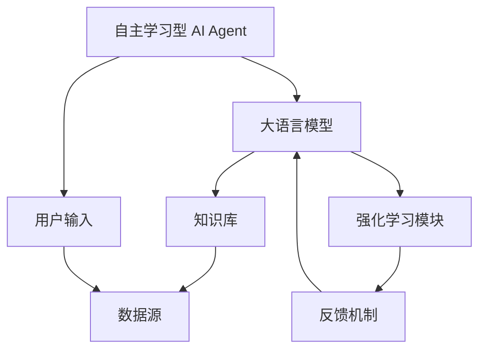

                 

# 自主学习型 AI Agent：利用 LLM 实现持续进化

> 关键词：自主学习型 AI Agent, 大语言模型, 持续进化, 算法原理, 系统架构

> 摘要：本文深入探讨了自主学习型 AI Agent 的核心概念、算法原理、系统架构、项目实战和高级主题。通过分析大语言模型（LLM）的持续进化机制，结合实际案例和详细的技术实现，展示了如何构建一个能够自主学习和进化的 AI Agent。

---

# 第1章: 自主学习型 AI Agent 的背景介绍

## 1.1 自主学习型 AI Agent 的定义与特点

### 1.1.1 自主学习型 AI Agent 的定义
自主学习型 AI Agent 是一种能够通过与环境交互和自我学习来不断提升自身能力的人工智能系统。与传统 AI 系统不同，它具备自主性、适应性和进化性，能够在动态变化的环境中持续优化自身性能。

### 1.1.2 自主学习型 AI Agent 的核心特点
- **自主性**：无需外部干预，能够独立完成任务。
- **适应性**：能够根据环境变化调整行为和策略。
- **进化性**：通过学习和经验积累，不断提升能力。

### 1.1.3 自主学习型 AI Agent 与传统 AI 的区别
| 特性 | 自主学习型 AI Agent | 传统 AI 系统 |
|------|---------------------|--------------|
| 行为驱动 | 内在动机，主动探索 | 外部指令驱动 |
| 学习能力 | 具备持续学习能力 | 依赖人工训练 |
| 环境适应 | 能够自适应复杂环境 | 需人工调整 |

## 1.2 问题背景与问题描述

### 1.2.1 当前 AI 系统的局限性
传统 AI 系统依赖于预定义的规则和训练数据，难以应对未知和动态变化的环境。例如，在自然语言处理领域，模型的性能受限于训练数据的质量和数量，无法实时更新和优化。

### 1.2.2 自主学习型 AI Agent 的提出背景
随着大语言模型（LLM）的快速发展，如何利用这些模型构建能够持续进化和适应的 AI Agent 成为研究热点。通过结合强化学习和持续学习技术，可以实现 AI Agent 的自主进化。

### 1.2.3 问题解决的路径与目标
- **路径**：利用 LLM 的强大生成能力和强化学习的反馈机制，构建一个能够自我改进的 AI Agent。
- **目标**：实现 AI Agent 的持续进化，使其在复杂环境中具备更强的适应能力和问题解决能力。

## 1.3 问题的边界与外延

### 1.3.1 自主学习型 AI Agent 的能力边界
- **感知能力**：受限于输入数据的质量和类型。
- **决策能力**：依赖于模型的训练和算法的设计。
- **学习能力**：受制于计算资源和学习策略的有效性。

### 1.3.2 自主学习型 AI Agent 的应用范围
- **智能助手**：如 Siri、Alexa 的高级版本。
- **机器人控制**：在制造业和物流领域的智能机器人。
- **游戏 AI**：在复杂游戏中的自主进化。

### 1.3.3 自主学习型 AI Agent 的技术局限性
- **计算资源需求高**：持续学习需要大量的计算资源。
- **伦理问题**：自主进化可能带来不可控的风险。

# 第2章: 自主学习型 AI Agent 的核心概念与联系

## 2.1 核心概念原理

### 2.1.1 大语言模型（LLM）的基本原理
大语言模型通过大量的文本数据进行预训练，具备强大的生成和理解能力。其核心是基于转换器架构，采用自注意力机制（Self-Attention）进行上下文理解。

#### 转换器架构
转换器由编码器和解码器组成，编码器将输入数据转化为向量表示，解码器根据这些向量生成输出。

#### 自注意力机制
自注意力机制通过计算输入序列中每个位置与其他位置的相关性，生成注意力权重矩阵。

### 2.1.2 自主学习的核心机制
自主学习型 AI Agent 通过与环境的交互获得反馈，利用强化学习算法优化自身行为。

### 2.1.3 持续进化算法的实现原理
持续进化算法通过不断迭代和优化模型参数，提升 AI Agent 的性能。

## 2.2 核心概念属性特征对比

### 2.2.1 不同类型 AI Agent 的特征对比
| 类型 | 基于规则的 AI Agent | 基于机器学习的 AI Agent | 自主学习型 AI Agent |
|------|---------------------|--------------------------|----------------------|
| 学习机制 | 预定义规则          | 依赖训练数据            | 具备自主学习能力    |
| 适应性 | 低                  | 中等                     | 高                   |
| 进化能力 | 无                  | 有限                    | 持续进化             |

### 2.2.2 自主学习型 AI Agent 的独特属性
- **内在动机**：具备探索未知环境的内在驱动力。
- **自我评估**：能够评估自身行为并进行改进。

### 2.2.3 自主学习型 AI Agent 的性能指标
- **任务完成率**：完成任务的准确性和效率。
- **学习速度**：模型参数更新的频率和速度。
- **适应性**：应对环境变化的能力。

## 2.3 实体关系图架构

---

## 总结
通过以上章节的详细分析，我们可以看到，自主学习型 AI Agent 的构建涉及多个关键领域，包括核心概念的理解、算法原理的实现、系统架构的设计以及项目实战的应用。接下来，我们将深入探讨算法原理和系统架构的具体实现细节，为读者提供更加全面的技术解读。

作者：AI天才研究院 & 禅与计算机程序设计艺术

