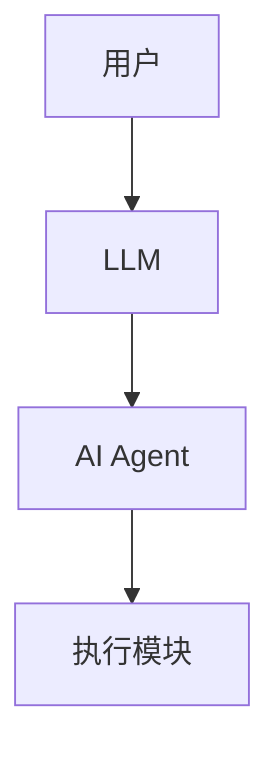
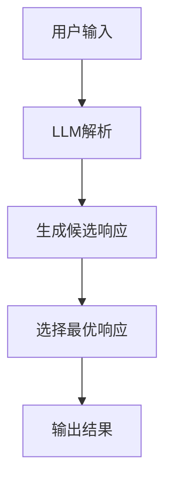
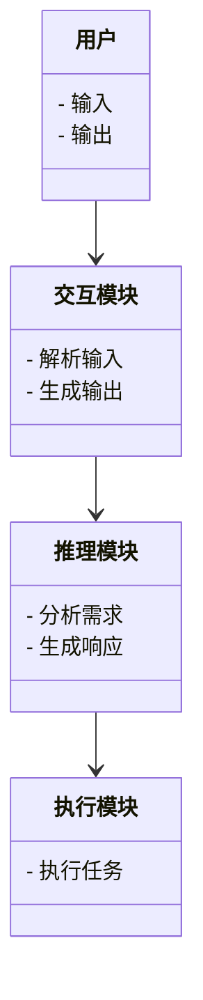
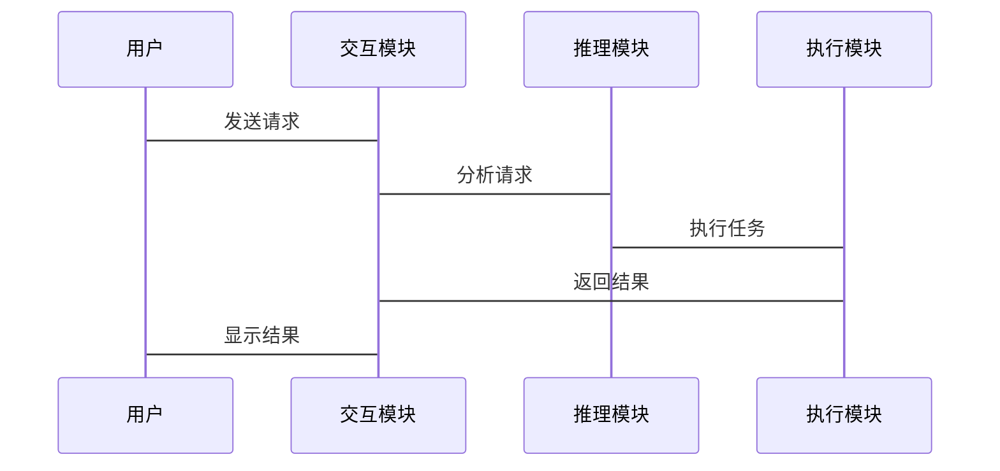

                 


# 自动化AI Agent开发平台：LLM辅助的智能系统构建

---

## 关键词：
自动化AI Agent，LLM，智能系统，开发平台，AI开发，系统架构

---

## 摘要：
本文将深入探讨自动化AI Agent开发平台的核心概念、算法原理和系统架构，重点分析大语言模型（LLM）在AI Agent开发中的作用。通过结合实际案例，本文将详细阐述如何利用LLM构建高效、智能的AI Agent系统，为开发者提供从理论到实践的全面指导。

---

# 第一部分：自动化AI Agent开发平台概述

## 第1章：自动化AI Agent开发平台的背景与意义

### 1.1 什么是自动化AI Agent
自动化AI Agent是一种能够自主执行任务、解决问题并适应动态环境的智能实体。它结合了自然语言处理、机器学习和自动化技术，能够与用户交互、分析数据并做出决策。

#### 1.1.1 自动化AI Agent的定义
- **自主性**：能够在没有人工干预的情况下执行任务。
- **智能性**：具备理解和推理能力，能够处理复杂问题。
- **适应性**：能够根据环境变化调整行为。

#### 1.1.2 自动化AI Agent的核心特征
| 特征 | 描述 |
|------|------|
| 感知能力 | 通过传感器或API获取环境信息 |
| 决策能力 | 基于获取的信息做出决策 |
| 执行能力 | 执行预设或自动生成的动作 |
| 学习能力 | 通过经验或数据优化行为 |

#### 1.1.3 自动化AI Agent的应用场景
- **智能助手**：如 Siri、Alexa。
- **自动化系统**：如工业机器人。
- **智能客服**：处理客户咨询和问题。

### 1.2 LLM在AI Agent开发中的作用
大语言模型（LLM）是自然语言处理领域的突破性技术，能够理解和生成人类语言，为AI Agent的开发提供了强大的支持。

#### 1.2.1 LLM的定义与特点
- **定义**：大型预训练语言模型，如GPT-3、GPT-4。
- **特点**：通用性强、可扩展性高、能够处理多种任务。

#### 1.2.2 LLM在AI Agent中的应用
- **自然语言理解**：理解用户输入。
- **生成能力**：生成自然语言回复。
- **多任务处理**：结合其他AI技术完成复杂任务。

#### 1.2.3 LLM与传统AI开发的区别
| 方面 | 传统AI | 基于LLM的AI Agent |
|------|--------|------------------|
| 开发复杂度 | 高 | 低 |
| 适应性 | 低 | 高 |
| 智能性 | 有限 | 强大 |

### 1.3 自动化AI Agent开发平台的必要性
随着AI技术的快速发展，开发高效、智能的AI Agent需要专业的平台支持。

#### 1.3.1 当前AI开发面临的挑战
- **技术门槛高**：需要多领域知识。
- **开发效率低**：传统开发流程耗时长。
- **维护成本高**：系统更新和维护复杂。

#### 1.3.2 自动化开发平台的优势
- **降低开发门槛**：平台提供工具和模板。
- **提高开发效率**：自动化处理流程。
- **降低维护成本**：平台提供更新和维护支持。

#### 1.3.3 平台对企业及开发者的价值
- **企业**：提升效率、优化流程。
- **开发者**：降低技术门槛、提高开发效率。

### 1.4 本章小结
本章介绍了自动化AI Agent的基本概念、LLM在其中的作用以及开发平台的重要性，为后续内容打下基础。

---

# 第二部分：自动化AI Agent的核心概念与原理

## 第2章：AI Agent的核心概念与联系

### 2.1 AI Agent的构成要素
AI Agent由感知层、决策层和执行层构成。

#### 2.1.1 感知层
- **功能**：获取环境信息。
- **实现方式**：传感器、API调用。
- **示例**：语音识别、图像识别。

#### 2.1.2 决策层
- **功能**：分析信息并做出决策。
- **实现方式**：基于LLM的自然语言处理。
- **示例**：智能助手理解用户需求并生成回复。

#### 2.1.3 执行层
- **功能**：执行决策结果。
- **实现方式**：调用外部服务、控制硬件。
- **示例**：发送邮件、调整设备参数。

### 2.2 LLM与AI Agent的关系
LLM作为AI Agent的核心模块，负责处理自然语言交互和任务推理。

#### 2.2.1 LLM作为AI Agent的核心模块
- **输入**：用户需求或指令。
- **输出**：处理结果或决策。

#### 2.2.2 LLM与AI Agent的交互机制


#### 2.2.3 LLM对AI Agent能力的提升
- **提升理解能力**：更好地理解用户需求。
- **增强生成能力**：生成更自然的回复。
- **扩展功能**：支持更多任务类型。

### 2.3 核心概念的ER实体关系图
```mermaid
er
actor: 用户
agent: AI Agent
platform: 开发平台
ability: 功能模块
interaction: 交互记录
```

### 2.4 本章小结
本章详细阐述了AI Agent的构成要素及其与LLM的关系，帮助读者理解AI Agent的核心概念。

---

# 第三部分：自动化AI Agent的算法原理

## 第3章：LLM辅助的AI Agent算法原理

### 3.1 LLM的训练过程
LLM的训练包括数据预处理、模型训练和优化三个阶段。

#### 3.1.1 数据预处理
- **步骤**：清洗数据、分词、标注。
- **目的**：提高训练效率和模型性能。

#### 3.1.2 模型训练
- **方法**：使用大规模数据训练Transformer模型。
- **目标**：最小化预测误差。

#### 3.1.3 模型优化
- **策略**：调整超参数、使用优化算法（如Adam）。
- **效果**：提高模型性能。

### 3.2 LLM的推理机制
推理是LLM生成输出的关键过程。

#### 3.2.1 解析用户输入
- **方法**：将输入转换为模型可处理的格式。
- **示例**：将自然语言查询转换为SQL语句。

#### 3.2.2 生成候选响应
- **方法**：基于模型生成多个候选响应。
- **技术**：使用beam search生成多样化的结果。

#### 3.2.3 响应优化
- **方法**：根据上下文选择最优响应。
- **技术**：结合领域知识进行筛选。

### 3.3 基于LLM的AI Agent算法流程图


### 3.4 算法数学模型
#### 3.4.1 损失函数
$$ L = -\sum_{i=1}^{n} y_i \log p(y_i) $$

#### 3.4.2 优化算法
$$ \theta_{t+1} = \theta_t - \eta \frac{\partial L}{\partial \theta} $$

### 3.5 本章小结
本章详细讲解了LLM的训练和推理过程，以及如何将其应用于AI Agent的开发。

---

# 第四部分：系统架构与设计

## 第4章：自动化AI Agent的系统架构设计

### 4.1 系统功能设计
AI Agent系统主要包括交互模块、推理模块和执行模块。

#### 4.1.1 交互模块
- **功能**：接收用户输入、输出系统响应。
- **实现方式**：基于LLM的自然语言处理。

#### 4.1.2 推理模块
- **功能**：分析用户需求、生成响应。
- **实现方式**：结合LLM和领域知识。

#### 4.1.3 执行模块
- **功能**：执行系统决策。
- **实现方式**：调用外部服务或控制硬件。

### 4.2 系统架构图


### 4.3 系统接口设计
- **输入接口**：接收用户输入的自然语言或命令。
- **输出接口**：输出系统响应或执行结果。

### 4.4 系统交互序列图


### 4.5 本章小结
本章详细设计了AI Agent系统的架构和接口，为后续的开发提供了指导。

---

# 第五部分：项目实战与案例分析

## 第5章：基于LLM的AI Agent开发实战

### 5.1 项目背景
本项目旨在开发一个智能客服系统，利用LLM辅助处理客户咨询。

### 5.2 开发环境
- **编程语言**：Python
- **框架库**：Hugging Face、Flask
- **模型**：GPT-3.5-turbo

### 5.3 核心代码实现
```python
from transformers import AutoTokenizer, AutoModelForCausalLM
import requests

tokenizer = AutoTokenizer.from_pretrained("gpt2")
model = AutoModelForCausalLM.from_pretrained("gpt2")

def generate_response(prompt):
    inputs = tokenizer(prompt, return_tensors="np")
    outputs = model.generate(
        inputs.input_ids,
        max_length=50,
        do_sample=True,
        temperature=0.7
    )
    response = tokenizer.decode(outputs[0], skip_special_tokens=True)
    return response

# 示例调用
print(generate_response("What is AI?"))
```

### 5.4 案例分析
- **输入**：用户询问“如何提高学习效率？”
- **输出**：生成详细的学习方法和建议。

### 5.5 代码解读
- **tokenizer**：将输入转换为模型可处理的格式。
- **model**：加载预训练的LLM模型。
- **generate_response**：生成用户输入的响应。

### 5.6 本章小结
本章通过一个实际案例展示了如何利用LLM开发AI Agent，为读者提供了从理论到实践的指导。

---

# 第六部分：总结与展望

## 第6章：总结与展望

### 6.1 本章总结
本文详细介绍了自动化AI Agent开发平台的核心概念、算法原理和系统架构，展示了如何利用LLM构建智能系统。

### 6.2 未来展望
- **技术进步**：更大规模的模型和更高效算法。
- **应用拓展**：更多领域和场景的应用。
- **人机协作**：更自然的交互方式。

### 6.3 注意事项
- **数据隐私**：确保用户数据的安全。
- **模型优化**：提高模型的准确性和效率。
- **用户体验**：优化交互流程，提升用户满意度。

### 6.4 拓展阅读
- **书籍**：《深度学习入门：基于Python和TensorFlow》
- **论文**：《Attention Is All You Need》
- **工具**：Hugging Face Transformers库

### 6.5 本章小结
本文总结了自动化AI Agent开发平台的核心内容，并展望了未来的发展方向。

---

## 作者：AI天才研究院/AI Genius Institute & 禅与计算机程序设计艺术 /Zen And The Art of Computer Programming

---

以上为文章的完整内容，涵盖了从背景到实战的各个方面，帮助读者全面理解自动化AI Agent开发平台的构建与应用。

