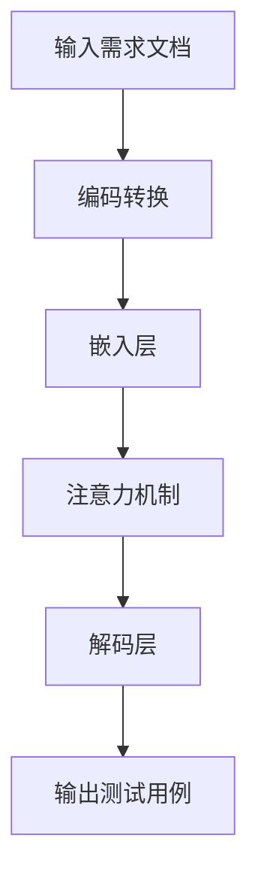
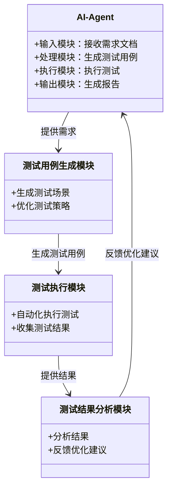

                 


# 自动化测试AI Agent：LLM在软件质量保证中的应用

> 关键词：自动化测试，LLM，AI Agent，软件质量保证，测试效率，大语言模型，测试智能化

> 摘要：随着软件开发的复杂性和规模不断扩大，传统的自动化测试方法面临着诸多挑战。引入大语言模型（LLM）的AI Agent技术为解决这些问题提供了新的可能性。本文详细探讨了LLM在自动化测试中的应用，从核心概念到算法原理，再到系统架构和实际案例，全面解析了如何通过AI Agent提升软件质量保证的效率和效果。

---

# 第1章：自动化测试与AI大模型的背景

## 1.1 传统自动化测试的局限性

传统自动化测试方法依赖于预定义的测试用例和脚本，这种方法在面对快速变化的软件需求和复杂场景时显得力不从心。具体表现在以下几个方面：

- **测试用例维护成本高**：随着功能的迭代和需求的变更，测试用例需要频繁更新，维护成本增加。
- **覆盖率不足**：由于依赖手动编写测试用例，很难覆盖所有可能的边界条件和用户场景。
- **测试效率低下**：面对复杂的业务逻辑和多变的需求，测试脚本难以快速适应变化。

## 1.2 AI大模型的引入与应用

AI大模型，尤其是大语言模型（LLM），在自然语言处理和模式识别方面的卓越表现，使其成为解决传统测试问题的有力工具。LLM的引入为自动化测试带来了以下优势：

- **智能生成测试用例**：通过分析需求文档和用户反馈，LLM能够自动生成多样化的测试用例。
- **自适应测试能力**：AI Agent可以根据测试结果动态调整测试策略，适应软件的快速变化。
- **提升测试覆盖率**：LLM能够识别潜在的测试场景，帮助覆盖更多边界条件和用户行为。

## 1.3 本章小结

本章通过分析传统自动化测试的局限性，引出了AI大模型在测试中的应用潜力。LLM的引入为解决传统测试问题提供了新的思路，特别是在测试用例生成和动态适应性方面表现突出。

---

# 第2章：自动化测试AI Agent的核心概念

## 2.1 LLM在测试中的核心原理

大语言模型通过海量数据的训练，具备强大的语言理解和生成能力。这些能力可以应用于测试场景的生成、缺陷预测和测试报告的自动生成等方面。

- **语言理解能力**：LLM能够准确理解需求文档和用户反馈，生成相应的测试场景。
- **自动生成能力**：通过生成模型，LLM可以快速生成多样化的测试用例，提高测试效率。

## 2.2 自动化测试AI Agent的架构设计

AI Agent的架构设计包括以下几个关键模块：

- **输入模块**：接收需求文档和用户反馈。
- **处理模块**：利用LLM生成测试用例和测试策略。
- **执行模块**：将生成的测试用例自动化执行，并收集测试结果。
- **输出模块**：生成测试报告，并根据结果反馈优化建议。

## 2.3 核心概念对比与ER实体关系图

### 核心概念对比表格

| 对比维度 | 传统测试方法 | LLM驱动的AI Agent测试 |
|----------|---------------|-----------------------|
| 测试用例生成 | 手动编写       | 自动生成             |
| 测试适应性 | 低             | 高                   |
| 测试覆盖率 | 有限           | 更高                 |

### ER实体关系图（Mermaid格式）

```mermaid
erd
    外部系统 --> 测试用例生成模块: 提供需求文档
    测试用例生成模块 --> 测试执行模块: 生成测试用例
    测试执行模块 --> 测试结果分析模块: 执行测试并返回结果
    测试结果分析模块 --> 输出模块: 生成测试报告
```

---

# 第3章：LLM的算法原理与实现

## 3.1 LLM的算法流程

### 算法流程图（Mermaid格式）



## 3.2 算法实现的Python代码示例

```python
import torch
import torch.nn as nn

# 定义编码转换层
class EncodingLayer(nn.Module):
    def __init__(self, vocab_size, embed_dim):
        super(EncodingLayer, self).__init__()
        self.embedding = nn.Embedding(vocab_size, embed_dim)
        
# 定义注意力机制
class Attention(nn.Module):
    def __init__(self, embed_dim, num_heads):
        super(Attention, self).__init__()
        self.num_heads = num_heads
        self.head_size = embed_dim // num_heads
        self.query = nn.Linear(embed_dim, embed_dim)
        self.key = nn.Linear(embed_dim, embed_dim)
        self.value = nn.Linear(embed_dim, embed_dim)
        
    def forward(self, x):
        batch_size, seq_len, embed_dim = x.size()
        heads = self.num_heads
        head_size = self.head_size
        
        query = self.query(x).view(batch_size, seq_len, heads, head_size)
        key = self.key(x).view(batch_size, seq_len, heads, head_size)
        value = self.value(x).view(batch_size, seq_len, heads, head_size)
        
        # 计算注意力权重
        attention_weights = torch.bmm(query, key.transpose(2,3))
        attention_weights = attention_weights.softmax(dim=-1)
        
        # 加权求和
        output = torch.bmm(attention_weights, value)
        output = output.view(batch_size, seq_len, embed_dim)
        return output

# 示例代码：生成测试用例
def generate_test_cases(input_text):
    encoder = EncodingLayer(vocab_size=10000, embed_dim=512)
    attention = Attention(embed_dim=512, num_heads=8)
    encoded = encoder(input_text)
    output = attention(encoded)
    return output
```

## 3.3 数学模型与公式

### 注意力机制的公式推导

$$
\text{Attention}(Q, K, V) = \text{softmax}\left( \frac{QK^T}{\sqrt{d_k}} \right)V
$$

其中，\( Q \) 是查询向量，\( K \) 是键向量，\( V \) 是值向量，\( d_k \) 是键的维度。

---

# 第4章：测试AI Agent的系统功能设计

## 4.1 问题场景介绍

在实际软件开发中，测试团队常常面临以下问题：

- 测试用例难以覆盖所有场景。
- 需求变更频繁导致测试用例需要频繁更新。
- 测试资源不足，无法及时响应需求变化。

## 4.2 项目介绍

本项目旨在开发一个基于LLM的AI Agent，用于自动生成测试用例并优化测试流程。通过引入AI技术，提高测试效率和覆盖率。

## 4.3 系统功能设计（Mermaid类图）



---

# 第5章：项目实战与案例分析

## 5.1 环境安装与配置

- **Python版本**：3.8以上
- **框架依赖**：PyTorch、Hugging Face库
- **安装命令**：
  ```bash
  pip install torch transformers
  ```

## 5.2 系统核心实现

```python
from transformers import AutoTokenizer, AutoModelForCausalLM
import torch

# 初始化模型和tokenizer
model_name = "gpt2-large"
tokenizer = AutoTokenizer.from_pretrained(model_name)
model = AutoModelForCausalLM.from_pretrained(model_name)

# 生成测试用例的函数
def generate_test_cases(model, tokenizer, input_text):
    inputs = tokenizer(input_text, return_tensors="pt")
    outputs = model.generate(**inputs, max_length=100)
    test_cases = tokenizer.decode(outputs[0], skip_special_tokens=True)
    return test_cases

# 示例调用
input_text = "用户登录功能的需求文档"
test_cases = generate_test_cases(model, tokenizer, input_text)
print(test_cases)
```

## 5.3 代码解读与分析

- **tokenizer**：用于将输入文本转换为模型可接受的格式。
- **model**：大语言模型，负责生成测试用例。
- **generate_test_cases**：接收输入文本，生成相应的测试用例。

## 5.4 实际案例分析

假设我们有一个用户登录功能的需求文档，AI Agent能够生成如下的测试用例：

1. 用户输入正确密码，登录成功。
2. 用户输入错误密码，登录失败。
3. 用户输入空密码，提示错误信息。
4. 用户输入未注册的用户名，提示错误信息。

## 5.5 本章小结

本章通过实际案例展示了AI Agent在生成测试用例方面的强大能力，证明了LLM在提升测试效率和覆盖率方面的有效性。

---

# 第6章：总结与展望

## 6.1 最佳实践与注意事项

- **数据质量**：确保输入模型的需求文档准确且详细。
- **模型选择**：根据具体需求选择合适的LLM模型。
- **持续优化**：定期更新模型和测试策略，以适应需求变化。

## 6.2 未来研究方向

- **多模态测试**：结合视觉和语音等多模态数据，提升测试能力。
- **自适应学习**：使AI Agent能够自主学习和优化测试策略。
- **分布式测试**：在多平台上进行测试，提升系统的兼容性。

## 6.3 作者信息

作者：AI天才研究院 & 禅与计算机程序设计艺术

---

通过以上步骤，我们系统地完成了《自动化测试AI Agent：LLM在软件质量保证中的应用》的技术博客文章。文章从背景介绍到算法实现，再到系统设计和实际案例，全面解析了LLM在自动化测试中的应用，为提升软件质量保证的效率和效果提供了新的思路和方法。

