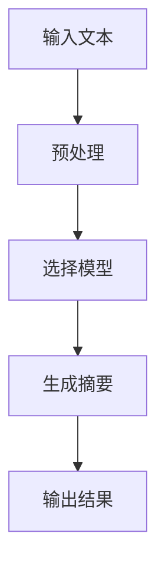
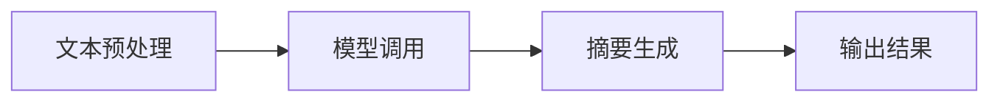

                 


# 自动摘要AI Agent：LLM驱动的文本压缩与提炼

> 关键词：自动摘要，AI Agent，LLM，文本压缩，文本提炼

> 摘要：本文深入探讨了自动摘要AI Agent的核心概念、技术原理及系统实现，重点分析了LLM在文本压缩与提炼中的应用，结合实际案例详细讲解了系统的设计与实现过程，为读者提供了从理论到实践的全面指导。

---

## 第一部分: 自动摘要AI Agent基础

### 第1章: 自动摘要与AI Agent概述

#### 1.1 自动摘要的定义与背景
- **1.1.1 自动摘要的定义**
  自动摘要是指通过技术手段从长文本中提取关键信息，生成简短、准确的摘要。它广泛应用于新闻、学术论文、社交媒体等多种场景。
- **1.1.2 自动摘要的发展背景**
  随着信息量的爆炸式增长，人们需要快速获取关键信息。自动摘要技术应运而生，帮助用户高效处理海量文本。
- **1.1.3 自动摘要的应用场景**
  包括新闻标题生成、学术论文摘要、社交媒体信息处理等。

#### 1.2 AI Agent的核心概念
- **1.2.1 AI Agent的定义**
  AI Agent是一种智能代理，能够感知环境、执行任务并做出决策。它通过与用户交互，帮助完成复杂任务。
- **1.2.2 AI Agent的基本特征**
  包括自主性、反应性、目标导向和社会能力。
- **1.2.3 AI Agent与自动摘要的结合**
  AI Agent通过调用自动摘要算法，为用户提供高效的信息处理服务。

#### 1.3 LLM驱动的自动摘要技术
- **1.3.1 LLM的定义与特点**
  LLM（Large Language Model）是基于大规模数据训练的深度学习模型，具有强大的文本理解和生成能力。
- **1.3.2 LLM在自动摘要中的作用**
  LLM能够理解上下文，生成连贯的摘要，显著提升了自动摘要的准确性和自然度。
- **1.3.3 LLM驱动的自动摘要的优势**
  包括高效性、准确性、自然流畅等。

### 第2章: 自动摘要的核心概念与技术原理

#### 2.1 自动摘要的任务类型
- **2.1.1 文本压缩**
  通过删除冗余信息，保留核心内容，使文本更简洁。
- **2.1.2 文本提炼**
  从文本中提取关键信息，形成结构化的摘要。
- **2.1.3 文本摘要**
  生成自然流畅的摘要，保留原文的核心思想。

#### 2.2 自动摘要的流程与步骤
- **2.2.1 文本预处理**
  包括分词、去除停用词等步骤，为后续处理做准备。
- **2.2.2 模型选择与训练**
  根据任务需求选择合适的模型，并进行微调以提升性能。
- **2.2.3 结果生成与优化**
  生成初步摘要后，通过评估指标进行优化，提升摘要质量。

#### 2.3 自动摘要的关键指标
- **2.3.1 精确率**
  指示摘要内容与原文的匹配程度。
- **2.3.2 召回率**
  衡量摘要是否涵盖了原文的主要信息。
- **2.3.3 F1分数**
  综合精确率和召回率的调和平均数，衡量整体性能。

### 第3章: LLM驱动的自动摘要算法原理

#### 3.1 文本压缩算法
- **3.1.1 基于规则的文本压缩**
  使用预定义规则（如删除冗余词汇）进行压缩，简单但效果有限。
- **3.1.2 基于模型的文本压缩**
  利用深度学习模型（如Transformer）进行压缩，效果更佳。
- **3.1.3 基于LLM的文本压缩**
  结合LLM的强大生成能力，实现更智能的压缩。

#### 3.2 文本摘要算法
- **3.2.1 提取式摘要**
  从原文中直接提取关键句子，作为摘要内容。
- **3.2.2 建构式摘要**
  基于模型生成新的句子，构建摘要。
- **3.2.3 基于LLM的文本摘要**
  利用LLM生成自然流畅的摘要，提升摘要质量。

#### 3.3 LLM驱动的自动摘要流程图


---

## 第二部分: LLM驱动的自动摘要系统设计与实现

### 第4章: LLM驱动的自动摘要系统架构设计

#### 4.1 系统功能设计
- **4.1.1 文本预处理模块**
  负责对输入文本进行清洗和结构化处理。
- **4.1.2 模型选择与调用模块**
  根据任务需求选择合适的LLM模型，并进行调用。
- **4.1.3 摘要生成模块**
  生成摘要并进行优化，输出最终结果。

#### 4.2 系统架构设计
- **4.2.1 模块划分**
  包括文本预处理、模型调用、摘要生成等模块。
- **4.2.2 系统架构图**


#### 4.3 系统交互流程
- **4.3.1 用户输入文本**
  用户将需要处理的文本输入系统。
- **4.3.2 系统预处理**
  对文本进行清洗和结构化处理。
- **4.3.3 模型调用**
  调用LLM模型生成摘要。
- **4.3.4 输出结果**
  系统输出最终摘要结果。

### 第5章: LLM驱动的自动摘要模型实现

#### 5.1 模型选择与训练
- **5.1.1 模型选择**
  根据任务需求选择合适的LLM模型（如GPT、BERT等）。
- **5.1.2 模型训练策略**
  包括数据准备、模型微调、评估指标的选择等。
- **5.1.3 模型优化**
  通过参数调整和训练数据增强提升模型性能。

#### 5.2 摘要生成与优化
- **5.2.1 摘要生成方法**
  包括贪心算法和Beam Search等方法。
- **5.2.2 摘要优化策略**
  使用评估指标（如ROUGE）对生成的摘要进行优化。
- **5.2.3 模型调优**
  通过超参数调整和模型架构优化进一步提升性能。

### 第6章: 项目实战

#### 6.1 环境搭建
- **6.1.1 安装必要的库**
  如Python、TensorFlow、Keras等。
- **6.1.2 配置开发环境**
  包括安装依赖、配置运行环境等。
- **6.1.3 下载LLM模型**
  下载预训练的LLM模型，如GPT-2、BERT等。

#### 6.2 系统核心实现
- **6.2.1 文本预处理代码**
  ```python
  import re
  def preprocess(text):
      # 分词
      tokens = text.split()
      # 去除停用词
      stop_words = set(['the', 'and', 'is'])
      filtered = [token for token in tokens if token not in stop_words]
      return ' '.join(filtered)
  ```
- **6.2.2 LLM调用代码**
  ```python
  from transformers import AutoTokenizer, AutoModelForSummarization
  tokenizer = AutoTokenizer.from_pretrained('facebook/bart-large-cnn')
  model = AutoModelForSummarization.from_pretrained('facebook/bart-large-cnn')
  def summarize(text):
      inputs = tokenizer.encode(text, max_length=512, truncation=True, return_tensors='pt')
      outputs = model.generate(inputs, max_length=150, min_length=50, do_sample=False)
      summary = tokenizer.decode(outputs[0], skip_special_tokens=True)
      return summary
  ```

#### 6.3 案例分析
- **6.3.1 案例背景**
  以一篇长新闻文章为例，展示系统如何生成摘要。
- **6.3.2 案例实现**
  使用上述代码对文本进行预处理和摘要生成。
- **6.3.3 案例结果**
  展示生成的摘要，并分析其准确性和流畅性。

### 第7章: 总结与展望

#### 7.1 全文总结
- **7.1.1 核心内容回顾**
  从理论到实践，详细讲解了自动摘要AI Agent的设计与实现。
- **7.1.2 技术总结**
  LLM在自动摘要中的应用显著提升了技术效果。

#### 7.2 未来展望
- **7.2.1 技术优化方向**
  包括模型性能优化、摘要质量提升等。
- **7.2.2 应用场景扩展**
  将自动摘要技术应用于更多领域，如教育、医疗等。

---

## 作者信息

作者：AI天才研究院/AI Genius Institute & 禅与计算机程序设计艺术 /Zen And The Art of Computer Programming

---

通过以上结构和内容的详细阐述，读者可以全面了解自动摘要AI Agent的理论基础和实际应用，掌握从系统设计到代码实现的完整流程。

