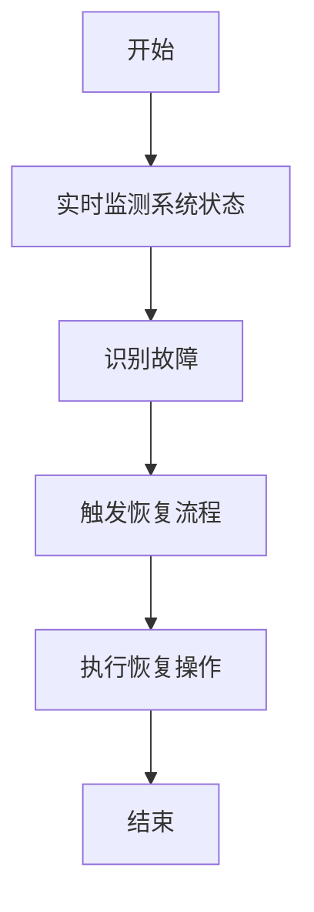
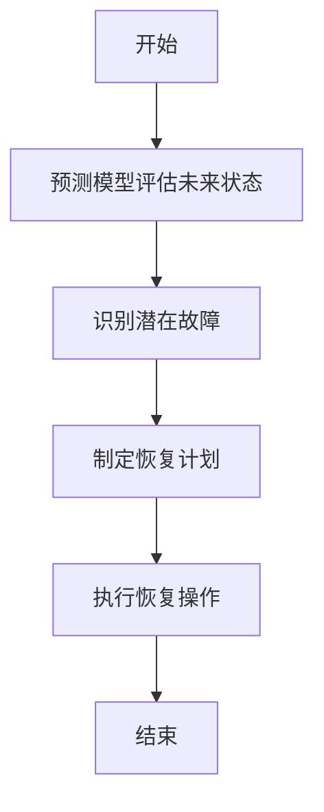
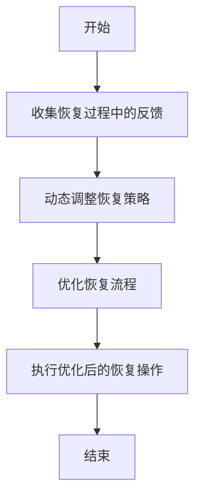
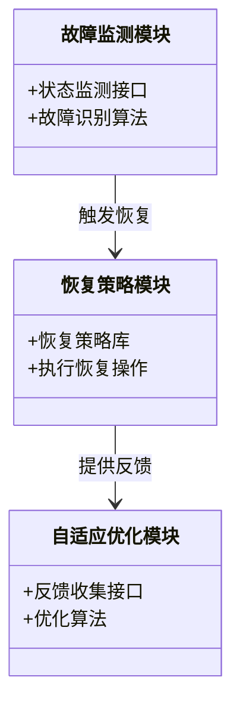
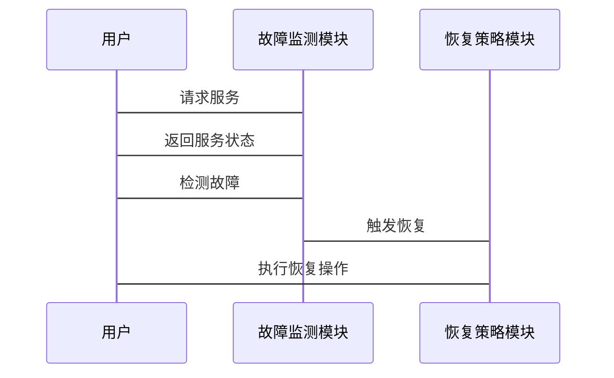
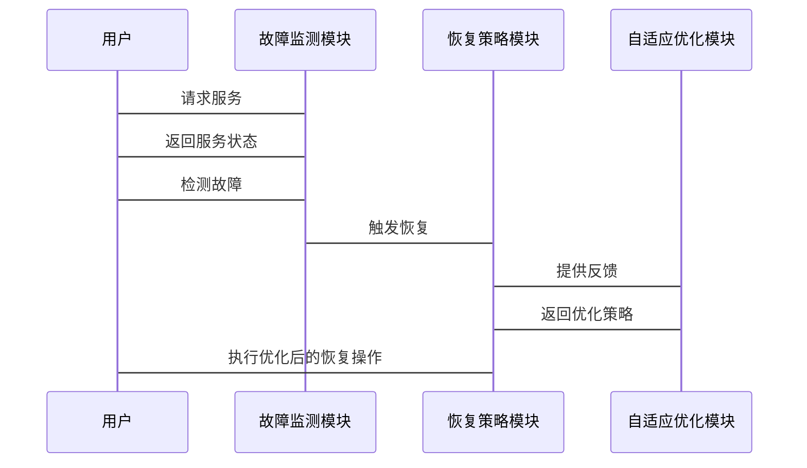

                 


```markdown
# 自动故障恢复：提高AI Agent的可靠性

> 关键词：自动故障恢复, AI Agent, 可靠性, 算法原理, 数学模型, 系统架构, 项目实战

> 摘要：本文系统地探讨了自动故障恢复在提高AI Agent可靠性中的关键作用。通过分析故障恢复的核心概念、算法原理、数学模型、系统架构及项目实战，全面阐述了如何通过自动故障恢复技术来提升AI Agent的可靠性。本文适合AI开发人员、系统架构师及对可靠性工程感兴趣的读者阅读。

---

# 第1章: 自动故障恢复的背景与挑战

## 1.1 问题背景

### 1.1.1 AI Agent的可靠性问题
- AI Agent在复杂环境中的可靠性问题
- 故障恢复在AI Agent中的重要性
- 自动故障恢复的核心目标

### 1.1.2 故障恢复的重要性
- AI Agent的故障类型及其影响
- 故障恢复的必要性
- 自动故障恢复的优势

### 1.1.3 核心目标
- 提高AI Agent的可用性
- 减少故障对系统的影响
- 实现自动化的故障恢复机制

## 1.2 问题描述

### 1.2.1 AI Agent的故障类型
- 软件故障
- 硬件故障
- 网络故障

### 1.2.2 故障恢复的必要性
- 保障系统连续性
- 提高用户体验
- 减少维护成本

### 1.2.3 自动故障恢复的边界与外延
- 自动故障恢复的边界
- 外延与相关技术的联系

## 1.3 核心概念与联系

### 1.3.1 自动故障恢复的原理
- 故障监测机制
- 恢复策略
- 自适应优化

### 1.3.2 核心概念对比
- 不同故障恢复机制的对比
- 各种恢复策略的优缺点

### 1.3.3 ER实体关系图
- 实体关系图的构建
- 实体关系图的解释

---

# 第2章: 自动故障恢复的核心概念与联系

## 2.1 核心概念原理

### 2.1.1 故障监测机制
- 基于状态监测的恢复机制
- 基于预测的恢复策略
- 基于反馈的自适应优化

### 2.1.2 恢复策略
- 立即恢复
- 分阶段恢复
- 自适应恢复

### 2.1.3 自适应优化
- 动态调整恢复策略
- 基于反馈的优化
- 自学习机制

## 2.2 核心概念对比

### 2.2.1 不同故障恢复机制的对比
| 机制类型       | 描述                     | 优点                     | 缺点                     |
|----------------|--------------------------|--------------------------|--------------------------|
| 基于状态监测    | 基于实时状态进行恢复     | 实时性强                 | 对监测系统的依赖性高     |
| 基于预测        | 基于预测模型进行恢复     | 提前预防                 | 预测模型的准确性影响效果 |
| 基于反馈        | 基于反馈信息进行恢复     | 可自适应                   | 反馈延迟可能导致恢复不及时 |

### 2.2.2 各种恢复策略的优缺点
| 恢复策略       | 优点                     | 缺点                     |
|----------------|--------------------------|--------------------------|
| 立即恢复        | 快速恢复                 | 可能影响系统稳定性       |
| 分阶段恢复      | 稳定性高                 | 恢复时间较长             |
| 自适应恢复      | 灵活性高                 | 实现复杂性较高           |

## 2.3 ER实体关系图

```mermaid
erDiagram
    actor 用户 {
        string 用户ID
        string 用户名
        string 密码
    }
    agent AI-Agent {
        string 唯一标识符
        string 状态
        string 故障类型
    }
    recovery Mechanism {
        string 恢复策略
        string 恢复时间
        string 恢复结果
    }
    用户 --> AI-Agent : 控制
    AI-Agent --> recovery : 触发
    recovery --> AI-Agent : 应用
```

---

# 第3章: 自动故障恢复的算法原理

## 3.1 算法原理讲解

### 3.1.1 基于状态监测的恢复机制
- 实时监测系统状态
- 识别故障并触发恢复流程
- 执行恢复操作

### 3.1.2 基于预测的恢复策略
- 使用预测模型评估未来状态
- 根据预测结果制定恢复计划
- 执行恢复操作

### 3.1.3 基于反馈的自适应优化
- 收集恢复过程中的反馈
- 动态调整恢复策略
- 提高恢复效率

## 3.2 算法流程图

### 3.2.1 基于状态监测的恢复机制流程图



### 3.2.2 基于预测的恢复策略流程图



### 3.2.3 基于反馈的自适应优化流程图



## 3.3 数学模型与公式

### 3.3.1 故障概率模型

$$ P(failure) = \sum_{i=1}^{n} P(failure_i) $$

### 3.3.2 恢复时间模型

$$ T_{restore} = \sum_{i=1}^{m} T_i $$

### 3.3.3 自适应优化模型

$$ \theta_{new} = \theta_{old} + \alpha \cdot (target - \theta_{old}) $$

---

# 第4章: 系统分析与架构设计方案

## 4.1 问题场景介绍

### 4.1.1 AI Agent的故障场景
- 软件故障场景
- 硬件故障场景
- 网络故障场景

### 4.1.2 自动故障恢复的应用场景
- 单点故障恢复
- 分布式系统恢复
- 高可用性系统恢复

## 4.2 系统功能设计

### 4.2.1 领域模型类图



### 4.2.2 系统架构设计图


### 4.2.3 系统接口设计
- 故障监测模块接口
- 恢复策略模块接口
- 自适应优化模块接口

## 4.3 系统交互序列图

### 4.3.1 故障检测与恢复交互流程



### 4.3.2 自适应优化交互流程



---

# 第5章: 项目实战

## 5.1 环境安装

### 5.1.1 开发环境搭建
- 安装Python
- 安装必要的库（如numpy, pandas, scikit-learn）
- 安装mermaid工具

### 5.1.2 依赖库安装
- 使用pip安装所需的依赖库
- 配置开发环境

## 5.2 核心实现

### 5.2.1 故障监测模块
- 实现状态监测接口
- 实现故障识别算法
- 提供故障检测服务

### 5.2.2 恢复策略模块
- 实现恢复策略库
- 实现恢复操作执行
- 提供恢复策略服务

### 5.2.3 自适应优化模块
- 实现反馈收集接口
- 实现优化算法
- 提供自适应优化服务

## 5.3 案例分析

### 5.3.1 案例背景
- 一个简单的AI Agent系统
- 系统中可能出现的故障类型
- 系统恢复的目标

### 5.3.2 实际案例分析
- 实现故障监测模块
- 实现恢复策略模块
- 实现自适应优化模块
- 集成测试与优化

## 5.4 项目小结
- 项目实现的关键点
- 遇到的问题及解决方案
- 经验总结与未来改进方向

---

# 第6章: 总结与展望

## 6.1 总结
- 自动故障恢复的核心概念
- 算法原理
- 系统架构设计
- 项目实战经验

## 6.2 展望
- 自动故障恢复的未来发展方向
- 新技术对自动故障恢复的影响
- 如何进一步提高AI Agent的可靠性

---

# 作者

作者：AI天才研究院/AI Genius Institute & 禅与计算机程序设计艺术 /Zen And The Art of Computer Programming

---

# 附录

## 附录A: 参考文献

## 附录B: 工具与资源

## 附录C: 术语表

---

# 结束语

感谢您的阅读！希望本书能为您提供有价值的内容，帮助您更好地理解和应用自动故障恢复技术，提高AI Agent的可靠性。
```

