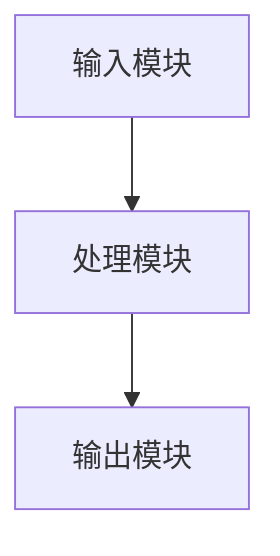

                 


# 自动文本摘要AI Agent：LLM驱动的关键信息提取

## 关键词：自动文本摘要、LLM、关键信息提取、AI Agent、自然语言处理

## 摘要：
本文详细探讨了基于大型语言模型（LLM）的自动文本摘要技术，从背景、核心概念到算法原理、系统架构，再到项目实战和总结，全面解析LLM驱动的关键信息提取技术及其在实际应用中的潜力与挑战。通过深入分析和具体案例，本文为读者提供了系统性的技术指导和实践参考。

---

# 第1章: 自动文本摘要的背景与问题背景

## 1.1 问题背景

### 1.1.1 自动文本摘要的定义与目标
自动文本摘要（Automatic Text Summarization）是自然语言处理（NLP）领域中的一个重要任务，旨在通过算法从长文本中提取关键信息，生成简洁、准确的摘要。其目标是保留原文的核心内容，同时去除冗余信息，使读者能够快速理解文本的主要内容。

**关键概念对比表：**

| 比较维度 | 传统文本摘要 | 基于LLM的自动摘要 |
|----------|--------------|-------------------|
| 方法     | 基于规则或统计模型 | 基于深度学习模型   |
| 性能     | 有限，难以处理复杂语义 | 更准确，语义理解能力强 |
| 应用场景 | 适用于简单文本 | 适用于复杂长文本   |

### 1.1.2 当前文本摘要技术的现状与挑战
当前，文本摘要技术主要分为两类：基于规则的传统方法和基于深度学习的方法。传统方法依赖于预定义的规则或统计模型，难以处理复杂语义和长文本。而基于深度学习的方法，尤其是利用大型语言模型（LLM），在准确性和灵活性方面有了显著提升。然而，LLM驱动的摘要技术仍面临计算资源消耗大、模型调优复杂等问题。

### 1.1.3 LLM驱动的自动文本摘要的优势与局限性
**优势：**
- **准确性**：LLM能够更好地理解上下文，生成更贴近人类语言习惯的摘要。
- **灵活性**：支持多种语言和复杂文本结构。
- **可扩展性**：适用于大规模数据处理。

**局限性：**
- **计算成本高**：LLM的训练和推理需要大量计算资源。
- **结果不可控**：生成的摘要可能偏离原文的核心内容。

---

## 1.2 技术现状与发展趋势

### 1.2.1 基于传统NLP的文本摘要技术
传统方法依赖于统计模型和规则，例如：
- **基于字典的摘要**：通过关键词提取生成摘要。
- **基于句子重要性排序的摘要**：通过计算句子的TF-IDF值或位置权重选择重要句子。

### 1.2.2 基于深度学习的文本摘要技术
深度学习方法，尤其是基于Transformer的模型（如BERT、GPT），在文本摘要中表现出色。这些模型通过自注意力机制捕捉文本中的语义关系，生成高质量的摘要。

### 1.2.3 LLM在文本摘要中的应用与发展
随着LLM的兴起，文本摘要技术进入了一个新的发展阶段。LLM不仅能够生成摘要，还能根据用户需求定制摘要内容，例如：
- **个性化摘要**：根据用户偏好生成不同风格的摘要。
- **多语言摘要**：支持多种语言的文本摘要。

---

## 1.3 问题描述与解决思路

### 1.3.1 文本摘要的关键问题与挑战
- **语义理解**：如何准确捕捉文本的核心信息。
- **生成控制**：如何确保生成的摘要符合用户需求。
- **计算效率**：如何降低摘要生成的计算成本。

### 1.3.2 LLM驱动的自动文本摘要的核心思路
- **模型选择**：选择适合任务的LLM模型。
- **输入处理**：将文本输入模型并生成摘要。
- **结果优化**：通过后处理技术提升摘要质量。

### 1.3.3 问题解决的边界与外延
- **边界**：专注于关键信息提取，不涉及文本生成的其他任务。
- **外延**：扩展至多语言、多任务的摘要生成。

---

# 第2章: LLM驱动的自动文本摘要的核心概念

## 2.1 自动文本摘要的关键概念

### 2.1.1 文本摘要的基本原理
文本摘要的基本原理是通过算法选择文本中的重要信息，生成一个简洁的摘要。LLM驱动的摘要技术通过模型生成的方式来实现这一目标。

### 2.1.2 LLM在文本摘要中的工作原理
LLM通过以下步骤生成摘要：
1. **输入处理**：将原始文本输入模型。
2. **编码**：模型将文本编码为向量表示。
3. **解码**：模型生成摘要文本。

### 2.1.3 自动文本摘要的核心特征与属性
- **简洁性**：摘要长度远小于原文。
- **准确性**：摘要应保留原文的核心信息。
- **可读性**：摘要应通顺易懂。

---

## 2.2 LLM驱动的文本摘要模型

### 2.2.1 基于LLM的文本摘要模型的结构
模型结构通常包括编码器和解码器，编码器将文本编码为向量，解码器根据向量生成摘要。

### 2.2.2 模型的输入
模型输入包括原始文本和一些可选参数，例如：
- **输入文本**：需要摘要的长文本。
- **参数设置**：控制生成摘要的长度和风格。

---

# 第3章: LLM驱动的自动文本摘要的算法原理

## 3.1 算法原理概述

### 3.1.1 模型训练目标
模型通过最小化交叉熵损失函数来优化摘要生成：

$$ L = -\sum_{i=1}^{n} \log p(y_i|x) $$

### 3.1.2 模型调优策略
- **超参数调整**：调整学习率和批次大小。
- **数据增强**：通过多样化数据输入提升模型泛化能力。

### 3.1.3 算法实现步骤
1. **数据准备**：收集和预处理文本数据。
2. **模型训练**：使用训练数据优化模型参数。
3. **摘要生成**：输入文本，生成摘要。

### 3.1.4 算法优化技巧
- **早停法**：防止过拟合。
- **学习率衰减**：提升训练效率。

---

## 3.2 案例分析与代码实现

### 3.2.1 案例背景
我们以新闻文章摘要为例，展示如何使用LLM生成摘要。

### 3.2.2 环境安装
安装必要的库：
```bash
pip install transformers
```

### 3.2.3 核心代码实现
```python
from transformers import AutoTokenizer, AutoModelForSeq2Seq

model_name = "facebook/bart-large-cnn"
tokenizer = AutoTokenizer.from_pretrained(model_name)
model = AutoModelForSeq2Seq.from_pretrained(model_name)

def generate_summary(text):
    inputs = tokenizer(text, max_length=512, truncation=True, return_tensors="pt")
    with torch.no_grad():
        outputs = model.generate(inputs.input_ids)
    summary = tokenizer.decode(outputs[0], skip_special_tokens=True)
    return summary

text = "..."  # 需要摘要的文本
print(generate_summary(text))
```

### 3.2.4 代码解读
- **模型加载**：加载预训练的摘要模型。
- **文本处理**：对输入文本进行分词和编码。
- **摘要生成**：使用模型生成摘要并解码。

---

## 3.3 算法优化与调优

### 3.3.1 超参数调整
- **学习率**：设置合适的学习率。
- **批次大小**：调整训练批次大小。

### 3.3.2 模型调优策略
- **数据增强**：通过多样化数据提升模型性能。
- **早停法**：防止过拟合。

---

# 第4章: 系统架构设计与实现

## 4.1 系统功能设计

### 4.1.1 系统功能模块
- **输入模块**：接收用户输入。
- **处理模块**：处理文本并生成摘要。
- **输出模块**：展示生成的摘要。

### 4.1.2 系统功能流程
1. 用户输入需要摘要的文本。
2. 系统对文本进行处理。
3. 系统生成摘要并输出。

---

## 4.2 系统架构设计

### 4.2.1 系统架构图


### 4.2.2 系统模块设计
- **输入模块**：接收输入文本。
- **处理模块**：调用LLM生成摘要。
- **输出模块**：展示摘要结果。

---

## 4.3 系统接口设计

### 4.3.1 接口定义
- **输入接口**：接收文本数据。
- **输出接口**：返回摘要结果。

### 4.3.2 接口实现
```python
class TextSummarizer:
    def __init__(self):
        self.tokenizer = AutoTokenizer.from_pretrained("facebook/bart-large-cnn")
        self.model = AutoModelForSeq2Seq.from_pretrained("facebook/bart-large-cnn")

    def summarize(self, text):
        inputs = self.tokenizer(text, max_length=512, truncation=True, return_tensors="pt")
        with torch.no_grad():
            outputs = self.model.generate(inputs.input_ids)
        summary = self.tokenizer.decode(outputs[0], skip_special_tokens=True)
        return summary
```

---

## 4.4 系统交互设计

### 4.4.1 系统交互流程
1. 用户输入文本。
2. 系统处理文本。
3. 系统输出摘要。

### 4.4.2 交互案例
```python
summarizer = TextSummarizer()
text = "..."
summary = summarizer.summarize(text)
print(summary)
```

---

# 第5章: 项目实战与总结

## 5.1 项目实战

### 5.1.1 环境安装
```bash
pip install transformers torch
```

### 5.1.2 代码实现
```python
# 如上所述的代码实现
```

### 5.1.3 功能解读
- **环境安装**：安装必要的库。
- **代码实现**：实现文本摘要功能。
- **功能解读**：展示如何使用代码生成摘要。

### 5.1.4 案例分析
- **案例选择**：新闻文章摘要。
- **案例分析**：展示生成的摘要结果。

---

## 5.2 总结与展望

### 5.2.1 最佳实践
- **模型选择**：选择适合任务的模型。
- **数据处理**：对数据进行充分的预处理。
- **调优策略**：合理调整模型参数。

### 5.2.2 小结
本文详细探讨了基于LLM的自动文本摘要技术，从背景到实现，全面解析了关键信息提取的核心原理和系统架构。

### 5.2.3 注意事项
- **计算资源**：确保有足够的计算资源。
- **模型选择**：选择适合任务的模型。
- **结果验证**：验证生成的摘要质量。

### 5.2.4 拓展阅读
- 探索更多LLM驱动的NLP任务。
- 研究更先进的文本摘要方法。

---

# 总结

本文系统地探讨了基于LLM的自动文本摘要技术，从背景到实现，全面解析了关键信息提取的核心原理和系统架构。通过具体案例，展示了如何利用LLM生成高质量的文本摘要，并提出了优化和调优的策略。未来，随着LLM技术的不断发展，自动文本摘要将更加智能化和多样化。

---

**作者：AI天才研究院/AI Genius Institute & 禅与计算机程序设计艺术 /Zen And The Art of Computer Programming**

