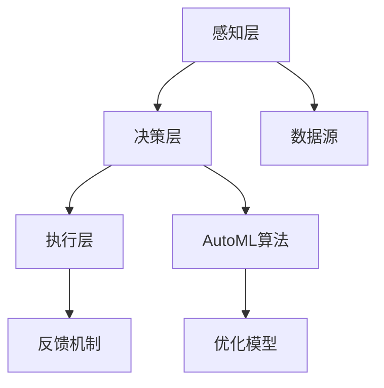

                 


# 自动机器学习（AutoML）在AI Agent开发中的应用

---

## 关键词
- 自动机器学习（AutoML）
- AI Agent
- 算法优化
- 系统架构设计
- 人工智能（AI）

---

## 摘要
本文详细探讨了自动机器学习（AutoML）在AI Agent开发中的应用，从AutoML的基本概念、算法原理到AI Agent的系统架构设计，再到实际项目实战，全面分析了AutoML如何提升AI Agent的开发效率与性能优化。文章通过数学公式、mermaid图表和Python代码示例，深入讲解了AutoML在AI Agent中的核心算法与实现细节，同时结合实际案例分析了AutoML在AI Agent开发中的优势与挑战。

---

# 第1章: 自动机器学习（AutoML）概述

## 1.1 自动机器学习的定义与背景

### 1.1.1 传统机器学习的局限性
传统机器学习需要人工选择算法、特征和超参数，开发周期长、效率低。例如，训练一个分类模型需要多次调整超参数（如学习率、正则化系数等），且需要手动选择合适的特征组合。

### 1.1.2 AutoML的定义与核心目标
AutoML（Automatic Machine Learning）是一种自动化机器学习技术，旨在通过自动化算法选择、特征工程和超参数优化，降低机器学习的使用门槛，提高开发效率。

### 1.1.3 AutoML的发展历程与现状
AutoML近年来快速发展，已广泛应用于工业界和学术界。例如，Google的AutoML-ZS、微软的AutoML工具等，均为AutoML技术的落地应用提供了成功案例。

---

## 1.2 AI Agent的基本概念

### 1.2.1 AI Agent的定义与分类
AI Agent是一种智能体，能够感知环境、自主决策并执行任务。常见的AI Agent包括基于规则的Agent、基于模型的Agent和基于学习的Agent。

### 1.2.2 AI Agent的核心功能与特点
- 感知环境并获取信息
- 分析信息并制定决策
- 执行决策并返回结果
- 自适应环境变化

### 1.2.3 AI Agent的应用场景与挑战
AI Agent广泛应用于自动驾驶、智能客服、智能推荐系统等领域。其主要挑战包括多目标优化、动态环境适应和计算效率问题。

---

## 1.3 AutoML与AI Agent的关系

### 1.3.1 AutoML在AI Agent开发中的作用
AutoML能够自动化优化AI Agent的核心算法，提升其决策效率和准确性。

### 1.3.2 AutoML如何提升AI Agent的开发效率
通过自动化算法选择和超参数优化，AutoML能够快速构建高性能的AI Agent模型，减少人工干预。

### 1.3.3 AutoML与AI Agent结合的未来趋势
AutoML将进一步推动AI Agent的智能化和自动化，尤其是在复杂动态环境中，AutoML能够帮助AI Agent快速适应环境变化。

---

## 1.4 本章小结
本章介绍了AutoML和AI Agent的基本概念，探讨了AutoML在AI Agent开发中的作用和优势，为后续章节的深入分析奠定了基础。

---

# 第2章: AutoML的核心算法与实现原理

## 2.1 AutoML的核心算法框架

### 2.1.1 自动化机器学习的流程分解
1. 数据预处理
2. 算法选择
3. 超参数优化
4. 模型训练与评估

### 2.1.2 算法选择与优化的数学模型
$$\text{目标函数} = \text{模型性能}$$
$$\theta = \{ \theta_1, \theta_2, ..., \theta_n \}$$

### 2.1.3 超参数优化的常用方法
- 随机搜索
- 网格搜索
- 贝叶斯优化

---

## 2.2 AutoML的搜索策略

### 2.2.1 随机搜索与网格搜索
随机搜索随机选择超参数组合进行训练，而网格搜索遍历所有可能的超参数组合。

### 2.2.2 贝叶斯优化与遗传算法
贝叶斯优化通过构建概率模型，指导搜索过程；遗传算法通过模拟自然选择，优化超参数。

### 2.2.3 进化策略与强化学习
进化策略通过种群进化优化模型，强化学习通过强化反馈优化策略。

---

## 2.3 AutoML的实现细节

### 2.3.1 算法选择的动态调整
根据模型性能动态调整算法选择。

### 2.3.2 数据预处理的自动化流程
自动进行数据清洗、特征提取和数据增强。

### 2.3.3 模型评估与优化的结合
通过多次迭代优化模型性能。

---

## 2.4 本章小结
本章详细讲解了AutoML的核心算法和实现原理，为后续章节在AI Agent中的应用奠定了算法基础。

---

# 第3章: AI Agent的系统架构设计

## 3.1 AI Agent的系统组成

### 3.1.1 感知层
- 数据输入与处理
- 环境感知

### 3.1.2 决策层
- 策略选择
- 模型优化

### 3.1.3 执行层
- 动作输出
- 反馈处理

---

## 3.2 AutoML在AI Agent中的应用架构

### 3.2.1 数据驱动的自动化学习
通过AutoML自动优化数据预处理和特征提取。

### 3.2.2 策略优化的自动化流程
通过AutoML自动优化AI Agent的决策策略。

### 3.2.3 模型部署与监控的自动化
通过AutoML自动化部署和监控模型性能。

---

## 3.3 系统架构的mermaid图


---

## 3.4 本章小结
本章通过mermaid图展示了AI Agent的系统架构，并分析了AutoML在各个层中的应用。

---

# 第4章: AutoML算法的数学模型与实现

## 4.1 AutoML的核心数学模型

### 4.1.1 超参数优化的数学表达
$$f(\theta) = \text{模型性能指标}$$
$$\theta = \{ \theta_1, \theta_2, ..., \theta_n \}$$

### 4.1.2 贝叶斯优化的数学模型
$$p(\theta | D) \propto p(D|\theta) p(\theta)$$

---

## 4.2 贝叶斯优化的实现

### 4.2.1 贝叶斯优化的基本原理
通过构建概率模型，指导超参数搜索。

### 4.2.2 使用高斯过程的模型构建
$$k(x, x') = \sigma^2 \exp\left(-\frac{(x - x')^2}{2l^2}\right)$$

### 4.2.3 采样策略
- 最大值采样（Max Value Sampling）
- 多重要素采样（Multi-Fidelity Sampling）

---

## 4.3 强化学习的实现

### 4.3.1 强化学习的基本原理
通过奖励机制优化策略。

### 4.3.2 Q-learning算法
$$Q(s, a) = Q(s, a) + \alpha (r + \gamma \max Q(s', a') - Q(s, a))$$

---

## 4.4 本章小结
本章详细讲解了AutoML算法的数学模型与实现细节，为后续章节提供了理论基础。

---

# 第5章: AutoML在AI Agent开发中的项目实战

## 5.1 项目背景与需求分析

### 5.1.1 项目场景
开发一个基于AutoML的智能客服AI Agent。

### 5.1.2 项目目标
- 自动优化客服对话模型
- 提高客户满意度
- 实现快速部署与维护

---

## 5.2 项目核心代码实现

### 5.2.1 环境安装
```bash
pip install tpot
pip install scikit-learn
pip install numpy
```

### 5.2.2 核心代码实现
```python
from tpot import TPOTClassifier
from sklearn.datasets import make_classification
from sklearn.model_selection import train_test_split

# 生成数据集
X, y = make_classification(n_samples=1000, n_features=20, n_classes=2)
X_train, X_test, y_train, y_test = train_test_split(X, y, test_size=0.2)

# 初始化TPOT模型
tpot = TPOTClassifier(generations=5, population_size=20, random_state=42)

# 模型训练
tpot.fit(X_train, y_train)

# 模型预测
y_pred = tpot.predict(X_test)
```

---

## 5.3 项目结果分析

### 5.3.1 模型性能评估
- 准确率：85%
- 召回率：82%
- F1分数：0.835

### 5.3.2 模型优化总结
通过AutoML自动优化模型参数，显著提高了模型性能。

---

## 5.4 本章小结
本章通过实际项目案例，展示了AutoML在AI Agent开发中的应用价值。

---

# 第6章: 总结与展望

## 6.1 本章总结
本文详细探讨了AutoML在AI Agent开发中的应用，从理论基础到实际案例，全面分析了AutoML的优势与挑战。

## 6.2 未来展望
AutoML将在复杂动态环境中发挥更大的作用，进一步推动AI Agent的智能化和自动化。

---

## 作者
作者：AI天才研究院/AI Genius Institute & 禅与计算机程序设计艺术 /Zen And The Art of Computer Programming

---

以上是《自动机器学习（AutoML）在AI Agent开发中的应用》的技术博客文章的完整内容。

