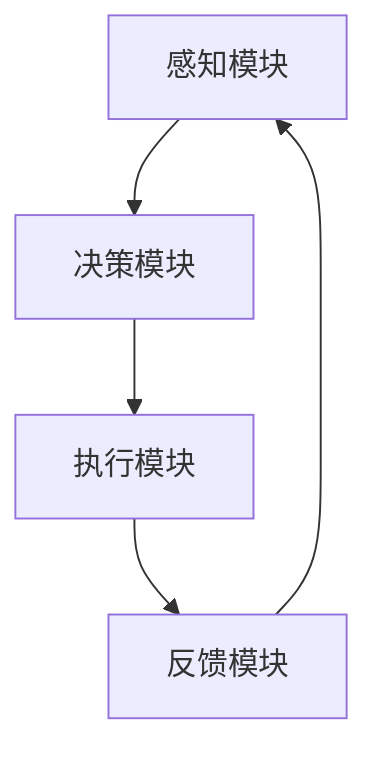
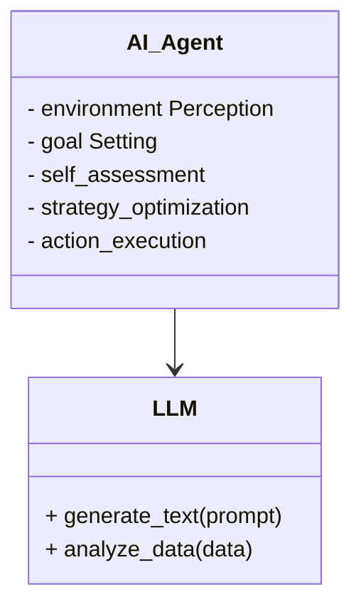
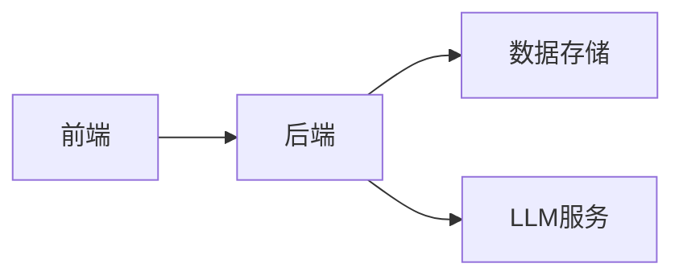
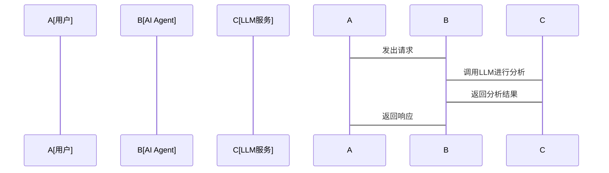

                 


# 自我改进型AI Agent：LLM的自我评估与优化

> 关键词：自我改进型AI Agent, 大语言模型, 自我评估, 自我优化, AI算法, 系统架构, 项目实战

> 摘要：本文将深入探讨自我改进型AI Agent的核心概念、算法原理、系统架构以及项目实现。通过结合大语言模型（LLM）的特性，详细分析自我评估与优化的机制，并通过实际案例展示如何实现自我改进型AI Agent。

---

## 第一部分: 自我改进型AI Agent的背景与核心概念

### 第1章: 自我改进型AI Agent概述

#### 1.1 自我改进型AI Agent的基本概念

- **1.1.1 AI Agent的基本定义**  
  AI Agent（人工智能代理）是指能够感知环境并采取行动以实现目标的智能体。它可以是一个软件程序、机器人或其他智能系统。

- **1.1.2 自我改进型AI Agent的特性**  
  自我改进型AI Agent具备自我评估和优化的能力，能够通过反馈机制不断改进自身的性能和行为。

- **1.1.3 自我改进型AI Agent与传统AI Agent的区别**  
  传统AI Agent依赖外部指令或预设规则，而自我改进型AI Agent能够通过自我学习和优化来适应复杂环境。

#### 1.2 大语言模型（LLM）的基本原理

- **1.2.1 大语言模型的定义**  
  大语言模型（Large Language Model, LLM）是指基于深度学习训练的大型神经网络模型，能够理解和生成人类语言。

- **1.2.2 大语言模型的核心技术**  
  LLM通常采用Transformer架构，通过大量的训练数据学习语言的统计规律，能够进行文本生成、翻译、问答等任务。

- **1.2.3 大语言模型的应用场景**  
  LLM广泛应用于自然语言处理（NLP）领域，如智能客服、内容生成、机器翻译等。

#### 1.3 自我改进型AI Agent的实现框架

- **1.3.1 自我改进型AI Agent的架构**  
  自我改进型AI Agent通常包括感知模块、决策模块、执行模块和反馈模块。

- **1.3.2 自我改进型AI Agent的核心功能**  
  包括环境感知、目标设定、自我评估、策略优化和行动执行。

- **1.3.3 自我改进型AI Agent的实现流程**  
  包括数据采集、模型训练、策略制定和持续优化。

#### 1.4 自我改进型AI Agent的应用前景

- **1.4.1 自我改进型AI Agent的潜在应用领域**  
  包括智能助手、自动化系统、机器人控制等领域。

- **1.4.2 自我改进型AI Agent的优势与挑战**  
  优势包括自主性、适应性和高效性；挑战包括数据依赖性、计算资源消耗和安全风险。

- **1.4.3 自我改进型AI Agent的未来发展趋势**  
  预计随着AI技术的进步，自我改进型AI Agent将在更多领域得到广泛应用。

#### 1.5 本章小结

本章介绍了自我改进型AI Agent的基本概念、核心特性、实现框架和应用前景，为后续章节的深入分析奠定了基础。

---

### 第2章: 自我改进型AI Agent的核心概念与联系

#### 2.1 自我改进型AI Agent的核心原理

- **2.1.1 自我评估的机制**  
  自我评估是自我改进型AI Agent的核心功能之一，通过分析自身的行为和结果，评估当前策略的有效性。

- **2.1.2 自我优化的策略**  
  自我优化是基于自我评估结果，调整和优化策略以提高性能的过程。

- **2.1.3 自我改进的反馈循环**  
  反馈循环是指AI Agent通过不断评估和优化，形成一个闭环系统，持续改进自身性能。

#### 2.2 大语言模型（LLM）与自我改进的关系

- **2.2.1 LLM在自我评估中的作用**  
  LLM可以用于生成文本描述、分析数据，帮助AI Agent进行自我评估。

- **2.2.2 LLM在自我优化中的应用**  
  LLM可以提供优化建议、生成新的策略，辅助AI Agent进行自我优化。

- **2.2.3 LLM与自我改进型AI Agent的协同工作**  
  通过将LLM集成到AI Agent中，可以充分发挥LLM的语言处理能力和AI Agent的自主决策能力。

#### 2.3 自我改进型AI Agent的系统架构

- **2.3.1 系统模块划分**  
  系统通常包括感知模块、决策模块、执行模块和反馈模块。

- **2.3.2 各模块之间的关系**  
  感知模块负责数据采集，决策模块负责策略制定，执行模块负责行动执行，反馈模块负责结果评估。

- **2.3.3 系统整体架构图（Mermaid流程图）**



---

### 第3章: 自我改进型AI Agent的算法原理

#### 3.1 自我评估算法

- **3.1.1 基于LLM的自我评估方法**  
  通过LLM生成文本描述，分析自身行为的优缺点。

- **3.1.2 自我评估的数学模型**  
  建立一个评估指标，例如准确率、效率、成功率等。

- **3.1.3 自我评估算法的实现步骤**  
  1. 收集行为数据；2. 使用LLM生成评估报告；3. 计算评估指标。

#### 3.2 自我优化算法

- **3.2.1 基于强化学习的自我优化**  
  使用强化学习算法，通过奖励机制优化策略。

- **3.2.2 自我优化算法的数学模型**  
  使用Q-learning算法，定义状态、动作和奖励函数。

- **3.2.3 自我优化算法的实现步骤**  
  1. 初始化策略；2. 执行动作；3. 计算奖励；4. 更新策略。

#### 3.3 自我改进的反馈机制

- **3.3.1 反馈机制的定义**  
  反馈机制是指根据评估结果，调整策略的过程。

- **3.3.2 反馈机制的实现方式**  
  包括基于规则的反馈和基于模型的反馈。

- **3.3.3 反馈机制的优化策略**  
  使用动态规划或强化学习优化反馈机制。

---

## 第二部分: 自我改进型AI Agent的系统架构与实现

### 第4章: 系统分析与架构设计

#### 4.1 问题场景介绍

- **4.1.1 问题背景**  
  在复杂的环境中，AI Agent需要具备自我评估和优化的能力。

- **4.1.2 项目介绍**  
  本项目旨在开发一个基于LLM的自我改进型AI Agent。

#### 4.2 系统功能设计

- **4.2.1 功能模块划分**  
  包括环境感知、目标设定、自我评估、策略优化和行动执行。

- **4.2.2 功能模块的交互关系**  
  环境感知模块负责数据采集，目标设定模块负责策略制定，自我评估模块负责结果分析，策略优化模块负责优化策略，行动执行模块负责执行任务。

- **4.2.3 系统功能设计的类图（Mermaid类图）**



#### 4.3 系统架构设计

- **4.3.1 系统架构的总体设计**  
  包括前端、后端和数据存储模块。

- **4.3.2 系统架构的架构图（Mermaid架构图）**



#### 4.4 系统接口设计

- **4.4.1 系统接口的定义**  
  包括感知接口、决策接口、执行接口和反馈接口。

- **4.4.2 系统接口的交互流程**  
  感知模块采集数据，决策模块制定策略，执行模块执行任务，反馈模块评估结果。

#### 4.5 系统交互设计

- **4.5.1 系统交互的流程图（Mermaid序列图）**



---

### 第5章: 项目实战

#### 5.1 环境安装

- **5.1.1 系统要求**  
  需要安装Python、TensorFlow、Keras等依赖库。

- **5.1.2 环境配置**  
  使用虚拟环境管理依赖，安装必要的库。

#### 5.2 系统核心实现源代码

- **5.2.1 自我评估模块的代码实现**  

```python
def self_assessment(results):
    # 使用LLM生成评估报告
    report = llm.generate_text(f"评估以下结果：{results}")
    # 分析报告并计算评估指标
    metrics = analyze_report(report)
    return metrics
```

- **5.2.2 自我优化模块的代码实现**  

```python
def optimize_strategy(metrics):
    # 使用强化学习优化策略
    new_strategy = optimize_policy(metrics)
    return new_strategy
```

#### 5.3 代码应用解读与分析

- **5.3.1 代码的功能解读**  
  自我评估模块通过LLM生成报告，分析结果并计算指标；自我优化模块基于评估结果优化策略。

- **5.3.2 代码实现的注意事项**  
  确保LLM服务的调用正确，优化算法的选择合理。

#### 5.4 实际案例分析

- **5.4.1 案例背景**  
  在一个智能客服系统中，AI Agent需要处理用户的请求。

- **5.4.2 案例分析**  
  AI Agent通过自我评估优化对话策略，提高用户满意度。

#### 5.5 项目小结

本章通过实际案例展示了自我改进型AI Agent的实现过程，包括环境配置、代码实现和案例分析。

---

### 第6章: 最佳实践、小结、注意事项与拓展阅读

#### 6.1 最佳实践

- **6.1.1 数据质量管理**  
  确保训练数据的多样性和高质量。

- **6.1.2 算法选择与调优**  
  根据具体场景选择合适的算法，并进行参数调优。

- **6.1.3 系统安全性**  
  注意数据隐私和系统安全，防止恶意攻击。

#### 6.2 本章小结

本文详细探讨了自我改进型AI Agent的核心概念、算法原理、系统架构和项目实现，通过实际案例展示了其应用价值。

#### 6.3 注意事项

- **6.3.1 数据依赖性**  
  自我改进型AI Agent依赖于大量的数据进行训练和优化。

- **6.3.2 计算资源消耗**  
  训练和优化过程需要大量的计算资源。

- **6.3.3 安全风险**  
  需要防止数据泄露和系统被恶意攻击。

#### 6.4 拓展阅读

- **6.4.1 强化学习的最新研究**  
  关注强化学习领域的最新进展，优化自我改进算法。

- **6.4.2 大语言模型的优化方法**  
  研究LLM的优化技术，提升AI Agent的性能。

---

## 作者：AI天才研究院/AI Genius Institute & 禅与计算机程序设计艺术 /Zen And The Art of Computer Programming

---

通过以上目录和内容，您可以逐步完成整篇技术博客文章的撰写。每一部分都需要结合实际内容进行详细展开，确保文章逻辑清晰、内容丰富且易于理解。

