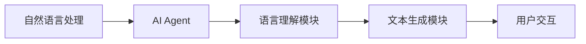
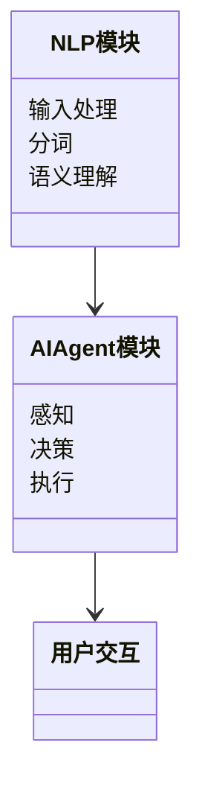
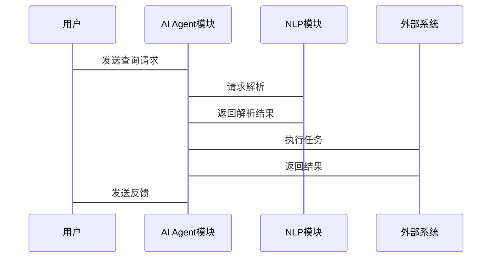

                 


# 自然语言处理AI Agent：深化LLM的语言理解

## 关键词：自然语言处理、AI Agent、大语言模型、语言理解、LLM

## 摘要：本文深入探讨了自然语言处理AI Agent的设计与实现，结合大语言模型（LLM）的技术特点，分析了其在语言理解能力上的优化策略。通过系统性地介绍AI Agent的基本概念、核心算法、系统架构，以及实际项目中的应用场景，详细阐述了如何通过深化LLM的语言理解能力，提升AI Agent的智能交互水平。文章最后还提供了实际的项目实现和最佳实践，为读者提供完整的解决方案。

---

## 第1章：背景介绍

### 1.1 自然语言处理的基本概念

自然语言处理（NLP）是人工智能领域的重要分支，致力于使计算机能够理解和处理人类语言。其核心任务包括：

- **分词**：将连续的文本分割成有意义的词语或短语。
- **句法分析**：分析句子的语法结构，确定词语的词性和句法关系。
- **语义理解**：理解文本的深层含义，包括实体识别、关系抽取等任务。

### 1.2 AI Agent的基本概念

AI Agent是一种智能代理，能够感知环境、执行任务并与其他实体进行交互。其特点包括：

- **自主性**：能够独立决策和行动。
- **反应性**：能够实时感知环境变化并做出反应。
- **社会性**：能够与人类或其他AI Agent进行有效交互。

### 1.3 大语言模型（LLM）的背景与作用

大语言模型（LLM）通过大规模数据的预训练，具备强大的语言生成和理解能力。LLM在NLP中的应用包括：

- **文本生成**：生成连贯且有意义的文本。
- **问答系统**：回答复杂问题。
- **对话系统**：实现自然语言对话。

---

## 第2章：核心概念与联系

### 2.1 自然语言处理的核心原理

- **分词**：使用jieba等工具将文本分割成词语。
- **句法分析**：基于语法树的句法结构分析。
- **语义理解**：通过词向量（如Word2Vec）或语义向量（如BERT）进行语义表示。

### 2.2 AI Agent的核心原理

- **感知**：通过NLP技术理解用户输入。
- **决策**：基于知识库或推理引擎做出决策。
- **执行**：通过API或外部系统执行任务。

### 2.3 自然语言处理与AI Agent的联系

通过Mermaid图展示实体关系：



---

## 第3章：算法原理讲解

### 3.1 Transformer模型的原理

Transformer模型由编码器和解码器组成，核心是自注意力机制：

- **自注意力机制**：通过计算每个词与其他词的相关性，生成权重矩阵。

$$\text{Attention}(Q, K, V) = \text{softmax}\left(\frac{QK^T}{\sqrt{d_k}}\right)V$$

- **解码器**：基于编码器输出生成目标文本。

### 3.2 LLM的训练与优化

- **预训练**：使用大规模数据进行无监督学习。
- **微调**：针对特定任务进行有监督微调。

### 3.3 LLM的推理过程

- **解码策略**：基于贪心算法或随机采样生成文本。

---

## 第4章：系统分析与架构设计方案

### 4.1 系统架构设计

通过Mermaid图展示系统架构：



### 4.2 接口设计与交互流程

通过Mermaid序列图展示交互流程：



---

## 第5章：项目实战

### 5.1 环境安装

- 安装Python和相关库（如TensorFlow、Keras）。
- 安装NLP处理工具（如jieba、spaCy）。

### 5.2 核心代码实现

```python
import tensorflow as tf
from tensorflow.keras import layers

# 定义Transformer模型
def transformer_model():
    inputs = layers.Input(shape=(None, 100), dtype='int64')
    embedding = layers.Embedding(input_dim=10000, output_dim=64)(inputs)
    attention = layers.MultiHeadAttention(heads=8, key_dim=8)(embedding, embedding)
    outputs = layers.GlobalMaxPool1D()(attention)
    model = tf.keras.Model(inputs=inputs, outputs=outputs)
    return model

model = transformer_model()
model.summary()
```

### 5.3 案例分析

以客服咨询系统为例，展示AI Agent如何通过NLP技术处理用户请求，并生成智能回复。

---

## 第6章：最佳实践与总结

### 6.1 最佳实践

- 数据预处理：确保数据质量，去除噪声。
- 模型调优：通过网格搜索优化超参数。
- 可解释性：使用可视化工具分析模型决策过程。

### 6.2 小结

本文系统地介绍了自然语言处理AI Agent的设计与实现，结合LLM技术，深入探讨了如何提升语言理解能力。通过实际案例分析，展示了AI Agent在不同场景中的应用潜力。

### 6.3 注意事项

- 数据隐私：确保用户数据的安全性。
- 模型泛化能力：避免过拟合特定任务。
- 用户体验：优化交互流程，提升用户满意度。

### 6.4 拓展阅读

推荐相关书籍和论文，如《Deep Learning》、《自然语言处理入门》等。

---

## 作者：AI天才研究院/AI Genius Institute & 禅与计算机程序设计艺术 /Zen And The Art of Computer Programming

