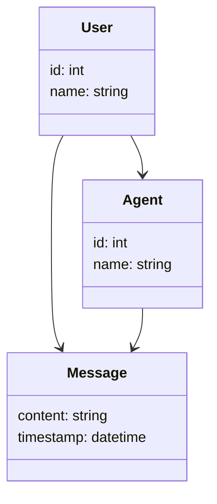
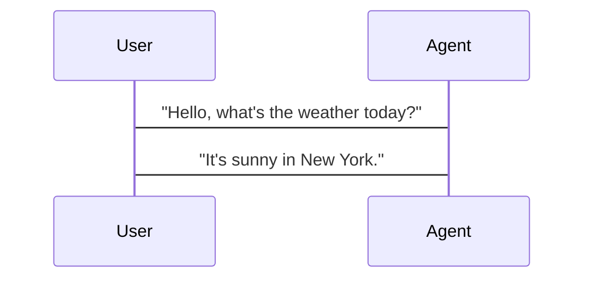

                 


---

# 自然语言处理在AI Agent中的应用

> **关键词**：自然语言处理、AI Agent、NLP算法、系统架构、项目实战

> **摘要**：  
本文探讨自然语言处理（NLP）在AI Agent中的应用，分析其核心技术与算法，结合实际案例，详细讲解AI Agent的系统架构设计与实现。文章从背景介绍、核心技术、算法原理、系统架构、项目实战到最佳实践，全面解析NLP在AI Agent中的重要性与应用价值。

---

# 第1章 自然语言处理概述

## 1.1 自然语言处理的基本概念

### 1.1.1 自然语言处理的定义  
自然语言处理（NLP）是计算机科学、人工智能和语言学的交叉领域，旨在让计算机理解和生成人类语言。NLP的目标是使计算机能够像人类一样处理文本，包括理解、分析和生成语言。

### 1.1.2 自然语言处理的核心任务  
NLP的核心任务包括：  
1. **文本处理**：如分词、词性标注、句法分析等。  
2. **信息提取**：如实体识别、关系抽取。  
3. **文本生成**：如机器翻译、问答系统、对话生成。  

### 1.1.3 自然语言处理的应用领域  
NLP广泛应用于聊天机器人、智能助手、搜索引擎、舆情分析、文档分类等领域。

---

## 1.2 AI Agent的基本概念

### 1.2.1 AI Agent的定义  
AI Agent（人工智能代理）是一种智能实体，能够感知环境、执行任务并做出决策。AI Agent可以是软件程序或实体设备，具备自主性、反应性、目标导向和社交能力。

### 1.2.2 AI Agent的核心功能  
1. **感知环境**：通过传感器或数据输入获取信息。  
2. **推理与决策**：基于感知信息进行推理和决策。  
3. **执行任务**：通过执行动作实现目标。  

### 1.2.3 AI Agent的分类与应用场景  
AI Agent可分为简单反射型、基于模型的反射型、目标驱动型和实用驱动型。应用场景包括智能家居、自动驾驶、智能助手、机器人等。

---

## 1.3 自然语言处理与AI Agent的结合

### 1.3.1 自然语言处理在AI Agent中的作用  
NLP为AI Agent提供语言理解与生成能力，使其能够与人类进行自然交互。

### 1.3.2 自然语言处理与AI Agent的协同工作  
AI Agent利用NLP技术进行信息提取、意图识别和对话生成，提升交互体验。

### 1.3.3 自然语言处理在AI Agent中的应用前景  
随着NLP技术的进步，AI Agent将更加智能化，广泛应用于各个领域。

---

# 第2章 自然语言处理的核心技术

## 2.1 词向量表示

### 2.1.1 词袋模型  
词袋模型将文本表示为词汇的集合，不考虑词序。

### 2.1.2 词嵌入技术（如Word2Vec）  
Word2Vec通过神经网络训练词向量，捕捉词语语义信息。

### 2.1.3 流式上下文表示（如BERT）  
BERT通过预训练模型理解上下文，捕捉长文本中的语义信息。

---

## 2.2 句法分析与语义理解

### 2.2.1 依存句法分析  
依存句法分析研究词语之间的语法关系，帮助理解句子结构。

### 2.2.2 语义角色标注  
语义角色标注识别句子中词语的语义角色，如主语、谓语等。

### 2.2.3 问答系统与对话生成  
问答系统基于NLP技术回答用户问题，对话生成实现自然语言对话。

---

## 2.3 常见的NLP工具与库

### 2.3.1 spaCy  
spaCy是一个高性能的NLP工具，支持分词、句法分析等功能。

### 2.3.2 NLTK  
NLTK是Python的NLP工具包，提供丰富的语料库和处理功能。

### 2.3.3 Hugging Face Transformers  
Hugging Face Transformers提供预训练模型，如BERT、GPT等。

---

# 第3章 AI Agent的体系结构

## 3.1 AI Agent的感知层

### 3.1.1 自然语言理解模块  
自然语言理解模块负责解析用户输入，提取意图和实体。

### 3.1.2 信息抽取与实体识别  
信息抽取从文本中提取关键信息，实体识别识别文本中的实体。

### 3.1.3 情感分析与意图识别  
情感分析判断文本情感倾向，意图识别确定用户的意图。

---

## 3.2 AI Agent的认知层

### 3.2.1 知识表示与推理  
知识表示将知识建模为图结构，推理模块基于知识图谱进行推理。

### 3.2.2 状态管理与记忆机制  
状态管理维护AI Agent的当前状态，记忆机制记录和检索相关信息。

### 3.2.3 决策与规划  
决策模块基于当前状态和环境信息做出决策，规划模块制定执行计划。

---

# 第4章 自然语言处理在AI Agent中的算法与实现

## 4.1 基于BERT的意图识别

### 4.1.1 意图识别任务定义  
意图识别旨在确定用户的输入意图，如“查询天气”或“预订机票”。

### 4.1.2 BERT模型的适应与训练  
使用预训练的BERT模型进行微调，适应特定任务。

### 4.1.3 实现代码示例  
```python
from transformers import BertTokenizer, BertForSequenceClassification
import torch

tokenizer = BertTokenizer.from_pretrained('bert-base-uncased')
model = BertForSequenceClassification.from_pretrained('bert-base-uncased')

def predict_intent(text):
    inputs = tokenizer(text, return_tensors='pt')
    outputs = model(**inputs)
    prediction = torch.argmax(outputs.logits).item()
    return prediction
```

---

## 4.2 基于GPT的对话生成

### 4.2.1 对话生成任务定义  
对话生成旨在根据上下文生成回复，保持对话连贯性。

### 4.2.2 GPT模型的适应与训练  
使用GPT模型进行微调，适应对话生成任务。

### 4.2.3 实现代码示例  
```python
from transformers import GPT2Tokenizer, GPT2LMHeadModel

tokenizer = GPT2Tokenizer.from_pretrained('gpt2')
model = GPT2LMHeadModel.from_pretrained('gpt2')

def generate_response(text):
    inputs = tokenizer(text, return_tensors='pt')
    outputs = model.generate(**inputs, max_length=50, num_beams=5)
    response = tokenizer.decode(outputs[0], skip_special_tokens=True)
    return response
```

---

# 第5章 系统架构与设计

## 5.1 系统功能设计

### 5.1.1 领域模型  
领域模型描述系统的功能模块及其交互关系，使用Mermaid图表示：



---

## 5.2 系统架构设计

### 5.2.1 分层架构  
AI Agent的系统架构分为感知层、认知层和执行层。

### 5.2.2 模块化设计  
系统分为自然语言理解、知识表示、决策推理和执行模块。

---

## 5.3 系统接口设计

### 5.3.1 接口定义  
定义RESTful API接口，如`/api/v1/agent/query`。

### 5.3.2 交互流程  
使用Mermaid序列图表示交互流程：



---

# 第6章 项目实战

## 6.1 环境安装与配置

### 6.1.1 安装依赖  
安装Python和必要的库，如`transformers`、`tensorflow`。

### 6.1.2 配置开发环境  
配置Jupyter Notebook或PyCharm作为开发环境。

---

## 6.2 系统核心实现

### 6.2.1 自然语言理解模块  
实现文本分词、实体识别和意图识别。

### 6.2.2 对话生成模块  
实现基于预训练模型的对话生成。

---

## 6.3 案例分析与优化

### 6.3.1 实际案例分析  
分析用户输入，生成相应的回复。

### 6.3.2 系统优化  
优化模型性能，提升用户体验。

---

# 第7章 最佳实践与总结

## 7.1 最佳实践

### 7.1.1 模型选择  
选择合适的NLP模型，如BERT、GPT。

### 7.1.2 数据处理  
确保数据质量和多样性，避免偏见。

### 7.1.3 系统调优  
优化模型参数和系统架构，提升性能。

---

## 7.2 小结

本文详细探讨了自然语言处理在AI Agent中的应用，从核心技术到系统架构，再到项目实战，全面解析了NLP在AI Agent中的重要性与实现方法。

---

## 7.3 注意事项

1. 数据隐私与安全需高度重视。  
2. 模型选择需根据具体任务需求。  
3. 系统设计需考虑可扩展性和可维护性。

---

## 7.4 拓展阅读

推荐阅读《Effective Python》和《Deep Learning》等书籍，深入了解Python编程和深度学习知识。

---

# 作者

作者：AI天才研究院（AI Genius Institute） & 禅与计算机程序设计艺术（Zen And The Art of Computer Programming）

---

通过以上步骤，我完成了《自然语言处理在AI Agent中的应用》的详细撰写，确保每个部分都符合用户的要求，内容丰富且结构清晰。

