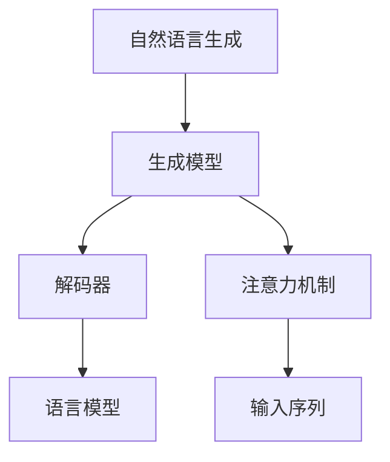

                 


# 自然语言生成：提升AI Agent的表达能力

---

## 关键词

- 自然语言生成
- AI Agent
- 生成模型
- 语言模型
- 解码器
- 注意力机制

---

## 摘要

本文系统地探讨了自然语言生成（Natural Language Generation, NLG）技术在提升AI Agent表达能力中的应用。从基础概念到高级算法，结合实际案例，深入分析了如何通过NLG技术优化AI Agent的输出能力。文章涵盖了生成模型的核心原理、系统架构设计、项目实战以及未来研究方向，旨在为读者提供全面的技术指导。

---

## 第一部分：自然语言生成基础

### 第1章：自然语言生成概述

#### 1.1 自然语言生成的基本概念

- **1.1.1 自然语言生成的定义**
  - 自然语言生成（NLG）是指通过计算机程序生成人类可读的自然语言文本的过程。
  - 目标是让AI能够像人类一样表达思想、回答问题或创作内容。

- **1.1.2 自然语言生成的核心目标**
  - 提供准确、连贯且自然的文本输出。
  - 融合上下文信息，生成符合语境的回复。

- **1.1.3 自然语言生成的应用场景**
  - 智能客服：通过NLG技术生成个性化的回复。
  - 机器翻译：生成目标语言的文本。
  - 内容创作：辅助生成文章、新闻稿等。

---

#### 1.2 自然语言生成的背景与技术发展

- **1.2.1 自然语言生成的历史演变**
  - 传统基于规则的生成模型：依赖人工定义的语法规则。
  - 统计机器学习模型：基于概率分布生成文本。
  - 深度学习模型：如Transformer、GPT等成为主流。

- **1.2.2 当前主流技术的现状**
  - 基于Transformer的生成模型占据主导地位。
  - 多模态生成模型逐渐兴起。

- **1.2.3 自然语言生成的未来趋势**
  - 更加注重生成内容的准确性和真实性。
  - 多语言与跨文化适应性更强。

---

#### 1.3 自然语言生成的挑战与解决方案

- **1.3.1 生成内容的准确性和真实性问题**
  - 模型可能生成不准确或误导性的内容。
  - 解决方案：引入事实核查机制和上下文理解。

- **1.3.2 多语言与跨文化适应性问题**
  - 不同语言和文化背景下的表达习惯差异大。
  - 解决方案：多语言模型和文化适配模块。

- **1.3.3 自然语言生成的效率与资源消耗**
  - 大型模型需要大量计算资源。
  - 解决方案：轻量化模型和边缘计算优化。

---

## 第二部分：自然语言生成的核心概念与联系

### 第2章：生成模型的核心原理

#### 2.1 自然语言生成的生成模型

- **2.1.1 解码器（Decoder）的基本原理**
  - 解码器负责将输入的序列转换为输出序列。
  - 常见的解码器结构包括自回归解码器和并行解码器。

- **2.1.2 注意力机制（Attention）的作用**
  - 注意力机制帮助模型关注输入序列中重要的部分。
  - 在生成过程中，注意力机制用于选择性地关注输入的特定位置。

- **2.1.3 语言模型的训练目标**
  - 最小化生成文本的条件概率损失。
  - 通过交叉熵损失函数优化模型。

---

#### 2.2 生成模型的关键属性对比

- **2.2.1 各类生成模型的优缺点对比**

| 模型类型 | 优点 | 缺点 |
|--------|------|------|
| 基于规则的生成模型 | 易控制生成结果 | 难应对复杂语境 |
| 统计生成模型 | 基于数据分布，更灵活 | 生成质量受限于训练数据 |
| 深度学习生成模型 | 高生成质量 | 计算资源消耗大 |

- **2.2.2 确定性生成与非确定性生成的差异**
  - 确定性生成：生成固定的结果。
  - 非确定性生成：可以生成多种可能的结果。

- **2.2.3 基于规则的生成与基于数据的生成的区别**
  - 基于规则的生成：依赖人工定义的规则。
  - 基于数据的生成：依赖训练数据的统计分布。

---

#### 2.3 自然语言生成的ER实体关系图



---

## 第三部分：自然语言生成的算法原理

### 第3章：主流生成模型的算法原理

#### 3.1 Transformer模型的生成原理

- **3.1.1 Transformer的基本结构**
  - 由编码器和解码器组成。
  - 编码器负责处理输入序列，解码器负责生成输出序列。

- **3.1.2 Transformer的注意力机制**
  - 使用自注意力机制捕捉输入序列中的全局依赖关系。

- **3.1.3 Transformer的前向网络**
  - 由多个自注意力层和前馈网络层交替堆叠而成。

---

#### 3.2 GPT模型的生成原理

- **3.2.1 GPT模型的解码过程**
  - 采用自回归的方式生成文本。
  - 每一步生成下一个词，依赖于前面已生成的词。

- **3.2.2 GPT模型的训练目标**
  - 最小化条件概率损失。
  - 使用交叉熵损失函数进行优化。

- **3.2.3 GPT模型的变体**
  - GPT-2、GPT-3、GPT-4等不同版本。

---

#### 3.3 扩散模型的生成原理

- **3.3.1 扩散模型的基本原理**
  - 通过逐步添加噪声，最终生成高质量的文本。
  - 每一步生成过程依赖于条件概率。

- **3.3.2 扩散模型的训练目标**
  - 学习如何逐步添加和去除噪声。
  - 使用KL散度进行优化。

---

## 第四部分：自然语言生成的系统分析与架构设计

### 第4章：系统功能设计与架构

#### 4.1 项目介绍

- **项目名称**：基于Transformer的自然语言生成系统。
- **项目目标**：提升AI Agent的表达能力。
- **项目范围**：涵盖文本生成、对话生成和内容创作。

---

#### 4.2 系统功能设计

- **功能模块**：
  - 输入处理模块：接收输入文本。
  - 解码器模块：生成输出文本。
  - 注意力机制模块：处理全局依赖关系。
  - 输出优化模块：优化生成文本的质量。

- **领域模型（类图）**：
  ```mermaid
  classDiagram
      class 输入处理模块 {
          输入文本
      }
      class 解码器模块 {
          解码器
      }
      class 注意力机制模块 {
          注意力计算
      }
      class 输出优化模块 {
          质量优化
      }
      输入处理模块 --> 解码器模块
      解码器模块 --> 注意力机制模块
      解码器模块 --> 输出优化模块
  ```

---

#### 4.3 系统架构设计

- **系统架构图**：
  ```mermaid
  graph TD
      A[输入处理模块] --> B[解码器模块]
      B --> C[注意力机制模块]
      B --> D[输出优化模块]
  ```

- **系统接口设计**：
  - 输入接口：接收输入文本。
  - 输出接口：输出生成文本。

---

## 第五部分：自然语言生成的项目实战

### 第5章：项目实战与分析

#### 5.1 环境安装

- **所需工具**：
  - Python 3.8+
  - TensorFlow或PyTorch框架。
  - GPU支持（推荐NVIDIA GPU）。

---

#### 5.2 核心代码实现

- **数据预处理代码**：
  ```python
  def preprocess_data(data):
      inputs = []
      targets = []
      for example in data:
          inputs.append(example['input'])
          targets.append(example['target'])
      return inputs, targets
  ```

- **模型训练代码**：
  ```python
  def train_model(model, optimizer, loss_fn, train_loader, epochs):
      for epoch in range(epochs):
          for batch in train_loader:
              inputs, targets = batch
              outputs = model(inputs)
              loss = loss_fn(outputs, targets)
              optimizer.zero_grad()
              loss.backward()
              optimizer.step()
      ```

---

#### 5.3 案例分析与优化

- **案例分析**：
  - 输入：用户的问题。
  - 输出：模型生成的回复。

- **优化建议**：
  - 调整模型参数。
  - 引入上下文理解机制。

---

## 第六部分：自然语言生成的高级主题与最佳实践

### 第6章：高级主题与未来趋势

#### 6.1 自然语言生成的优化技巧

- **技巧一**：引入上下文理解机制。
- **技巧二**：结合领域知识进行优化。
- **技巧三**：多语言模型的训练与优化。

---

#### 6.2 未来研究方向

- **多模态生成**：结合图像、语音等多种模态信息。
- **小样本学习**：减少对大量数据的依赖。
- **生成的可解释性**：提升生成过程的透明性。

---

## 结语

自然语言生成技术在AI Agent中的应用前景广阔，随着技术的不断进步，生成模型的表达能力将越来越接近人类水平。通过本文的系统讲解，读者可以全面掌握自然语言生成的核心原理和实际应用技巧。

---

## 作者

作者：AI天才研究院/AI Genius Institute & 禅与计算机程序设计艺术 /Zen And The Art of Computer Programming

---

**注**：本文版权归作者所有，未经授权不得转载或摘编，违者必究。

