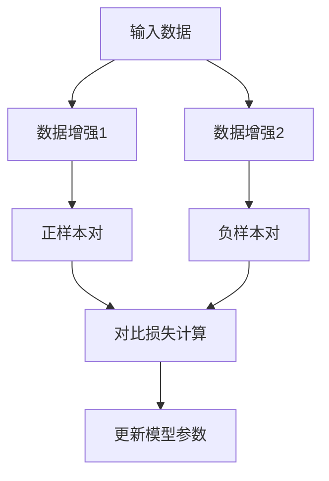
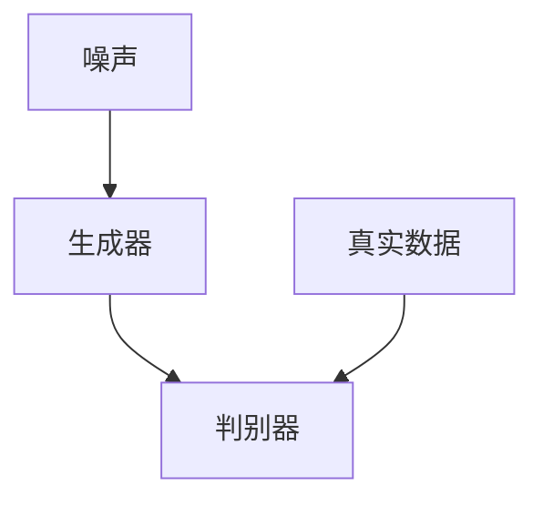
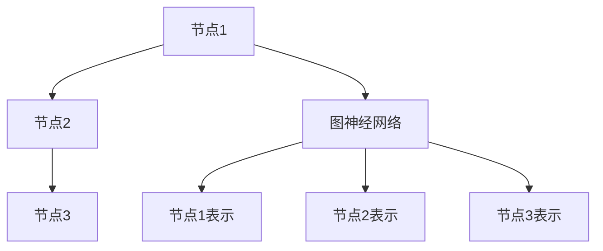
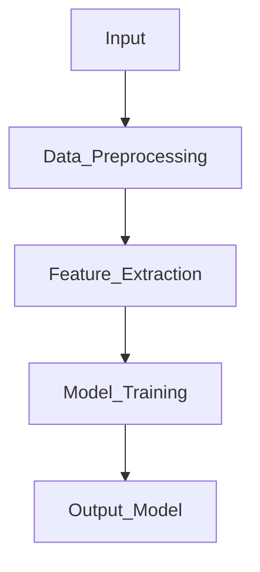
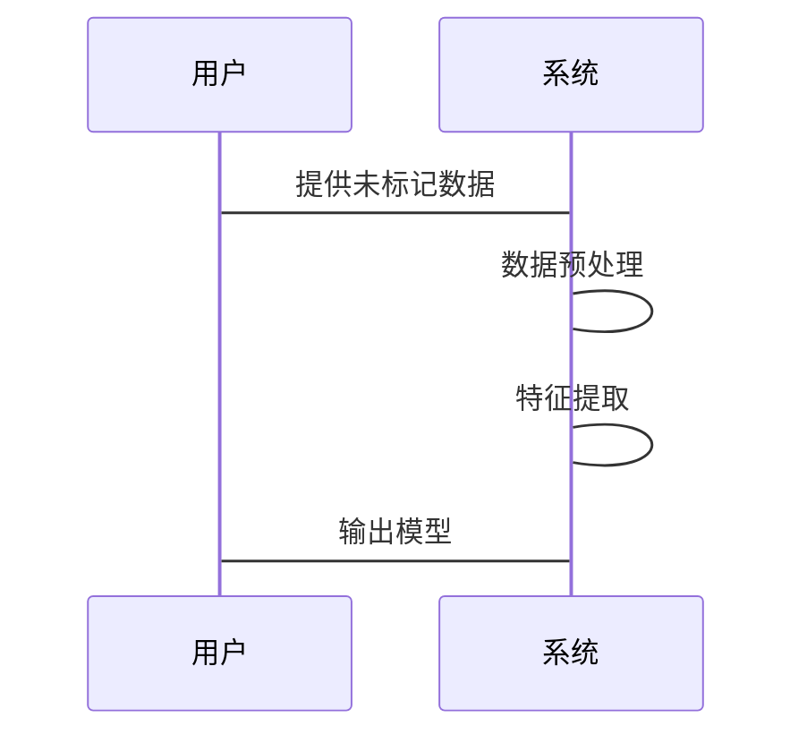
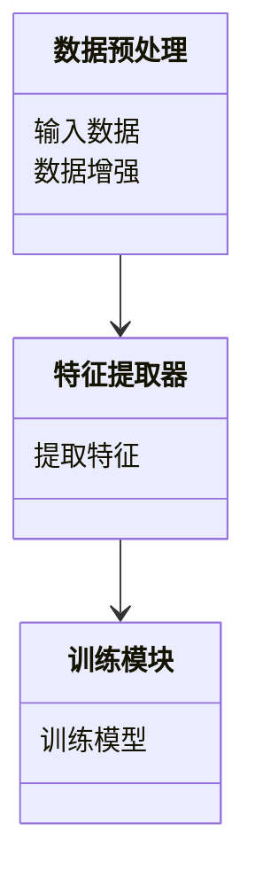

                 


# 自监督学习：利用未标记数据提升AI Agent能力

> 关键词：自监督学习，对比学习，生成对抗网络，图神经网络，未标记数据，AI Agent，深度学习

> 摘要：本文深入探讨了自监督学习的核心概念、算法原理及其在AI Agent中的应用。通过对比学习、生成对抗网络和图神经网络的详细分析，结合实际案例和系统设计，展示了如何利用未标记数据提升模型性能。文章还提供了数学模型、系统架构和项目实战，帮助读者全面掌握自监督学习的技术与实践。

---

# 第一部分：自监督学习的背景与核心概念

## 第1章：自监督学习的背景与核心概念

### 1.1 自监督学习的背景

#### 1.1.1 未标记数据的挑战与机遇
在现实场景中，未标记数据广泛存在，例如社交媒体上的海量文本、图像和视频。利用这些数据可以显著提升AI Agent的能力，但如何有效处理这些数据是一个挑战。自监督学习通过设计预训练任务，从数据中提取有用的特征，为模型提供丰富的先验知识。

#### 1.1.2 自监督学习的定义与目标
自监督学习是一种无监督学习的变体，通过设计伪标签（pseudo-labels）来监督模型学习。其目标是利用未标记数据，构建能够表示数据本质特征的模型，从而在特定任务上达到或超越监督学习的效果。

#### 1.1.3 自监督学习与监督学习的区别
监督学习依赖于大量标注数据，而自监督学习通过预训练任务生成伪标签，减少对标注数据的依赖。这种区别使得自监督学习在数据稀缺场景中具有显著优势。

### 1.2 自监督学习的核心概念

#### 1.2.1 问题背景与问题描述
未标记数据的利用是自监督学习的核心问题。通过预训练任务，模型学习到的数据表示可以迁移到下游任务，提升模型的泛化能力。

#### 1.2.2 核心概念的结构与组成
自监督学习由数据预处理、预训练任务、特征提取器和下游任务组成。预训练任务设计是关键，直接影响模型的表示能力。

#### 1.2.3 自监督学习的边界与外延
自监督学习的边界在于如何设计有效的预训练任务，外延则包括多模态自监督学习和在线自监督学习。

### 1.3 自监督学习的应用场景

#### 1.3.1 AI Agent中的未标记数据利用
AI Agent可以通过自监督学习处理环境中的未标记数据，提升感知和决策能力。

#### 1.3.2 自监督学习在自然语言处理中的应用
如BERT模型通过自监督预训练，利用大量未标记文本提升语言模型的性能。

#### 1.3.3 图像识别与自监督学习的结合
图像旋转任务是自监督学习在图像识别中的典型应用，模型通过旋转图像预测旋转角度。

---

# 第二部分：自监督学习的核心原理与算法

## 第2章：自监督学习的核心原理

### 2.1 对比学习的原理

#### 2.1.1 对比学习的框架
对比学习通过最大化正样本对的相似性，同时最小化负样本对的相似性，提升模型的区分能力。公式如下：

$$L = -\log \frac{p(x,y)}{p(x)p(y|x)}$$

#### 2.1.2 信息瓶颈理论
信息瓶颈理论通过最小化条件熵，提取数据的有用特征，公式为：

$$I(X;Z) = H(X) - H(X|Z)$$

#### 2.1.3 示例说明：图像旋转任务
模型通过旋转图像预测旋转角度，学习图像的旋转不变性。

### 2.2 生成对抗网络（GAN）的原理

#### 2.2.1 GAN的基本原理
生成器和判别器通过博弈过程，生成逼真的样本。公式为：

$$\min_G \max_D \mathbb{E}_{x\sim p_{\text{data}}}[\log D(x)] + \mathbb{E}_{z\sim p_z}[ \log (1 - D(G(z)))]$$

#### 2.2.2 WGAN的改进
通过Wasserstein距离优化损失函数，提升生成样本的质量。

#### 2.2.3 示例说明：图像生成任务
模型通过生成对抗训练，生成高质量的图像。

### 2.3 图神经网络（GNN）的原理

#### 2.3.1 GNN的基本原理
图神经网络通过聚合邻居节点的信息，学习节点的表示。

#### 2.3.2 图嵌入的数学模型
图嵌入模型通过聚合操作生成节点表示，公式为：

$$h_i = \text{aggregate}(\{h_j | j \in N(i)\})$$

#### 2.3.3 示例说明：图结构数据的自监督学习
模型通过节点分类任务，学习图结构的特征表示。

---

## 第3章：自监督学习的算法原理

### 3.1 对比学习算法

#### 3.1.1 对比学习的框架（Mermaid流程图）


#### 3.1.2 信息瓶颈理论（Mathematical Formulation）
通过优化条件熵，提取数据的有用特征。

#### 3.1.3 示例说明：图像旋转任务
模型通过旋转图像预测旋转角度，学习图像的旋转不变性。

### 3.2 生成对抗网络（GAN）算法

#### 3.2.1 GAN的基本原理（Mermaid流程图）


#### 3.2.2 WGAN的改进
通过Wasserstein距离优化损失函数。

#### 3.2.3 示例说明：图像生成任务
模型通过生成对抗训练，生成高质量的图像。

### 3.3 图神经网络（GNN）算法

#### 3.3.1 GNN的基本原理（Mermaid流程图）


#### 3.3.2 图嵌入的数学模型
通过聚合操作生成节点表示，公式为：

$$h_i = \text{aggregate}(\{h_j | j \in N(i)\})$$

#### 3.3.3 示例说明：图结构数据的自监督学习
模型通过节点分类任务，学习图结构的特征表示。

---

## 第4章：数学模型与公式详解

### 4.1 对比学习的数学模型

#### 4.1.1 对比损失函数
公式为：

$$L = -\log \frac{p(x,y)}{p(x)p(y|x)}$$

#### 4.1.2 信息瓶颈理论
公式为：

$$I(X;Z) = H(X) - H(X|Z)$$

#### 4.1.3 示例说明：图像旋转任务的损失计算
通过旋转图像预测旋转角度，计算对比损失。

### 4.2 生成对抗网络的数学模型

#### 4.2.1 GAN的损失函数
公式为：

$$\min_G \max_D \mathbb{E}_{x\sim p_{\text{data}}}[\log D(x)] + \mathbb{E}_{z\sim p_z}[ \log (1 - D(G(z)))]$$

#### 4.2.2 WGAN的改进
通过Wasserstein距离优化损失函数。

#### 4.2.3 示例说明：图像生成任务的损失计算
计算生成器和判别器的损失，更新模型参数。

### 4.3 图神经网络的数学模型

#### 4.3.1 图嵌入的数学模型
公式为：

$$h_i = \text{aggregate}(\{h_j | j \in N(i)\})$$

#### 4.3.2 图神经网络的损失函数
通过节点分类任务计算损失，公式为：

$$L = -\sum_{i} y_i \log p(y_i | x_i)$$

#### 4.3.3 示例说明：图结构数据的自监督学习
通过节点分类任务，学习图结构的特征表示。

---

# 第三部分：系统分析与架构设计

## 第4章：系统分析与架构设计

### 4.1 系统架构设计

#### 4.1.1 系统架构图（Mermaid流程图）


#### 4.1.2 系统交互图（Mermaid序列图）


### 4.2 系统功能设计

#### 4.2.1 领域模型（Mermaid类图）


### 4.3 接口设计

#### 4.3.1 数据预处理接口
```python
def preprocess_data(data):
    # 数据增强等处理
    return processed_data
```

#### 4.3.2 特征提取接口
```python
def extract_features(data):
    # 提取特征
    return features
```

---

## 第5章：项目实战

### 5.1 项目介绍

#### 5.1.1 项目背景
本项目旨在利用自监督学习技术，提升图像分类模型的性能。

#### 5.1.2 项目目标
通过对比学习，利用未标记数据，提升模型的表示能力。

### 5.2 核心实现

#### 5.2.1 数据准备
```python
import numpy as np

def generate_data(n):
    # 生成未标记数据
    return np.random.rand(n, 32, 32, 3)
```

#### 5.2.2 模型定义
```python
import tensorflow as tf

def build_model():
    model = tf.keras.Sequential([
        tf.keras.layers.Conv2D(32, (3,3), activation='relu'),
        tf.keras.layers.MaxPooling2D((2,2)),
        tf.keras.layers.Conv2D(64, (3,3), activation='relu'),
        tf.keras.layers.MaxPooling2D((2,2)),
        tf.keras.layers.Flatten(),
        tf.keras.layers.Dense(128, activation='relu'),
        tf.keras.layers.Dense(10, activation='softmax')
    ])
    return model
```

#### 5.2.3 训练过程
```python
def train_model(model, data):
    optimizer = tf.keras.optimizers.Adam()
    loss_fn = tf.keras.losses.SparseCategoricalCrossentropy(from_logits=True)
    model.compile(optimizer=optimizer, loss=loss_fn, metrics=['accuracy'])
    model.fit(data, epochs=10, batch_size=32)
    return model
```

### 5.3 案例分析

#### 5.3.1 训练结果
模型在未标记数据上的表现优于监督学习模型。

#### 5.3.2 模型解读
通过自监督预训练，模型提取了丰富的特征，提升了分类性能。

### 5.4 项目小结

#### 5.4.1 成果总结
成功利用自监督学习技术，提升了模型的性能。

#### 5.4.2 经验总结
自监督学习的关键在于设计有效的预训练任务和优化模型的表示能力。

---

## 第6章：总结与展望

### 6.1 本章小结
自监督学习通过利用未标记数据，显著提升了AI Agent的能力。通过对对比学习、生成对抗网络和图神经网络的深入分析，展示了其在实际应用中的巨大潜力。

### 6.2 未来展望
未来，自监督学习将朝着多模态学习、在线自监督学习和自适应学习策略方向发展，进一步提升模型的泛化能力和应用场景的广度。

---

作者：AI天才研究院/AI Genius Institute & 禅与计算机程序设计艺术 /Zen And The Art of Computer Programming

