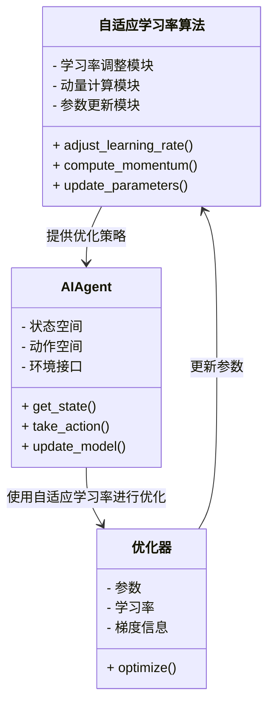
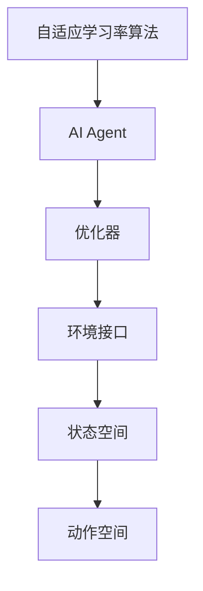

                 


# 自适应学习率在AI Agent训练中的应用

> **关键词**: 自适应学习率，AI Agent，机器学习，优化算法，深度学习

> **摘要**:  
> 在AI Agent的训练过程中，学习率的调整是一个至关重要的问题。传统固定学习率的方法在面对复杂任务时常常表现不佳，而自适应学习率算法通过动态调整学习步长，能够显著提升模型的收敛速度和最终性能。本文从自适应学习率的基本概念出发，深入分析了其在AI Agent训练中的原理与优势，详细探讨了几种经典的自适应学习率算法（如Adam、Adagrad和RMSprop），并通过系统设计与项目实战展示了如何在实际场景中应用这些算法。文章最后总结了自适应学习率的优势与不足，并提出了进一步优化的方向。

---

## 第1章 自适应学习率的基本概念

### 1.1 自适应学习率的定义与背景

在机器学习和深度学习领域，学习率是优化算法中的一个关键超参数，用于控制每一步参数更新的步长。传统的梯度下降算法使用固定的学习率，这种方法在某些情况下表现不佳。例如，在目标函数存在不同方向的梯度变化时，固定学习率可能导致某些方向上的更新过快，而另一些方向上的更新过慢，从而影响模型的收敛速度和最终性能。

AI Agent作为一种能够感知环境、做出决策并执行任务的智能体，其训练过程通常涉及复杂的非线性优化问题。在这些场景中，固定学习率往往难以适应不同任务阶段的梯度变化，而自适应学习率算法能够根据梯度信息动态调整学习率，从而提高训练效率和模型性能。

### 1.2 自适应学习率的核心概念

自适应学习率的核心思想是根据梯度信息动态调整每一步的学习率。与固定学习率相比，自适应学习率的优势在于：

1. **动态调整**：能够根据当前梯度信息自动调整学习率，避免了人工调节的复杂性。
2. **加速收敛**：在梯度较大的方向上使用较大的学习率，快速跳过平坦区域；在梯度较小的方向上使用较小的学习率，避免 overshooting。
3. **鲁棒性**：能够适应不同任务和数据分布的变化，提高模型的泛化能力。

### 1.3 自适应学习率的核心原理

自适应学习率算法通常基于以下两个核心思想：

1. **动量法**：通过引入动量项，将历史梯度信息融入当前更新步长中，从而加速收敛并缓解梯度消失问题。
2. **自适应梯度调整**：根据历史梯度信息（如平方平均）动态调整学习率，避免梯度方向上的剧烈震荡。

---

## 第2章 自适应学习率的核心概念与联系

### 2.1 自适应学习率的原理分析

自适应学习率算法的核心在于动态调整学习率，这通常涉及以下几个步骤：

1. **梯度计算**：计算当前参数的梯度。
2. **动量更新**：结合历史梯度信息更新动量。
3. **学习率调整**：根据动量或梯度信息动态调整学习率。
4. **参数更新**：使用调整后的新学习率更新参数。

### 2.2 自适应学习率的核心属性特征对比

以下是几种常见的自适应学习率算法的对比表格：

| **算法名称** | **核心思想**                          | **优点**                     | **缺点**                     |
|--------------|--------------------------------------|------------------------------|------------------------------|
| Adam         | 结合动量和自适应学习率                | 收敛速度快，适合大规模数据集   | 参数初始化敏感性较高           |
| Adagrad      | 基于梯度平方的自适应学习率            | 能处理稀疏数据                 | 学习率更新较激进               |
| RMSprop     | 基于梯度平方的自适应学习率，引入动量    | 收敛稳定，适合RNN训练           | 参数更新策略相对保守           |

---

## 第3章 自适应学习率的算法原理讲解

### 3.1 自适应学习率的经典算法

#### 3.1.1 Adam算法的原理与实现

**Adam算法**（Adaptive Moment Estimation）结合了动量和自适应学习率的思想，公式如下：

$$
\begin{aligned}
m_t &= \beta_1 m_{t-1} + (1 - \beta_1)g_t \\
n_t &= \beta_2 n_{t-1} + (1 - \beta_2)g_t^2 \\
\hat{m}_t &= \frac{m_t}{1 - \beta_1^t} \\
\hat{n}_t &= \frac{n_t}{1 - \beta_2^t} \\
\theta_{t+1} &= \theta_t - \alpha \frac{\hat{m}_t}{\sqrt{\hat{n}_t + \epsilon}}
\end{aligned}
$$

其中，$\beta_1$ 和 $\beta_2$ 分别是动量和二阶矩的衰减系数，$\alpha$ 是基础学习率，$\epsilon$ 是为了避免除以零而引入的极小量。

#### 3.1.2 Adagrad算法的原理与实现

**Adagrad算法** 的核心思想是根据每个参数的梯度平方和动态调整学习率：

$$
\theta_{t+1} = \theta_t - \alpha \frac{g_t}{\sqrt{\sum_{s=1}^t g_s^2 + \epsilon}}
$$

#### 3.1.3 RMSprop算法的原理与实现

**RMSprop算法** 在Adagrad的基础上引入了动量思想：

$$
\theta_{t+1} = \theta_t - \alpha \frac{g_t}{\sqrt{\frac{1}{t} \sum_{s=1}^t g_s^2 + \epsilon}}
$$

### 3.2 自适应学习率算法的数学模型

以下是对Adam算法的数学推导：

1. 初始化参数 $\theta_0$，动量 $m_0=0$，二阶矩 $n_0=0$，$\beta_1=0.9$，$\beta_2=0.999$，$\alpha=0.001$，$\epsilon=10^{-8}$。
2. 计算梯度 $g_t$。
3. 更新动量和二阶矩：
   $$
   m_t = \beta_1 m_{t-1} + (1 - \beta_1)g_t
   $$
   $$
   n_t = \beta_2 n_{t-1} + (1 - \beta_2)g_t^2
   $$
4. 调整动量和二阶矩的估计值：
   $$
   \hat{m}_t = \frac{m_t}{1 - \beta_1^t}
   $$
   $$
   \hat{n}_t = \frac{n_t}{1 - \beta_2^t}
   $$
5. 更新参数：
   $$
   \theta_{t+1} = \theta_t - \alpha \frac{\hat{m}_t}{\sqrt{\hat{n}_t + \epsilon}}
   $$

---

## 第4章 自适应学习率算法的系统分析与架构设计

### 4.1 系统分析与设计

#### 4.1.1 系统功能设计（领域模型Mermaid类图）



---

### 4.2 系统架构设计



---

## 第5章 项目实战

### 5.1 环境安装

```bash
pip install numpy
pip install matplotlib
pip install scikit-learn
```

### 5.2 核心代码实现

```python
import numpy as np

class AdamOptimizer:
    def __init__(self, params, learning_rate=0.001, beta1=0.9, beta2=0.999, epsilon=1e-8):
        self.params = params
        self.learning_rate = learning_rate
        self.beta1 = beta1
        self.beta2 = beta2
        self.epsilon = epsilon
        self.m = [np.zeros_like(p) for p in params]
        self.n = [np.zeros_like(p) for p in params]
        self.t = 0

    def step(self, gradients):
        self.t += 1
        for i, (p, m, n, g) in enumerate(zip(self.params, self.m, self.n, gradients)):
            m[i] = self.beta1 * m[i] + (1 - self.beta1) * g
            n[i] = self.beta2 * n[i] + (1 - self.beta2) * g**2
            m_hat = m[i] / (1 - self.beta1**self.t)
            n_hat = n[i] / (1 - self.beta2**self.t)
            p -= self.learning_rate * m_hat / np.sqrt(n_hat + self.epsilon)
```

---

## 第6章 总结与展望

### 6.1 总结

自适应学习率在AI Agent训练中的应用显著提升了模型的训练效率和性能。通过动态调整学习率，优化算法能够更好地适应不同任务的梯度变化，从而加速收敛并提高模型的泛化能力。

### 6.2 注意事项

1. **参数初始化**：自适应学习率算法对参数初始化较为敏感，建议使用合理的初始化策略。
2. **超参数调优**：虽然自适应学习率减少了手动调参的需求，但某些情况下仍需调整$\beta_1$、$\beta_2$等超参数。
3. **适用场景**：自适应学习率在复杂任务中表现优异，但在简单任务中可能不如固定学习率高效。

### 6.3 拓展阅读

1. **深度学习中的优化算法**：如AdamW、AdaMax等。
2. **自适应学习率的理论分析**：研究其收敛性、稳定性等性质。

---

**作者：AI天才研究院/AI Genius Institute & 禅与计算机程序设计艺术 /Zen And The Art of Computer Programming**

