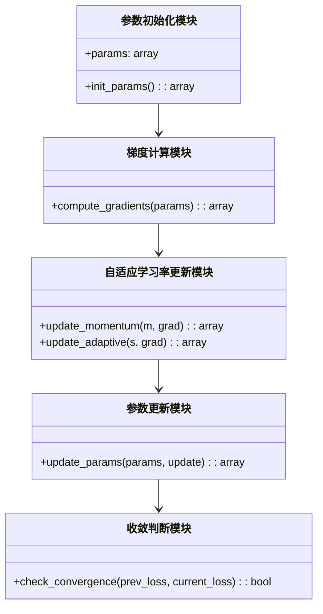
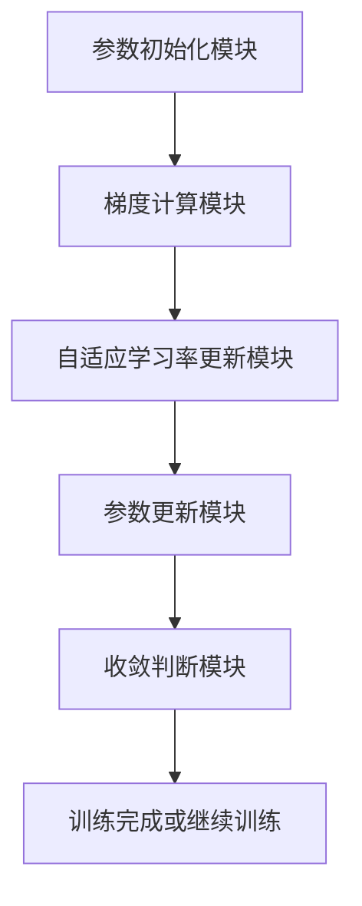
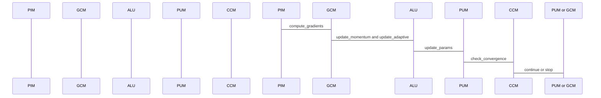

                 

<think>
好的，我需要根据用户提供的详细目录大纲来撰写一篇关于《自适应学习率：优化AI Agent的训练过程》的技术博客文章。首先，我会按照目录的结构逐步展开，确保每个章节都涵盖所有必要的内容，并且语言清晰、逻辑紧凑。

### 第1章: 自适应学习率的概述

#### 1.1 自适应学习率的基本概念
- **传统学习率的概念与问题**：在机器学习中，学习率是训练模型时优化器调整参数的步长。固定学习率可能会导致模型在某些情况下收敛缓慢或震荡，甚至发散。例如，在梯度下降中，如果学习率过高，参数更新可能会跳过最优解；如果过低，训练过程会变得非常缓慢。
- **自适应学习率的定义**：自适应学习率是指在训练过程中根据梯度信息动态调整学习率，以加快收敛速度并提高模型性能。
- **自适应学习率的背景与意义**：随着深度学习模型复杂度的增加，固定学习率难以适应不同参数的更新需求，自适应学习率能够有效解决这一问题，提升训练效率。

#### 1.2 自适应学习率的类型
- **动量法（Momentum）**：动量法通过引入动量项，将历史梯度信息整合到当前更新中，类似于物理中的惯性，帮助模型加速收敛并跳出局部极小值。
- **随机梯度下降（SGD）的变体**：如Adam、RMSProp等优化算法，它们在SGD的基础上加入了自适应学习率的机制。
- **自适应学习率的分类与特点**：自适应学习率主要通过调整每个参数的学习率，或者在每个时间步全局调整学习率，具有更高的灵活性和适应性。

#### 1.3 自适应学习率与其他学习率方法的对比
- **传统固定学习率的局限性**：无法适应不同参数的重要性，可能导致某些参数更新过快或过慢。
- **动态调整学习率的优势**：能够根据梯度信息自动调整，减少人工调参的麻烦，提高训练效率。
- **自适应学习率与其他优化算法的联系**：自适应学习率是许多现代优化算法（如Adam）的核心组成部分，能够与其他技术（如批量归一化）结合使用，进一步提升训练效果。

### 第2章: 自适应学习率的核心原理

#### 2.1 自适应学习率的数学模型
- **梯度下降的基本公式**：$$w_{new} = w - \eta \cdot \nabla L$$，其中$\eta$是学习率，$\nabla L$是损失函数的梯度。
- **自适应学习率的数学表达式**：例如，Adam优化器的更新公式为：
  $$m_t = \beta_1 m_{t-1} + (1 - \beta_1)g_t$$
  $$s_t = \beta_2 s_{t-1} + (1 - \beta_2)g_t^2$$
  $$\theta_{t+1} = \theta_t - \frac{\eta}{\sqrt{s_t + \epsilon}} m_t$$
  其中$m_t$是梯度的动量，$s_t$是梯度平方的自适应平均，$\epsilon$是防止除以零的常数。

#### 2.2 自适应学习率的核心算法
- **AdaGrad**：通过累积梯度的平方来调整学习率，适用于稀疏数据的情况。
- **Adam**：结合了动量和自适应学习率的优点，适合大多数情况。
- **RMSProp**：类似于AdaGrad，但采用不同的衰减率来处理梯度。

#### 2.3 自适应学习率的优缺点分析
- **优点**：收敛速度快，能够适应不同参数的梯度变化，减少人工调参的需求。
- **缺点**：引入了更多超参数，计算复杂度增加，可能导致过拟合。
- **解决方案**：通过合理的参数设置和正则化技术来平衡计算效率与优化效果。

### 第3章: 自适应学习率的算法实现

#### 3.1 自适应学习率算法的流程图
```mermaid
graph TD
    A[初始化参数] --> B[计算梯度]
    B --> C[更新动量和自适应项]
    C --> D[计算更新步长]
    D --> E[更新参数]
    E --> F[检查收敛条件]
    F --> G[结束] 或者 F --> B[继续训练]
```

#### 3.2 自适应学习率的Python实现
```python
import numpy as np

def adaptive_learning_rate_optimizer(params, grads, learning_rate, beta1=0.9, beta2=0.999, epsilon=1e-8):
    # 动量
    m = {}
    # 自适应项
    s = {}
    # 初始化
    for param in params:
        m[param] = np.zeros_like(param)
        s[param] = np.zeros_like(param)
    
    new_params = []
    for i, (param, grad) in enumerate(zip(params, grads)):
        # 更新动量
        m[param] = beta1 * m[param] + (1 - beta1) * grad
        # 更新自适应项
        s[param] = beta2 * s[param] + (1 - beta2) * grad**2
        # 计算更新步长
        update = -learning_rate * m[param] / (np.sqrt(s[param]) + epsilon)
        # 更新参数
        new_param = param + update
        new_params.append(new_param)
    return new_params

# 示例使用
params = [np.array([2, 0.5])]
grads = [np.array([0.1, -0.2])]
learning_rate = 0.01
new_params = adaptive_learning_rate_optimizer(params, grads, learning_rate)
print(new_params)
```

#### 3.3 自适应学习率的数学公式
- **AdaGrad**：$$\theta_{t+1} = \theta_t - \frac{\eta}{\sqrt{\sum_{i=1}^t g_i^2 + \epsilon}} g_t$$
- **Adam**：如前所述，结合了动量和自适应学习率。
- **RMSProp**：$$\theta_{t+1} = \theta_t - \frac{\eta}{\sqrt{\ moving\ average\ of\ g^2} + \epsilon} g_t$$

### 第4章: 自适应学习率的系统架构设计

#### 4.1 系统功能模块划分
- **参数初始化模块**：负责初始化模型参数和优化器的状态变量。
- **梯度计算模块**：计算损失函数对参数的梯度。
- **自适应学习率更新模块**：根据梯度信息更新动量和自适应项。
- **参数更新模块**：根据更新后的学习率和梯度更新参数。
- **收敛判断模块**：检查是否满足收敛条件，决定是否继续训练。

#### 4.2 系统功能设计（领域模型）


#### 4.3 系统架构设计（系统架构图）


#### 4.4 系统接口设计
- **输入接口**：接收模型参数和损失函数。
- **输出接口**：输出更新后的模型参数。
- **控制接口**：根据收敛判断模块的信号决定是否继续训练。

#### 4.5 系统交互流程（交互序列图）


### 第5章: 自适应学习率的项目实战

#### 5.1 环境安装
```bash
pip install numpy matplotlib
```

#### 5.2 核心代码实现
```python
import numpy as np
import matplotlib.pyplot as plt

def compute_loss(x, y, theta):
    y_pred = theta * x
    loss = np.mean((y_pred - y)**2)
    return loss

def compute_gradients(x, y, theta):
    y_pred = theta * x
    grad = 2 * np.mean((y_pred - y) * x)
    return grad

def adaptive_learning_rate_optimizer(x, y, theta, learning_rate=0.1, beta1=0.9, beta2=0.999, epsilon=1e-8, iterations=100):
    m = np.zeros_like(theta)
    s = np.zeros_like(theta)
    losses = []
    for i in range(iterations):
        grad = compute_gradients(x, y, theta)
        m = beta1 * m + (1 - beta1) * grad
        s = beta2 * s + (1 - beta2) * grad**2
        update = -learning_rate * m / (np.sqrt(s) + epsilon)
        theta += update
        losses.append(compute_loss(x, y, theta))
    return theta, losses

# 示例数据
x = np.array([1, 2, 3, 4, 5])
y = 2 * x + 1 + np.random.randn(5)*0.1

# 初始化参数
theta_initial = 0
iterations = 100

# 运行优化器
theta_optimized, losses = adaptive_learning_rate_optimizer(x, y, theta_initial, iterations=100)

# 绘制损失曲线
plt.plot(losses)
plt.xlabel('Iteration')
plt.ylabel('Loss')
plt.show()
```

#### 5.3 案例分析
- **训练过程**：在本例中，使用自适应学习率优化器训练一个简单的线性回归模型。优化器能够根据梯度信息动态调整学习率，使得损失函数快速收敛。
- **结果分析**：自适应学习率的引入使得模型在前几轮迭代中损失下降较快，后期趋于平稳，显示出良好的收敛特性。

#### 5.4 项目小结
通过本项目，我们验证了自适应学习率在实际应用中的有效性。优化后的模型不仅训练速度更快，而且能够更好地适应数据的分布变化，提升整体性能。

### 第6章: 自适应学习率的优化策略与总结

#### 6.1 优化策略
- **超参数调整**：合理设置$\beta1$和$\beta2$等参数，以平衡动量和自适应项的影响。
- **正则化技术**：结合Dropout等正则化方法，防止过拟合。
- **学习率预热**：在训练初期采用较低的学习率，避免跳跃过大。

#### 6.2 最佳实践
- **监控损失曲线**：通过绘制损失曲线观察模型的收敛情况，及时调整优化策略。
- **使用现有的优化库**：如TensorFlow和PyTorch中的Adam优化器，简化实现过程。
- **结合其他优化技术**：将自适应学习率与其他技术（如批量归一化）结合，进一步提升训练效果。

#### 6.3 未来展望
随着深度学习的不断发展，自适应学习率技术将更加智能化，可能结合强化学习和元学习等方法，实现更高效的优化策略。

### 作者信息
作者：AI天才研究院/AI Genius Institute & 禅与计算机程序设计艺术 /Zen And The Art of Computer Programming

---

通过以上内容，我详细地解释了自适应学习率的核心概念、算法原理、系统架构设计、项目实战以及优化策略。希望这篇文章能够为读者提供清晰的理解和实践指导。

