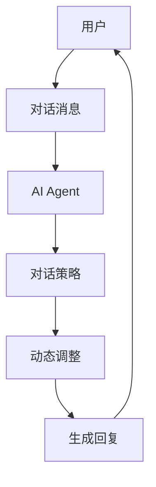
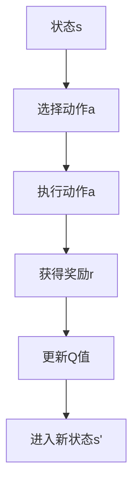
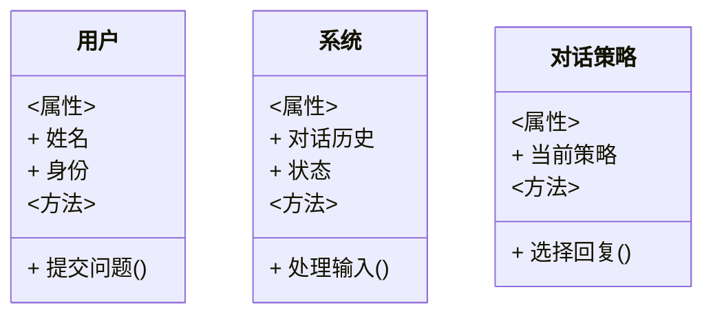
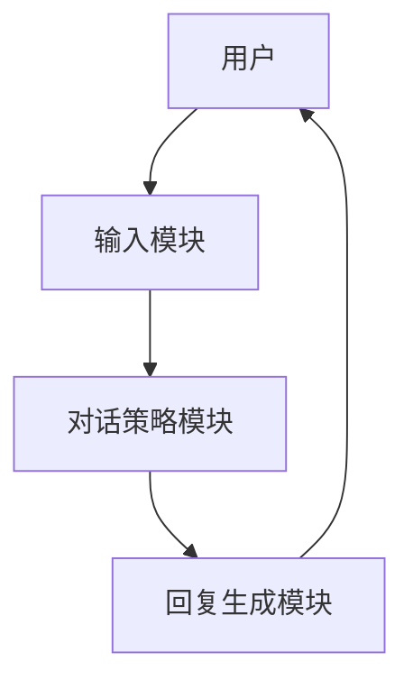
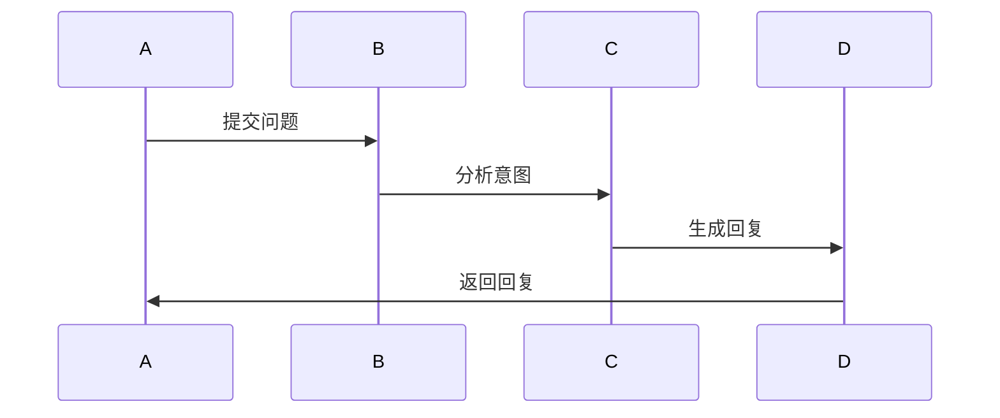

                 


# 自适应对话策略：提升AI Agent的交互质量

> **关键词**：自适应对话策略, AI Agent, 交互质量, 对话系统, 自然语言处理, 强化学习

> **摘要**：  
本文深入探讨了自适应对话策略在提升AI Agent交互质量中的核心作用。通过分析对话策略的基本概念、自适应机制、算法原理、系统架构以及实际应用，本文为读者提供了从理论到实践的全面指导。通过对比分析、算法讲解和案例实战，帮助读者理解如何通过自适应对话策略优化AI Agent的交互体验。

---

## 第1章: 对话策略与自适应交互概述

### 1.1 对话策略的基本概念

#### 1.1.1 对话策略的定义
对话策略是AI Agent在与用户进行对话时，根据当前对话状态、用户意图和系统目标，选择合适的回复内容和交互方式的规则或模型。其目标是通过优化对话流程，提升用户满意度和任务完成效率。

#### 1.1.2 自适应对话策略的核心特征
自适应对话策略具有以下核心特征：
- **动态性**：能够根据对话进展实时调整策略。
- **个性化**：根据用户特征（如性格、情绪）提供定制化服务。
- **上下文感知**：充分考虑对话历史和当前语境。

#### 1.1.3 对话策略在AI Agent中的作用
对话策略是AI Agent实现高效交互的关键桥梁，负责连接自然语言理解（NLU）和生成（NLG）模块，确保对话过程流畅且符合用户需求。

---

### 1.2 自适应对话策略的背景与问题背景

#### 1.2.1 当前对话系统的主要挑战
传统对话系统面临以下挑战：
- **语境理解不足**：难以处理多轮对话中的上下文关联。
- **意图识别错误**：用户表达模糊时，系统难以准确理解需求。
- **策略固定**：缺乏灵活性，无法根据实时反馈调整对话方向。

#### 1.2.2 自然语言处理中的对话策略问题
- **信息抽取不准确**：对话系统难以从复杂语境中提取关键信息。
- **策略选择单一**：面对多意图输入时，系统难以权衡选择最优策略。

#### 1.2.3 用户需求与系统响应的不匹配问题
用户期望AI Agent能够理解其隐含需求，而系统往往仅根据显式输入进行回复，导致交互体验不佳。

---

### 1.3 自适应对话策略的目标与边界

#### 1.3.1 自适应对话策略的目标
- **提高交互准确率**：通过动态调整策略，减少对话歧义。
- **增强用户体验**：提供更自然、流畅的对话流程。
- **提升任务完成效率**：优化对话流程，缩短用户达成目标的时间。

#### 1.3.2 边界与外延
- **边界**：专注于对话策略层面，不涉及自然语言处理的其他环节（如分词、实体识别）。
- **外延**：可与其他技术（如情感分析、知识图谱）结合，提升交互质量。

#### 1.3.3 核心概念与关键要素组成
- **对话上下文**：包括对话历史、用户意图、系统状态等。
- **用户特征**：如性格、情绪、偏好等。
- **策略调整机制**：根据反馈动态优化对话策略。

---

### 1.4 自适应对话策略的核心要素

#### 1.4.1 对话上下文的构建
对话上下文是自适应对话策略的基础，主要包括：
- **对话历史**：记录用户和系统的过往交互内容。
- **当前状态**：包括用户意图、系统目标等实时信息。

#### 1.4.2 用户意图的理解与预测
通过自然语言理解技术，识别用户的显式和隐式需求，为策略选择提供依据。

#### 1.4.3 动态调整的策略机制
根据实时反馈和对话进展，调整对话策略，优化交互体验。

---

### 1.5 本章小结
本章介绍了对话策略的基本概念、自适应对话策略的核心特征及其在AI Agent中的作用。通过分析当前对话系统面临的挑战，明确了自适应对话策略的目标与边界，并总结了其核心要素。

---

## 第2章: 自适应对话策略的核心概念与联系

### 2.1 自适应对话策略的原理

#### 2.1.1 基于强化学习的策略优化
通过强化学习（Reinforcement Learning）不断优化对话策略，使系统在与用户的交互中逐步提升表现。

#### 2.1.2 基于监督学习的策略训练
利用标注数据训练对话策略模型，使其能够根据输入生成合适的回复。

#### 2.1.3 基于生成模型的策略生成
使用生成模型（如GPT）生成多样化的回复，结合策略选择最佳回复。

---

### 2.2 核心概念对比分析

#### 2.2.1 对话策略与对话生成的对比
- 对话策略：选择合适的回复内容和方式。
- 对话生成：根据策略生成具体的回复文本。

#### 2.2.2 自适应策略与固定策略的对比
| 特性       | 自适应策略       | 固定策略       |
|------------|------------------|----------------|
| 灵活性      | 高               | 低             |
| 适应性      | 强               | 弱             |
| 交互效果    | 更优             | 较差           |

#### 2.2.3 不同策略的优缺点分析
- **优点**：自适应策略能够根据用户反馈动态调整，提供更个性化的服务。
- **缺点**：实现复杂，需要处理大量实时数据。

---

### 2.3 实体关系图与流程图

#### 2.3.1 自适应对话策略的ER实体关系图
```mermaid
er
actor: 用户
agent: AI Agent
message: 对话消息
strategy: 对话策略
goal: 对话目标
```

#### 2.3.2 自适应对话策略的流程图


---

### 2.4 本章小结
本章通过对比分析和图示，详细解释了自适应对话策略的核心概念及其与其他技术的联系，为后续的算法原理和系统设计奠定了基础。

---

## 第3章: 自适应对话策略的算法原理

### 3.1 基于强化学习的策略优化

#### 3.1.1 强化学习的基本原理
强化学习通过智能体与环境的交互，逐步学习最优策略。其核心是通过奖励机制（Reward）优化动作选择（Action）。

#### 3.1.2 Q-learning算法在对话策略中的应用
Q-learning算法通过更新Q值函数，选择最优动作。其数学公式为：
$$ Q(s, a) = Q(s, a) + \alpha (r + \max Q(s', a') - Q(s, a)) $$
其中：
- \( s \)：当前状态
- \( a \)：动作
- \( r \)：奖励
- \( \alpha \)：学习率

#### 3.1.3 算法流程图


---

### 3.2 基于监督学习的策略训练

#### 3.2.1 监督学习的基本原理
监督学习通过标注数据训练模型，使其能够根据输入生成预测输出。

#### 3.2.2 对话策略训练的数学模型
常用损失函数为交叉熵损失：
$$ \mathcal{L} = -\sum_{i=1}^{n} y_i \log p(y_i) $$
其中：
- \( y_i \)：真实标签
- \( p(y_i) \)：模型预测概率

---

### 3.3 基于生成模型的策略生成

#### 3.3.1 生成模型的基本原理
生成模型（如GPT）通过概率分布生成多样化的回复。

#### 3.3.2 对话策略生成的数学模型
使用概率生成模型，计算每个回复的概率：
$$ P(y|x) = \frac{1}{Z} \exp(\theta \cdot f(x, y)) $$
其中：
- \( x \)：输入
- \( y \)：输出
- \( f(x, y) \)：特征函数
- \( \theta \)：模型参数
- \( Z \)：归一化因子

---

### 3.4 本章小结
本章详细讲解了自适应对话策略的算法原理，包括强化学习、监督学习和生成模型的应用，并通过公式和流程图展示了算法的核心思想。

---

## 第4章: 系统分析与架构设计方案

### 4.1 问题场景介绍
本章以一个智能客服系统为例，分析自适应对话策略的实际应用场景。

### 4.2 系统功能设计

#### 4.2.1 领域模型类图


#### 4.2.2 系统架构图


#### 4.2.3 系统交互序列图


---

### 4.3 本章小结
本章通过系统设计和架构图，展示了自适应对话策略在实际项目中的应用，为后续的系统实现提供了参考。

---

## 第5章: 项目实战

### 5.1 环境安装
安装Python和相关库（如TensorFlow、Keras）。

### 5.2 系统核心实现源代码

#### 5.2.1 对话策略模块代码
```python
class DialogueStrategy:
    def __init__(self):
        self.current_policy = 'random'

    def select_response(self, context):
        # 根据上下文选择最佳回复
        pass
```

#### 5.2.2 回复生成模块代码
```python
def generate_response(context, policy):
    # 根据策略生成回复
    pass
```

### 5.3 代码应用解读与分析
解释代码的功能和实现细节，如策略选择和回复生成的逻辑。

### 5.4 实际案例分析
以具体案例分析自适应对话策略的实际应用效果。

### 5.5 本章小结
本章通过代码实现和案例分析，帮助读者理解自适应对话策略的实战应用。

---

## 第6章: 最佳实践

### 6.1 小结
总结全文内容，强调自适应对话策略的重要性。

### 6.2 注意事项
- 数据质量对策略优化至关重要。
- 需要结合具体场景进行策略调整。

### 6.3 拓展阅读
推荐相关领域的书籍和论文，供读者深入学习。

---

## 作者信息

作者：AI天才研究院/AI Genius Institute & 禅与计算机程序设计艺术 /Zen And The Art of Computer Programming

---

以上是文章的详细内容，涵盖了从理论到实践的各个方面，帮助读者全面理解自适应对话策略的核心思想和应用方法。

