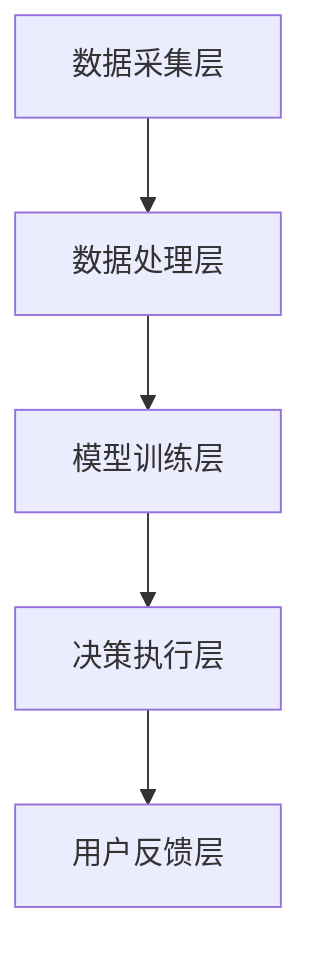
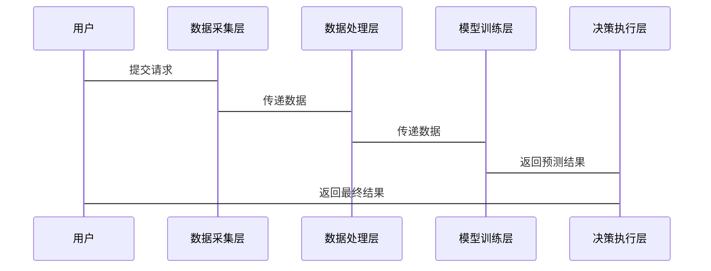

                 


# 芒格的"mental models"在人工智能辅助决策中的应用

> 关键词：芒格，mental models，人工智能，决策，思维模型，算法，系统架构，项目实战

> 摘要：本文探讨了芒格提出的“mental models”在人工智能辅助决策中的应用。通过分析“mental models”的核心概念、思维模型及其在AI决策系统中的具体应用，结合算法实现和系统设计，展示了如何利用这些思维模型优化AI辅助决策过程。文章结合实际项目案例，详细讲解了从理论到实践的全过程，为读者提供了一套完整的解决方案。

---

# 第1章: 芒格"mental models"的核心概念

## 1.1 "mental models"的定义与背景

### 1.1.1 "mental models"的起源与演变
“mental models”是由查理·芒格提出的，是指通过多学科思维模型来分析问题、做出决策的一种方法。这种方法的核心在于将复杂的现实问题拆解为多个简单的模型，通过模型之间的相互作用来理解问题的本质。

### 1.1.2 芒格对"mental models"的贡献
芒格在其职业生涯中，通过不断学习和应用多个领域的知识，形成了独特的“mental models”体系。他强调，决策者需要掌握多个思维模型，并在实际问题中灵活运用这些模型。

### 1.1.3 "mental models"在决策中的作用
“mental models”通过提供多个视角和分析工具，帮助决策者更好地理解问题、预测结果，并制定最优的决策方案。这种方法在商业、投资、管理等领域得到了广泛应用。

---

## 1.2 "mental models"的核心要素

### 1.2.1 知识体系的构建
“mental models”要求决策者具备广泛的知识储备，能够从多个角度分析问题。这包括经济学、心理学、物理学等领域的基本原理。

### 1.2.2 多学科思维模型的整合
芒格强调，决策者需要将不同学科的思维模型结合起来，形成一个完整的知识体系。例如，将经济学的“ incentives”模型与心理学的“惯性思维”模型结合起来，可以更好地理解市场行为。

### 1.2.3 模型之间的相互关联与协同
不同思维模型之间并非孤立存在，而是通过相互关联和协同作用，形成一个完整的决策框架。这种协同作用能够帮助决策者避免单一模型的局限性。

---

## 1.3 "mental models"与人工智能的结合

### 1.3.1 AI在决策中的优势
人工智能通过大数据分析和机器学习算法，能够快速处理海量信息，并从中提取规律。这种方法在处理复杂问题时，往往比人类决策者更高效。

### 1.3.2 "mental models"在AI辅助决策中的应用潜力
“mental models”为AI决策系统提供了理论基础。通过将多个思维模型嵌入到AI系统中，可以实现更加智能化和个性化的决策支持。

### 1.3.3 人工智能如何增强"mental models"的效果
人工智能可以通过数据挖掘和模式识别，帮助决策者发现新的思维模型，并通过算法优化，提升“mental models”的应用效果。

---

# 第2章: 芒格"mental models"的核心思维模型

## 2.1 基础思维模型

### 2.1.1 inversion思维模型
inversion思维模型是一种反向思考方法，即通过分析问题的对立面，来寻找问题的最优解决方案。例如，在投资决策中，通过分析可能的失败原因，来避免投资风险。

### 2.1.2 马太效应模型
马太效应模型描述了资源分配的不均衡现象。在商业决策中，可以通过识别马太效应的特征，来预测市场趋势和竞争优势。

### 2.1.3 循环思维模型
循环思维模型强调问题的动态性和周期性。通过分析问题的循环变化规律，可以帮助决策者制定更具前瞻性的决策策略。

---

## 2.2 高级思维模型

### 2.2.1 第一性原理模型
第一性原理模型要求从问题的本质出发，通过分解和重构，找到问题的最佳解决方案。这种方法在技术创新和产品设计中具有重要意义。

### 2.2.2 贝叶斯推理模型
贝叶斯推理模型是一种基于概率论的决策方法。通过分析事件发生的概率，可以帮助决策者做出更准确的预测和判断。

### 2.2.3 资本分配模型
资本分配模型是芒格在投资决策中提出的一种方法，通过分析资本的流动和分配规律，来预测市场趋势和投资机会。

---

## 2.3 思维模型的分类与对比

### 2.3.1 分类依据与标准
思维模型可以根据应用领域、分析维度、决策类型等多个维度进行分类。例如，可以根据应用领域分为经济模型、社会模型等。

### 2.3.2 各类模型的优缺点对比
不同思维模型在不同场景下具有不同的优缺点。例如，第一性原理模型具有高度的通用性，但在具体问题中可能需要更多的数据支持。

### 2.3.3 模型间的相互关系与协同
思维模型之间并非孤立存在，而是通过相互关联和协同作用，形成一个完整的决策框架。这种协同作用能够帮助决策者避免单一模型的局限性。

---

# 第3章: "mental models"在AI辅助决策中的应用

## 3.1 AI辅助决策的基本框架

### 3.1.1 数据驱动的决策过程
AI辅助决策的核心是通过大数据分析和机器学习算法，从数据中提取规律和洞察。这种数据驱动的方法能够帮助决策者做出更加科学和准确的决策。

### 3.1.2 知识驱动的决策过程
除了数据，知识和经验也是决策的重要依据。通过将“mental models”中的思维模型嵌入到AI系统中，可以实现知识驱动的决策支持。

### 3.1.3 数据与知识的结合
数据和知识的结合是AI辅助决策的核心。通过将数据驱动和知识驱动的方法结合起来，可以实现更加全面和准确的决策支持。

---

## 3.2 "mental models"在AI决策中的具体应用

### 3.2.1 数据处理与特征提取
在AI决策系统中，数据的预处理和特征提取是关键步骤。通过应用“mental models”中的思维模型，可以更好地识别数据中的关键特征。

### 3.2.2 模型选择与优化
AI决策系统需要选择合适的算法和模型。通过将“mental models”中的思维模型作为指导，可以优化模型的选择和调优过程。

### 3.2.3 结果解释与反馈
AI决策系统的输出需要能够被决策者理解和应用。通过“mental models”中的思维模型，可以实现决策结果的解释和反馈优化。

---

## 3.3 AI辅助决策中的思维模型优化

### 3.3.1 模型的动态调整
AI决策系统需要能够根据实际情况动态调整模型和算法。通过将“mental models”中的思维模型作为指导，可以实现模型的动态优化。

### 3.3.2 知识体系的持续更新
“mental models”需要不断更新和扩展。AI系统可以通过持续学习和知识更新，保持决策模型的有效性和先进性。

### 3.3.3 多模型协同优化
通过将多个思维模型结合起来，可以实现多模型的协同优化。这种协同作用能够提升AI决策系统的整体性能和决策效果。

---

# 第4章: 基于"mental models"的AI决策算法

## 4.1 基础算法原理

### 4.1.1 决策树算法
决策树是一种常用的机器学习算法，通过构建树状结构来实现分类和回归任务。在AI决策系统中，决策树可以用来帮助决策者制定决策策略。

### 4.1.2 随机森林算法
随机森林是一种基于决策树的集成算法，通过组合多个决策树的预测结果，可以提高模型的准确性和稳定性。

### 4.1.3 支持向量机算法
支持向量机是一种监督学习算法，通过构建超平面来实现数据的分类。在AI决策系统中，支持向量机可以用来处理复杂的分类问题。

---

## 4.2 基于"mental models"的改进算法

### 4.2.1 基于inversion模型的决策优化
通过将inversion思维模型嵌入到AI决策系统中，可以实现决策优化。例如，在投资决策中，可以通过分析可能的失败原因，来优化投资策略。

### 4.2.2 基于第一性原理的特征选择
第一性原理模型可以帮助AI系统更好地选择关键特征。通过分析问题的本质，可以更准确地提取数据中的关键信息。

### 4.2.3 基于贝叶斯推理的动态调整
贝叶斯推理模型可以帮助AI系统实现动态调整。通过分析事件发生的概率，可以优化模型的预测和决策能力。

---

# 第5章: 系统架构与设计

## 5.1 问题场景介绍

### 5.1.1 问题背景
在实际应用中，AI辅助决策系统需要处理复杂的问题。例如，在电商领域，如何通过AI系统优化客户推荐策略。

### 5.1.2 项目介绍
本项目旨在通过构建一个基于“mental models”的AI决策系统，实现客户行为预测和推荐策略优化。

---

## 5.2 系统功能设计

### 5.2.1 领域模型设计
通过构建领域模型，可以明确系统的核心功能和模块。例如，在电商推荐系统中，需要设计用户画像、行为分析、推荐策略等功能模块。

### 5.2.2 系统架构设计
系统的架构设计需要考虑模块之间的协作和数据流的传递。例如，可以通过分层架构，将系统划分为数据采集层、数据处理层、模型训练层和决策执行层。

---

## 5.3 系统架构实现

### 5.3.1 系统架构图
通过mermaid图展示系统架构，明确各模块之间的关系和功能。



### 5.3.2 接口设计
系统需要设计合理的接口，确保各模块之间的数据传递和协作。例如，可以通过RESTful API实现模块之间的通信。

### 5.3.3 交互流程设计
通过mermaid序列图，展示系统各模块之间的交互流程。



---

## 5.4 系统实现细节

### 5.4.1 数据处理与特征提取
通过Python代码实现数据的预处理和特征提取。例如，使用Pandas库进行数据清洗，使用Scikit-learn库进行特征选择。

```python
import pandas as pd
from sklearn.feature_selection import SelectKBest, chi2

# 数据加载
data = pd.read_csv('data.csv')

# 特征提取
selector = SelectKBest(score_func=chi2, k=10)
selected_features = selector.fit_transform(data)
```

### 5.4.2 模型训练与优化
通过机器学习算法实现模型训练和优化。例如，使用XGBoost算法进行模型训练，并通过网格搜索优化模型参数。

```python
from xgboost import XGBClassifier
from sklearn.model_selection import GridSearchCV

# 模型训练
model = XGBClassifier()

# 参数优化
param_grid = {
    'n_estimators': [100, 200],
    'max_depth': [3, 4, 5],
    'learning_rate': [0.01, 0.05, 0.1]
}

grid_search = GridSearchCV(model, param_grid, cv=5)
grid_search.fit(X_train, y_train)
```

---

## 5.5 项目实战与案例分析

### 5.5.1 电商推荐系统案例
通过构建一个电商推荐系统，展示“mental models”在AI决策中的具体应用。例如，如何通过用户画像和行为分析，优化推荐策略。

### 5.5.2 系统性能分析
通过实验分析系统的性能指标，例如准确率、召回率、F1分数等。通过对比不同算法的性能，选择最优的决策模型。

### 5.5.3 系统优化与改进
根据实验结果，对系统进行优化和改进。例如，通过调整模型参数、优化数据处理流程等，提升系统的整体性能。

---

## 5.6 项目总结与经验分享

### 5.6.1 项目小结
总结项目的实施过程和主要成果，分析系统的优势和不足。

### 5.6.2 最佳实践
分享项目中的最佳实践，例如如何选择合适的算法、如何优化系统性能等。

### 5.6.3 注意事项
提醒读者在实际应用中需要注意的问题，例如数据隐私、模型泛化能力等。

### 5.6.4 拓展阅读
推荐相关领域的书籍和资源，帮助读者进一步学习和深入研究。

---

# 第6章: 总结与展望

## 6.1 总结
本文详细探讨了芒格的“mental models”在人工智能辅助决策中的应用。通过理论分析和实际案例，展示了如何利用这些思维模型优化AI决策系统。

## 6.2 展望
未来，随着人工智能技术的不断发展，“mental models”在决策中的应用将更加广泛和深入。通过结合更多领域的知识模型，AI决策系统将能够实现更加智能化和个性化的决策支持。

---

# 作者：AI天才研究院/AI Genius Institute & 禅与计算机程序设计艺术 /Zen And The Art of Computer Programming

