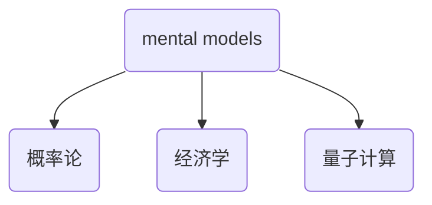
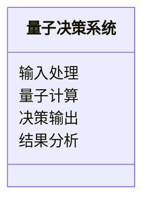
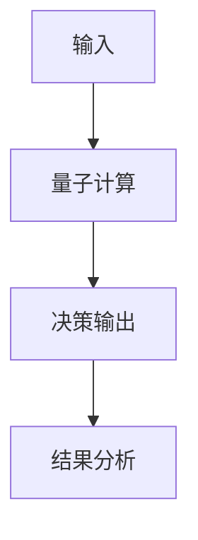

                 


# 芒格的"mental models"在量子人工智能决策系统中的应用

## 关键词：芒格、mental models、量子人工智能、决策系统、算法原理、系统架构、项目实战

## 摘要：本文探讨了芒格的“mental models”在量子人工智能决策系统中的应用，分析了其核心概念、算法原理、系统架构，并通过实际案例展示了其在量子AI中的优势和潜力。

---

## 第一部分：芒格的"mental models"概述

### 第1章：芒格的"mental models"核心概念

#### 1.1 芒格"mental models"定义与起源

1.1.1 芒格"mental models"的定义  
芒格的"mental models"是指人类在决策过程中使用的各种思维框架，这些框架帮助我们理解和分析问题。每个模型都是一个简化版的现实，帮助我们在复杂的情况下做出更明智的决策。

1.1.2 芒格"mental models"的起源与背景  
"mental models"的概念起源于查理·芒格的“知识的框架”理论，他认为人类决策的质量取决于所使用的模型数量和质量。芒格强调，决策者需要掌握多个学科的核心模型，并能够将它们结合起来解决复杂问题。

1.1.3 芒格"mental models"在决策中的重要性  
"mental models"通过简化复杂问题，帮助我们在决策过程中避免常见错误，从而提高决策的准确性和效率。这些模型在量子人工智能中尤其重要，因为它们可以帮助我们处理量子叠加和纠缠等复杂现象。

#### 1.2 芒格"mental models"的核心要素

1.2.1 "mental models"的核心组成  
"mental models"的核心组成包括基本原理、逻辑关系和应用场景。每个模型都基于特定的学科知识，例如概率论、经济学、物理学等。

1.2.2 "mental models"的属性特征对比表格  
| 属性 | 特征 | 描述 |
|------|------|------|
| 基础学科 | 概率论 | 用于分析不确定性问题 |
| 应用场景 | 量子计算 | 用于处理量子叠加和纠缠问题 |
| 逻辑关系 | 因果关系 | 分析事件之间的因果关系 |

1.2.3 "mental models"的ER实体关系图  


1.3 芒格"mental models"与量子AI的联系

1.3.1 "mental models"在量子AI中的应用潜力  
"mental models"可以帮助量子AI系统更好地理解和处理复杂问题，尤其是在涉及多个变量和不确定性的情况下。

1.3.2 "mental models"与量子决策系统的结合方式  
通过将"mental models"应用于量子决策系统，可以利用量子计算的并行性和叠加性来提高决策效率和准确性。

1.3.3 "mental models"在量子AI中的优势  
"mental models"可以帮助量子AI系统更好地理解和处理复杂问题，尤其是在涉及多个变量和不确定性的情况下。

---

## 第二部分：量子人工智能决策系统基础

### 第2章：量子人工智能决策系统概述

#### 2.1 量子人工智能的基本概念

2.1.1 量子计算的定义与特点  
量子计算是一种利用量子叠加和量子纠缠现象进行计算的技术，其特点是计算速度远快于经典计算机。

2.1.2 量子人工智能的定义与目标  
量子人工智能是指利用量子计算技术来实现更高效的智能系统，其目标是解决经典人工智能无法高效处理的复杂问题。

2.1.3 量子人工智能与经典人工智能的区别  
量子人工智能利用量子计算的并行性和叠加性，能够更高效地处理复杂问题，尤其是在涉及大量数据和变量的情况下。

#### 2.2 量子决策系统的原理

2.2.1 量子决策的基本原理  
量子决策系统利用量子叠加和纠缠现象，能够在同一时刻处理多个可能性，从而提高决策的效率和准确性。

2.2.2 量子叠加与量子纠缠在决策中的应用  
量子叠加允许系统同时考虑多个可能性，而量子纠缠则允许不同部分的系统之间形成相关性，从而提高决策的准确性。

2.2.3 量子测量在决策过程中的作用  
量子测量是将量子系统与经典决策系统连接的关键步骤，它通过测量量子状态来提取决策所需的信息。

#### 2.3 量子AI在决策系统中的优势

2.3.1 量子并行性对决策效率的提升  
量子并行性允许系统在同一时间处理多个可能性，从而显著提高决策效率。

2.3.2 量子叠加性对多维决策问题的处理优势  
量子叠加性允许系统同时考虑多个变量，从而更好地处理多维决策问题。

2.3.3 量子纠缠性对复杂决策系统的支持  
量子纠缠性允许不同部分的系统之间形成相关性，从而更好地处理复杂决策系统。

---

## 第三部分：量子人工智能决策系统的算法原理

### 第3章：量子人工智能决策系统的算法原理

#### 3.1 量子叠加在决策系统中的应用

3.1.1 量子叠加的基本原理  
量子叠加允许系统同时处于多个状态，从而在决策过程中考虑多个可能性。

3.1.2 量子叠加在决策系统中的实现  
通过量子叠加，系统可以同时考虑多个决策选项，从而提高决策的效率和准确性。

3.1.3 量子叠加与"mental models"的结合  
将"mental models"应用于量子叠加，可以更好地处理复杂问题，尤其是在涉及多个变量的情况下。

#### 3.2 量子纠缠在决策系统中的应用

3.2.1 量子纠缠的基本原理  
量子纠缠允许不同部分的系统之间形成相关性，从而提高决策的准确性。

3.2.2 量子纠缠在决策系统中的实现  
通过量子纠缠，系统可以更好地处理复杂决策问题，尤其是在涉及多个变量的情况下。

3.2.3 量子纠缠与"mental models"的结合  
将"mental models"应用于量子纠缠，可以更好地处理复杂问题，尤其是在涉及多个变量的情况下。

#### 3.3 量子测量在决策系统中的应用

3.3.1 量子测量的基本原理  
量子测量是将量子系统与经典决策系统连接的关键步骤，它通过测量量子状态来提取决策所需的信息。

3.3.2 量子测量在决策系统中的实现  
通过量子测量，系统可以将量子叠加和纠缠的状态转换为经典决策信息，从而做出更明智的决策。

3.3.3 量子测量与"mental models"的结合  
将"mental models"应用于量子测量，可以更好地处理复杂问题，尤其是在涉及多个变量的情况下。

---

## 第四部分：量子人工智能决策系统的系统架构

### 第4章：量子人工智能决策系统的系统架构

#### 4.1 量子人工智能决策系统的功能设计

4.1.1 量子决策系统的功能模块  
量子决策系统主要包括输入处理、量子计算、决策输出和结果分析四个功能模块。

4.1.2 量子决策系统的领域模型  


4.1.3 量子决策系统的架构图  


#### 4.2 量子人工智能决策系统的接口设计

4.2.1 量子决策系统的接口模块  
量子决策系统需要与外部系统进行交互，主要包括输入接口、输出接口和控制接口。

4.2.2 量子决策系统的接口协议  
量子决策系统的接口协议包括量子叠加协议、量子纠缠协议和量子测量协议。

4.2.3 量子决策系统的交互流程  
```mermaid
sequenceDiagram
    用户 --> 输入接口：提交决策请求
    输入接口 --> 量子计算模块：进行量子计算
    量子计算模块 --> 输出接口：返回决策结果
    输出接口 --> 用户：显示决策结果
```

---

## 第五部分：量子人工智能决策系统的项目实战

### 第5章：量子人工智能决策系统的项目实战

#### 5.1 量子人工智能决策系统的环境安装

5.1.1 量子计算环境的安装  
需要安装量子计算开发工具和量子计算模拟器。

5.1.2 量子人工智能开发工具的安装  
需要安装量子人工智能开发框架和相关库。

5.1.3 量子决策系统运行环境的配置  
配置量子计算环境和人工智能开发环境，确保系统能够正常运行。

#### 5.2 量子人工智能决策系统的代码实现

5.2.1 量子叠加的实现  
```python
import numpy as np
from qiskit import QuantumCircuit, execute, Aer

def quantum_superposition(n_qubits):
    circuit = QuantumCircuit(n_qubits)
    circuit.h(range(n_qubits))
    return circuit
```

5.2.2 量子纠缠的实现  
```python
def quantum_entanglement(n_qubits):
    circuit = QuantumCircuit(n_qubits)
    circuit.h(0)
    circuit.cnot(0, 1)
    return circuit
```

5.2.3 量子测量的实现  
```python
def quantum_measurement(circuit):
    backend = Aer.get_backend('qasm_simulator')
    result = execute(circuit, backend).result()
    return result.get_counts()
```

#### 5.3 量子人工智能决策系统的案例分析

5.3.1 量子决策系统的案例背景  
以金融投资为例，量子决策系统可以帮助投资者更好地处理复杂的市场波动。

5.3.2 量子决策系统的案例分析  
通过量子叠加和纠缠，系统可以同时考虑多个投资选项，从而做出更明智的决策。

5.3.3 量子决策系统的案例总结  
量子决策系统在金融投资中的应用展示了其在处理复杂问题中的优势。

---

## 第六部分：量子人工智能决策系统的最佳实践

### 第6章：量子人工智能决策系统的最佳实践

#### 6.1 量子人工智能决策系统的注意事项

6.1.1 系统的可扩展性  
需要注意量子计算系统的可扩展性，以应对未来更大的数据量和更复杂的决策问题。

6.1.2 系统的安全性  
需要确保量子决策系统的安全性，防止数据泄露和系统攻击。

6.1.3 系统的可维护性  
需要确保量子决策系统的可维护性，以便在未来进行系统升级和功能扩展。

#### 6.2 量子人工智能决策系统的未来趋势

6.2.1 量子计算技术的进步  
随着量子计算技术的进步，量子决策系统将变得更加高效和强大。

6.2.2 量子人工智能的应用拓展  
量子人工智能将在更多领域得到应用，尤其是在需要处理复杂问题的领域。

6.2.3 量子决策系统的集成发展  
量子决策系统将与经典人工智能系统更加紧密地集成，形成更强大的决策支持系统。

---

## 结语

芒格的"mental models"在量子人工智能决策系统中的应用展示了其在处理复杂问题中的巨大潜力。通过结合量子计算的并行性和叠加性，"mental models"可以帮助量子AI系统做出更明智的决策。未来，随着量子计算技术的进步，"mental models"在量子人工智能中的应用将更加广泛和深入。

---

## 作者：AI天才研究院/AI Genius Institute & 禅与计算机程序设计艺术 /Zen And The Art of Computer Programming

