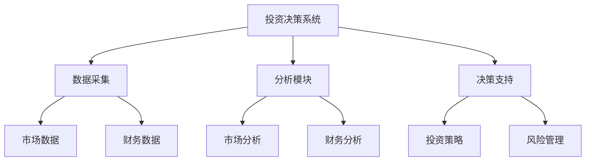

                 


# 芒格的"不做"清单：避免投资陷阱

## 关键词：芒格投资哲学，不做清单，风险管理，投资陷阱，价值投资，心理偏差

## 摘要：芒格的“不做”清单是一种投资策略，强调通过避免常见错误和陷阱来实现稳健投资。本文从芒格的投资哲学出发，详细探讨了“不做”清单的核心内容，包括避免投机、过度杠杆和情绪化交易，并结合风险管理策略和实际案例，为投资者提供实用的指导。通过系统化的分析和工具应用，帮助读者构建稳健的投资体系，提升投资决策的科学性和有效性。

---

# 第1章: 引言

## 1.1 芒格投资哲学的概述

### 1.1.1 芒格的生平简介

查理·芒格（Charlie Munger）是世界著名投资家、伯克希尔·哈撒韦公司副董事长，被誉为“巴菲特的黄金搭档”。他不仅是投资领域的传奇人物，更是心理学、经济学等多领域知识的跨界专家。芒格的投资哲学以“格栅思维”为核心，强调通过多学科的交叉分析来做出更明智的决策。

### 1.1.2 芒格投资哲学的核心理念

芒格的投资哲学强调长期价值投资、安全边际和风险管理。他认为，投资不仅仅是对市场的分析，更是对人性的洞察。他提出的“格栅思维”模型，通过将不同学科的智慧整合，帮助投资者避免常见的心理偏差和认知错误。

### 1.1.3 "不做"清单的概念与意义

“不做”清单是芒格投资哲学的重要组成部分，它列出了一系列投资者应该避免的行为和决策。通过明确“不做”的事项，投资者可以避免陷入常见的投资陷阱，从而提高决策的科学性和稳健性。

## 1.2 投资中的陷阱与风险

### 1.2.1 市场波动与情绪化决策

市场波动是投资中的常见现象，但情绪化决策往往会导致投资者在市场低点卖出或在高点买入，从而造成损失。芒格强调，投资者需要克服情绪化，坚持长期价值投资。

### 1.2.2 过度自信与认知偏差

投资者常常因为过度自信或认知偏差而做出错误决策。例如，确认偏差、从众心理等都会影响投资判断。芒格提醒投资者要保持谦逊，避免因过度自信而忽视潜在风险。

### 1.2.3 信息过载与决策疲劳

在信息爆炸的时代，投资者容易被大量信息淹没，导致决策疲劳。芒格建议投资者专注于关键信息，避免被噪声干扰，从而做出更清晰的决策。

---

# 第2章: 芒格的格栅思维模型

## 2.1 格栅思维的核心概念

### 2.1.1 格栅思维的定义

格栅思维（Lattice Thinking）是芒格提出的一种多学科交叉的思维方式。它通过将不同学科的知识整合到一个网格（格栅）中，帮助投资者更全面地分析问题。

### 2.1.2 格栅思维的构成要素

格栅思维的构成要素包括心理学、经济学、金融学、统计学等多个学科。通过将这些学科的智慧整合，投资者可以更好地理解市场的复杂性。

### 2.1.3 格栅思维与投资决策的关系

格栅思维帮助投资者避免单一视角的局限，从而做出更全面的投资决策。例如，通过心理学视角理解市场的非理性行为，通过经济学视角分析市场趋势。

## 2.2 投资决策中的多学科交叉

### 2.2.1 经济学视角

经济学视角帮助投资者理解市场的供需关系、价格机制和经济周期。例如，通过分析经济周期的波动，投资者可以更好地判断市场的整体趋势。

### 2.2.2 心理学视角

心理学视角帮助投资者理解市场参与者的心理行为。例如，通过分析投资者的心理偏差，可以预测市场的非理性波动。

### 2.2.3 金融学视角

金融学视角帮助投资者分析资产的内在价值、风险和回报。例如，通过DCF模型评估企业的内在价值。

---

# 第3章: "不做"清单的核心内容

## 3.1 不做投机性投资

### 3.1.1 投机与投资的区分

投机性投资是指通过短期价格波动获利的行为，而投资则是通过长期持有优质资产实现价值增长的行为。芒格认为，投机性投资风险极高，容易导致亏损。

### 3.1.2 避免投机的策略

芒格建议投资者通过以下策略避免投机：
- 长期价值投资：选择具有持续竞争优势和良好治理的企业。
- 分散投资：通过分散投资降低风险。
- 风险管理：设置止损点，避免重大损失。

### 3.1.3 投机带来的风险

投机性投资容易导致以下风险：
- 市场波动风险：价格波动可能导致重大损失。
- 过度杠杆风险：杠杆放大了亏损的可能性。
- 心理压力风险：频繁交易可能导致心理压力和决策疲劳。

## 3.2 不做过度杠杆投资

### 3.2.1 过度杠杆的定义

过度杠杆是指通过大量借款进行投资，杠杆比例过高，导致投资风险急剧增加。

### 3.2.2 过度杠杆的风险

过度杠杆可能导致以下风险：
- 利息负担加重：债务利息可能超过投资收益。
- 资产贬值风险：资产价格下跌可能导致无法偿还债务。
- 市场波动风险：市场下跌时，杠杆放大了亏损。

## 3.3 不做情绪化交易

### 3.3.1 情绪化交易的定义

情绪化交易是指投资者因情绪波动而做出的非理性决策，例如在市场恐慌时抛售资产或在市场狂热时追涨杀跌。

### 3.3.2 情绪化交易的危害

情绪化交易可能导致以下问题：
- 错失长期投资机会：因恐慌抛售优质资产。
- 追涨杀跌：高价买入低价卖出，导致亏损。
- 心理压力：频繁交易可能导致心理压力和疲劳。

---

# 第4章: 投资风险管理策略

## 4.1 风险管理的重要性

### 4.1.1 风险管理的定义

风险管理是指通过识别、评估和控制风险，降低投资损失的可能性。

### 4.1.2 风险管理的核心原则

风险管理的核心原则包括：
- 风险与收益匹配：根据风险承受能力选择投资标的。
- 分散投资：通过多样化投资降低风险。
- 定期评估：根据市场变化定期调整投资组合。

## 4.2 风险管理的具体策略

### 4.2.1 安全边际的概念

安全边际是指投资价格低于内在价值的部分。通过安全边际，投资者可以降低因市场价格波动带来的风险。

### 4.2.2 投资组合分散化

通过分散投资不同资产类别和行业，投资者可以降低特定资产的风险。

### 4.2.3 止损策略的应用

止损策略是指在资产价格下跌到一定程度时，及时卖出以避免进一步损失。

---

# 第5章: 案例分析

## 5.1 投资陷阱的典型案例

### 5.1.1 2008年金融危机

2008年金融危机中，许多投资者因过度杠杆和投机行为而遭受重大损失。芒格提醒投资者，要避免过度杠杆和投机性投资。

### 5.1.2 技术股泡沫

2000年互联网泡沫破裂时，许多投资者因追涨杀跌而遭受重大损失。芒格强调，投资者要避免情绪化交易。

## 5.2 如何避免投资陷阱

### 5.2.1 选择优质资产

通过选择具有持续竞争优势和良好治理的企业，投资者可以降低风险。

### 5.2.2 遵循价值投资原则

价值投资原则强调长期持有优质资产，避免短期波动的影响。

---

# 第6章: 系统架构设计

## 6.1 投资决策系统的整体架构

### 6.1.1 系统功能设计

投资决策系统包括数据采集、分析、决策支持和风险管理四大模块。

### 6.1.2 系统架构图



---

# 第7章: 项目实战

## 7.1 环境安装

### 7.1.1 安装Python环境

使用Anaconda安装Python和相关库（如Pandas、NumPy、Matplotlib）。

### 7.1.2 安装投资分析工具

安装金融分析工具，如Pandas、NumPy、Matplotlib等。

## 7.2 系统核心实现源代码

### 7.2.1 风险管理模块

```python
def calculate VaR(portfolio, confidence_level):
    # 计算投资组合的VaR
    import numpy as np
    returns = portfolio.returns
    sorted_returns = np.sort(returns)
    index = int(len(sorted_returns) * (1 - confidence_level))
    VaR = -sorted_returns[index]
    return VaR
```

### 7.2.2 投资组合优化模块

```python
def optimize_portfolio(assets, returns):
    # 使用现代投资组合理论优化投资组合
    import numpy as np
    from scipy.optimize import minimize
    n = len(assets)
    # 定义目标函数
    def objective(weights):
        return -sum(weights * returns * weights.T)
    # 定义约束条件
    constraints = [
        {'type': 'eq', 'fun': lambda w: sum(w) - 1}
    ]
    # 使用SLSQP求解器
    result = minimize(objective, np.ones(n)/n, method='SLSQP', constraints=constraints)
    return result.x
```

## 7.3 代码应用解读与分析

### 7.3.1 风险管理模块

风险管理模块通过计算VaR（Value at Risk）来衡量投资组合的风险。VaR是在给定置信水平下的潜在损失。例如，95%置信水平下的VaR表示在95%的概率下，投资组合的最大损失。

### 7.3.2 投资组合优化模块

投资组合优化模块使用现代投资组合理论，通过优化权重来最大化投资收益。该模块可以帮助投资者找到最优的投资组合，实现收益与风险的最佳平衡。

---

# 第8章: 结论与展望

## 8.1 投资风险管理的重要性

通过芒格的“不做”清单，投资者可以避免常见的投资陷阱，提高投资决策的科学性和稳健性。

## 8.2 未来发展方向

未来，随着人工智能和大数据技术的发展，投资决策将更加依赖于数据驱动的方法。投资者可以通过机器学习算法分析市场数据，优化投资策略，进一步提高投资收益。

---

# 作者：AI天才研究院/AI Genius Institute & 禅与计算机程序设计艺术 /Zen And The Art of Computer Programming

---

通过以上目录结构，我们可以看到，文章从芒格的投资哲学出发，详细探讨了“不做”清单的核心内容，并结合风险管理策略和实际案例，为投资者提供了实用的指导。通过系统化的分析和工具应用，帮助读者构建稳健的投资体系，提升投资决策的科学性和有效性。

